# 2 Principles of Data Literacy

<br>

## Contents
- [Data Gaps](#data-gaps)
- [Adressing Bias](#adressing-bias)
- [Describing Numeric Variables](#describing-numeric-variables)
- [Mean and Standard Deviation](#mean-and-standard-deviation)
- [Skewed Distributions](#skewed-distributions)
- [Median](#median)
- [IQR (Interquartile Range)](#iqr-interquartile-range)
- [Outliers and Robust Measures](#outliers-and-robust-measures)
- [Aggregate Data](#aggregate-data)
- [Mode](#mode)
- [Variable Relationships](#variable-relationships)
- [Univariate Charts](#univariate-charts)
- [Bi- and Multivariate Charts](#bi--and-multivariate-charts)
- [Aesthetic Properties](#aesthetic-properties)
- [Consider the Audience](#consider-the-audience)
- [Context is key](#context-is-key)
- [Accessibility Basics](#accessibility-basics)
- [Universal Design](#universal-design)
- [Axes](#axes)
- [Scaling](#scaling)
- [Color Scales](#color-scales)
- [Color Associations](#color-associations)
- [Labels and Titles](#labels-and-titles)
- [Introduction Data Analysis](#introduction-data-analysis)
- [Descriptive Analysis](#descriptive-analysis)
- [Exploratory Analysis](#exploratory-analysis)
- [More Exploratory Analysis: Clustering](#more-exploratory-analysis-clustering)
- [Inferential Analysis](#inferential-analysis)
- [Causal Analysis](#causal-analysis)
- [Causal Analysis with Observational Data](#causal-analysis-with-observational-data)
- [Predictive Analysis](#predictive-analysis)
- [Predictive Analysis: Challenges](#predictive-analysis-challenges)
- [Conclusion - Data Analysis](#conclusion---data-analysis)

<br>

## Data Gaps
- *Garbage in, garbage out* is a data-world phrase that means “our data-driven conclusions are only as strong, robust, and well-supported as the data behind them.”
- How does data literacy factor in? 
    - Part of understanding and communicating with data means **asking the right questions so that we end up with useful, relevant data**.
- Part of practicing good data literacy means asking…
    - Do we have sufficient data to answer the question at hand?
    - Can my data answer my exact question?

<br>

## Adressing Bias
- **Bias** is a systematic error in measurement that skews the data in a particular direction.
- Part of practicing good data literacy means asking…
    - Who participated in the data?
    - Who is left out?
    - Who made the data?

<br>

## Describing Numeric Variables
- **Distribution**
    - Is a function that shows all possible values of a variable and how frequently each value occurs

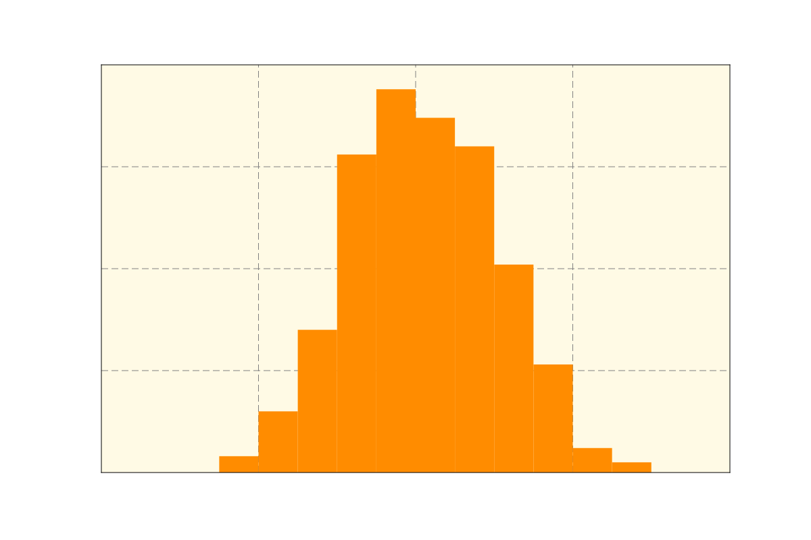

<br>

## Mean and Standard Deviation
- **Mean**
    - The average of all values in a dataset
    - Bad measurement if the dataset has outliers
    $$ \bar{x} = \frac{\sum_{i=1}^{n} x_i}{n} $$
- **Standard Deviation**
    - Describes the spread of values in a numeric distribution relative to the mean
    - It is calculated by finding the average squared distance from each data point to the mean and square-rooting the result.
    - Formula of **standard deviation for a sample**:
    $$ s = \sqrt{\frac{\sum_{i=1}^{n} (x_i - \bar{x})^2}{n-1}} $$
    - Formula of **standard deviation for a population**:
    $$ \sigma = \sqrt{\frac{\sum_{i=1}^{n} (x_i - \bar{x})^2}{n}} $$

<br>

## Skewed Distributions
- Is asymmetrical with a steep change in frequency on one side and a flatter, trailing change in frequency on the other
- 2 types of skewness:
    - **Positive skewness / Right skewed distribution**
        - The tail of the distribution is on the right side
    - **Negative skewness / Left skewed distribution**
        - The tail of the distribution is on the left side

Right skewed distribution:

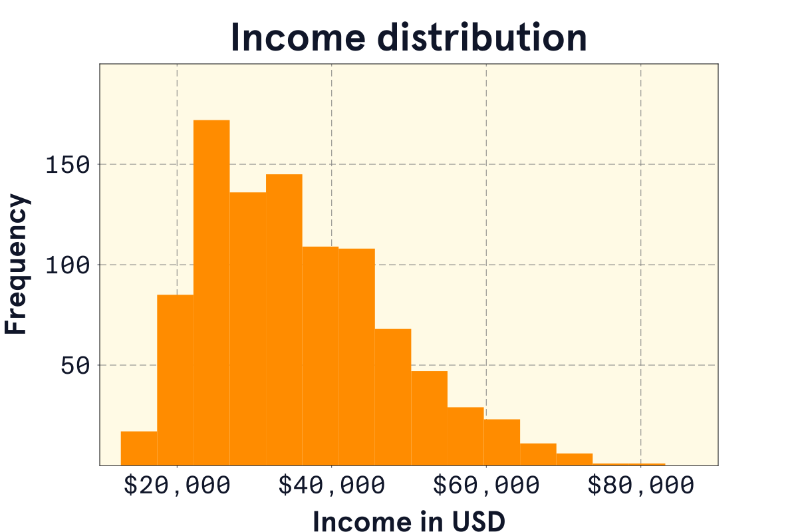

<br>

## Median 
- (50. percentile, Q2 --> *look at* [*IQR*](#iqr-interquartile-range))
- The middle value of a dataset
- It is less sensitive to outliers than the mean
- It is the value that separates the higher half from the lower half of the data
- If the number of data points is even, the median is the average of the two middle values
- `Example: [1, 2, 3, 4, 5] -> Median is 3`
- `Example: [1, 2, 3, 4, 5, 6] -> Median is (3+4)/2 = 3.5`

<br>

## IQR (Interquartile Range)
- A quartile is simply a marker for a quarter (25%) of the data.
- ```py 
    values = [6, 7, 7, 8, 9, 11, 11, 11, 12, 12, 14, 
            15, 17, 19, 20, 24, 25, 25, 26, 28]
    Q1 = np.percentile(values, 25) # 10,5
    Q2 = np.percentile(values, 50) # 13 (Median)
    Q3 = np.percentile(values, 75) # 21
    IQR = Q3 - Q1 # 10,5
    ```
- The IQR is the difference between `Q3` and `Q1` `(21-10,5 = 10,5)`, marking the range for just the middle 50% of the data.

<br>

## Outliers and Robust Measures
- Big impact on the mean and standard deviation
- Median and IQR are more robust to outliers
- `Example: [1, 2, 3, 4, 5, 100] -> Mean is 19.2, Median is 3.5`

<br>

## Aggregate Data
- Aggregating data is the process of combining data together to create a summary
- `Example: [1, 2, 3, 4, 5] -> Sum is 15, Mean is 3, Median is 3`

<br>

## Mode
- The mode is defined as the value with the highest frequency
- We can also think of the mode as the value where the peak of the distribution occurs
- The mode can help us identify interesting features in a variable
- In the following plot, we can see there’s one peak near the 10-year mark and another near the 30-year mark
- We call this a bimodal distribution

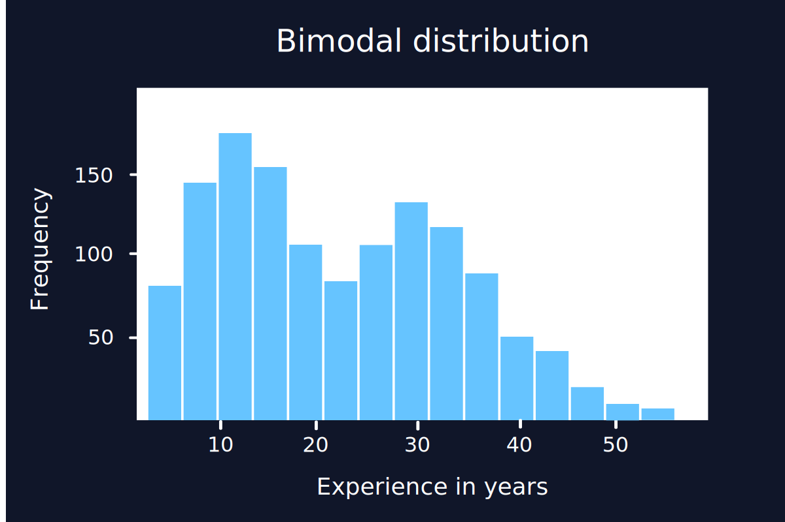

- Sometimes bimodal distributions occur when there are differences across categories of another variable
- Types of modes:
    - **Unimodal**
        - One peak
    - **Bimodal**
        - Two peaks
    - **Multimodal**
        - More than two peaks
    - `Example: [1, 2, 2, 3, 3, 3, 4, 4, 4, 4] -> Mode is 4`
    - `Example: [1, 2, 2, 3, 3, 4, 4, 4, 4, 5, 5, 5, 5] -> Mode is 4 and 5`
    - `Example: [1, 2, 3, 4, 5, 6, 7, 8, 9, 10] -> No mode`

<br>

## Variable Relationships
- **Correlation**
    - describes the linear relationship between two variables
- **Correlation coefficient `r`**
    - A value between -1 and 1 that describes the strength and direction of the relationship
    - Farther from 0 means a stronger relationship
    - `-1 <= r <= 1`
    - **-1**
        - A perfect negative correlation
        - As one variable increases, the other decreases
    - **0**
        - No correlation
    - **1**
        - A perfect positive correlation
        - As one variable increases, the other increases
    $$ r = \frac{\sum_{i=1}^{n} (x_i - \bar{x})(y_i - \bar{y})}{\sqrt{\sum_{i=1}^{n} (x_i - \bar{x})^2} \sqrt{\sum_{i=1}^{n} (y_i - \bar{y})^2}} $$
- **Coefficient of determination `r²`**
    - `r² = r * r`
    - `0 <= r² <= 1`
    - The square of the correlation coefficient `r`
    - It tells us how much of the variance in one variable is explained by the other variable
    - `Example: r = 0.8 -> r^2 = 0.64 -> 64% of the variance in one variable is explained by the other variable`

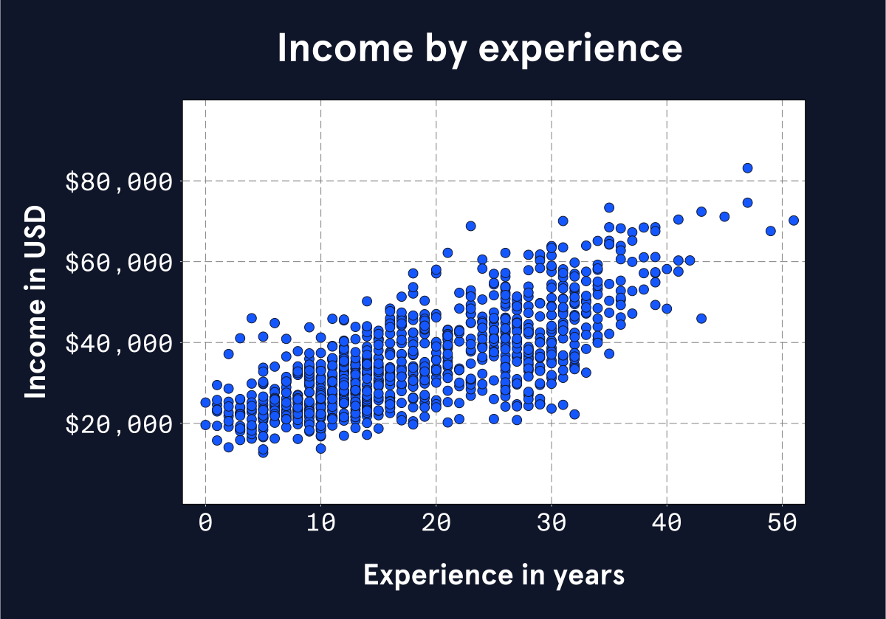

<br>

## Univariate Charts
- Univariate charts help us visualize a change in **one variable**.
- Often that means measuring “how much,” which can either be a **count** or a **distribution**.
- Common charts:
    - **Bar graph**
        -  If we want to compare an amount between different categories
            - *“how many of each coin is in the piggy bank”*
            - *“how many birds were saved by species”*
    - **Histogram**
        - Great way to show the concept of a normal (or skewed) distribution.
            - *“how does foot size vary across the population?”*
            - *“what is the distribution of pregnancy length across the human population?”*
            - *“how is income distributed in my country?”*
        - A density curve also visualizes a distribution, without putting data in bins like a histogram does
    - **Box plot**
        - A more *“math-forward”* way to visualize distributions is a box plot or violin plot.
        - These visualizations make percentile and quartile values obvious.
    - **Univariate map**
        - This would be a map where the only variable is geographic
            - Example: A map that just shows us location and distance.

<br>

## Bi- and Multivariate Charts
- Show the relationships between two or more variables
- Common charts:
    - **Scatter plot**
        - One variable on the x-axis, one on the y-axis
        - each point helps is compare the two variables by its position on the plot
        - translate the relationship between two variables into an easy-to-see spatial relationship
        - Because we’re relying on the idea that each variable increases as we move up the X or Y axis, the scatterplot only makes sense for numeric variables, not categorical.
    - **Line chart**
        - Often measuring a variable changing over time.
            - A stock chart, for example, measures the value of a company over time.
        - Can have multiple lines on the same chart, each representing a different variable.
    - **Bivariate map**
        - Shows a basic geographical map plus an additional variable 
        - Can also map precipitation, altitude or depth, median income, museum locations, or combinations of variables

<br>

## Aesthetic Properties
- Are the attributes we use to communicate data visually:
    - **Position**
    - **Size**
    - **Shape**
    - **Color / pattern**
- **Information Redundancy**
    - encoding the same information in different visual properties
    - It’s important for readability, organization and prioritization of information, and accessibility.
    - Helpful for prioritizing values
    - **Helps key data points to stand out**

<br>

## Consider the Audience
- **different context is appropriate for different audiences**

<br>

## Context is key
- **considering their specific audiences when making decisions about what context to include or not.**
- Viewers need context to understand what a data visualization means and why it matters.
- Provide necessary details
- Include context that’s helpful for the specific audience
- Avoid “chart junk”: excess graphics, annotations, and general lines that don’t actually contain information

<br>

## Accessibility Basics
- The most commonly discussed accessibility concern is color, since color blindness affects 1 in 12 males and 1 in 200 females. 
- There are different kinds of color blindness:
    - **Red Weak (Protanomaly)**
    - **Green Weak (Deuteranomaly)**
    - **Blue Weak (Tritanomaly)**
- The big takeaway when designing for color accessibility is to think not only about the **hue** of a color (e.g. red, green, or purple), but the **value** as well (e.g. bright red, light green, dark purple).
- **Good color comparisons use high contrast values, not just different hues.**
- It’s also important to use readable fonts in readable sizes, and make sure they’re web-accessible if online
- For online data visualizations, make sure to include alt text as we would for any other web image
    - Alt text ensures that users experiencing a visualization through a screen reader won’t miss out on whatever information it contains
- **Conclusion**:
    - Colorblind-friendly color palettes
    - Large enough font size
    - Readable, web-accessible font type
    - Alt text on data visualization images online

<br>

## Universal Design
- Making our work available and easier to access for more people
- Is a great principle to keep in mind no matter what
- We can apply it when it comes to…
    - **Readability**: keep the reading level to a high school level whenever possible
    - **Prior knowledge**: define unfamiliar terms and avoid unnecessary jargon
    - **Information overload**: introduce new information with intentional pacing and organization

<br>

## Axes
- Axes and scaling are like the page layout and spacing of a paper book
- x-axis (horizontal, left-right)
- y-axis (vertical, top-bottom)
- Common misleading aspect of an axis is a **break**
    -  A break starts the count at a number that’s not zero, or jumps ahead
    - this can distort the amount of difference between data points by removing context, and make small differences in data seem bigger.
    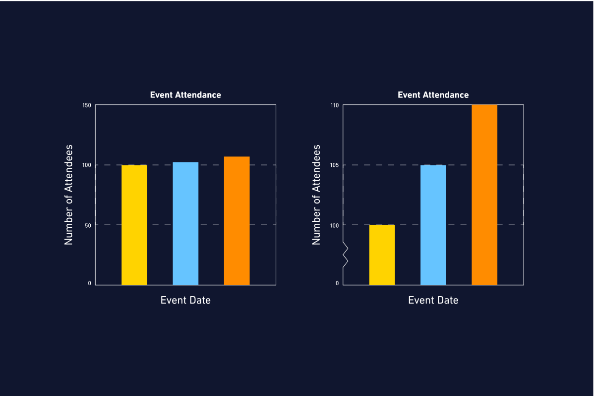
- If you’re making the graph, instead of using a big break…
    - Keep enough context to view differences in proportion to a meaningful amount, OR
    - Make two graphs, one without a break and one “zoomed in”, OR
    - Choose a visualization type that shows the change, rather than the raw numbers

<br>

## Scaling
- Scaling refers to the distances between numbers on an axis
- Almost all graphs use a **linear scale**, where the numbers count up by a consistent interval
- The other scaling option is a **logarithmic scale**, a.k.a. log scale
    - The log scale is common for showing exponential growth that won’t fit on the page with a linear scale
    - But it’s almost never a good choice for a general audience. Unless people use log scales regularly, they tend to have **trouble interpreting them correctly**.
- Last thing about axes and scaling: **generally, we measure time horizontally**, putting that variable on the x-axis. For the vast majority of circumstances, this makes the most sense and helps readers to intuit what the graph measures.

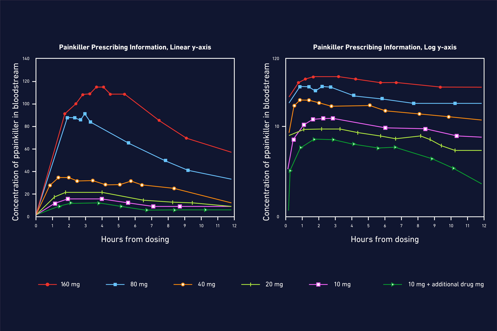

<br>

## Color Scales
- There are three types of color scales, used for the three major types of relationships we can visualize with color.
    - **Sequential**
        - Used for data that ranges from low to high
        - Example: a temperature map
    - **Diverging**
        - Used for data that has a neutral midpoint
        - Example: a map of political affiliations
    - **Categorical**
        - Used for data that has distinct categories
        - Example: a map of countries

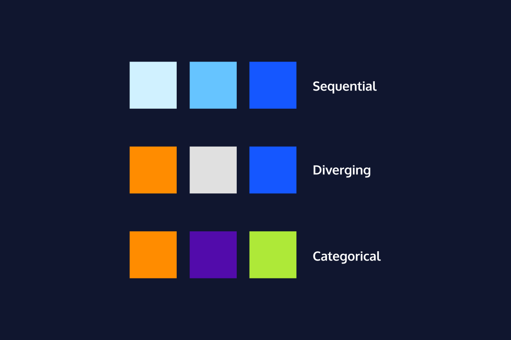

<br>

## Color Associations
- We tend to view darker colors as **“more”** and lighter colors as **“less.”**
    - If we’re visualizing which US states have the most pet ferrets, California – with the most pet ferrets of any state – should be the darkest state on the map.
    - When this scale is reversed, people will tend to just read the graph wrong rather than reading the legend carefully.
- **Pre-existing associations**
    - Red is often associated with danger, green with safety, and blue with calmness.
    - These associations can be helpful or harmful, depending on the context.
    - If we’re visualizing a map of crime rates, red might be a good choice for high-crime areas, but if we’re visualizing a map of the best places to live, red might be misleading.
- Color associations can pull on both helpful prior knowledge and harmful stereotypes.

<br>

## Labels and Titles
- A good title is one of the best and fastest tools for making a more understandable visualization
- Lots of confusion can be saved with a descriptive title.
- If the graph doesn’t have a good title (or even a title!), viewers have to do more legwork to first figure out what each axis measures and then what the data points show.
- The title can be a question that visualization answers    
    - *“Who speaks more in Disney movies, male or female characters?”*
- Titles can also be a statement of what the visualization shows
    - *“Comparing denim inseam lengths through the decades”*
    - *“Millennials really do spend more on rent than on avocados”*
    - *“The effect of hunger on mood level.”*
- Like a good title, annotations on a graph also help the viewer to understand what’s going on
- Just a few lines of thoughtful annotation here and there give the audience so much more ability to interpret the graph at a deeper level

<br>

## Introduction Data Analysis
- When working with data, our ultimate goal is to draw conclusions.
- The point of **data analysis** is to **discover useful information**, **inform conclusions**, and **support decision-making**.
-  In general, data analysis lets us evaluate the presence, strength, and direction of relationships between different variables in our data
- Types of Data Analysis:
    1. **Descriptive Analysis**
    2. **Exploratory Analysis**
    3. **Inferential Analysis**
    4. **Causal Analysis**
    5. **Predictive Analysis**

<br>

## Descriptive Analysis
- Lets us describe, summarize, and visualize data so that patterns can emerge.
- Sometimes we’ll only do a descriptive analysis, but most of the time a descriptive analysis is the first step in our analysis process
- Descriptive analyses include measures of central tendency (e.g., mean, median, mode) and spread (e.g., range, quartiles, variance, standard deviation, distribution), which are referred to as **descriptives** or **summary statistics**.
- Typically, data visualization is also included in descriptive analysis.
- Descriptive analysis helps us understand our data and decide what steps to take next, but we cannot extend what we learn to other datasets.

<br>

## Exploratory Analysis
- **Exploratory analysis** is the next step after descriptive analysis.
- With exploratory analysis, we look for relationships between variables in our dataset.
- While our exploratory analyses might uncover some fascinating patterns, we should keep in mind that exploratory analyses cannot tell us *why* something happened: **correlation is not the same as causation.**
- Watch the Image below for following explaination:
    - We are exploring trends in annual income over time using two descriptives (mean and median). We see that the difference between these two descriptives seems to be growing. This suggests that annual income in the U.S. is becoming more skewed: a few very high earners are pulling the average up.
    - Next, we plot the difference between mean and median annual income over time. It sure does look like it’s increasing with time!
    - Finally, we add a trend line and calculate the R-squared, which gives us an indication of how well the line fits the data. With an R-squared of 0.99 out of a maximum of 1.00, we can be very sure that the gap between mean and median is increasing.

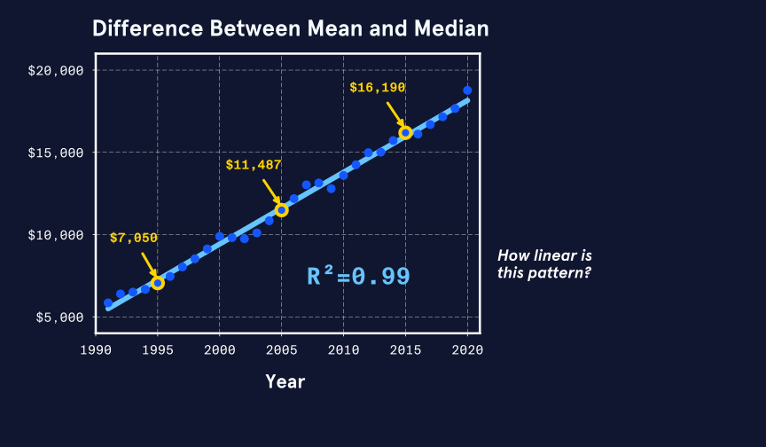

<br>

## More Exploratory Analysis: Clustering
- **Unsupervised machine learning** techniques, such as **clustering** algorithms, are useful tools for exploratory analysis.
    - These techniques “learn” patterns from untagged data, or data that do not have classifications already attached to them, and they help us see relationships between many at once.
- Lets watch the Images below to understand the following steps:
    - We have four measurements (weight, beak length, beak depth, and flipper length) from Gentoo, Adelie, and Chinstrap penguins living on three islands (penguin artwork by @allison_horst). It’s pretty difficult to see relationships between the measurements looking at the raw data.
    - Ideally, we want to see how all the measurements relate to each other, but plotting them all would be a lot to look at. Instead, we can perform a **Principal Component Analysis** or PCA, which compresses the variables into principal components that can be plotted against each other. After PCA, we can use **k-means clustering** to look for trends in the data. We see that the penguins fall into three distinct clusters in the PCA plot!
    - It’s cool that our analysis shows three clusters because we know that our data include three penguin species living on three islands. We can use the Rand statistic to see how well species and islands match the k-means clusters. This is similar to the R-squared statistic we use to check the fit of a trend line. With a Rand score of 0.97 out of 1.0, species have a stronger relationship to clustering!

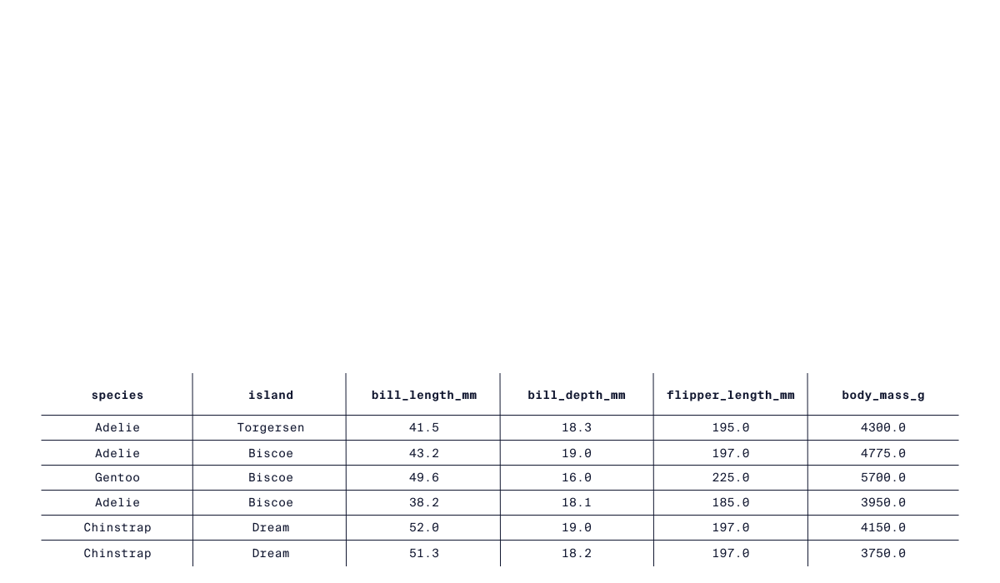
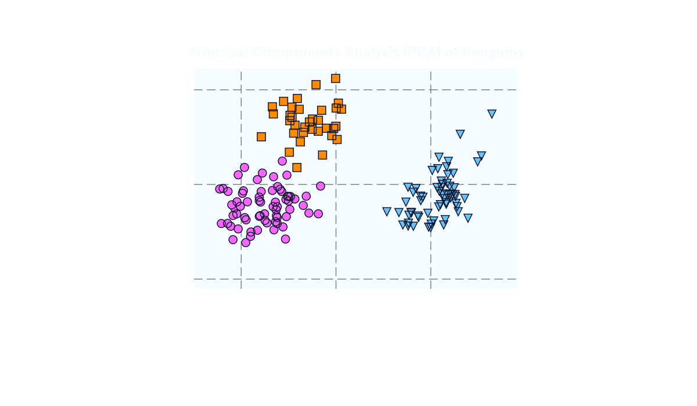

<br>

## Inferential Analysis
- **A/B tests** are a popular business tool that data scientists use to optimize websites and other online platforms
-  A/B tests are a type of **inferential analysis**.
- Inferential analysis lets us test a hypothesis on a sample of a population and then extend our conclusions to the whole population.
- **Example (Bases on the Image below):**
    - Imagine we want to know if a blue or a green button will get more clicks on a website.
    - We hypothesize that the green button will be more successful and we run an A/B test on a sample of people that visit our site.
    - Half the sample sees the blue button (option A) and half see the green button (option B).
    - At the end of the test, 90% of people that saw the green button clicked it, whereas 60% of the people that saw the blue button clicked it.

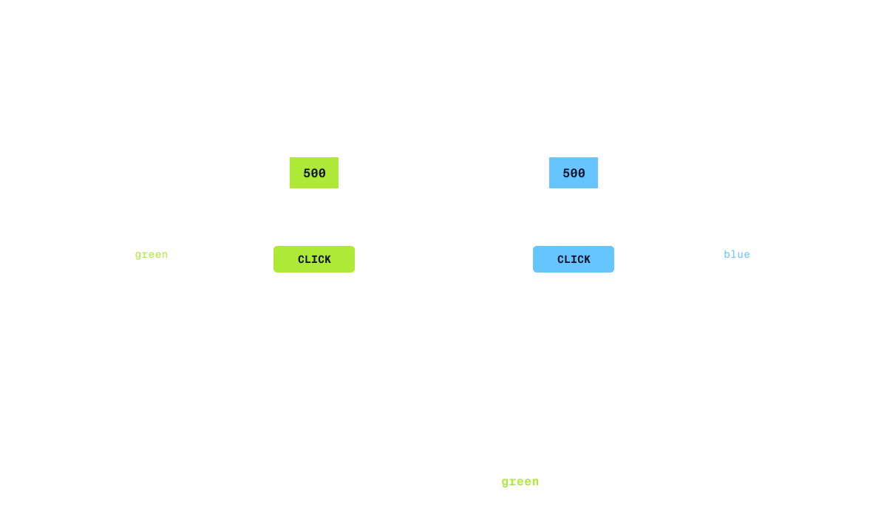

- This is a powerful thing to be able to do! But since it’s so powerful, there are some rules about how to do it:
    - Sample size must be big enough compared to the total population size (**10% is a good rule-of-thumb**).
    - Our sample must be randomly selected and representative of the total population.
    - We can only test one hypothesis at a time.

<br>

## Causal Analysis
- **Correlation does not mean causation**
- We often really want to know why something happened
    - We turn to **causal analysis**.
- Causal analysis generally relies on carefully designed experiments, but we can sometimes also do causal analysis with observational data
- Experiments that support causal analysis:
    - Only change one variable at a time
    - Carefully control *all* other variables
    - Are repeated multiple times with the same results

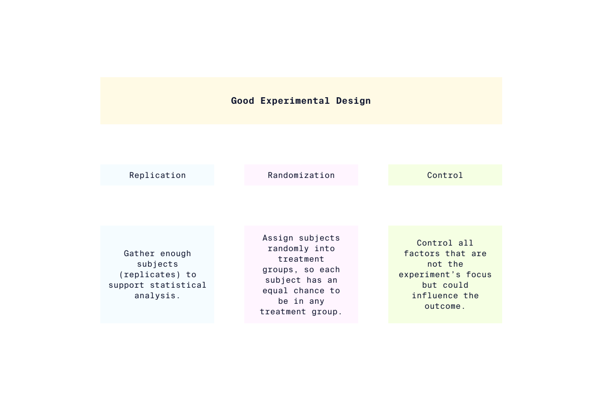

<br>

## Causal Analysis with Observational Data
- Sometimes we need to establish causation when actual **experimentation is impossible**.
- For example, we might want to know why something happened that we really don’t want to repeat (e.g., why did a product flop?), or the necessary experiments may be too difficult, too expensive, or unethical. 
- In such cases, we can sometimes apply causal inference techniques to observational data, but we need to be very careful.
- Causal inference with observational data requires:
    - Advanced techniques to identify a causal effect
    - Meeting very strict conditions
    - Appropriate statistical tests
- Let’s think about this in terms of climate change.
    - It is important to know if climate change is causing more frequent and intense hurricanes.
    - But, we can’t do a controlled, replicated experiment on multiple planets with and without climate change.
    - Instead, climate scientists carefully use causal analysis on observational data to determine whether climate change contributes to bigger hurricanes happening more often.

<br>

## Predictive Analysis
- We interact with **predictive analysis** in everyday life when we text a friend using text completion or watch a suggested TV show on Netflix.
- Predictive analysis also underlies computer vision, which is applied in facial recognition software and self-driving cars.
- Predictive analysis uses data and **supervised machine learning** techniques to identify the likelihood of future outcomes.
- Some popular supervised machine learning techniques include:
    - **regression models**
    - **support vector machines**
    - **deep learning convolutional neural networks**
    - The actual algorithm used with each of these techniques is different, but each requires training data. 
    - That is, we have to provide a set of already-classified data that the algorithm can “learn” from. 
    - Once the algorithm has learned from the features of the training data, it can make predictions about new data.
- An important point here is that the algorithm can only be as good as the data used to train the algorithm.
    - *“garbage in, garbage out”*
- That is certainly true for predictive analysis: a predictive model trained on poor-quality data will make poor-quality predictions.

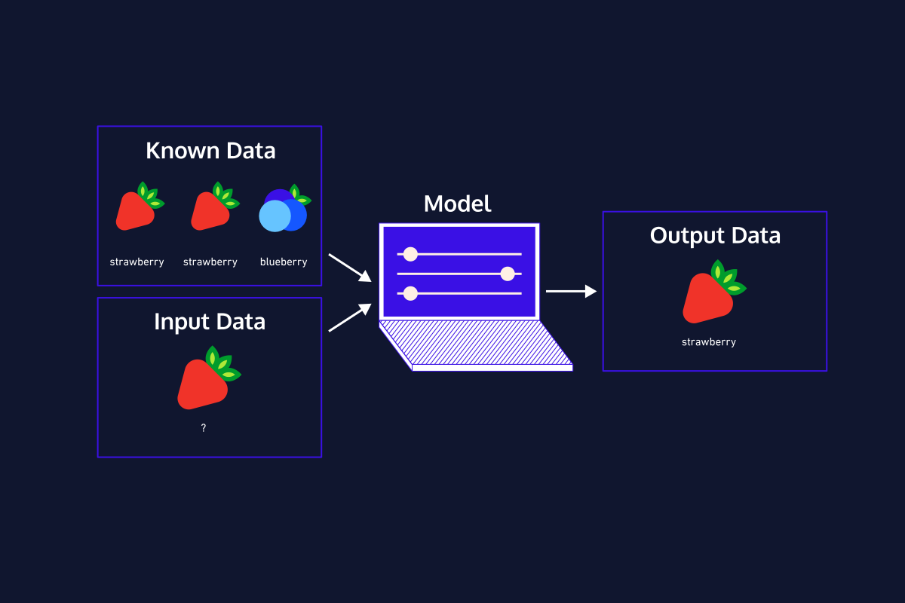

<br>

## Predictive Analysis: Challenges
- Predictive analyses have tremendous power.
- As a result, we need to be careful about when we use them and when we trust them.
    - Recommendation algorithms are excellent for making low-risk predictions.
        - When Netflix makes recommendations for you, the predictions are relatively low-risk. 
    - In contrast, predicting whether someone will commit a crime is a high-risk prediction, especially if the prediction is used for criminal sentencing or deciding to grant someone parole.
- **Example**:
    - Let’s think more about predictive analyses with an example from [an article published by WIRED](https://www.wired.com/story/algorithm-set-students-grades-altered-futures/) in 2020.
    - When the COVID-19 pandemic started in 2020, high-school students had to finish the school year virtually. 
    - Standardized tests, like the International Baccalaureate (IB) exam, were canceled.
    - International high school students wanting to study in the U.S. must take the IB exam to attend competitive U.S. colleges and universities.
    - Since the exam was canceled, the IB board used a supervised machine learning to predict scores for each student.
    - Unfortunately, many students were surprised by the scores the algorithm predicted for them.
    - The students thought they were going to do much better on the test than the algorithm predicted they would!

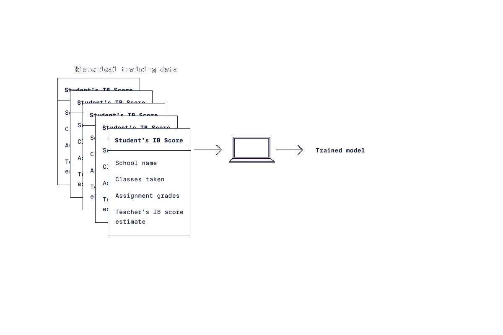

<br>

## Conclusion - Data Analysis
1. Data analysis is the process of mathematically summarizing and manipulating data to discover useful information, inform conclusions, and support decision-making.
2. Data analysis can be broken down into 5 main types—Descriptive, Exploratory, Inferential, Causal, and Predictive—that are more or less appropriate depending on the situation.
3. **Descriptive analysis** describes major patterns in data through summary statistics and visualization of measures of central tendency and spread.
4. **Exploratory analysis** explores relationships between variables within a dataset and can group subsets of data. Exploratory analyses might reveal correlations between variables.
5. **Inferential analysis** allows us to test hypotheses on a small sample of a population and extend our conclusions to the entire population.
6. **Causal analysis** lets us go beyond correlation and actually assign causation when we carefully design and conduct experiments. In addition, causal inference sometimes allows us to determine causal effects even when experimentation is not possible.
7. **Predictive analysis** goes beyond understanding the past and present and allows us to make data-driven predictions about the future. The quality of these predictions is deeply dependent on the quality of the data used to generate the predictions.