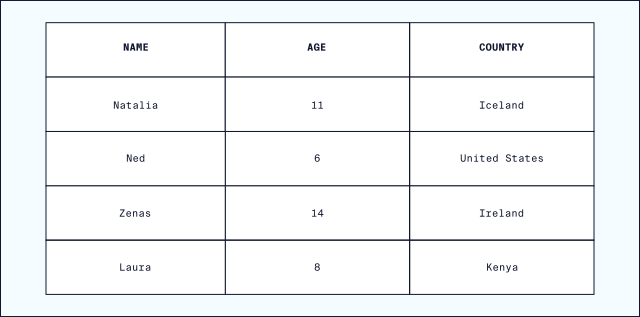
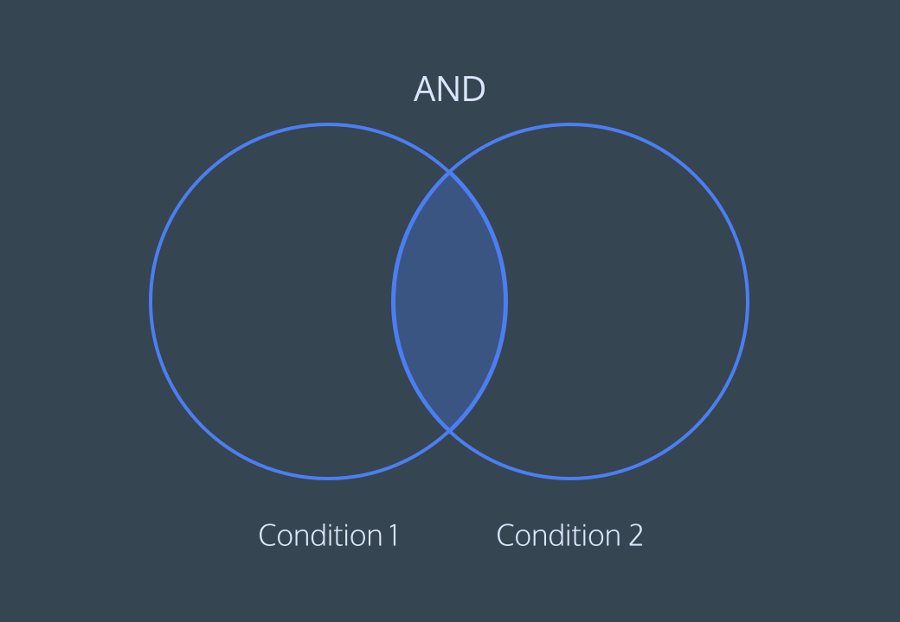
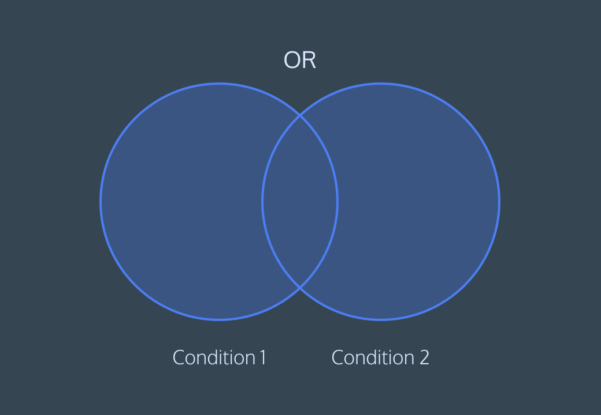
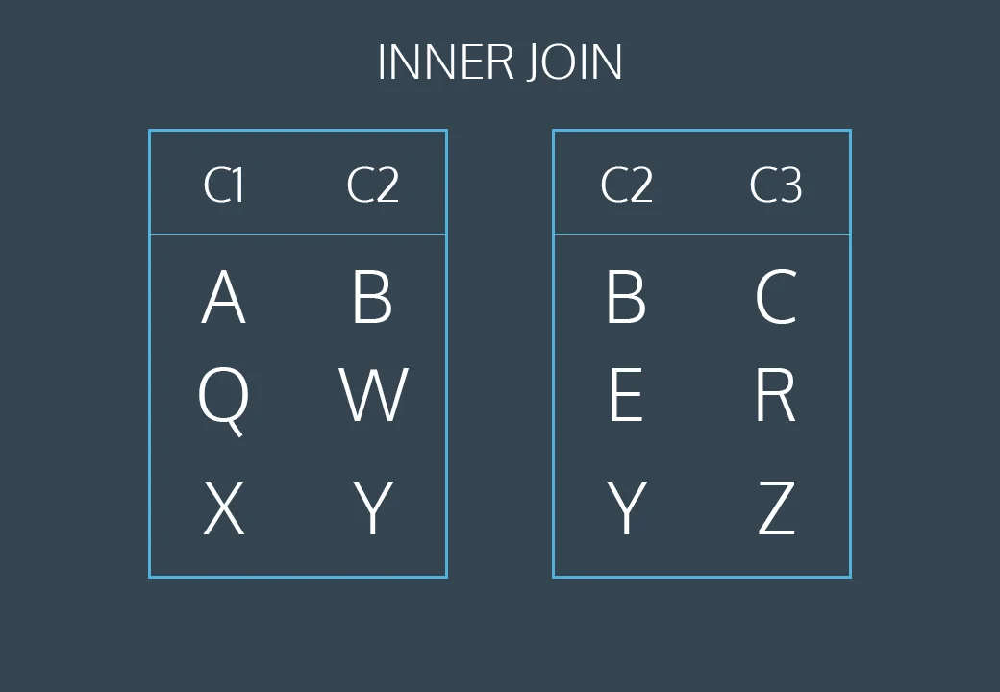

# 3 Learn SQL

## Contents

- [What is a Relational Database Management System (RDBMS)?](#what-is-a-relational-database-management-system-rdbms)
- [Statements](#statements)
- [Create](#create)
- [Insert](#insert)
- [Select](#select)
- [Alter](#alter)
- [Update](#update)
- [Delete](#delete)
- [Constraints](#constraints)
- [As](#as)
- [Distinct](#distinct)
- [Where](#where)
- [Like](#like)
- [Is Null / Is Not Null](#is-null--is-not-null)
- [Between](#between)
- [And](#and)
- [Or](#or)
- [Order By](#order-by)
- [Limit](#limit)
- [Case](#case)
- [Count](#count)
- [Sum](#sum)
- [Max / Min](#max--min)
- [Avg](#avg)
- [Round](#round)
- [Group By I](#group-by-i)
- [Group by II](#group-by-ii)
- [Having](#having)
- [Combining Tables with SQL - Join](#combining-tables-with-sql---join)
- [Inner Join](#inner-join)
- [Left Join](#left-join)
- [Right Join](#right-join)
- [Primary Key vs Foreign Key](#primary-key-vs-foreign-key)
- [Cross Join](#cross-join)
- [Union](#union)
- [With](#with)

<br>

## What is a Relational Database Management System (RDBMS)?

### What is a Database?	
- A *database* is a set of data stored in a computer. This data is usually structured in a way that makes the data easily accessible.

### What is a Relational Database?
- A *relational database* is a type of database. It uses a structure that allows us to identify and access data in relation to another piece of data in the database. Often, data in a relational database is organized into tables.

### Tables: Rows and Columns
- Tables can have hundreds, thousands, sometimes even millions of rows of data. These rows are often called records.
- Tables can also have many *columns* of data. Columns are labeled with a descriptive name (say, `age` for example) and have a specific data type.
- For example, a column called `age` may have a type of `INTEGER` (denoting the type of data it is meant to hold).



- In the table above, there are three columns (`name`, `age`, and `country`).
- The `name` and `country` columns store string data types, whereas `age` stores integer data types. The set of columns and data types make up the schema of this table.
- The table also has four rows, or records, in it (one each for Natalia, Ned, Zenas, and Laura).

### What is a Relational Database Management System (RDBMS)?
- A relational database management system (RDBMS) is a program that allows you to create, update, and administer a relational database. 
- Most relational database management systems use the SQL language to access the database.

<br>

## Statements
- A *statement* is text that the database recognizes as a valid command.
- Statements always end in a semicolon `;`.

<br>

## Create
- The `CREATE` statement is used to create a new table in a database.
- The `CREATE` statement is followed by the keyword `TABLE` and then the table name.
- The `CREATE TABLE` statement is always followed by a set of parentheses. Inside the parentheses, you define the columns in the table along with the data types they hold.

```sql
CREATE TABLE table_name (
    column1_name data_type,
    column2_name data_type,
    column3_name data_type
);
```
```sql
CREATE TABLE celebs (
    id INTEGER,
    name TEXT,
    age INTEGER
);
```

<br>

## Insert
- The `INSERT INTO` statement is used to add a new record (row) to a table.
- The `INSERT INTO` statement is followed by the table name and a set of parentheses containing the column names and the values to be inserted.

```sql
INSERT INTO table_name (column1_name, column2_name, column3_name)
VALUES (value1, value2, value3);
```
```sql
INSERT INTO celebs (id, name, age)
VALUES (1, 'Justin Bieber', 22);
```

<br>

## Select
- The `SELECT` statement is used to fetch data from a database.
- The `SELECT` statement is followed by the names of the columns in the table you want to select data from.
- You can use `*` to select all columns.

```sql
SELECT column1_name, column2_name
FROM table_name;
```
```sql
SELECT *
FROM celebs;
```

<br>

## Alter
- The `ALTER TABLE` statement is used to add, delete, or modify columns in an existing table.
- The `ALTER TABLE` statement is followed by a keyword that specifies the action that you need to perform.
- Actions include `ADD`, `DROP`, and `ALTER COLUMN`.


```sql
ALTER TABLE table_name
action_type column_name data_type;
```
```
```sql
ALTER TABLE celebs
ALTER COLUMN age SET DATA TYPE TEXT;
```
```sql
ALTER TABLE celebs
ADD COLUMN twitter_handle TEXT;
```
```sql
ALTER TABLE celebs
DROP COLUMN twitter_handle;
```

<br>

## Update
- The `UPDATE` statement is used to edit records in a table.
- The `UPDATE` statement is followed by the table you want to edit.
- Then you list the column name and the new value that you want to set.

```sql
UPDATE table_name
SET column1_name = new_value
WHERE some_column = some_value;
```
```sql
UPDATE celebs
SET age = 23
WHERE id = 1;
``` 

<br>

## Delete
- The `DELETE FROM` statement is used to remove records from a table.
- The `DELETE FROM` statement is followed by the table you want to delete from.
- The `WHERE` clause is used to specify which record(s) should be deleted. If you omit the `WHERE` clause, all records will be deleted.

```sql
DELETE FROM table_name
WHERE some_column = some_value;
```
```sql
DELETE FROM celebs
WHERE twitter_handle IS NULL;
```

<br>

## Constraints
- Constraints are rules that we can apply to a column to enforce the data that goes into a table.
- Constraints can be added to a table when the table is created or after the table is created.
- Constraints can be added to a column in a table.
    - `NOT NULL`: Ensures that a column cannot have a NULL value.
    - `UNIQUE`: Ensures that all values in a column are different.
    - `PRIMARY KEY`: A combination of a `NOT NULL` and `UNIQUE`. Uniquely identifies each row in a table.
    - `FOREIGN KEY`: Uniquely identifies a row/record in another table.
    - `CHECK`: Ensures that all values in a column satisfy a specific condition.
    - `DEFAULT`: Sets a default value for a column when no value is specified.
    - ...

```sql	
CREATE TABLE table_name (
    column1_name data_type CONSTRAINT constraint_name,
    column2_name data_type,
    column3_name data_type
);
```
```sql
CREATE TABLE celebs (
    id INTEGER PRIMARY KEY,
    name TEXT UNIQUE,
    date_of_birth TEXT NOT NULL,
    date_of_birth TEXT DEFAULT '1970-01-01'
);
```

<br>

## As
- The `AS` keyword is used to rename a column or table.

```sql
SELECT column1_name AS 'new_name'
FROM table_name;
```
```sql
SELECT name AS 'full_name'
FROM celebs;
```

<br>

## Distinct
- The `DISTINCT` keyword is used in a `SELECT` statement to return only distinct / unique (different) values.

```sql
SELECT DISTINCT column1_name
FROM table_name;
```
```sql
SELECT DISTINCT age
FROM celebs;
```

<br>

## Where
- The `WHERE` clause is used to filter records.
- The `WHERE` clause is used to extract only the records that fulfill a specified condition.
- Possible operators include `=`, `!=`, `>`, `<`, `>=`, `<=`, `BETWEEN`, `LIKE`, `IN`, `AND`, `OR`, `NOT`.

```sql
SELECT column1_name
FROM table_name
WHERE some_column = some_value;
```
```sql
SELECT *
FROM celebs
WHERE age = 22;
```

<br>

## Like
- The `LIKE` operator is used in a `WHERE` clause to search for a specified pattern in a column.
- The `LIKE` operator is often used with `%` (percent sign) and `_` (underscore).
    - `%` represents zero, one, or multiple characters.
    - `_` represents a single character.

```sql
SELECT column1_name
FROM table_name
WHERE some_column LIKE pattern;
```
```sql
SELECT *
FROM celebs
WHERE name LIKE 'J%';   -- names that start with 'J'
```

<br>

## Is Null / Is Not Null
- The `IS NULL` operator is used in a `WHERE` clause to select rows with NULL values.
- The opposite of `IS NULL` is `IS NOT NULL`.

```sql
SELECT column1_name
FROM table_name
WHERE some_column IS NULL;
```
```sql
SELECT *
FROM celebs
WHERE twitter_handle IS NULL;
```

<br>

## Between
- The `BETWEEN` operator is used to select values within a range.
- The values can be numbers, text, or dates.
    - For text, `value2` is not included in th result

```sql
SELECT column1_name
FROM table_name
WHERE some_column BETWEEN value1 AND value2;
```
```sql
SELECT *
FROM celebs
WHERE age BETWEEN 20 AND 25;
```

<br>

## And
- The `AND` operator is used in a `WHERE` clause to filter the result set based on more than one condition.

```sql
SELECT column1_name
FROM table_name
WHERE some_column = some_value AND another_column = another_value;
```
```sql
SELECT *
FROM celebs
WHERE age = 22 AND name = 'Justin Bieber';
```



<br>

## Or
- The `OR` operator is used in a `WHERE` clause to filter the result set based on more than one condition.
- At least one of the conditions must be true for the record to be included in the result set.

```sql
SELECT column1_name
FROM table_name
WHERE some_column = some_value OR another_column = another_value;
```
```sql
SELECT *
FROM celebs
WHERE age = 22 OR age = 23;
```



<br>

## Order By
- The `ORDER BY` keyword is used to sort the result-set in ascending or descending order.
- The `ORDER BY` keyword sorts the records in ascending order by default. To sort the records in descending order, you can use the `DESC` keyword.
- **`ORDER BY` always goes after `WHERE` (if `WHERE` is used).**

```sql
SELECT column1_name
FROM table_name
ORDER BY column1_name ASC|DESC;
```
```sql
SELECT *
FROM celebs
ORDER BY age DESC;
```

<br>

## Limit
- The `LIMIT` clause is used to specify the number of records to return.
- The `LIMIT` clause is used in the `SELECT` statement.

```sql
SELECT column1_name
FROM table_name
LIMIT number_of_records;
```
```sql
SELECT *
FROM celebs
LIMIT 5;
```

<br>

## Case
- The `CASE` statement is SQL’s way of handling if-then logic.
- The `CASE` statement is followed by at least one pair of `WHEN` and `THEN` statements.
- The `CASE` statement must end with the `END` statement.
    - `END` can be combined with `AS` to rename the column.

```sql
SELECT column1_name,
    CASE
        WHEN some_column = some_value THEN 'value1'
        WHEN some_column = some_value THEN 'value2'
        ELSE 'value3'
    END|AS 'new_column_name'
FROM table_name;
```
```sql
SELECT name,
    CASE
        WHEN age < 20 THEN 'young'
        WHEN age >= 20 AND age < 30 THEN 'adult'
        ELSE 'old'
    END|AS 'age_group'
FROM celebs;
```

<br>

## Count
- The `COUNT()` function returns the number of rows that match a specified criteria.

```sql
SELECT COUNT(column1_name)
FROM table_name;
```
```sql
SELECT COUNT(*)
FROM celebs;
```
```sql
SELECT COUNT(*)
FROM celebs
WHERE age > 20;
```

<br>

## Sum
- The `SUM()` function returns the total sum of a numeric column.

```sql
SELECT SUM(column1_name)
FROM table_name;
```
```sql
SELECT SUM(age)
FROM celebs;
```

<br>

## Max / Min
- The `MAX()` function returns the largest value of the selected column.
- The `MIN()` function returns the smallest value of the selected column.

```sql
SELECT MAX(column1_name)
FROM table_name;
```
```sql
SELECT MIN(age)
FROM celebs;
```

<br>

## Avg
- The `AVG()` function returns the average value of a numeric column.

```sql
SELECT AVG(column1_name)
FROM table_name;
```
```sql
SELECT AVG(age)
FROM celebs;
```

<br>

## Round
- The `ROUND()` function is used to round a numeric field to the number of decimals specified.

```sql
SELECT ROUND(column1_name, number_of_decimals)
FROM table_name;
```
```sql
SELECT ROUND(AVG(age), 2)
FROM celebs;
```

<br>

## Group By I
- Aggregate functions perform a calculation on a set of values and return a single value.
- The `GROUP BY` statement is used in conjunction with aggregate functions to group the result-set by one or more columns.

| Country | Poplulation |
|---------|-------------|
| USA     | 2           |
| USA     | 1           |
| USA     | 3           |
| UK      | 1           |
| UK      | 2           |

```sql
SELECT country, population
FROM table_name
GROUP BY country;
```

| Country | Poplulation |
|---------|-------------|
| USA     | 6           |
| UK      | 3           |


```sql
SELECT column1_name, aggregate_function(column2_name)
FROM table_name
GROUP BY column1_name;
```
```sql
SELECT age, COUNT(*)
FROM celebs
GROUP BY age;
```

<br>

## Group by II
- Sometimes, we want to a calculation done on a column.
- For instance, we might want to know how many movies have IMDb ratings that round to 1, 2, 3, 4, 5. We could do this using the following syntax:

```sql
SELECT ROUND(imdb_rating), COUNT(name)
FROM movies
GROUP BY ROUND(imdb_rating)
ORDER BY ROUND(imdb_rating);
```
- time-consuming writing
- SQL lets us use column reference(s) in our GROUP BY that will make our lives easier.
    - `1` is the first column selected
    - `2` is the second column selected
    - ...

```sql
SELECT ROUND(imdb_rating), COUNT(name)
FROM movies
GROUP BY 1
ORDER BY 1;
```

<br>

## Having
- The `HAVING` clause was added to SQL because the `WHERE` keyword could not be used with aggregate functions.
- We can’t use `where` because we don’t want to filter the rows; we want to *filter groups*.
- `HAVING` is very similar to `WHERE`. In fact, all types of `WHERE` clauses you learned about thus far can be used with `HAVING`.
- `HAVING` is only used with `GROUP BY`.

```sql
SELECT column1_name, aggregate_function(column2_name)
FROM table_name
GROUP BY column1_name
HAVING aggregate_function(column2_name) operator value;
```
```sql
SELECT age, COUNT(*)
FROM celebs
GROUP BY age
HAVING COUNT(*) > 1;
```

<br>

## Combining Tables with SQL - Join
- A `JOIN` clause is used to combine rows from two or more tables, based on a related column between them.
- You can also expand this statement using `WHERE` for example.

```sql
SELECT column1_name, column2_name
FROM table1_name
JOIN table2_name
    ON table1_name.column_name = table2_name.column_name
...;
```
```sql
SELECT *
FROM orders
JOIN subscriptions
    ON orders.subscription_id = subscriptions.subscription_id;
```

- Subscriptions:

| Subscription ID | Description | Price per Month | Subscription Length |
|-----------------|-------------|-----------------|---------------------|
| 1               | Basic       | 5               | 30                  |
| 2               | Premium     | 10              | 30                  |
| 3               | Gold        | 15              | 30                  |
| 4               | Basic       | 5               | 30                  |

- Orders:

| Order ID | Customer ID | Subscription ID | Purchase Date |
|----------|-------------|-----------------|---------------|
| 1        | 1           | 1               | 2020-01-01    |
| 2        | 2           | 2               | 2020-01-01    |
| 3        | 3           | 3               | 2020-01-01    |
| 4        | 4           | 4               | 2020-01-01    |

- Result (`SELECT * FROM orders JOIN subscriptions ON orders.subscription_id = subscriptions.subscription_id`):

| Order ID | Customer ID | Subscription ID | Purchase Date | Subscription ID | Description | Price per Month | Subscription Length |
|----------|-------------|-----------------|---------------|-----------------|-------------|-----------------|---------------------|
| 1        | 1           | 1               | 2020-01-01    | 1               | Basic       | 5               | 30                  |
| 2        | 2           | 2               | 2020-01-01    | 2               | Premium     | 10              | 30                  |
| 3        | 3           | 3               | 2020-01-01    | 3               | Gold        | 15              | 30                  |
| 4        | 4           | 4               | 2020-01-01    | 4               | Basic       | 5               | 30                  |

<br>

## Inner Join
- Same as `JOIN`
- The `INNER JOIN` keyword selects records that have matching values in both tables.

```sql
SELECT column1_name, column2_name
FROM table1_name
INNER JOIN table2_name
    ON table1_name.column_name = table2_name.column_name;
```
```sql
SELECT *
FROM orders
INNER JOIN subscriptions
    ON orders.subscription_id = subscriptions.subscription_id;
```



<br>

## Left Join
- The `LEFT JOIN` keyword returns all records from the left table (`table1_name`), and the matched records from the right table (`table2_name`). The result is `NULL` from the right side, if there is no match.

```sql
SELECT column1_name, column2_name
FROM table1_name
LEFT JOIN table2_name
    ON table1_name.column_name = table2_name.column_name;
```
```sql
SELECT *
FROM orders
LEFT JOIN subscriptions
    ON orders.subscription_id = subscriptions.subscription_id;
```


<br>

## Right Join
- The `RIGHT JOIN` keyword returns all records from the right table (`table2_name`), and the matched records from the left table (`table1_name`). The result is `NULL` from the left side, when there is no match.
- Same as `LEFT JOIN`, but the tables are switched.

```sql
SELECT column1_name, column2_name
FROM table1_name
RIGHT JOIN table2_name
    ON table1_name.column_name = table2_name.column_name;
```
```sql
SELECT *
FROM orders
RIGHT JOIN subscriptions
    ON orders.subscription_id = subscriptions.subscription_id;
```

<br>

## Primary Key vs Foreign Key
- A `PRIMARY KEY` is a column (or a combination of columns) with a unique value for each row.
- A `PRIMARY KEY` is used to uniquely identify the rows in a table.
- A `FOREIGN KEY` is a key used to link two tables together.
- A `FOREIGN KEY` is a field (or collection of fields) in one table that uniquely identifies a row of another table.
- *Why is this so importan?*
    - The most common types of joins will be joining a foreign key from one table with the primary key from another table.
    - When we join `orders` and `subscriptions`, we join `subscription_id`, which is a `FOREIGN KEY` in `orders` and a `PRIMARY KEY` in `subscriptions`.
```sql
CREATE TABLE table1_name (
    column1_name data_type PRIMARY KEY,
    column2_name data_type,
    column3_name data_type
);
```
```sql
CREATE TABLE table2_name (
    column1_name data_type PRIMARY KEY,
    column2_name data_type,
    column3_name data_type,
    FOREIGN KEY (column1_name) REFERENCES table1_name(column1_name)
);
```

<br>

## Cross Join
- The `CROSS JOIN` keyword returns the Cartesian product of the two tables.
- Sometimes, we just want to combine all rows of one table with all rows of another table.
- A more common usage of `CROSS JOIN` is when we need to compare each row of a table to a list of values.

**Example: If we have 3 different shirts (white, grey, olive) and 2 different pants (black, blue), the result looks like this:**

| Shirt Color | Pants Color |
|-------------|-------------|
| White       | Black       |
| White       | Blue        |
| Grey        | Black       |
| Grey        | Blue        |
| Olive       | Black       |
| Olive       | Blue        |

3 shirts * 2 pants = 6 rows

```sql
SELECT column1_name, column2_name
FROM table1_name
CROSS JOIN table2_name;
```
```sql
SELECT *
FROM orders
CROSS JOIN subscriptions;
```

- Subscriptions:

| Subscription ID | Description | Price per Month | Subscription Length |
|-----------------|-------------|-----------------|---------------------|
| 1               | Basic       | 5               | 30                  |
| 2               | Premium     | 10              | 30                  |

- Orders:

| Order ID | Customer ID | Subscription ID | Purchase Date |
|----------|-------------|-----------------|---------------|
| 1        | 1           | 1               | 2020-01-01    |
| 4        | 4           | 4               | 2020-01-01    |

- Result (`SELECT * FROM orders CROSS JOIN subscriptions`):

| Order ID | Customer ID | Subscription ID | Purchase Date | Subscription ID | Description | Price per Month | Subscription Length |
|----------|-------------|-----------------|---------------|-----------------|-------------|-----------------|---------------------|
| 1        | 1           | 1               | 2020-01-01    | 1               | Basic       | 5               | 30                  |
| 1        | 1           | 1               | 2020-01-01    | 2               | Premium     | 10              | 30                  |
| 4        | 4           | 4               | 2020-01-01    | 1               | Basic       | 5               | 30                  |
| 4        | 4           | 4               | 2020-01-01    | 2               | Premium     | 10              | 30                  |

<br>

## Union
- Sometimes we just want to stack one dataset on top of the other. Well, the `UNION` operator allows us to do that.
- The `UNION` operator is used to combine the result-set of two or more `SELECT` statements.
- Each `SELECT` statement within `UNION` must have the same number of columns.
- The columns must also have similar data types.
- The columns in each `SELECT` statement must also be in the same order.

```sql
SELECT column1_name, column2_name
FROM table1_name
UNION
SELECT column1_name, column2_name
FROM table2_name;
```
```sql
SELECT *
FROM my_prokemons
UNION
SELECT *
FROM enemy_pokemons;
```

- my_pokemons:

| Name       | Type     |
|------------|----------|
| Pikachu    | Electric |
| Charmander | Fire     |
| Bulbasaur  | Grass    |

- enemy_pokemons:

| Name       | Type     |
|------------|----------|
| Squirtle   | Water    |
| Jigglypuff | Fairy    |
| Charmander | Fire     |

- Result (`SELECT * FROM my_pokemons UNION SELECT * FROM enemy_pokemons`):

| Name       | Type     |
|------------|----------|
| Pikachu    | Electric |
| Charmander | Fire     |
| Bulbasaur  | Grass    |
| Squirtle   | Water    |
| Jigglypuff | Fairy    |

<br>

## With
- Often times, we want to combine two tables, but one of the tables is the result of another calculation.
- The `WITH` statement allows us to perform a separate query (such as an aggregation) and then use it in our main query.
- The `WITH` statement is useful for breaking a query into multiple, more readable parts.

```sql
WITH table_name AS (
    SELECT column1_name, column2_name
    FROM table_name
)
SELECT column1_name, column2_name
FROM table_name;
```
```sql
WITH customer_purchases AS (
    SELECT customer_id, SUM(price)
    FROM orders
    GROUP BY customer_id
)
SELECT customer_id, SUM
FROM customer_purchases;
```

- With using `JOIN`:

```sql
WITH customer_purchases AS (
    SELECT customer_id, SUM(price)
    FROM orders
    GROUP BY customer_id
)
SELECT customer_id, SUM
FROM customer_purchases
JOIN customers
    ON customer_purchases.customer_id = customers.customer_id;
```