# 8 Exploratory Data Analysis in Python

<br>

## Content
- **Introduction to EDA**
    - [What is Exploratory Data Analysis (EDA)?](#what-is-exploratory-data-analysis-eda)
    - [Goals of EDA](#goals-of-eda)
    - [EDA Techniques](#eda-techniques)
    - [Data Inspection](#data-inspection)
    - [Numerical Summarization](#numerical-summarization)
    - [Data Visualization](#data-visualization)
    - [EDA as a cyclical process](#eda-as-a-cyclical-process)
    - [EDA Conclusion](#eda-conclusion)
- **Variable Types**
    - [Assessing Variable Types](#assessing-variable-types)
    - [Categorical Variables](#categorical-variables)
        - [Nominal Variables](#nominal-variables)
        - [Ordinal Variables](#ordinal-variables)
        - [Binary Variables](#binary-variables)
    - [Quantitative / Numerical Variables](#quantitative--numerical-variables)
        - [Continuous Variables](#continuous-variables)
        - [Discrete Variables](#discrete-variables)
    - [Changing Numerical Variable Data Types](#changing-numerical-variable-data-types)
    - [Changing Categorical Variable Data Types](#changing-categorical-variable-data-types)
    - [The Pandas Category Data Type](#the-pandas-category-data-type)
    - [One-Hot Encoding](#one-hot-encoding)
    - [Label Encoding](#label-encoding)
- **Summarizing a Single Feature**
    - [Univariate Statistics](#univariate-statistics)
        - [Quantitative Variables](#quantitative-variables)
            - [Central Location](#central-location)
            - [Spread](#spread)
        - [Categorical Variables](#categorical-variables)
    - [Bivariate Statistics](#bivariate-statistics)
        - [One Quantitative and One Categorical Variable](#one-quantitative-and-one-categorical-variable)
        - [Two Categorical Variables](#two-categorical-variables)
    - [Central Tendency for Quantitative Data](#central-tendency-for-quantitative-data)
    - [Spread for Quantitative Data](#spread-for-quantitative-data)
    - [Visualizing Quantitative Variables](#visualizing-quantitative-variables)
    - [Value Counts for Categorical Variables](#value-counts-for-categorical-variables)
    - [Value Proportions for Categorical Data](#value-proportions-for-categorical-data)
    - [Visualizing Categorical Variables](#visualizing-categorical-variables)
- **Summarizing the Relationship between Two Features**
    - **Associations: Quantitative and Categorical Variables**
        - [Mean and Median Differences](#mean-and-median-differences)
        - [Side-by-Side Box Plots](#side-by-side-box-plots)
        - [Inspecting Overlapping Histograms](#inspecting-overlapping-histograms)
        - [Exploring Non-Binary Categorical Variables](#exploring-non-binary-categorical-variables)
    - **Associations: Two Quantitative Variables**
        - [Introduction: Association Between Two Quantitative Variables](#introduction-association-between-two-quantitative-variables)
        - [Scatter Plots](#scatter-plots)
        - [Exploring Covariance](#exploring-covariance)
        - [Correlation](#correlation)
    - **Associations: Two Categorical Variables**
        - [Contingency Tables: Frequencies](#contingency-tables-frequencies)
        - [Contingency Tables: Proportions](#contingency-tables-proportions)
        - [Marginal Proportions](#marginal-proportions)
        - [Expected Contingency Tables](#expected-contingency-tables)
        - [The Chi-Square Statistic](#the-chi-square-statistic)


<br>

## What is Exploratory Data Analysis (EDA)?
- Exploratory Data Analysis (EDA for short) is all about getting curious about your data – finding out what is there, what patterns you can find, and what relationships exist. 
- EDA is the important first step towards analysis and model building. 
- When done well, it can help you formulate further questions and areas for investigation, and it almost always helps uncover aspects of your data that you wouldn’t have seen otherwise.

<br>

## Goals of EDA
- Depending on what you want to do with your data, EDA can take many different forms; However, the main goals of EDA are generally:
    - Uncover the data structure and determine how it is coded
    - Inspect and “get to know” the data by summarizing and visualizing it
    - Detect outliers, missing data, and other anomalies and decide how/whether to address these issues
    - Find new avenues for analysis and further research
    - Prepare for model building or analysis, including the following:
        - Check assumptions
        - Select features
        - Choose an appropriate method

<br>

## EDA Techniques
Just as the goals of EDA may vary, so do the techniques used to accomplish those goals.   
That said, the EDA process generally involves strategies that fall into the following three categories:
- Data inspection
- Numerical summarization
- Data visualization

<br>

## Data Inspection
- Data inspection is an important first step of any analysis. This can help illuminate potential issues or avenues for further investigation.
- For example, we might use the pandas .head() method to print out the first five rows of a dataset:
```python
print(data.head())
```

| Student Name | Favorite Class | Age | Hours of Sleep | Hours Spend Studying |
|--------------|----------------|-----|----------------|----------------------|
| John | Math | 9 | 9 | 1 |
| Sophie | Statistics | 17 | 7.5 | 4 |
| Alex | English | 12 | 8 | 3 |
| Liam | Statistics | 18 | nan | 4.5 |
| Colin | Math | 18 | 6.5 | 6.5 |

- Based on this output, we notice that hours of sleep is a quantitative variable. 
- In order to summarize it, we’ll need to make sure it is stored as an int or float.
- We also notice that there is at least one instance of missing data, which appears to be stored as nan. 
- As a next step, we could investigate further to determine how much missing data there is and what we want to do about it.

<br>

## Numerical Summarization
- Once we’ve inspected our data and done some initial cleaning steps, numerical summaries are a great way to condense the information we have into a more reasonable amount of space. 
- For numerical data, this allows us to get a sense of scale, spread, and central tendency. 
- For categorical data, this gives us information about the number of categories and frequencies of each.
- In pandas, we can get a quick collection of numerical summaries using the .describe() method:
```python
data.describe(include = 'all')
```

| | Student Name | Favorite Class | Age | Hours of Sleep | Hours Spend Studying |
| --- | --- | --- | --- | --- | --- |
| count | 250 | 250 | 250 | 250 | 250 |
| unique | 177 | 15 | NaN | NaN | NaN |
| top | Kevin | Math | NaN | NaN | NaN |
| freq | 12 | 23 | NaN | NaN | NaN |
| mean | NaN | NaN | 13.75 | 7.89 | 4.34 |
| std | NaN | NaN | 1.68 | 0.3 | 0.6 |
| min | NaN | NaN | 8 | 4.5 | 0.5 |
| 25% | NaN | NaN | 10.3 | 5.6 | 1.47 |
| 50% | NaN | NaN | 13.5 | 7.6 | 4.32 |
| 75% | NaN | NaN | 17 | 9.7 | 6.5 |
| max | NaN | NaN | 23 | 11 | 10.5 |

- Based on this table, we can see that there are 177 unique student names in our table, with Kevin being the most common. 
- The average student age is 13.75 years with students as young as 8 years and as old as 23 years.

<br>

## Data Visualization
- While numerical summaries are useful for condensing information, visual summaries can provide even more context and detail in a small amount of space.
- There are many different types of visualizations that we might want to create as part of EDA. 
- For example, histograms allow us to inspect the distribution of a quantitative feature, providing information about central tendency, spread, and shape (eg., skew or multimodality). 
- The histogram below shows the distribution of the number of characters in each student’s name. 
- We see that the average name is about 5-6 characters long and up to 10 characters long.

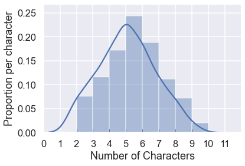

- Other kinds of visualizations are useful for investigating relationships between multiple features. 
- For example, the scatterplot below shows the relationship between hours spent studying and hours spent sleeping.

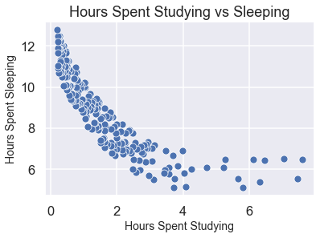

<br>

## EDA as a cyclical process
- Though EDA is commonly performed at the start of a project — before any analysis or model building — you may find yourself revisiting EDA again and again. 
- It is quite common for more questions and problems to emerge during an analysis (or even EDA itself!). 
- EDA is also a great tool for tuning a predictive model to improve its accuracy. 
- It is therefore useful to think of EDA as a cycle rather than a linear process in a data science workflow.

<br>

## EDA Conclusion
- EDA is a crucial step before diving into any data project because it informs data cleaning, can illuminate new research questions, is helpful in choosing appropriate analysis and modeling techniques, and can be useful during model tuning.

<br>

## Assessing Variable Types
- Variables define datasets. 
- They are the characteristics or attributes that we evaluate during data collection. 
- There are two ways to do that evaluation: we can **measure** or we can **categorize**.
- How we evaluate determines what kind of variable we have. 
- Since there are only two ways to get data, there are only two types of variables: numerical and categorical.

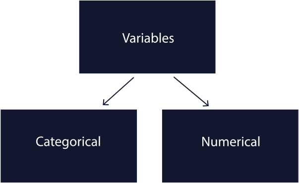

- Every observation (the individuals or objects we are collecting data about) is classified according to its characteristics. 
- In “flat” file formats (like tables, csvs, or DataFrames), the observations are the rows, the variables are the columns, and the values are at the intersection.
- We’ll go deeper into categorical and numerical variables in the following exercises.
- Typically, the best way to understand your data is to look at a sample of it.
- In the example dataset about cereal below, we can look at the first few rows with the `.head()` method to get an idea of the variable types that we have.

```python
df.head()
```

<br>

## Categorical Variables
- Categorical variables come in 3 types:
    - **Nominal** variables, which describe something,
    - **Ordinal** variables, which have an inherent ranking, and
    - **Binary** variables, which have only two possible variations.

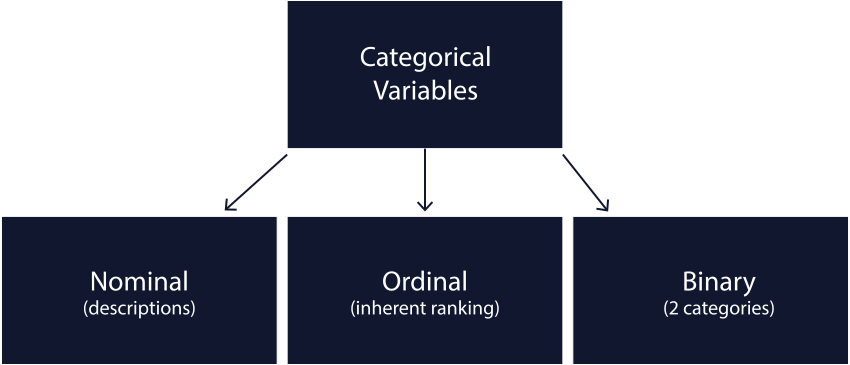

### Nominal Variables
- When we want to describe something about the world, we need a nominal variable. 
- Nominal variables are usually words (i.e., red, yellow, blue or hot, cold), but they can also be numbers (i.e., zip codes or user id’s).
- Often, nominal variables describe something with a lot of variation. 
- It can be hard to capture all of that variation, so an ‘Other’ category is often necessary. 
- For example, in the case of color, we could have a lot of different labels, but might still need an ‘Other’ category to capture anything we missed.

### Ordinal Variables
- When our categories have an inherent order, we need an ordinal variable. 
- Ordinal variables are usually described by numbers like 1st, 2nd, 3rd. Places in a race, grades in school, and the scales in survey responses (Likert Scales) are ordinal variables.
- Ordinal variables can be a little tricky because even though they are numbers, it doesn’t make sense to do math on them. 
- For example, let’s say an Olympian won a Gold medal (1st place) and a Bronze medal (3rd place). 
- We wouldn’t say that they averaged Silver medals (2nd place).
Though there is some debate about whether Likert scales should be treated like intervals or ordinal categories, most statisticians agree that they are ordinal categories and therefore should not be summarized numerically.

### Binary Variables
- When there are only two logically possible variations, we need a binary variable. 
- Binary variables are things like on/off, yes/no, and TRUE/FALSE. 
- If there is any possibility of a third option, it is not a binary variable.

<br>

## Quantitative / Numerical Variables
- Numerical variables are created two ways: through measurement and counting. 
- While measurement is a matter of philosophical debate, counting is pretty straightforward. 
- The result is continuous and discrete variables.
- Some variables depend on context to determine if they are continuous or discrete. Money and time can both be measured continuously or discretely.
- For money, all currencies have a smallest-possible-unit (i.e., the cent in USD) and are therefore discrete. 
- However, banks and other institutions sometimes measure money in fractions of a cent, treating it like a continuous variable.

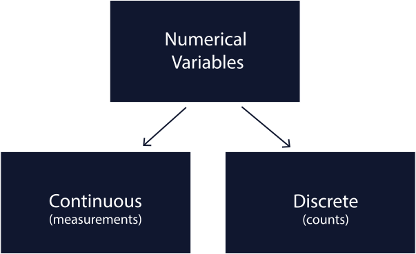

### Continuous Variables
- Continuous variables come from measurements. 
- For a variable to be continuous, there must be infinitely smaller units of measurement between one unit and the next unit. 
- Continuous variables can be represented by decimal places (but because of rounding, sometimes they are whole numbers). 
- Length, time, and temperature are all good examples of continuous variables because they all increase continuously.

### Discrete Variables
- Discrete variables come from counting. 
- For a variable to be discrete, there must be gaps between the smallest possible units. 
- People, cars, and dogs are all good examples of discrete variables.

<br>

## Changing Numerical Variable Data Types
- When you read a data file (such as a csv) with pandas, data types are assigned to each column. 
- Pandas does its best to predict what kind of data type each variable should contain. 
- For example, if a column contains only integer values, it will be stored as an `int32` or `int64`. 
- This usually works, but problems can arise for our analysis later on when there’s a mismatch between the real-world variable type and the data type pandas assigns.
- With numerical variables, pandas expects any column that has decimal values to be a `float` and anything without decimal values to be an `integer`. 
- If any non-numeric characters appear in the column, pandas will treat it as an `object`. 
- It’s possible to determine the data types of the columns in your DataFrame with the `.dtypes` attribute.

```python
df.dtypes
```
| name | dtype |
| --- | --- |
| id | int64 |
| name | object |
| age | int64 |
| height | float64 |
| weight | float64 |

- Best practices for data storage say that we should match the data type of the column with its real-world variable type. Therefore:
    - Continuous (numerical) variables should usually be stored as the `float` data type because they allow us to store decimal values.
    - Discrete (numerical) variables should be stored as the `int` datatype to represent mathematically that they are discrete.
- Using `float` and `int` to store quantitative variables is important so that you can later **perform numerical operations** on those values. 
- It also helps indicate what the variables refer to in the real world. 
- Keeping them separate helps ensure that we perform the right calculations and get the right results. 
- For example, if a variable appears with the wrong data type, we can change it with the `.astype()` function.

```python
df['id'] = df['id'].astype("string")
df.name = df.name.astype("string")
```

| name | dtype |
| --- | --- |
| id | string |
| name | string |
| age | int64 |
| height | float64 |
| weight | float64 |

- The `.astype()` function can be used to convert between a numerical data types, including:
    - `int32` `int64`
    - `float32` `float64`
    - `object`
    - `string`
    - `bool`

- If numerical columns has missing values like `NaN`, you can easily convert them to `int` data type using the `.fillna()` method.

```python
df['column_name'] = df['column_name'].fillna(0).astype(int)
df.column_name.fillna(0, inplace=True).astype(int)
```

<br>

## Changing Categorical Variable Data Types
- Just like with numerical variables, best practices for categorical data storage say that we should match the data type of the column with its real-world variable type. 
- However, the types are a little more nuanced:
    - Nominal Variables:
        - Nominal variables are often represented by the `object` data type. 
        - Columns in the object data type can contain any combination of values, including strings, integers, booleans, etc. 
        - This means that string operations like `.lower()` are not possible on object columns.
        - Nominal variables are also represented by the `string` data type. 
        - However, Pandas usually guesses `object` rather than `string`, so if you want a column to be a string, you will likely have to explicitly tell pandas to make it a `string`. 
        - This is most important if you want to do string manipulations on a column like `.lower()`.
    - Ordinal variables should be represented as `object`s, but pandas often guesses `int` since they are often encoded as whole numbers.
    - Binary variables can be represented as `bool`, but pandas often guesses `int` or `object` data types.

```python
df['column_name'] = df['column_name'].astype(dtype)
df.column_name = df.column_name.astype(dtype)
```

<br>

## The Pandas Category Data Type
- For ordinal categorical variables, we often want to store two different pieces of information: category labels and their order.
- None of the data types we’ve covered so far can store both of these at once.
- For example, let’s take another look at the `shelf` variable in our `cereal` DataFrame, which contains the shelf each item is on stored as strings. 
- We can use the `.unique()` method to inspect the category names:

```python
print(cereal['shelf'].unique())

# Output
[top, mid, bottom]
``` 

- At this point, Python does not know that these categories have an inherent order. 
- Luckily, there is a specific data type for categorical variables in pandas called `category` to address this problem! 
- The pandas `.Categorical()` method can be used to store data as type category and indicate the order of the categories.

```python
cereal['shelf'] = pd.Categorical(cereal['shelf'], ['bottom', 'mid', 'top'], ordered=True)
```

- Now, not only does Python recognize that the `shelf` column is an ordinal variable, it understands that `top` > `mid` > `bottom`. 
- If we call `.unique()` on this column again, we see how Python retains the correct rankings.

```python
print(cereal['shelf'].unique())

# Output
[bottom, mid, top]
Categories (6, object): [bottom < mid < top]
```

- This is helpful in the event that we would like to sort the column by category; if we use `.sort_values()`, the DataFrame will be sorted by the logical order of the shelf column as opposed to the alphabetical order.

<br>

## One-Hot Encoding
- In the previous exercise, we saw how label encoding can be useful for ordinal categorical variables. 
- But sometimes we need a different approach. This could be because:
    - We have a nominal categorical variable (like breed of dog), so it doesn’t really make sense to assign numbers like `0`,`1`,`2`,`3`,`4`,`5` to our categories, as this could create an order among the species that is not present.
    - We have an ordinal categorical variable but we don’t want to assume that there’s equal spacing between categories.
- Another way of encoding categorical variables is called *One-Hot Encoding (OHE)*. 
- With OHE, we essentially create a new binary variable for each of the categories within our original variable. 
- This technique is useful when managing nominal variables because it encodes the variable without creating an order among the categories.
- To perform OHE on a variable within a pandas dataframe, we can use the pandas `.get_dummies()` method which creates a binary or “dummy” variable for each category. 
- We can assign the columns to be encoded in the columns parameter, and set the data parameter to the dataset we intend to alter. 
- The `pd.get_dummies()` method will also work on data types other than category.

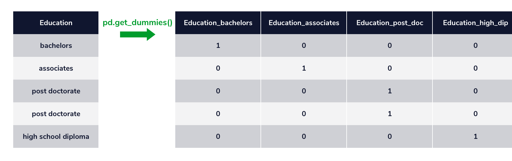

- Notice that when using `pd.get_dummies()`, we are effectively creating a new dataframe that contains a different set of variables to the original dataframe.

| Survived | Pclass | Name | SibSp | Parch | Embarked |
| --- | --- | --- | --- | --- | --- |
| 0 | 3 | Braund, Mr. Owen Harris | 1 | 0 | S |
| 1 | 1 | Cumings, Mrs. John Bradley (Florence Briggs Thayer) | 1 | 0 | C |
| 1 | 3 | Heikkinen, Miss. Laina | 0 | 0 | S |
| 1 | 1 | Futrelle, Mrs. Jacques Heath (Lily May Peel) | 1 | 0 | S |
| 0 | 3 | Allen, Mr. William Henry | 0 | 0 | Q |

```python
df = pd.get_dummies(data=df, columns=['Embarked'])
df.head()
```

| Survived | Pclass | Name | SibSp | Parch | Embarked_C | Embarked_Q | Embarked_S |
| --- | --- | --- | --- | --- | --- | --- | --- |
| 0 | 3 | Braund, Mr. Owen Harris | 1 | 0 | 0 | 0 | 1 |
| 1 | 1 | Cumings, Mrs. John Bradley (Florence Briggs Thayer) | 1 | 0 | 1 | 0 | 0 |
| 1 | 3 | Heikkinen, Miss. Laina | 0 | 0 | 0 | 0 | 1 |
| 1 | 1 | Futrelle, Mrs. Jacques Heath (Lily May Peel) | 1 | 0 | 0 | 0 | 1 |
| 0 | 3 | Allen, Mr. William Henry | 0 | 0 | 0 | 1 | 0 |

- In this example, we have created three new columns, `Embarked_C`, `Embarked_Q`, and `Embarked_S`, which represent the three categories of the original `Embarked` column.
- By passing in the dataset and column that we want to encode into `pd.get_dummies()`, we have created a new dataframe that contains three new binary variables with values of `1` for True and `0` for False, which we can view when we scroll to the right in the table. 
- Now we haven’t assigned weighting to our nominal variable. 
- It is important to note that OHE works best when we do not create too many additional variables, as increasing the dimensionality of our dataframe can create problems when working with certain machine learning models.

<br>

## Label Encoding
- Label encoding is a way to encode categorical variables as integers.
- This is useful because many machine learning algorithms require their input to be in numerical format.
- Label encoding is a simple and effective way to encode your categorical variables.
- We can use the pandas `.cat.codes` method to label encode a column in a pandas DataFrame.

```python
df['column_name'] = df['column_name'].astype('category')
df['column_name'] = df['column_name'].cat.codes
```

<br>

## Univariate Statistics
- Summary statistics that focus on a single variable are called *univariate statistics*.
- They are useful for answering questions about a single feature in tabular data.

| name | year | selling_price | km_driven | fuel | transmission | owner | mileage | engine |
| --- | --- | --- | --- | --- | --- | --- | --- | --- |
| Maruti Swift Dzire VDI | 2014 | 450000 | 145500 | Diesel | Manual | First Owner | 23.4 kmpl | 1248 cc |
| Skoda Rapid 1.5 TDI Ambition | 2014 | 370000 | 120000 | Diesel | Manual | Second Owner | 21.14 kmpl | 1498 cc |
| Honda City 2017-2020 EXi | 2006 | 158000 | 140000 | Petrol | Manual | Third Owner | 17.7 kmpl | 1497 cc |
| Hyundai i20 Sportz Diesel | 2010 | 225000 | 127000 | Diesel | Manual | First Owner | 23.0 kmpl | 1396 cc |
| Maruti Swift VXI BSIII | 2007 | 130000 | 120000 | Petrol | Manual | First Owner | 16.1 kmpl | 1298 cc |

- Univariate statistics can help us answer questions like:
    - How much does a typical car cost?
    - What proportion of cars have a manual transmission?
    - How old is the oldest listed car?
- Each of these questions focuses on a single variable (`selling_price`, `transmission`, and `year`, respectively, for the above examples). 
- Depending on the type of variable, different summary statistics are appropriate.

<br>

### Quantitative Variables
- When summarizing quantitative variables, we often want to describe *central location* and *spread*.

<br>

#### Central Location
- The central location (also called central tendency) is often used to communicate the “typical” value of a variable. 
- Recall that there are a few different ways of calculating the central location:
    - **Mean**: Also called the “average”; calculated as the sum of all values divided by the number of values.
    - **Median**: The middle value of the variable when sorted.
    - **Mode**: The most frequent value in the variable.
    - **Trimmed Mean**: The mean excluding x percent of the lowest and highest data points.
- Choosing an appropriate summary statistic for central tendency sometimes requires data visualization techniques along with domain knowledge. 
- For example, suppose we want to know the typical price of a car in our dataset. If we calculate each of the statistics described above, we’ll get the following estimates:
    - Mean = Rs. 63827.18
    - Median = Rs. 45000.00
    - Mode = Rs. 30000.00
    - Trimmed Mean = Rs. 47333.61
- Because the mean is so much larger than the median and trimmed mean, we might guess that there are some outliers in this data with respect to price. 
- We can investigate this by plotting a histogram of `selling_price`:

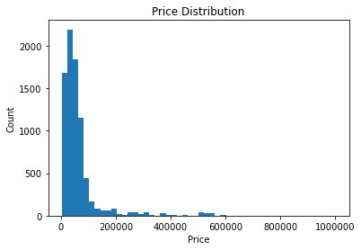

- Indeed, we see that `selling_price` is highly right-skewed. 
- The very high prices (10 million Rupees for a small number of cars) are skewing the average upwards. 
- By using the median or a trimmed mean, we can more accurately represent a “typical” price.

<br>

#### Spread
- Spread, or dispersion, describes the variability within a feature. 
- This is important because it provides context for measures of central location. 
- For example, if there is a lot of variability in car prices, we can be less certain that any particular car will be close to 450000.00 Rupees (the median price). 
- Like the central location measures, there are a few values that can describe the spread:
    - **Range**: The difference between the maximum and minimum values in a variable.
    - **Inter-Quartile Range (IQR)**: The difference between the 75th and 25th percentile values.
    - **Variance**: The average of the squared distance from each data point to the mean.
    - **Standard Deviation (SD)**: The square root of the variance.
    - **Mean Absolute Deviation (MAD)**: The mean absolute value of the distance between each data point and the mean.
- Choosing the most appropriate measure of spread is much like choosing a measure of central tendency, in that we need to consider the data holistically. 
- For example, below are measures of spread calculated for `selling_price`:
    - Range: Rs. 9970001
    - IQR: Rs. 420001
    - Variance: 650044550668.61 (Rs^2)
    - Standard Deviation: Rs. 806253.40
    - Mean Absolute Deviation: Rs. 42,213.14
- We see that the range is almost 10 million Rupees; however, this could be due to a single 10 million Rupee car in the dataset. 
- If we remove that one car, the range might be much smaller. The IQR is useful in comparison because it trims away outliers.
- Meanwhile, we see that variance is extremely large. 
- This happens because variance is calculated using squared differences, and is therefore not in the same units as the original data, making it less interpretable. 
- Both the standard deviation and MAD solve this issue, but MAD is even less impacted by extreme outliers.
- For highly skewed data or data with extreme outliers, we therefore might prefer to use IQR or MAD. 
- For data that is more normally distributed, the variance and standard deviation are frequently reported.

<br>

### Categorical Variables
- Categorical variables can be either ordinal (ordered) or nominal (unordered).
- For ordinal categorical variables, we may still want to summarize central location and spread. 
- However, because ordinal categories are not necessarily evenly spaced (like numbers), we should NOT calculate the mean of an ordinal categorical variable (or anything that relies on the mean, like variance, standard deviation, and MAD).
- For nominal categorical variables (and ordinal categorical variables), another common numerical summary statistic is the frequency or proportion of observations in each category. 
- This is often reported using a frequency table and can be visualized using a bar plot.
- For example, suppose we want to know what kind of fuel listed cars tend to use. We could calculate the frequency of each fuel type:

| Fuel Type | Count | 
| --- | --- |
| Diesel | 2153 |
| Petrol | 2123 |
| CNG | 40 |
| LPG | 23 |
| Electric | 1 |

- This tells us that `Diesel` cars are most common, with `Petrol` cars a close second. 
- Converting these frequencies to proportions can also help us compare fuel types more easily. 
- For example, the following table of proportions indicates that `Diesel` cars account for almost half of all listings.

| Fuel Type | Count (Normalization) | 
| --- | --- |
| Diesel | 0.496083 |
| Petrol | 0.489171 |
| CNG | 0.009217 |
| LPG | 0.005300 |
| Electric | 0.000230 |

<br>

## Bivariate Statistics
- In contrast to univariate statistics, bivariate statistics are used to summarize the relationship between two variables. 
- They are useful for answering questions like:
    - Do manual transmission cars tend to cost more or less than automatic transmission?
    - Do older cars tend to cost less money?
    - Are automatic transmission cars more likely to be sold by individuals or dealers?
- Depending on the types of variables we want to summarize a relationship between, we should choose different summary statistics.

<br>

### One Quantitative and One Categorical Variable
- If we want to know whether manual transmission cars tend to cost more or less than automatic transmission cars, we are interested in the relationship between `transmission` (categorical) and `selling_price` (quantitative). 
- To answer this question, we can use a mean or median difference.
- For example, if we calculate that the correlation between `year` and `selling_price` is 0.4, we can conclude that there is a moderate positive association between these variables (older cars do tend to cost less money).

<br>

### Two Categorical Variables
- If we want to know whether automatic transmission cars are more likely to be sold by individuals or dealers, we are interested in the relationship between `transmission` and `seller_type`, both of which are categorical. 
- We can explore this relationship using a contingency table and the Chi-Square statistic.
- For example, based on the following contingency table, we might conclude that a higher proportion of cars sold by dealers are automatic (compared to cars sold by individuals):

| seller_type<br>transmission | Dealer | Individual | Trustmark Dealer |
| --- | --- | --- | --- |
| Automatic | 217 | 212 | 19 |
| Manual | 777 | 3032 | 83 |

<br>

## Central Tendency for Quantitative Data
- For quantitative variables, we often want to describe the central tendency, or the “typical” value of a variable. 
- For example, what is the typical cost of rent in New York City?
- There are several common measures of central tendency:
    - **Mean**: The average value of the variable, calculated as the sum of all values divided by the number of values.
    - **Median**: The middle value of the variable when sorted.
    - **Mode**: The most frequent value of the variable.
    - **Trimmed Mean**: The mean excluding x percent of the lowest and highest data points.
- For our `rentals` DataFrame with a column named `rent` that contains rental prices, we can calculate the central tendency statistics listed above as follows:

```python
# Mean
rentals.rent.mean()

# Median
rentals.rent.median()

# Mode
rentals.rent.mode()

# Trimmed mean
from scipy.stats import trim_mean
trim_mean(rentals.rent, proportiontocut=0.1)  # trim extreme 10%
```

<br>

## Spread for Quantitative Data
- The spread of a quantitative variable describes the amount of variability. 
- This is important because it provides context for measures of central tendency. 
- For example, if there is a lot of variability in New York City rent prices, we can be less certain that the mean or median price is representative of what the typical rent is.
- There are several common measures of spread:
    - **Range**: The difference between the maximum and minimum values of a variable.
    - **Interquartile range (IQR)**: The difference between the 75th and 25th percentile values.
    - **Variance**: The average of the squared distance from each data point to the mean.
    - **Standard deviation (SD)**: The square root of the variance.
    - **Mean absolute deviation (MAD)**: The mean absolute value of the distance between each data point and the mean.
- For our `rentals` DataFrame, we can calculate the spread for the `rent` column as follows:

```python
# Range
rentals.rent.max() - rentals.rent.min()

# Interquartile range
rentals.rent.quantile(0.75) - rentals.rent.quantile(0.25)

from scipy.stats import iqr
iqr(rentals.rent)  # alternative way

# Variance
rentals.rent.var()

# Standard deviation
rentals.rent.std()

# Mean absolute deviation
rentals.rent.mad()
```

<br>

## Visualizing Quantitative Variables
- While summary statistics are certainly helpful for exploring and quantifying a feature, we might find it hard to wrap our minds around a bunch of numbers. 
- This is why data visualization is such a powerful element of EDA.
- For quantitative variables, *boxplots* and *histograms* are two common visualizations. 
- These plots are useful because they simultaneously communicate information about minimum and maximum values, central location, and spread. 
- *Histograms* can additionally illuminate patterns that can impact an analysis (e.g., skew or multimodality).
- Python’s `seaborn` library, built on top of matplotlib, offers the `boxplot()` and `histplot()` functions to easily plot data from a `pandas` DataFrame:

```python
import matplotlib.pyplot as plt 
import seaborn as sns

# Boxplot for rent
sns.boxplot(x='rent', data=rentals)
plt.show()
plt.close()
```

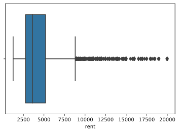

```python
# Histogram for rent
sns.histplot(x='rent', data=rentals)
plt.show()
plt.close()
```

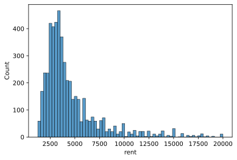

<br>

## Value Counts for Categorical Variables
- When it comes to categorical variables, the measures of central tendency and spread that worked for describing numeric variables, like mean and standard deviation, generally becomes unsuitable when we’re dealing with discrete values. 
- Unlike numbers, categorical values are not continuous and oftentimes do not have an intrinsic ordering.
- Instead, a good way to summarize categorical variables is to generate a frequency table containing the count of each distinct value. 
- For example, we may be interested to know how many of the New York City rental listings are from each borough. 
- Related, we can also find which borough has the most listings.

```python
# Counts of rental listings in each borough
df.borough.value_counts()

# Output
Manhattan        3539   
Brooklyn         1013
Queens            448
```

- By default, it returns the results sorted in descending order by count, where the top element is the mode, or the most frequently appearing value. 
- In this case, the mode is Manhattan with 3,539 rental listings.

<br>

## Value Proportions for Categorical Data
- A counts table is one approach for exploring categorical variables, but sometimes it is useful to also look at the proportion of values in each category. 
- For example, knowing that there are 3,539 rental listings in Manhattan is hard to interpret without any context about the counts in the other categories. 
- On the other hand, knowing that Manhattan listings make up 71% of all New York City listings tells us a lot more about the relative frequency of this category.
- We can calculate the proportion for each category by dividing its count by the total number of values for that variable:

```python
# Proportions of rental listings in each borough
rentals.borough.value_counts() / len(rentals.borough)

# Output
Manhattan    0.7078
Brooklyn     0.2026
Queens       0.0896
```

- Alternatively, we could also obtain the proportions by specifying `normalize=True` to the `.value_counts()` method:

```python
df.borough.value_counts(normalize=True)
```

<br>

## Visualizing Categorical Variables
- For categorical variables, bar charts and pie charts are common options for visualizing the count (or proportion) of values in each category. 
- They can also convey the relative frequencies of each category.
- Python’s `seaborn` library offers several functions that can create bar charts. 
- The simplest for plotting the counts is `countplot()`:

```python
# Bar chart for borough
sns.countplot(x='borough', data=rentals)
plt.show()
plt.close()
```

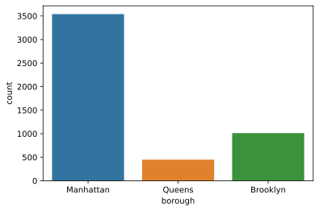

- There are currently no functions in the `seaborn` library for creating a pie chart, but the `pandas` library provides a convenient wrapper function around `matplotlib`‘s `pie()` function that can generate a pie chart from any column in a DataFrame:

```python
# Pie chart for borough
rentals.borough.value_counts().plot.pie()
plt.show()
plt.close()
```

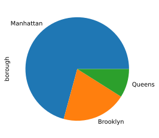

- In general, many data analysts avoid pie charts because people are better at visually comparing areas of rectangles than wedges of a pie. 
- For a variable with a small number of categories (i.e., fewer than three), a pie chart is a reasonable choice; however, for more complex data, a bar chart is usually preferable.

<br>

## Mean and Median Differences
- Is the difference between the mean and median of a quantitative variable
- We want to find out if two variables (e.g. school type, test scores) have a strong relationship by comparing them with another school type and test scores. If the difference is large, it can be assumed that there is a relationship between one type of school and its test scores, otherwise there is weak relationship.

```python
# Calculate the mean and median of a column using pandas 
mean = df['column_name'].mean()
mean = df.column_name.mean()
median = df['column_name'].median()
median = df.column_name.median()

# Using numpy 
mean = np.mean(df['column_name'])
median = np.median(df['column_name'])

mean_diff = mean_1 - mean_2
median_diff = median_1 - median_2
```

- Highly associated variables tend to have a large mean or median difference. Since “large” could have different meanings depending on the variable
    - Highly associated variables often have a large mean or median difference because it indicates a strong relationship or effect between the groups being compared. 
    - A large difference suggests that the variable (e.g., school type, location) has a significant impact on the outcome (e.g., test scores). 
    - This means that the variable is likely influencing the results, leading to distinct group characteristics.
    - The goal is to determine if the type of school (e.g., urban vs. rural) has a strong relationship with test scores. 
    - By comparing the mean or median scores of students from different school types, a large difference suggests that the school type might significantly influence the test scores. 
    - This indicates a potential association between school type and test scores.

<br>

## Side-by-Side Box Plots
- The difference in mean math scores for students at GP and MS was 0.64. How do we know whether this difference is considered small or large?
- To answer this question, we need to know something about the spread of the data.
- One way to get a better sense of spread is by looking at a visual representation of the data. 
- Side-by-side box plots are useful in visualizing mean and median differences because they allow us to visually estimate the variation in the data. 
- This can help us determine if mean or median differences are “large” or “small”.

```python
sns.boxplot(data = df, x = 'school', y = 'G3')
plt.show()
```

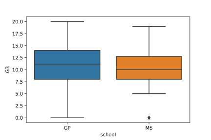

- Looking at the plot, we can clearly see that there is a lot of overlap between the boxes (i.e. the middle 50% of the data). 
- Therefore, we can be more confident that there is not much difference between the math scores of the two groups.
- In contrast, suppose we saw the following plot:

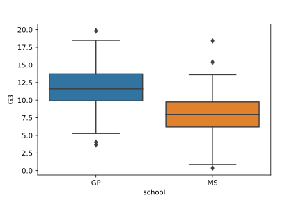

- In this version, the boxes barely overlap, demonstrating that the middle 50% of scores are different for the two schools. 
- This would be evidence of a stronger association between school and math score.

<br>

## Inspecting Overlapping Histograms
- Another way to explore the relationship between a quantitative and categorical variable in more detail is by inspecting overlapping histograms.
- In the code below, setting `alpha = .5` ensures that the histograms are see-through enough that we can see both of them at once. We have also used `normed=True` make sure that the y-axis is a density rather than a frequency (note: the newest version of matplotlib renamed this parameter `density` instead of `normed`):

```python
plt.hist(scores_GP , color="blue", label="GP", normed=True, alpha=0.5)
plt.hist(scores_MS , color="red", label="MS", normed=True, alpha=0.5)
plt.legend()
plt.show()
```

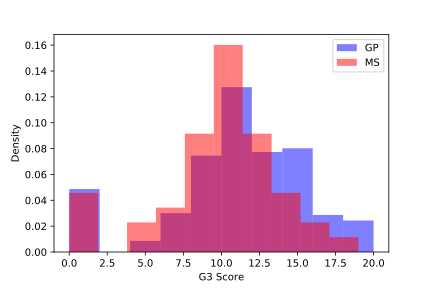

- By inspecting this histogram, we can clearly see that the entire distribution of scores at GP (not just the mean or median) appears slightly shifted to the right (higher) compared to the scores at MS. 
- However, there is also still a lot of overlap between the scores, suggesting that the association is relatively weak.
- Note that there are only 46 students at MS, but there are 349 students at GP. If we hadn’t used `normed = True`, our histogram would have looked like this, making it impossible to compare the distributions fairly:

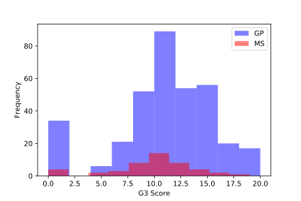

- While overlapping histograms and side by side boxplots can convey similar information, histograms give us more detail and can be useful in spotting patterns that were not visible in a box plot (eg., a bimodal distribution). 
- For example, the following set of box plots and overlapping histograms illustrate the same hypothetical data:

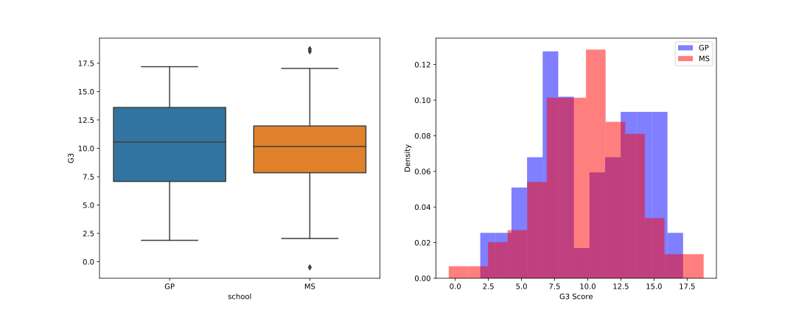

- While the box plots and means/medians appear similar, the overlapping histograms illuminate the differences between these two distributions of scores.

<br>

## Exploring Non-Binary Categorical Variables
- In each of the previous exercises, we assessed whether there was an association between a quantitative variable (math scores) and a BINARY categorical variable (school). 
- The categorical variable is considered binary because there are only two available options, either MS or GP. 
- However, sometimes we are interested in an association between a quantitative variable and non-binary categorical variable. 
- Non-binary categorical variables have more than two categories.
- When looking at an association between a quantitative variable and a non-binary categorical variable, we must examine all pair-wise differences. 
- For example, suppose we want to know whether or not an association exists between math scores (`G3`) and (`Mjob`), a categorical variable representing the mother’s job. 
- This variable has five possible categories: `at_home`, `health`, `services`, `teacher`, or `other`. 
- There are actually 10 different comparisons that we can make. 
- For example, we can compare scores for students whose mothers work `at_home` or in `health`; `at_home` or `other`; at home or `services; etc.. The easiest way to quickly visualize these comparisons is with side-by-side box plots:

```python
sns.boxplot(data = df, x = 'Mjob', y = 'G3')
plt.show()
```

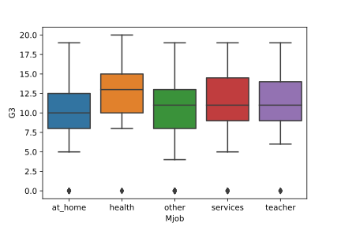

- Visually, we need to compare each box to every other box. 
- While most of these boxes overlap with each other, there are some pairs for which there are some apparent differences. 
- For example, scores appear to be higher among students with mothers working in health than among students with mothers working at home or in an “other” job. 
- If there are ANY pairwise differences, we can say that the variables are associated; however, it is more useful to specifically report which groups are different.

<br>

## Introduction: Association Between Two Quantitative Variables
- When associations exist between variables, it means that information about the value of one variable gives us information about the value of the other variable. 

<br>

## Scatter Plots
- One of the best ways to quickly visualize the relationship between quantitative variables is to plot them against each other in a scatter plot. 
- This makes it easy to look for patterns or trends in the data. 
- Let’s start by plotting the area of a rental against its monthly price to see if we can spot any patterns.

```python
plt.scatter(x = housing.price, y = housing.sqfeet)
plt.xlabel('Rental Price (USD)')
plt.ylabel('Area (Square Feet)')
plt.show()
```

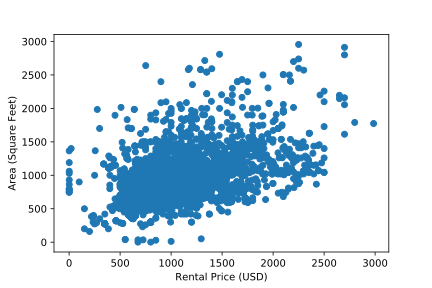

- While there’s a lot of variation in the data, it seems like more expensive housing tends to come with slightly more space. 
- This suggests an association between these two variables.
- It’s important to note that different kinds of associations can lead to different patterns in a scatter plot. 
- For example, the following plot shows the relationship between the age of a child in months and their weight in pounds. 
- We can see that older children tend to weigh more but that the growth rate starts leveling off after 36 months:

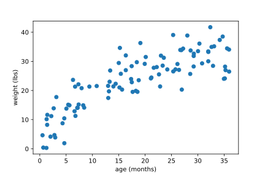

- If we don’t see any patterns in a scatter plot, we can probably guess that the variables are not associated. 
- For example, a scatter plot like this would suggest no association:

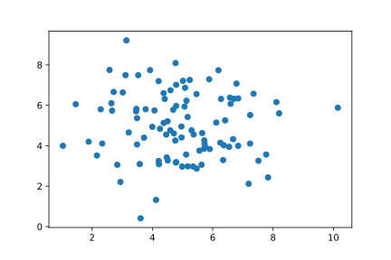

<br>

## Exploring Covariance
- Beyond visualizing relationships, we can also use summary statistics to quantify the strength of certain associations. 
- *Covariance* is a summary statistic that describes the **strength of a linear relationship**. 
- A linear relationship is one where a straight line would best describe the pattern of points in a scatter plot.
- Covariance can range from negative infinity to positive infinity. 
    - A positive covariance indicates that a larger value of one variable is associated with a larger value of the other. 
    - A negative covariance indicates a larger value of one variable is associated with a smaller value of the other. 
    - A covariance of 0 indicates no linear relationship. Here are some examples:

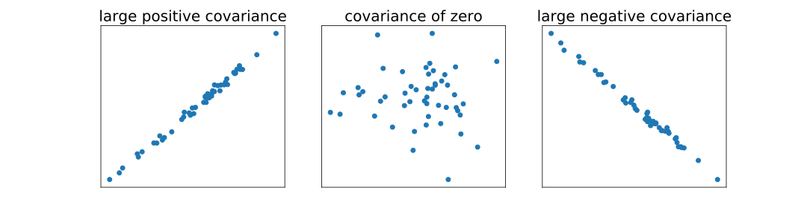

- To calculate covariance, we can use the `cov()` function from NumPy, which produces a covariance matrix for two or more variables. 
- A covariance matrix for two variables looks something like this:

| | Variable 1 | Variable 2 |
| --- | --- | --- |
| Variable 1 | variance(variable 1) | covariance |
| Variable 2 | covariance | variance(variable 2) |

```python
import numpy as np

cov_mat_price_sqfeet = np.cov(housing.price, housing.sqfeet)
print(cov_mat_price_sqfeet)

# Output: 
[[184332.9  57336.2]
 [ 57336.2 122045.2]]
```

<br>

## Correlation
- Like covariance, *Pearson Correlation* (often referred to simply as “correlation”) is **a scaled form of covariance**. 
- It also measures the strength of a linear relationship, but ranges from -1 to +1, making it more interpretable. 
- Highly associated variables with a positive linear relationship will have a correlation close to 1. 
- Highly associated variables with a negative linear relationship will have a correlation close to -1. 
- Variables that do not have a linear association (or a linear association with a slope of zero) will have correlations close to 0.

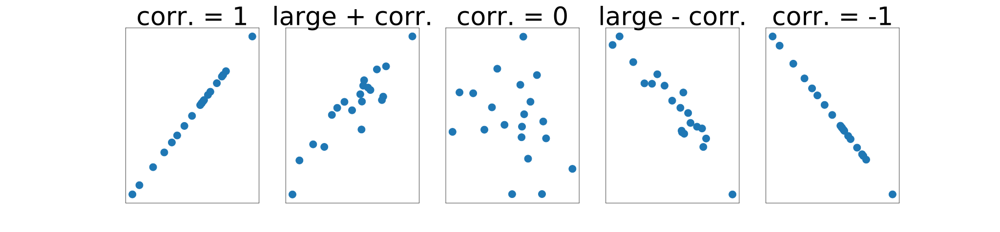

- The `pearsonr()` function from `scipy.stats` can be used to calculate correlation as follows:

```python
from scipy.stats import pearsonr

corr_price_sqfeet, p = pearsonr(housing.price, housing.sqfeet)
print(corr_price_sqfeet) # Output: 0.507
```

- Generally, a correlation larger than about .3 indicates a linear association. 
- A correlation greater than about .6 suggestions a strong linear association.

<br>

- It’s important to note that there are some limitations to using correlation or covariance as a way of assessing whether there is an association between two variables. 
- Because correlation and covariance both measure the strength of **linear** relationships with non-zero slopes, but not other kinds of relationships, correlation can be misleading.
- For example, the four scatter plots below all show pairs of variables with near-zero correlations. 
- The bottom left image shows an example of a perfect linear association where the slope is zero (the line is horizontal). 
- Meanwhile, the other three plots show non-linear relationships — if we drew a line through any of these sets of points, that line would need to be curved, not straight!

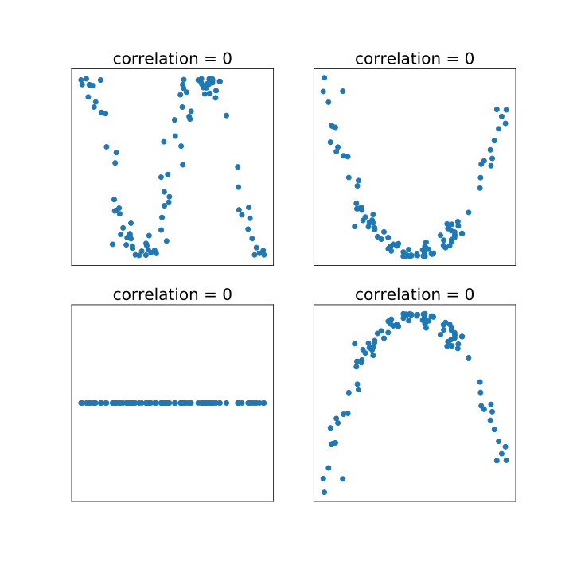

<br>

## Contingency Tables: Frequencies
- Contingency tables, also known as two-way tables or cross-tabulations, are useful for summarizing two variables at the same time. 
- For example, suppose we are interested in understanding whether there is an association between influence (whether a person thinks they have a talent for `influencing` people) and `leader` (whether they see themself as a leader). 
- We can use the `crosstab` function from pandas to create a contingency table:

```python
influence_leader_freq = pd.crosstab(npi.influence, npi.leader)
print(influence_leader_freq)

# Output
leader      No    Yes
influence
No         3015  1293
Yes        2360  4429
```

- This table tells us the number of people who gave each possible combination of responses to these two questions. 
- For example, 2360 people said that they do not see themselves as a leader but have a talent for influencing people.
- To assess whether there is an association between these two variables, we need to ask whether information about one variable gives us information about the other. 
- In this example, we see that among people who **don’t** see themselves as a leader (the first column), a larger number (3015) **don’t** think they have a talent for influencing people. 
- Meanwhile, among people who **do** see themselves as a leader (the second column), a larger number (4429) **do** think they have a talent for influencing people.
- So, if we know how someone responded to the leadership question, we have some information about how they are likely to respond to the influence question. 
- This suggests that the variables are associated.

<br>

## Contingency Tables: Proportions
- Sometimes it’s helpful to convert those frequencies to proportions. 
- We can accomplish this simply by dividing the all the frequencies in a contingency table by the total number of observations (the sum of the frequencies):

```python
influence_leader_freq = pd.crosstab(npi.influence, npi.leader)
influence_leader_prop = influence_leader_freq/len(npi)
print(influence_leader_prop)

# Output
leader          No         Yes
influence
No        0.271695    0.116518
Yes       0.212670    0.399117
```

- The resulting contingency table makes it slightly easier to compare the proportion of people in each category. 
- For example, we see that the two largest proportions in the table (.399 and .271) are in the yes/yes and no/no cells of the table. 
- We can also see that almost 40% of the surveyed population (by far the largest proportion) both see themselves as leaders and think they have a talent for influencing people.

<br>

## Marginal Proportions
- Now, let’s take a moment to think about what the tables would look like if there were no association between the variables. 
- Our first instinct may be that there would be .25 (25%) of the data in each of the four cells of the table, but that is not the case. 
- Let’s take another look at our contingency table.

```python
leader           no       yes
influence                    
no         0.271695  0.116518
yes        0.212670  0.399117
```

- We might notice that the bottom row, which corresponds to people who think they have a talent for influencing people, accounts for 0.213 + 0.399 = 0.612 (or 61.2%) of surveyed people — more than half! This means that we can expect higher proportions in the bottom row, regardless of whether the questions are associated.
- The proportion of respondents in each category of a single question is called a *marginal proportion*. 
- For example, the marginal proportion of the population that has a talent for influencing people is 0.612. 
- We can calculate all the marginal proportions from the contingency table of proportions (saved as `influence_leader_prop`) using row and column sums as follows:

```python
leader_marginals = influence_leader_prop.sum(axis=0)
print(leader_marginals)
influence_marginals =  influence_leader_prop.sum(axis=1)
print(influence_marginals)

# Output
leader
no     0.484365
yes    0.515635
dtype: float64

influence
no     0.388213
yes    0.611787
dtype: float64
```

- While respondents are approximately split on whether they see themselves as a leader, more people think they have a talent for influencing people than not.

<br>

## Expected Contingency Tables
- In the previous exercise we calculated the following marginal proportions for the leader and influence questions:

```python
leader            influence
no     0.484      no     0.388
yes    0.516      yes    0.612
```

- In order to understand whether these questions are associated, we can use the marginal proportions to create a contingency table of *expected proportions* if there were no **association** between these variables. 
- To calculate these expected proportions, we need to multiply the marginal proportions for each combination of categories:

```python
	                leader = no	             leader = yes
influence = no	    0.484*0.388 = 0.188	     0.516*0.388 = .200
influence = yes	    0.484*0.612 = 0.296	     0.516*0.612 = 0.315
```

- These proportions can then be converted to frequencies by multiplying each one by the sample size (11097 for this data):

```python
	                leader = no	              leader = yes
influence = no	    0.188*11097 = 2087	      0.200*11097 = 2221
influence = yes	    0.296*11097 = 3288	      0.315*11097 = 3501
```

- This table tells us that if there were no association between the leader and influence questions, we would expect 2087 people to answer no to both.
- In python, we can calculate this table using the `chi2_contingency()` function from SciPy, by passing in the observed frequency table. There are actually four outputs from this function, but for now, we’ll only look at the fourth one:

```python
from scipy.stats import chi2_contingency

chi2, pval, dof, expected = chi2_contingency(influence_leader_freq)
print(np.round(expected))

# Output:
[[2087. 2221.]
 [3288. 3501.]]
```

- Note that the ScyPy function returned the same expected frequencies as we calculated “by hand” above! Now that we have the expected contingency table if there’s no association, we can compare it to our observed contingency table:

```python
leader       no   yes
influence            
no         3015  1293
yes        2360  4429
```

- The more that the expected and observed tables differ, the more sure we can be that the variables are associated. 
- In this example, we see some pretty big differences (eg., 3015 in the observed table compared to 2087 in the expected table). 
- This provides additional evidence that these variables are associated.

<br>

## The Chi-Square Statistic
- In the previous exercise, we calculated a contingency table of expected frequencies **if** there were no association between the `leader` and `influence` questions. 
- We then compared this to the observed contingency table. 
- Because the tables looked somewhat different, we concluded that responses to these questions are probably associated.
- While we can inspect these tables visually, many data scientists use the *Chi-Square statistic* to summarize **how** different these two tables are. 
- To calculate the Chi Square statistic, we simply find the squared difference between each value in the observed table and its corresponding value in the expected table, and then divide that number by the value from the expected table; finally add up those numbers:

$$ ChiSquare = \sum \frac{(observed - expected)^2}{expected} $$

- The Chi-Square statistic is also the first output of the SciPy function `chi2_contingency()`:

```python
from scipy.stats import chi2_contingency

chi2, pval, dof, expected = chi2_contingency(influence_leader_freq)
print(chi2)
# Output: 1307.88
```

- The interpretation of the Chi-Square statistic is dependent on the size of the contingency table. 
- For a 2x2 table (like the one we’ve been investigating), a Chi-Square statistic larger than around 4 would strongly suggest an association between the variables. 
- In this example, our Chi-Square statistic is much larger than that — 1307.88! This adds to our evidence that the variables are highly associated.