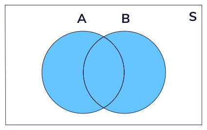
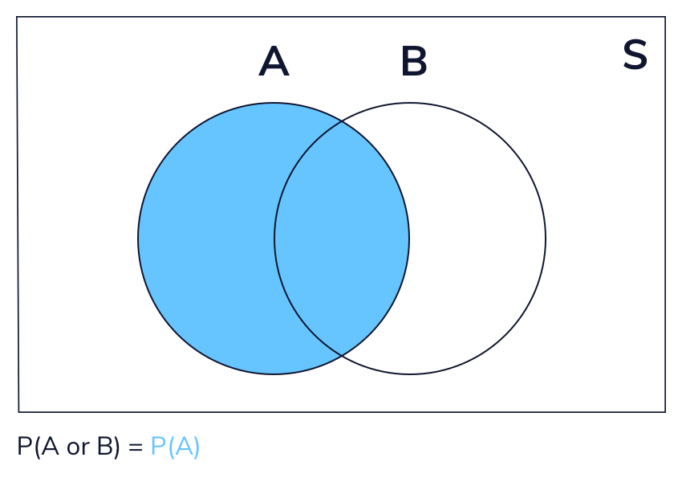
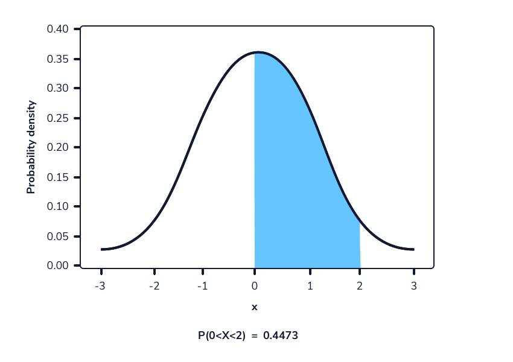
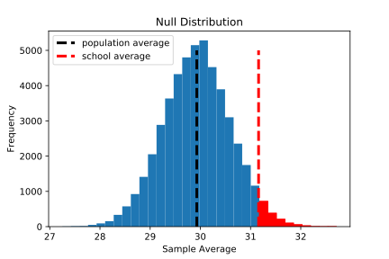

# 9 Statistics Fundamentals for Data Science

<br>

## Content

- **Probability for Data Science**
    - [Probability, Set Theory, and the Law of Large Numbers](#probability-set-theory-and-the-law-of-large-numbers)
        - [Probability](#probability)
        - [Set Theory](#set-theory)
        - [Experiments and Sample Spaces](#experiments-and-sample-spaces)
        - [Law of Large Numbers](#law-of-large-numbers)
    - **Rules of Probability**
        - [Introduction to Rules of Probability](#introduction-to-rules-of-probability)
        - [Union, Intersection, and Complement](#union-intersection-and-complement)
            - [Union](#union)
            - [Intersection](#intersection)
            - [Complement](#complement)
        - [Independence and Dependence](#independence-and-dependence)
        - [Mutually Exclusive Events](#mutually-exclusive-events)
        - [Addition Rule](#addition-rule)
        - [Conditional Probability](#conditional-probability)
        - [Multiplication Rule](#multiplication-rule)
            - [General Formula](#general-formula)
            - [Dependent Events](#dependent-events)
            - [Independent Events](#independent-events)
        - [Conditional Probability Continued](#conditional-probability-continued)
        - [Bayes’ Theorem](#bayes-theorem)
    - **Introduction to Probability Distributions**
        - [Random Variables](#random-variables)
        - [Discrete and Continuous Random Variables](#discrete-and-continuous-random-variables)
            - [Discrete Random Variables](#discrete-random-variables)
            - [Continuous Random Variables](#continuous-random-variables)
        - [Probability Mass Functions](#probability-mass-functions)
        - [Calculating Probabilities using Python](#calculating-probabilities-using-python)
        - [Using the Probability Mass Function Over a Range](#using-the-probability-mass-function-over-a-range)
        - [Probability Mass Function Over a Range using Python](#probability-mass-function-over-a-range-using-python)
        - [Cumulative Distribution Function](#cumulative-distribution-function)
        - [Cumulative Distribution Function continued](#cumulative-distribution-function-continued)
        - [Using the Cumulative Distribution Function in Python](#using-the-cumulative-distribution-function-in-python)
        - [Probability Density Functions](#probability-density-functions)
        - [Probability Density Functions and Cumulative Distribution Function](#probability-density-functions-and-cumulative-distribution-function)
    - **More on Probability Distributions**
        - [Introduction to the Poisson Distribution](#introduction-to-the-poisson-distribution)
        - [Calculating Probabilities of Exact Values Using the Probability Mass Function](#calculating-probabilities-of-exact-values-using-the-probability-mass-function)
        - [Calculating Probabilities of a Range using the Cumulative Density Function](#calculating-probabilities-of-a-range-using-the-cumulative-density-function)
        - [Expectation of the Poisson Distribution](#expectation-of-the-poisson-distribution)
        - [Spread of the Poisson Distribution](#spread-of-the-poisson-distribution)
        - [Expected Value of the Binomial Distribution](#expected-value-of-the-binomial-distribution)
        - [Variance of the Binomial Distribution](#variance-of-the-binomial-distribution)
        - [Properties of Expectation and Variance](#properties-of-expectation-and-variance)
            - [Properties of Expectation](#properties-of-expectation)
            - [Properties of Variance](#properties-of-variance)
- **Sampling for Data Science**
    - [Sampling from a Population](#sampling-from-a-population)
    - [Random Sampling in Python](#random-sampling-in-python)
    - [Sampling Distributions](#sampling-distributions)
    - [Central Limit Theorem](#central-limit-theorem)
    - [CLT Continued](#clt-continued)
    - [Standard Error](#standard-error)
    - [Biased Estimators](#biased-estimators)
    - [Calculating Probabilities](#calculating-probabilities)
    - [Article: Central Limit Theorem](#article-central-limit-theorem)
- **Hypthesis Testing for Data Science**
    - [Article: Introduction to Hypothesis Testing (Simulating a One-Sample T-Test)](#article-introduction-to-hypothesis-testing-simulating-a-one-sample-t-test)
        - [What is hypothesis testing?](#what-is-hypothesis-testing)
        - [Step 1: Ask a Question](#step-1-ask-a-question)
        - [Step 2: Define the Null and Alternative Hypotheses](#step-2-define-the-null-and-alternative-hypotheses)
        - [Step 3: Determine the Null Distribution](#step-3-determine-the-null-distribution)
        - [Step 4: Calculate a P-Value (or Confidence Interval)](#step-4-calculate-a-p-value-or-confidence-interval)
            - [Option 1](#option-1)
            - [Option 2](#option-2)
            - [Option 3](#option-3)
        - [Step 5: Interpret the Results](#step-5-interpret-the-results)
            - [Significance thresholds](#significance-thresholds)
            - [Impact of the Alternative Hypothesis](#impact-of-the-alternative-hypothesis)
        - [Summary and further applications](#summary-and-further-applications)
    - **One-Sample T-Tests in SciPy**
        - [Introduction One-Sample T-Tests](#introduction-one-sample-t-tests)
        - [Implementing a One-Sample T-Test](#implementing-a-one-sample-t-test)
        - [Assumptions of a One Sample T-Test](#assumptions-of-a-one-sample-t-test)
    - **Simulating a Binomial Test**
        - [Introduction Simulating a Binomial Test](#introduction-simulating-a-binomial-test)
        - [Summarizing the Sample](#summarizing-the-sample)
        - [Simulating Randomness](#simulating-randomness)
        - [Simulating the Null Distribution I](#simulating-the-null-distribution-i)
        - [Simulating the Null Distribution II](#simulating-the-null-distribution-ii)
        - [Inspecting the Null Distribution](#inspecting-the-null-distribution)
        - [Confidence Intervals](#confidence-intervals)
        - [Calculating a One-Sided P-Value](#calculating-a-one-sided-p-value)
        - [Calculating a Two-Sided P-Value](#calculating-a-two-sided-p-value)
        - [Writing a Binomial Test Function](#writing-a-binomial-test-function)
        - [Binomial Testing with SciPy](#binomial-testing-with-scipy)
    - **Summary One Sample T-Test vs. Binomial Test**
        - [Different One-Sample T-Test and Binomial Test](#different-one-sample-t-test-and-binomial-test)
        - [Python Implementation](#python-implementation)
    - **Significance Thresholds**
        - [Introduction to Significance Thresholds](#introduction-to-significance-thresholds)
        - [Interpreting a P-Value based on a Significance Threshold](#interpreting-a-p-value-based-on-a-significance-threshold)
        - [Error Types](#error-types)
        - [Setting the Type I Error Rate](#setting-the-type-i-error-rate)
        - [Problems with Multiple Hypothesis Tests](#problems-with-multiple-hypothesis-tests)
        - [Significance Thresholds Review](#significance-thresholds-review)
- **Simple Linear Regression for Data Science**
    - **Introduction to Linear Regression** 
        - [Introduction to Linear Regression](#introduction-to-linear-regression)
        - [Equation of a Line](#equation-of-a-line)
        - [Finding the "Best" Line](#finding-the-best-line)
        - [Fitting a Linear Regression Model in Python](#fitting-a-linear-regression-model-in-python)
        - [Using a Regression Model for Prediction](#using-a-regression-model-for-prediction)
        - [Interpreting a Regression Model](#interpreting-a-regression-model)
        - [Assumptions of Linear Regression Part 1](#assumptions-of-linear-regression-part-1)
        - [Assumptions of Linear Regression Part 2](#assumptions-of-linear-regression-part-2)
            - [Normality Assumption](#normality-assumption)
            - [Homoscedasticity Assumption](#homoscedasticity-assumption)
        - [Categorical Predictors](#categorical-predictors)
        - [Categorical Predictors: Fit and Interpretation](#categorical-predictors-fit-and-interpretation)
    - [Article: Linear Regression with a Category Predictor](#article-linear-regression-with-a-category-predictor)
        - [Introduction to Linear Regression with a Categorical Predictor](#introduction-to-linear-regression-with-a-categorical-predictor)
        - [The Data](#the-data)
        - [The X Matrix](#the-x-matrix)
        - [Implementation and Interpretation](#implementation-and-interpretation)
        - [Changing the Reference Category](#changing-the-reference-category)
        - [Other Python Libraries for fitting Linear Models](#other-python-libraries-for-fitting-linear-models)
        - [Conclusion](#conclusion)

<br>

## Probability, Set Theory, and the Law of Large Numbers

<br>

### Probability
- *Probability* is a branch of mathematics that allows us to quantify uncertainty. 
- In our daily lives, we often use probability to make decisions, even without thinking about it!
- **For example**:
    - Many weather reports give a percent chance that it will rain. 
    - If we hear that there is an 80 percent chance of rain, we probably are not going to make many plans outside. 
    - However, if there is only a 5 percent chance of rain, we may feel comfortable planning a picnic.

<br>

### Set Theory
- *Set theory* is a branch of mathematics based around the concept of sets. 
- In simple terms, a set is a collection of things. 
- **For example**:
    - We can use a set to represent items in a backpack. We might have:

$$ \{Book,Paper,Folder,Hat,Pen,Snack\} $$ 

- Notationally, mathematicians often represent sets with curly braces. Sets also follow two key rules:
    - Each element in a set is distinct.
    - The elements in a set are in no particular order.
- Therefore, we can say:

$$ \{1,2,3,4,5\} = \{5,3,2,4,1\} $$

- When defining a set, we often use a capital letter. For example:

$$ A = \{1,2,3,4,5\} $$

- Sets can also contain *subsets*. Set *A* is a subset of set *B* if all the elements in *A* exist within *B*. For example:

$$ A = \{1,2,3\} $$
$$ B = \{1,2,3,4,5\} $$

- Here, set *A* is a subset of *B* because all elements of *A* are contained within *B*.

<br>

### Experiments and Sample Spaces
- In probability, an *experiment* is something that produces observation(s) with some level of uncertainty. 
- A *sample point* is a single possible outcome of an experiment. 
- Finally, a *sample space* is the set of all possible sample points for an experiment.
- **For example**:
    - Suppose that we run an experiment where we flip a coin twice and record whether each flip results in heads or tails. 
    - There are four sample points in this experiment: two heads (*HH*), tails and then heads (TH), heads and then tails (HT), or two tails (TT). 
    - We can write the full sample space for this experiment as follows:

$$ S = \{HH,TH,HT,TT\} $$

- Suppose we are interested in the probability of one specific outcome: *HH*. 
- A specific outcome (or set of outcomes) is known as an *event* and is a subset of the sample space. 
- Three events we might look at in this sample space are:

$$ \text{Getting Two Heads} = A = \{HH\} $$
$$ \text{Getting Two Tail} = B = \{TT\} $$
$$ \text{Getting Both a Heads and Tails} = C = \{HT,TH\} $$

- The frequentist definition of *probability* is as follows: If we run an experiment an infinite amount of times, the probability of each event is the proportion of times it occurs. 
- Unfortunately, we don’t have the ability to flip two coins an infinite amount of times — but we can estimate probabilities by choosing some other large number, such as 1000.
- Okay, we have flipped two coins 1000 times. Here are each of the outcomes and the number of times we observed each one:
    - $ \{HH\} = 252 $
    - $ \{TT\} = 247 $
    - $ \{HT\} = 256 $
    - $ \{TH\} = 245 $
- To calculate the estimated probability of any one outcome, we use the following formula:

$$ P(Event) = \frac{\text{Number of Times Event Occurred}}{\text{Total Number of Trials}} $$

- In this scenario, a *trial* is a single run of our experiment (two coin flips). So, the probability of two heads on two coin flips is approximately:

$$ P(HH) = \frac{252}{1000} = 0.252 $$

- Based on these 1000 trials, we would estimate there is a 25.2% chance of getting two heads on two coin flips.
- However, if we do this same procedure over and over again, we may get slightly different results. 
- **For example**: 
    - If we repeat the experiment another 1000 times, we might get two heads only 24.2% of the time.
- If we want to feel confident that we are close to the true probability of a particular event, we can leverage the law of *large numbers*.

<br>

### Law of Large Numbers
- We can’t repeat our random experiment an infinite amount of times (as much FUN as that would be!). 
- However, we can still flip both coins a large number of times. 
- As we flip both coins more and more, the observed proportion of times each event occurs will converge to its true probability. 
- This is called the *law of large numbers*.
- Look [this Jupyter Notebook](../Projects%20Section/009%20Statistics%20Fundamentals%20for%20Data%20Science/law_of_large_numbers_experiment.ipynb) for an Example.

<br>

## Introduction to Rules of Probability
- Probability is a way to quantify uncertainty.
- When we flip a fair coin, we say that there is a 50 percent chance (probability = 0.5) of it coming up tails. 
- This means that if we flip INFINITELY many fair coins, half of them will come up tails. 
- Similarly, when we roll a six-sided die, we say there is a 1 in 6 chance of rolling a five.

<br>

## Union, Intersection, and Complement

<br>

### Union
- The *union* of two sets encompasses any element that exists in either one or both of them. 
- We can represent this visually as a Venn diagram.



- **For example**:
    - Let’s say we have two sets, *A* and *B*. 
    - *A* represents rolling an odd number with a six-sided die (the set *{1, 3, 5}*). 
    - *B* represents rolling a number greater than two (the set *{3, 4, 5, 6}*). 
    - The union of these two sets would be everything in either set *A*, set *B*, or both: *{1, 3, 4, 5, 6}*. 
    - We can write the union of two events mathematically as (*A* or *B*).

<br>

### Intersection
- The *intersection* of two sets encompasses any element that exists in both of the sets. 
- Visually:


- The intersection of the above sets (*A* represents rolling an odd number on a six-sided die and *B* represents rolling a number greater than two) includes any value that appears in both sets: *{3, 5}*. 
- We can write the intersection of two events mathematically as (*A* and *B*).

<br>

### Complement
- Lastly, the *complement* of a set consists of all possible outcomes outside of the set. 
- Visually:


- Consider set *A* from the above example (rolling an odd number on a 6-sided die). 
- The complement of this set would be rolling an even number: *{2, 4, 6}*. 
- We can write the complement of set *$A$* as *$A^C$*. 
- One key feature of complements is that a set and its complement cover the entire sample space. 
- In this die roll example, the set of even numbers and odd numbers would cover all possible rolls: *{1, 2, 3, 4, 5, 6}*.

<br>

## Independence and Dependence
- Imagine that we flip a fair coin 5 times and get 5 heads in a row. 
- Does this affect the probability of getting heads on the next flip? 
- Even though we may feel like it’s time to see “tails”, it is impossible for a past coin flip to impact a future one. 
- The fact that previous coin flips do not affect future ones is called *independence*. 
- Two events are *independent* if the occurrence of one event does not affect the probability of the other.

<br>

- Are there cases where previous events DO affect the outcome of the next event? 
- Suppose we have a bag of five marbles: 
    - two marbles are blue and three marbles are red. 
    - If we take one marble out of the bag, what is the probability that the second marble we take out is blue?


- This describes two events that are *dependent*. 
- The probability of grabbing a blue marble in the second event depends on whether we take out a red or a blue marble in the first event.
- What if we had put back the first marble? 
- Is the probability that we pick a blue marble second independent or dependent on what we pick out first? 
- In this case, the events would be independent.


- Why do we care if events are independent or dependent? 
- Knowing this helps us quantify the probability of events that depend on preexisting knowledge.
- This helps researchers understand and predict complex processes such as:
    - Effectiveness of vaccines
    - The weather on a particular day
    - Betting odds for professional sports games

<br>

- **Example 1:**
    - We pick out two cards from a standard deck of 52 cards without replacement. 
    - Event A is that we pick an Ace on the first draw. 
    - Event B is that we pick an Ace on the second draw. 
    - Are events A and B independent?
        - No, because there is no replacement for the drawn card, so drawing a card does affect the probability of drawing another card.
        - *Dependent*
- **Example 2:**
    - Suppose we roll a six-sided die two times. 
    - Event A is that we roll a 3 on the first roll. 
    - Event B is that we roll a 3 on the second roll. 
    - Are events A and B independent?
        - Yes, because every time rolling the die, there is always the exact same probability of rolling a 3.
        - *Independent*
- **Example 3:**
    - Suppose we flip a coin ten times. 
    - Event A is that we flip all heads on the first five flips. 
    - Event B is that we flip all heads on the second five flips. 
    - Are events A and B independent?
        - Yes, because the probability of flipping heads on a coin is always 0.5, regardless of the previous flips.
        - *Independent*

<br>

## Mutually Exclusive Events
- Two events are considered *mutually exclusive* if they cannot occur at the same time. 
- **For example**: 
    - Consider a single coin flip: the events “tails” and “heads” are mutually exclusive because we cannot get both tails and heads on a single flip.
- We can visualize two mutually exclusive events as a pair of non-overlapping circles. 
- They do not overlap because there is no outcome for one event that is also in the sample space for the other:


- What about events that are not mutually exclusive? 
- If event *A* is rolling an odd number and event *B* is rolling a number greater than two, these events are not mutually exclusive. 
- They have an intersection of *{3, 5}*. Any events that have a non-empty intersection are not mutually exclusive.

<br>

- **Example 1:**
    - We have a bag of five marbles: 
        - three are green and two are blue. 
    - Suppose that we pick one marble from the bag. 
    - Event A is that the marble is green. 
    - Event B is that the marble is blue. 
    - Are these events mutually exclusive?
        - If we take one marble from the bag, we cannot take out both a blue and a green marble at once. 
        - Therefore, these events are mutually exclusive.
        - *Mutually Exclusive*
- **Example 2:**
    - We roll a die once. 
    - Event A is rolling an odd number. 
    - Event B is rolling a number greater than four. 
    - Are these events mutually exclusive?
        - These events have a non-empty intersection: rolling a five is both odd and greater than four. 
        - Therefore, these events are not mutually exclusive.
        - *Not Mutually Exclusive*
    
- **Example 3:**
    - We roll a die once. 
    - Event A is rolling an even number. 
    - Event B is rolling a number less than two. 
    - Are these events mutually exclusive?
        - These events have an empty intersection. 
        - The only number less than two is one, which is odd, so no outcome exists in both sets. 
        - Therefore, these events are mutually exclusive.
        - *Mutually Exclusive*

<br>

## Addition Rule
- Let’s go back to one of our first examples: 
    - Event A is rolling an odd number on a six-sided die (*{1, 3, 5}*) 
    - Event B is rolling a number greater than two (*{3, 4, 5, 6}*).
    - What if we want to find the probability of one or both events occurring? 
    - This is the probability of the union of A and B:

$$ P(\text{A or B}) $$



- This animation gives a visual representation of the addition rule formula, which is:

$$ P(\text{A or B}) = P(A) + P(B) - P(\text{A and B}) $$

- We subtract the intersection of events *A* and *B* **because it is included twice** in the addition of *P(A)* and *P(B)*.
- What if the events are mutually exclusive? On a single die roll, if event *A* is that the roll is less than or equal to 2 and event *B* is that the roll is greater than or equal to 5, then events *A* and *B* cannot both happen.


- For mutually exclusive events, the addition rule formula is:

$$ P(\text{A or B}) = P(A) + P(B) $$

- This is because the intersection is empty, so we don’t need to remove any overlap between the two events.
- **Example**:
    - *P(A)*: 40% owning dogs
    - *P(B)*: 50% owning cats 
    - *P(A and B)*: 20% owning both
    - If we just adding *P(A)* and *P(B)* (result would be 90%), we would be counting the 20% of people who own both dogs and cats **twice**.
    - So we subtract *P(A and B)* from the sum of *P(A)* and *P(B)* to get the correct probability of owning a dog or a cat (70%).

<br>

## Conditional Probability
- If we want to calculate the probability that a pair of dependent events both occur, we need to define conditional probability. 
- Using a bag of marbles as an example, let’s remind ourselves of the definition of dependent events:


- If we pick two marbles from a bag of five marbles without replacement, the probability that the second marble is red depends on the color of the first marble. 
- We have a special name for this: *conditional probability*. 
- In short, conditional probability measures the probability of one event occurring, given that another one has already occurred.
- Notationally, we denote the word “given” with a vertical line. 
- For example, if we want to represent the probability that we choose a red marble given the first marble is blue, we can write:

$$ P(\text{Red Second} | \text{Blue First}) $$

- From the above diagram, we know that:

$$ P(\text{Red Second} | \text{Blue First}) = \frac{3}{4} $$

- What if we picked out two marbles with replacement? What does the conditional probability look like? Well, let’s think about this. 
- Regardless of which marble we pick out first, it will be put back into the bag. 
- Therefore, the probability of picking out a red marble or a blue marble second is unaffected by the first outcome.
- Therefore, for independent events, we can say the following:

$$ P(\text{A} | \text{B}) = P(\text{A}) $$
$$ and $$
$$ P(\text{B} | \text{A}) = P(\text{B}) $$

<br>

## Multiplication Rule

- We have looked at the addition rule, which describes the probability one event OR another event (or both) occurs. 
- What if we want to calculate the probability that two events happen simultaneously? 
- For two events, *A* and *B*, this is *P(A and B)* or the probability of the intersection of *A* and *B*.

### General Formula
- The general formula for the probability that two events occur simultaneously is:

$$ P(\text{A and B}) = P(A) \cdot P(B | A) $$

- However, for independent events, we can simplify this formula slightly.

### Dependent Events
- Let’s go back to our bag of marbles example. We have five marbles: two are blue, and three are red. 
- We pick two marbles without replacement. 
- What if we want to know the probability of choosing a blue marble first AND a blue marble second?
- Taking conditional probability into account, the multiplication rule for these two dependent events is:

$$ P(\text{Blue 1st and Blue 2nd}) = P(\text{Blue 1st}) \cdot P(\text{Blue 2nd | Blue 1st}) $$
$$ P(\text{Blue 1st and Blue 2nd}) = \frac{2}{5} \cdot \frac{1}{4} $$
$$ P(\text{Blue 1st and Blue 2nd}) = \frac{1}{10} $$

- This is one potential outcome when picking two marbles out of the bag. 
- One way to visualize all possible outcomes of a pair of events is a *tree diagram*.
- Tree diagrams have the following properties:
    - Each branch represents a specific set of events.
    - The probabilities the terminal branches (all possible sets of outcomes) sum to one.
    - We multiply across branches (using the multiplication rule!) to calculate the probability that each branch (set of outcomes) will occur.


### Independent Events
- For two independent events, the multiplication rule becomes less complicated. 
- The probability of two independent events occurring is:

$$ P(\text{A and B}) = P(A) \cdot P(B) $$

- This is because the following is true for independent events:

$$ P(B | A) = P(B) $$

- Let’s look at the simplest example: flipping a fair coin twice. 
- Event *A* is that we get tails on the first flip, and event *B* is that we get tails on the second flip. 
- *P(A) = P(B) = 0.5*, so according to our formula, the probability of getting tails on both flips would be:

$$ P(\text{A and B}) = 0.5 \cdot 0.5 = 0.25 $$


<br>

## Conditional Probability Continued
[Explaining 1 by Daniel Jung](https://www.youtube.com/watch?v=wUDxQFbXqjA)  
[Explaining 2 by Daniel Jung](https://www.youtube.com/watch?v=l8x-_pqiniM)   
[Explaining by MathePeter](https://www.youtube.com/watch?v=m24LhKjJoYk)    
[Example by Daniel Jung](https://www.youtube.com/watch?v=WrFSX8VhHf8)

- We have introduced conditional probability as a part of the multiplication rule for dependent events. 
- However, let’s go a bit more in-depth with it as it is a powerful probability tool that has real-world applications.


- For this problem, we will follow along the tree diagram above.
- Suppose that the following is true (this is shown in the first set of branches in the diagram):
    - 20 percent of the population has strep throat.
    - 80 percent of the population does not have strep throat.
- Now suppose that we test a bunch of people for strep throat. 
- The possible results of these tests are shown in the next set of branches:
    - If a person has strep throat, there is an 85% chance their test will be positive and a 15% chance it will be negative.
    - This is labeled as:
    
$$ P(\text{+ | ST}) = 0.85 $$
$$ and $$
$$ P(\text{- | ST}) = 0.15 $$

- If a person does not have strep throat, there is a 98% chance their test will be negative and a 2% chance it will be positive. 
- This can be labeled as:

$$ P(\text{- | NO ST}) = 0.98 $$
$$ and $$
$$ P(\text{+ | NO ST}) = 0.02 $$

- Finally, let’s look at the four possible pairs of outcomes that form the terminal branches of our diagram:

$$ P(\text{ST and +}) = 0.20 \cdot 0.85 = 0.17 $$
$$ P(\text{ST and -}) = 0.20 \cdot 0.15 = 0.03 $$
$$ P(\text{NO ST and +}) = 0.80 \cdot 0.02 = 0.016 $$
$$ P(\text{NO ST and -}) = 0.80 \cdot 0.98 = 0.784 $$

- Together, these add up to one since they capture all potential outcomes after patients are tested.
- It’s great that we have all this information. However, we are missing something. 
- If someone gets a positive result, what is the probability that they have strep throat? 
- Notationally, we can write this probability as:

$$ P(\text{ST | +}) $$

## Bayes’ Theorem
- Imagine that you are a patient who has recently tested positive for strep throat. 
- You may want to know the probability that you HAVE strep throat, given that you tested positive:

$$ P(\text{ST | +}) $$

- To calculate this probability, we will use something called *Bayes Theorem*, which states the following:

$$ P(\text{A | B}) = \frac{P(\text{B | A}) \cdot P(A)}{P(B)} $$

- Using Bayes’ theorem:

$$ P(\text{ST | +}) = \frac{P(\text{+ | ST}) \cdot P(\text{ST})}{P(\text{+})} $$

- We know:

$$ P(\text{+ | ST}) = 0.85 $$

- We also know:

$$ P(\text{ST}) = 0.20 $$

- What about *P(+)*? Is this something we know? Well, let’s think about this. 
- There are four possible outcomes:
    - Having strep throat and testing positive
    - Having strep throat and testing negative
    - Not having strep throat and testing positive
    - Not having strep throat and testing negative
- We only care about the two outcomes where a patient tests positives for *P(+)*. 
- Therefore, we can say:

$$ P(\text{+}) = P(\text{ST and +}) + P(\text{NO ST and +}) $$
$$ P(\text{+}) = 0.17 + 0.016 $$
$$ P(\text{+}) = 0.186 $$

- Finally, if we plug all of these into the Bayes’ theorem formula, we get:

$$ P(\text{ST | +}) = \frac{0.85 \cdot 0.20}{0.186} = 0.914 $$

- There is a 91.4% chance that you actually have strep throat given you test positive. 
- This is not obvious from the information outlined in our tree diagram, but with the power of Bayes theorem, we were able to calculate it!

- **Example 1**
    - Find $ P(\text{ST | -}) $. What is the Probability of having strep throat given that you tested negative?

$$ P(\text{ST | -}) = \frac{P(\text{- | ST}) \cdot P(\text{ST})}{P(\text{-})} $$
$$ P(-) = P(\text{ST and -}) + P(\text{NO ST and -}) = 0.03 + 0.784 = 0.814 $$
$$ P(\text{ST | -}) = \frac{0.15 \cdot 0.20}{0.814} = 0.037 $$

- **Example 2**
    - Find $ P(\text{NO ST | +}) $. What is the Probability of not having strep throat given that you tested positive?

$$ P(\text{NO ST | +}) = \frac{P(\text{+ | NO ST}) \cdot P(\text{NO ST})}{P(\text{+})} $$
$$ P(+) = P(\text{ST and +}) + P(\text{NO ST and +}) = 0.17 + 0.016 = 0.186 $$
$$ P(\text{NO ST | +}) = \frac{0.02 \cdot 0.80}{0.186} = 0.086 $$

- **Example 3**
    - Find $ P(\text{NO ST | -}) $. What is the Probability of not having strep throat given that you tested negative?

$$ P(\text{NO ST | -}) = \frac{P(\text{- | NO ST}) \cdot P(\text{NO ST})}{P(\text{-})} $$
$$ P(-) = P(\text{ST and -}) + P(\text{NO ST and -}) = 0.03 + 0.784 = 0.814 $$
$$ P(\text{NO ST | -}) = \frac{0.98 \cdot 0.80}{0.814} = 0.961 $$

<br>

## Random Variables
- A *random variable* is, in its simplest form, a function. 
- In probability, we often use random variables to represent random events. 
- **For example**: 
    - We could use a random variable to represent the outcome of a die roll: any number between one and six.
- Random variables must be numeric, meaning they always take on a number rather than a characteristic or quality. 
- If we want to use a random variable to represent an event with non-numeric outcomes, we can choose numbers to represent those outcomes. 
- **For example**: 
    - We could represent a coin flip as a random variable by assigning “heads” a value of 1 and “tails” a value of 0.
- The following code simulates the outcome of rolling a fair die twice using `np.random.choice()`:

```python
import numpy as np

# 7 is not included in the range function
die_6 = range(1, 7)

# size = 2 means we want to roll the die twice
# replace = can be equal to True or False, and determines whether we keep a value in die_6 after drawing it 
#           (replace = True) or remove it from the pool (replace = False).
rolls = np.random.choice(die_6, size=2, replace=True)

print(rolls) # [3 5]
```

<br>

## Discrete and Continuous Random Variables

### Discrete Random Variables
- Random variables with a countable number of possible values are called *discrete random variables*. 
- **For example**: 
    - Rolling a regular 6-sided die would be considered a discrete random variable because the outcome options are limited to the numbers on the die.
- Discrete random variables are also common when observing counting events, such as how many people entered a store on a randomly selected day. 
- In this case, the values are countable in that they are limited to whole numbers (you can’t observe half of a person).

<br>

### Continuous Random Variables
- When the possible values of a random variable are uncountable, it is called a *continuous random variable*. 
- These are generally measurement variables and are uncountable because measurements can always be more precise – meters, centimeters, millimeters, etc.
- **For example**:
    - The temperature in Los Angeles on a randomly chosen day is a continuous random variable. 
    - We can always be more precise about the temperature by expanding to another decimal place (96 degrees, 96.44 degrees, 96.437 degrees, etc.).

<br>

## Probability Mass Functions
- A *probability mass function (PMF)* is a type of probability distribution that defines the probability of observing a particular value of a discrete random variable. 
- **For example**: 
    - A PMF can be used to calculate the probability of rolling a three on a fair six-sided die.
- There are certain kinds of random variables (and associated probability distributions) that are relevant for many different kinds of problems. 
- These commonly used probability distributions have names and parameters that make them adaptable for different situations.
- **For example**:
    - Suppose that we flip a fair coin some number of times and count the number of heads. 
    - The probability mass function that describes the likelihood of each possible outcome (eg., 0 heads, 1 head, 2 heads, etc.) is called the *binomial distribution*. 
    - The parameters for the binomial distribution are:
        - `n` for the number of trials (eg., n=10 if we flip a coin 10 times)
        - `p` for the probability of success in each trial (probability of observing a particular outcome in each trial. In this example, p= 0.5 because the probability of observing heads on a fair coin flip is 0.5)
- If we flip a fair coin 10 times, we say that the number of observed heads follows a `Binomial(n=10, p=0.5)` distribution. 
- The graph below shows the probability mass function for this experiment. 
- The heights of the bars represent the probability of observing each possible outcome as calculated by the PMF.


- **For Example**:
    - If we 5 flips and we want to know, what is the probability of getting 3 heads?
    - We have to know, getting 3 heads is possible in multiple ways like:
        - H->H->H->T->T
        - H->H->T->H->T
        - ...
    - After adding all of these possibilities, we can calculate the probability of getting 3 heads.
    - **For Example**:
        - Assume we have 2 flips and we want to know, what is the probability of getting 1 head?
        - We have 2 possibilities:
            - H, T -> 0.5 * 0.5 = 0.25 
            - T, H -> 0.5 * 0.5 = 0.25
        - Adding these possibilities
        - So, the probability of getting 1 head is 0.5.


- The heights of the bars represent the probability of observing different values of heads from x number of fair coin flips. 
- Taller bars represent more likely outcomes. 
- **For example**: 
    - Let’s say we flip a fair coin 5 times, and want to know the probability of getting between 1 and 3 heads. 
    - We can visualize this scenario with the probability mass function shown.
    - We can calculate this using the following equation where *P(x)* is the probability of observing the number x successes (heads in this case):

$$ P(\text{1 to 3 heads}) = P(1 <= X <=3) $$
$$ P(\text{1 to 3 heads}) = P(X = 1) + P(X = 2) + P(X = 3) $$
$$ P(\text{1 to 3 heads}) = 0.16 + 0.31 + 0.31 $$
$$ P(\text{1 to 3 heads}) = 0.78 $$

- The sum of the heights of all the bars will always equal 1. 
- So when **x** is larger, the number of heads we can observe increases, and the probability needs to be divided between more values.
- The Reason why in the middle of the graph the probability is higher than at the beginning and the end is that, because there are few more ways to get 2 or 3 heads
- To get 0 or 5 heads, there is only one way to get them. But to get 2 or 3 heads, there are multiple ways to get them.

<br>

## Calculating Probabilities using Python
- The `binom.pmf()` method from the `scipy.stats` library can be used to calculate the PMF of the binomial distribution at any value. 
- This method takes 3 values:
    - `x`: the value of interest, the number of successes (3 heads -> x = 3)
    - `n`: the number of trials
    - `p`: the probability of success

```python
# import necessary library
import scipy.stats as stats

# stats.binom.pmf(x, n, p)
# x: 6 -> What is the probability of getting 6 heads?
# n: 10 -> Number of flips
# p: 0.5 -> Probability of getting heads
print(stats.binom.pmf(6, 10, 0.5))  # # 0.205078
```

- Notice that two of the three values that go into the `stats.binom.pmf()` method are the parameters that define the binomial distribution: `n` represents the number of trials and `p` represents the probability of success.

<br>

## Using the Probability Mass Function Over a Range
- We have seen that we can calculate the probability of observing a specific value using a probability mass function. 
- What if we want to find the probability of observing a range of values for a discrete random variable? 
- One way we could do this is by adding up the probability of each value.
- **For example**: 
    - Let’s say we flip a fair coin 5 times, and want to know the probability of getting between 1 and 3 heads. 
    - We can visualize this scenario with the probability mass function:


- We can calculate this using the following equation where *P(x)* is the probability of observing the number x successes (heads in this case):

$$ P(\text{1 to 3 heads}) = P(1 <= X <=3) $$
$$ P(\text{1 to 3 heads}) = P(X = 1) + P(X = 2) + P(X = 3) $$
$$ P(\text{1 to 3 heads}) = 0.1562 + 0.3125 + 0.3125 $$
$$ P(\text{1 to 3 heads}) = 0.7812 $$

<br>

## Probability Mass Function Over a Range using Python
- We can use the same `binom.pmf()` method from the `scipy.stats` library to calculate the probability of observing a range of values. As mentioned in a [previous exercise](#calculating-probabilities-using-python), the binom.pmf method takes 3 values:
    - `x`: the value of interest, the number of successes (3 heads -> x = 3)
    - `n`: the number of trials
    - `p`: the probability of success
- **For example**:
    - We can calculate the probability of observing between 2 and 4 heads from 10 coin flips as follows:
        ```python
        import scipy.stats as stats

        # calculating P(2-4 heads) = P(2 heads) + P(3 heads) + P(4 heads) for flipping a coin 10 times
        print(stats.binom.pmf(2, n=10, p=.5) 
            + stats.binom.pmf(3, n=10, p=.5) 
            + stats.binom.pmf(4, n=10, p=.5)
        ) 

        # Output
        # 0.366211
        ```
- We can also calculate the probability of observing less than a certain value, let’s say 3 heads, by adding up the probabilities of the values below it:

```python
import scipy.stats as stats

# calculating P(less than 3 heads) = P(0 heads) + P(1 head) + P(2 heads) for flipping a coin 10 times
print(stats.binom.pmf(0, n=10, p=.5) 
    + stats.binom.pmf(1, n=10, p=.5) 
    + stats.binom.pmf(2, n=10, p=.5)
)

# Output
# 0.0546875
```

- Note that because our desired range is less than 3 heads, we do not include that value in the summation.
- When there are many possible values of interest, this task of adding up probabilities can be difficult. 
- If we want to know the probability of observing 8 or fewer heads from 10 coin flips, we need to add up the values from 0 to 8:

```python	
import scipy.stats as stats

stats.binom.pmf(0, n = 10, p = 0.5) 
    + stats.binom.pmf(1, n = 10, p = 0.5) 
    + stats.binom.pmf(2, n = 10, p = 0.5) 
    + stats.binom.pmf(3, n = 10, p = 0.5) 
    + stats.binom.pmf(4, n = 10, p = 0.5) 
    + stats.binom.pmf(5, n = 10, p = 0.5) 
    + stats.binom.pmf(6, n = 10, p = 0.5) 
    + stats.binom.pmf(7, n = 10, p = 0.5) 
    + stats.binom.pmf(8, n = 10, p = 0.5)

# Output
# 0.98926
```

- This involves a lot of repetitive code. 
- Instead, we can also use the fact that the sum of the probabilities for all possible values is equal to 1:

$$ P(\text{0 to 8 heads}) + P(\text{9 to 10 heads}) = P(\text{0 to 10 heads}) = 1 $$
$$ P(\text{0 to 8 heads}) = 1 - P(\text{9 to 10 heads}) $$

- Now instead of summing up 9 values for the probabilities between 0 and 8 heads, we can do 1 minus the sum of two values and get the same result:

```python
import scipy.stats as stats
# less than or equal to 8
1 - (stats.binom.pmf(9, n=10, p=.5) + stats.binom.pmf(10, n=10, p=.5))

# Output
# 0.98926
```

## Cumulative Distribution Function
- The *cumulative distribution function* for a discrete random variable can be derived from the probability mass function. 
- However, instead of the probability of observing a specific value, the cumulative distribution function gives the probability of observing a specific value OR LESS.
- As previously discussed, the probabilities for all possible values in a given probability distribution add up to 1. 
- The value of a cumulative distribution function at a given value is equal to the sum of the probabilities lower than it, with a value of 1 for the largest possible number.
- Cumulative distribution functions are constantly increasing, so for two different numbers that the random variable could take on, the value of the function will always be greater for the larger number. 
- Mathematically, this is represented as:

$$ If \ x_1 < x_2, \ \rightarrow \ CDF(x_1) < CDF(x_2) $$

- We showed how the probability mass function can be used to calculate the probability of observing less than 3 heads out of 10 coin flips by adding up the probabilities of observing 0, 1, and 2 heads. 
- The cumulative distribution function produces the same answer by evaluating the function at `CDF(X=2)`. 
- In this case, using the CDF is simpler than the PMF because it requires one calculation rather than three.
- The animation below shows the relationship between the probability mass function and the cumulative distribution function. 
- The top plot is the PMF, while the bottom plot is the corresponding CDF.
- When looking at the graph of a CDF, each y-axis value is the sum of the probabilities less than or equal to it in the PMF.


<br>

## Cumulative Distribution Function continued
- We can use a cumulative distribution function to calculate the probability of a specific range by taking the difference between two values from the cumulative distribution function. 
- **For example**:
    - To find the probability of observing between 3 and 6 heads, we can take the probability of observing 6 or fewer heads and subtracting the probability of observing 2 or fewer heads. 
    - This leaves a remnant of between 3 and 6 heads.
- It is important to note that to include the lower bound in the range, the value being subtracted should be one less than the lower bound. 
- In this example, we wanted to know the probability from 3 to 6, which includes 3. Mathematically, this looks like the following equation:

$$ P(3 <= X <= 6) = P(X <= 6) - P(X < 3) $$
$$ or $$
$$ P(3 <= X <= 6) = P(X <= 6) - P(X <= 2) $$

.gif)

<br>

## Using the Cumulative Distribution Function in Python
- We can use the `binom.cdf()` method from the `scipy.stats` library to calculate the cumulative distribution function. This method takes 3 values:
    - `x`: the value of interest, looking for the probability of this value or less
    - `n`: the sample size
    - `p`: the probability of success
- Calculating the probability of observing 6 or fewer heads from 10 fair coin flips (0 to 6 heads) mathematically looks like the following:

$$ P(\text{6 or fewer heads}) = P(\text{0 to 6 heads}) $$

- In python, we use the following code:

```python	
import scipy.stats as stats

print(stats.binom.cdf(6, 10, 0.5))

# Output
0.828125
```

- Calculating the probability of observing between 4 and 8 heads from 10 fair coin flips can be thought of as taking the difference of the value of the cumulative distribution function at 8 from the cumulative distribution function at 3:

$$ P(\text{4 to 8 heads}) = P(\text{0 to 8 heads}) - P(\text{0 to 3 heads}) $$

- In python, we use the following code:

```python
import scipy.stats as stats

print(stats.binom.cdf(8, 10, 0.5) - stats.binom.cdf(3, 10, 0.5))

# Output
# 0.81738
```

- To calculate the probability of observing more than 6 heads from 10 fair coin flips we subtract the value of the cumulative distribution function at 6 from 1. 
- Mathematically, this looks like the following:

$$ P(\text{more than 6 heads}) = 1 - P(\text{6 or fewer heads}) $$

- Note that “more than 6 heads” does not include 6. 
- In python, we would calculate this probability using the following code:

```python
import scipy.stats as stats
print(1 - stats.binom.cdf(6, 10, 0.5))

# Output
# 0.171875
```

<br>

## Probability Density Functions 
- Similar to how discrete random variables relate to probability mass functions, **continuous random variables relate to probability density functions**. 
- They define the probability distributions of continuous random variables and span across all possible values that the given random variable can take on.
- When graphed, a probability density function is a curve across all possible values the random variable can take on, and the total area under this curve adds up to 1.
- The following image shows a probability density function. 
- The highlighted area represents the probability of observing a value within the highlighted range.


- In a probability density function, **we cannot calculate the probability at a single point**. 
- This is because the area of the **curve underneath a single point is always zero**. 
- The gif below showcases this.



- As we can see from the visual above, as the interval becomes smaller, the width of the area under the curve becomes smaller as well. 
- When trying to evaluate the area under the curve at a specific point, the width of that area becomes 0, and therefore the probability equals 0.
- We can calculate the area under the curve using the [cumulative distribution function](#cumulative-distribution-function) for the given probability distribution.

<br>

- **For example**:
    - Heights fall under a type of probability distribution called a normal distribution. 
    - The parameters for the normal distribution are the mean and the standard deviation, and we use the form Normal(mean, standard deviation) as shorthand.
- We know that women’s heights have a mean of 167.64 cm with a standard deviation of 8 cm, which makes them fall under the Normal(167.64, 8) distribution.
- Let’s say we want to know the probability that a randomly chosen woman is less than 158 cm tall. 
    - We can use the cumulative distribution function to calculate the area under the probability density function curve from 0 to 158 to find that probability.


- We can calculate the area of the blue region in Python using the `norm.cdf()` method from the `scipy.stats` library. This method takes on 3 values:
    - `x`: the value of interest
    - `loc`: the mean of the probability distribution
    - `scale`: the standard deviation of the probability distribution

```python
import scipy.stats as stats

# stats.norm.cdf(x, loc, scale)
print(stats.norm.cdf(158, 167.64, 8))

# Output
# 0.1141
```

<br>

## Probability Density Functions and Cumulative Distribution Function
- We can take the difference between two overlapping ranges to calculate the probability that a random selection will be within a range of values for continuous distributions. 
- This is essentially the same process as calculating the probability of a range of values for discrete distributions.


- **For Example**: 
    - Let’s say we wanted to calculate the probability of randomly observing a woman between 165 cm to 175 cm, assuming heights still follow the Normal(167.74, 8) distribution. 
    - We can calculate the probability of observing these values or less. 
    - The difference between these two probabilities will be the probability of randomly observing a woman in this given range. 
    - This can be done in python using the `norm.cdf()` method from the `scipy.stats` library. 
    - As mentioned before, this method takes on 3 values:
        - `x`: the value of interest
        - `loc`: the mean of the probability distribution
        - `scale`: the standard deviation of the probability distribution

```python
import scipy.stats as stats
# P(165 < X < 175) = P(X < 175) - P(X < 165)
# stats.norm.cdf(x, loc, scale) - stats.norm.cdf(x, loc, scale)
print(stats.norm.cdf(175, 167.74, 8) - stats.norm.cdf(165, 167.74, 8))

# Output
# 0.45194
```

- We can also calculate the probability of randomly observing a value or greater by subtracting the probability of observing less than the given value from 1. 
- This is possible because we know that the total area under the curve is 1, so the probability of observing something greater than a value is 1 minus the probability of observing something less than the given value.
- **For Example**:
    - Let’s say we wanted to calculate the probability of observing a woman taller than 172 centimeters, assuming heights still follow the Normal(167.74, 8) distribution. 
    - We can think of this as the opposite of observing a woman shorter than 172 centimeters. We can visualize it this way:

    

    - We can use the following code to calculate the blue area by taking 1 minus the red area:

```python
import scipy.stats as stats

# P(X > 172) = 1 - P(X < 172)
# 1 - stats.norm.cdf(x, loc, scale)
print(1 - stats.norm.cdf(172, 167.74, 8))

# Output
# 0.29718
```

<br>

## Introduction to the Poisson Distribution
- There are numerous probability distributions used to represent almost any random event. 
- In the previous lesson, we learned about the binomial distribution to represent events like any number of coin flips as well as the normal distribution to represent events such as the height of a randomly selected woman.
- **Formula**:
$$ P(X = k) = \frac{e^{-\lambda} \cdot \lambda^k}{k!} $$

<br>

- The Poisson distribution is another common distribution, and it is used to describe the **number of times a certain event occurs within a fixed time or space interval**. 
- **For example** 
    - The Poisson distribution can be used to describe the number of cars that pass through a specific intersection between 4pm and 5pm on a given day. 
    - It can also be used to describe the number of calls received in an office between 1pm to 3pm on a certain day.
- The Poisson distribution is defined by the rate parameter, symbolized by the Greek letter lambda, $ \lambda $.
- Lambda represents the expected value — or the average value — of the distribution. 
- **For example** 
    - If our expected number of customers between 1pm and 2pm is 7, then we would set the parameter for the Poisson distribution to be 7. 
    - The PMF for the Poisson(7) distribution is as follows:


<br>

## Calculating Probabilities of Exact Values Using the Probability Mass Function
- The Poisson distribution is a discrete probability distribution, so it can be described by a probability mass function and cumulative distribution function.
- We can use the `poisson.pmf()` method in the `scipy.stats` library to evaluate the probability of observing a specific number given the parameter (expected value) of a distribution. 
- **For example**: 
    - Suppose that we expect it to rain 10 times in the next 30 days. The number of times it rains in the next 30 days is “Poisson distributed” with lambda = 10. 
    - We can calculate the probability of exactly 6 times of rain as follows:
        ```python
        import scipy.stats as stats
        # expected value = 10, probability of observing 6
        stats.poisson.pmf(6, 10)
        
        # Output
        >>> 0.06305545800345125
        ```
- Like previous probability mass functions of discrete random variables, individual probabilities can be summed together to find the probability of observing a value in a range.
- **For example**: 
    - If we expect it to rain 10 times in the next 30 days, the number of times it rains in the next 30 days is “Poisson distributed” with lambda = 10. 
    - We can calculate the probability of 12-14 times of rain as follows:
        ```python
        import scipy.stats as stats
        # expected value = 10, probability of observing 12-14
        stats.poisson.pmf(12, 10) + stats.poisson.pmf(13, 10) + stats.poisson.pmf(14, 10)
        
        # Output
        >>> 0.21976538076223123
        ```

<br>

## Calculating Probabilities of a Range using the Cumulative Density Function
- We can use the `poisson.cdf()` method in the `scipy.stats` library to evaluate the probability of observing a specific number or less given the expected value of a distribution. 
- **For example**: 
    - If we wanted to calculate the probability of observing 6 or fewer rain events in the next 30 days when we expected 10, we could do the following:
        ```python
        import scipy.stats as stats
        # expected value = 10, probability of observing 6 or less
        stats.poisson.cdf(6, 10)
        
        # Output
        0.130141420882483
        ```
    - This means that there is roughly a 13% chance that there will be 6 or fewer rainfalls in the month in question.
- We can also use this method to evaluate the probability of observing a specific number or more given the expected value of the distribution. 
- **For example**: 
    - If we wanted to calculate the probability of observing 12 or more rain events in the next 30 days when we expected 10, we could do the following:
        ```python
        import scipy.stats as stats
        # expected value = 10, probability of observing 12 or more
        1 - stats.poisson.cdf(11, 10)
        
        # Output
        0.30322385369689386
        ```
    - This means that there is roughly a 30% chance that there will be 12 or more rain events in the month in question.
    - Note that we used 11 in the statement above even though 12 was the value given in the prompt. 
    - We wanted to calculate the probability of observing 12 or more rains, which includes 12. `stats.poisson.cdf(11, 10)` evaluates the probability of observing 11 or fewer rains, so `1 - stats.poisson.cdf(11, 10)` would equal the probability of observing 12 or more rains.
- Summing individual probabilities over a wide range can be cumbersome. 
- It is often easier to calculate the probability of a range using the cumulative density function instead of the probability mass function. 
- We can do this by taking the difference between the CDF of the larger endpoint and the CDF of one less than the smaller endpoint of the range.
- **For example**: 
    - While still expecting 10 rainfalls in the next 30 days, we could use the following code to calculate the probability of observing between 12 and 18 rainfall events:
        ```python
        import scipy.stats as stats
        # expected value = 10, probability of observing between 12 and 18
        stats.poisson.cdf(18, 10) - stats.poisson.cdf(11, 10)
        
        # Output
        0.29603734909303947
        ```

<br>

## Expectation of the Poisson Distribution
- Earlier, we mentioned that the parameter lambda ($ \lambda $) is the expected value (or average value) of the Poisson distribution. But what does this mean?
- **Let’s put this into context**: 
    - Let’s say we are salespeople, and after many weeks of work, we calculate our average to be 10 sales per week. 
    - If we take this value to be our expected value of a Poisson Distribution, the probability mass function will look as follows:
        
    - The tallest bar represents the value with the highest probability of occurring. 
    - In this case, the tallest bar is at 10. 
    - This does not, however, mean that we will make 10 sales. 
    - It means that on average, across all weeks, we expect our average to equal about 10 sales per week.
- Let’s look at this another way. Let’s take a sample of 1000 random values from the Poisson distribution with the expected value of 10. 
- We can use the `poisson.rvs()` method in the `scipy.stats` library to generate random values:

```python
import scipy.stats as stats

# generate random variable
# stats.poisson.rvs(lambda, size = num_values)
rvs = stats.poisson.rvs(10, size = 1000)
```

- The histogram of this sampling looks like the following:


- We can see observations of as low as 2 but as high as 20. 
- The tallest bars are at 9 and 10. If we took the average of the 1000 random samples, we would get:

```python
print(rvs.mean())

# Output
>>>10.009
```

- This value is very close to 10, confirming that over the 1000 observations, the expected value (or average) is 10.
- When we talk about the expected value, we mean the average over many observations. 
- This relates to the Law of Large Numbers: the more samples we have, the more likely samples will resemble the true population, and the mean of the samples will approach the expected value. 
- So even though the salesperson may make 3 sales one week, they may make 16 the next, and 11 the week after. 
- In the long run, after many weeks, the expected value (or average) would still be 10.

<br>

## Spread of the Poisson Distribution
- Probability distributions also have calculable variances.
- Variances are a way of measuring the spread or dispersion of values and probabilities in the distribution. 
- For the Poisson distribution, the variance is simply the value of lambda ($ \lambda $), meaning that the expected value and variance are equivalent in Poisson distributions.
- We know that the Poisson distribution has a discrete random variable and must be greater than 0 (think, a salesperson cannot have less than 0 sales, a shop cannot have fewer than 0 customers), so as the expected value increases, the number of possible values the distribution can take on would also increase.
- The first plot below shows a Poisson distribution with lambda equal to three, and the second plot shows a Poisson distribution with lambda equal to fifteen. 
- Notice that in the second plot, the spread of the distribution increases. 
- Also, take note that the height of the bars in the second bar decrease since there are more possible values in the distribution.


- As we can see, as the parameter lambda increases, the variance — or spread — of possible values increases as well.
- We can calculate the variance of a sample using the `numpy.var()` method:

```python
import scipy.stats as stats
import numpy as np

rand_vars = stats.poisson.rvs(4, size = 1000)
print(np.var(rand_vars))

# Output
>>> 3.864559
```

- Because this is calculated from a sample, it is possible that the variance might not equal **EXACTLY** lambda. 
- However, we do expect it to be relatively close when the sample size is large, like in this example.
- Another way to view the increase in possible values is to take the range of a sample (the minimum and maximum values in a set).
- The following code will take draw 1000 random variables from the Poisson distribution with lambda = 4 and then print the minimum and maximum values observed using the `.min()` and `.max()` Python functions:

```python
import scipy.stats as stats

rand_vars = stats.poisson.rvs(4, size = 1000)

print(min(rand_vars), max(rand_vars))

# Output
>>> 0 12
```

- If we increase the value of lambda to 10, let’s see how the minimum and maximum values change:

```python
import scipy.stats as stats

rand_vars = stats.poisson.rvs(10, size = 1000)

print(min(rand_vars), max(rand_vars))

# Output
>>> 1 22
```

- These values are spread wider, indicating a larger variance.

<br>

## Expected Value of the Binomial Distribution
- Other types of distributions have expected values and variances based on the given parameters, just like the Poisson distribution.
- Recall that the Binomial distribution has parameters `n`, representing the number of events and `p`, representing the probability of “success” (or the specific outcome we are looking for occurring).
- **Consider the following scenario**: 
    - We flip a fair coin 10 times and count the number of heads we observe. 
    - How many heads would you expect to see? You might naturally think 5, and you would be right! 
    - What we are doing is calculating the expected value without even realizing it. 
    - We take the 10 coin flips and multiply it by the chance of getting heads, or one-half, getting the answer of 5 heads. 
    - And that is exactly the equation for the expected value of the binomial distribution:
    $$ Expected(\text{\# of Heads}) = E(X) = n \times p $$
    - Note that if we were counting the number of heads out of 5 fair coin flips, the expected value would be:
    $$ Expected(\text{\# of Heads}) = E(X) = 5 \times 0.5 = 2.5 $$
    - It is ok for the expected value to be a fraction or have decimal values, though it would be impossible to observe 2.5 heads.
- **Let’s look at a different example**: 
    - Let’s say we forgot to study, and we are going to guess B on all 20 questions of a multiple-choice quiz. 
    - If we assume that every letter option (A, B, C, and D) has the same probability of being the right answer for each question, how many questions would we expect to get correct? 
    - `n` would equal 20, because there are 20 questions, and `p` would equal 0.25, because there is a 1 in 4 chance that B will be the right answer. 
    - Using the equation, we can calculate:
    $$ Expected(\text{\# of Correct Answers}) = E(X) = 20 \times 0.25 = 5 $$

<br>

## Variance of the Binomial Distribution
- The variance of a binomial distribution is how much the expected value of success (from the previous exercise) may vary. 
- In other words, it is a measurement of the spread of the probabilities to the mean/expected value.
- Variance for the Binomial distribution is similarly calculated to the expected value using the *n* (# of trials) and *p* (probability of success) parameters. 
- **Let’s use the 10 fair coin flips example to try to understand how variance is calculated**.
    - Each coin flip has a certain probability of landing as heads or tails: 0.5 and 0.5, respectively.
    - The variance of a single coin flip will be the probability that the success happens times the probability that it does not happen: `p·(1-p), or 0.5 x 0.5`. 
    - Because we have `n = 10` number of coin flips, the variance of a single fair coin flip is multiplied by the number of flips. Thus we get the equation:
    $$ Variance(\text{\# of Heads}) = Var(X) = n \times p \times (1-p) $$
    $$ Variance(\text{\# of Heads}) = Var(X) = 10 \times 0.5 \times (1 - 0.5) = 2.5 $$
- **Let’s consider our 20 multiple choice quiz again**: 
    - The variance around getting an individual question correct would be `p·(1-p), or 0.25 x 0.75`. 
    - We then multiply this variance for all 20 questions in the quiz and get:
    $$ Variance(\text{\# of Correct Answers}) = Var(X) = 20 \times 0.25 \times (1 - 0.25) = 3.75 $$
    - We would expect to get 5 correct answers, but the overall variance of the probability distribution is 3.75.

<br>

## Properties of Expectation and Variance

### Properties of Expectation
1. The expected value of two independent random variables is the sum of each expected value separately:
    $$ E(X + Y) = E(X) + E(Y) $$
    - **For example**: 
        - If we wanted to count the total number of heads between 10 fair quarter flips and 6 fair nickel flips, the expected value combined would be 5 heads (from the quarters) and 3 heads (from the nickels) so 8 heads overall.

<br>

1. Multiplying a random variable by a constant a changes the expected value to be a times the expected value of the random variable:
    $$ E(aX) = aE(X) $$
    - **For example**: 
        - The expected number of heads from 10 fair coin flips is 5. 
        - If we wanted to calculate the number of heads from this event run 4 times (40 total coin flips), the expected value would now be 4 times the original expected value, or 20.

<br>

1. Adding a constant a to the distribution changes the expected value by the value a:
    $$ E(X + a) = E(X) + a $$
    - **For example**: 
        - A test was given and graded, and the average grade was 78 out of 100 points. 
        - If the teacher decided to curve the grade by adding 2 points to everyone’s grade, the average would now be 80 points.

<br>

### Properties of Variance
1. Increasing the values in a distribution by a constant a does not change the variance:
    $$ Var(X + a) = Var(X) $$
    - This is because the variance of a constant is 0 (there is no range for a single number). 
    - Adding a constant to a random variable does not add any additional variance. 
    - **Let’s take the previous example with the teacher curving grades**: 
        - Though the expected value (or average) of the test changes from 78 to 80, the spread and dispersion (or variance) of the test scores stays the same.

<br>

1. Scaling the values of a random variable by a constant a scales the variance by the constant squared:
    $$ Var(aX) = a^2Var(X) $$

<br>

1. The variance of the sum of two random variables is the sum of the individual variances:
    $$ Var(X + Y) = Var(X) + Var(Y) $$
    - This principle ONLY holds if the X and Y are independent random variables. 
    - Let’s say that X is the event getting a heads on a single fair coin flip, and Y is the event rolling a 2 on a fair six-sided die:
        $$ Var(X) = 0.5 * (1 - 0.5) = 0.25 $$
        $$ Var(Y) = 0.167 * (1 - 0.167) = 0.139 $$
        $$ Var(X + Y) = Var(X) + Var(Y) = 0.25 + 0.139 = 0.389 $$

<br>

## Sampling from a Population
- Since collecting data for an entire population is often impossible, researchers may use a smaller sample of data to try to answer their questions.
- To do this, a researcher might calculate a statistic such as mean or median for a sample of data. 
- Then they can use that statistic as an estimate for the population value they really care about.
- **For example**: 
    - Suppose that a researcher wants to know the average weight of all Atlantic Salmon fish. 
    - It would be impossible to catch every single fish. 
    - Instead, the researchers might collect a sample of 50 fish off the coast of Nova Scotia and determine that the average weight of those fish is x. 
    - If the same researchers collected 50 new fish and took the new average weight, that average would likely be slightly different than the first sample average.
- Smaller samples sizes extreme values ca have a larger impact on the sample average.
- Higher sample sizes tend to have a more stable average, as the impact of extreme values is lessened.


<br>

## Random Sampling in Python
- The `numpy.random` package has several functions that we could use to simulate random sampling. 
- In this exercise, we’ll use the function `np.random.choice()`, which generates a sample of some size from a given array.
- More you can see in the [Jupyter Notebook](../Projects%20Section/009%20Statistics%20Fundamentals%20for%20Data%20Science/random_sampling_in_python.ipynb)

<br>

## Sampling Distributions
- As we saw in the last example, each time we sample from a population, we will get a slightly different sample mean. 
- In order to understand how much variation we can expect in those sample means, we can do the following:
    - Take a bunch of random samples of fish, each of the same size (50 fish in this example)
    - Calculate the sample mean for each one
    - Plot a histogram of all the sample means
- This process gives us an estimate of the sampling distribution of the mean for a sample size of 50 fish.

```python
salmon_population = population['Salmon_Weight']

sample_size = 50
sample_means = []

# loop 500 times to get 500 random sample means
for i in range(500):
  # take a sample from the data:
  samp = np.random.choice(salmon_population, sample_size, replace = False)
  # calculate the mean of this sample:
  this_sample_mean = np.mean(samp)
  # append this sample mean to a list of sample means
  sample_means.append(this_sample_mean)

# plot all the sample means to show the sampling distribution
sns.histplot(sample_means, stat='density')
plt.title("Sampling Distribution of the Mean")
plt.show()
```

- The distribution of the `sample_means` looks like this:


- Note that we can look at a sampling distribution for any statistic. 
- **For example**: 
    - We could estimate the sampling distribution of the maximum by calculating the maximum of each sample, rather than the mean (as shown above).

<br>

## Central Limit Theorem
- So far, we’ve defined the term *sampling distribution* and shown how we can simulate an approximated sampling distribution for a few different statistics (mean, maximum, variance, etc.). 
- The *Central Limit Theorem (CLT)* allows us to specifically describe the sampling distribution of the mean.
- The CLT states that the sampling distribution of the mean is normally distributed as long as the population is not too skewed or the sample size is large enough. 
- Using a sample size of n > 30 is usually a good rule of thumb, regardless of what the distribution of the population is like. 
- If the distribution of the population is normal, the sample size can be smaller than that.
- **Let’s take another look at the salmon weight to see how the CLT applies here.**
    - The first plot below shows the population distribution. 
    - The salmon weight is skewed right, meaning the tail of the distribution is longer on the right than on the left.

    

    - Next, we’ve simulated a sampling distribution of the mean (using a sample size of 100) and super-imposed a normal distribution on top of it. 
    - Note how the estimated sampling distribution follows the normal curve almost perfectly.

    

    - Note that the CLT only applies to the sampling distribution of the mean and not other statistics like maximum, minimum, and variance!
- For more Informations look this [Jupyter Notebook](../Projects%20Section/009%20Statistics%20Fundamentals%20for%20Data%20Science/central_limit_theorem.ipynb)

<br>

## CLT Continued
- The CLT not only establishes that the sampling distribution will be normally distributed, but it also allows us to describe that normal distribution quantitatively. 
- Normal distributions are described by their mean `μ` (mu) and standard deviation `σ` (sigma).
- **Let’s break this up**:
    - We take samples of size *n* from a population (that has a true population mean `μ` and standard deviation of `σ`) and calculate the sample mean `x`.
    - Given that *n* is sufficiently large (n > 30), the sampling distribution of the means will be normally distributed with:
        - mean `x` approximately equal to the population mean `μ`
        - standard deviation equal to the population standard deviation divided by the square root of the sample size. We can write this out as:

$$ \text{Sampling Distribution St.Dev} = \frac{\sigma}{\sqrt{n}} $$

- **As an example of this**: 
    - Let’s look again at our salmon fish population. 
    - Last exercise, we saw that the sampling distribution of the mean was normally distributed. 
    - In the plot below, we can see that the mean of the simulated sampling distribution is approximately equal to the population mean.


- **Summary:**
    - For Skewed Source Distribution:
        - Sample size matters for:
            - sampling distribution of the mean
                - Lower sample size = more skewed, because source distribution is skewed
                - Higher sample size = more normal distribution
                - Spread will be smaller with a higher sample size
    - For Normal Source Distribution:
        - Sample Size matters for:
            Spread will be smaller with a higher sample size
        - Sample Size does not matter for:
            - Shape of the sampling distribution of the mean
                - Small sample size will create a normal distribution, because the source distribution is normal
- For more Informations look this [Jupyter Notebook](../Projects%20Section/009%20Statistics%20Fundamentals%20for%20Data%20Science/central_limit_theorem.ipynb)

<br>

## Standard Error
- The second part of the Central Limit Theorem is: The sampling distribution of the mean is normally distributed, with standard deviation equal to the population standard deviation (often denoted as the greek letter, sigma $ \sigma $) divided by the square root of the sample size (often denoted as n):

$$ \frac{\sigma}{\sqrt{n}} $$

- The standard deviation of a sampling distribution is also known as the standard error of the estimate of the mean. 
- In many instances, we cannot know the population standard deviation, so we estimate the standard error using the sample standard deviation:

$$ \frac{\text{standard deviation of our sample}}{\sqrt{\text{sample size}}} $$

- Two important things to note about this formula is that:
    - As sample size increases, the standard error will decrease.
    - As the population standard deviation increases, so will the standard error.
- For more Informations look this [Jupyter Notebook](../Projects%20Section/009%20Statistics%20Fundamentals%20for%20Data%20Science/central_limit_theorem.ipynb)

<br>

## Biased Estimators
- According to the Central Limit Theorem, the mean of the sampling distribution of the mean is equal to the population mean. 
- This is the case for some, but not all, sampling distributions. 
- Remember, you can have a sampling distribution for any sample statistic, including:
    - mean
    - median
    - maximum
    - minimum
    - variance
- Because the mean of the sampling distribution of the mean is equal to the mean of the population, we call it an unbiased estimator. 
- A statistic is called an unbiased estimator of a population parameter if the mean of the sampling distribution of the statistic is equal to the value of the statistic for the population.
- The maximum is one example of a biased estimator, meaning that the mean of the sampling distribution of the maximum is not centered at the population maximum.
- **Biased Estimators**:
    - Maximum and minimum are typically biased because their sampling distribution means do not equal the population maximum or minimum.
    - Variance can be biased if calculated as population variance from a sample. However, using sample variance (with degrees of freedom adjustment) makes it an unbiased estimator.
- **Unbiased Estimators**:
    - Mean is an unbiased estimator because the mean of its sampling distribution equals the population mean.
    - Median can be unbiased under certain conditions, but it depends on the distribution and sample size.
- For more Informations look this [Jupyter Notebook](../Projects%20Section/009%20Statistics%20Fundamentals%20for%20Data%20Science/central_limit_theorem.ipynb)

<br>

## Calculating Probabilities
- Once we know the sampling distribution of the mean, we can also use it to estimate the probability of observing a particular range of sample means, given some information (either known or assumed) about the population. 
- To do this, we can use the Cumulative Distribution Function, or (CDF) of the normal distribution.
- Let’s work through this with our salmon fish example. 
- Let’s say we are transporting the salmon and want to make sure the crate we carry the fish in will be strong enough to hold the weight.
    - Suppose we estimate that the salmon population has an average weight of 60 lbs with a standard deviation of 40 lbs.
    - We have a crate that supports 750 lbs, and we want to be able to transport 10 fish at a time.
    - We want to calculate the probability that the average weight of those 10 fish is less than or equal to 75 (750/10).
- Using the CLT, we first estimate that the mean weight of 10 randomly sampled salmon from this population is normally distributed with mean = 60 and standard error = 40/10^.5. 
- Then, we can use this probability distribution to calculate the probability that 10 randomly sampled fish will have a mean weight less than or equal to 75.

```python
x = 75
mean = 60
std_dev = 40
samp_size = 10
standard_error = std_dev / (samp_size**.5)
# remember that **.5 is raising to the power of one half, or taking the square root

stats.norm.cdf(x, mean, standard_error)

# Output
>>> 0.882
```

- This returns 0.882, or a probability of 88.2% that the average weight of our sample of 10 fish will be less than or equal to 75.

<br>

## Article: Central Limit Theorem
- Watch [Jupyter Notebook](../Projects%20Section/009%20Statistics%20Fundamentals%20for%20Data%20Science/article_central_limit_theorem.ipynb) for more Informations.

<br>

## Article: Introduction to Hypothesis Testing (Simulating a One-Sample T-Test)

<br>

### What is hypothesis testing?
- *Hypothesis Testing* is a framework for asking questions about a dataset and answering them with probabilistic statements. 
- There are many different kinds of hypothesis tests that can be used to address different kinds of questions and data. 
- In this article, we’ll walk through a simulation of a one sample t- test in order to build intuition about how many different kinds of hypothesis tests work!

<br>

### Step 1: Ask a Question
- The International Baccalaureate Degree Programme (IBDP) is a world-wide educational program. 
- Each year, students in participating schools can take a standardized assessment to earn their degree. 
- Total scores on this assessment range from **1-45**. 
- Based on data provided [here](https://www.ibo.org/about-the-ib/facts-and-figures/statistical-bulletins/diploma-programme-and-career-related-programme-statistical-bulletin/), the average total score for all students who took this exam in May 2020 was around **29.92**. 
- The distribution of scores looks something like this:   


- Imagine a hypothetical online school, Statistics Academy, that offers a 5-week test-preparation program. 
- Suppose that 100 students who took the IBDP assessment in May 2020 were randomly chosen to participate in the first group of this program and that these 100 students earned an average score of **31.16** points on the exam — about 1.24 points higher than the international average! 
- Are these students really outperforming their peers? Or could this difference be attributed to random chance?

<br>

### Step 2: Define the Null and Alternative Hypotheses
- Before attempting to answer this question, it is useful to reframe it in a way that is testable. 
- Right now, our question (*“Are the Statistics Academy students really outperforming their peers?*”) is not clearly defined. 
- Objectively, this group of 100 students performed better than the general population — but answering *“yes, they outperformed their peers!*” doesn’t feel particularly satisfying.

<br>

- The reason it’s not satisfying is this: 
    - If we randomly choose ANY group of 100 students from the population of all test takers and calculate the average score for that sample, there’s a 50% chance it will be higher than the population average. 
    - Observing a higher average for a single sample is not surprising.

<br>

- Of course, large differences from the population average are less probable — if all the Statistics Academy students earned 45 points on the exam (the highest possible score), we’d probably be convinced that these students had a real advantage. 
- The trick is to quantify when differences are “large enough” to convince us that these students are systematically different from the general population. 
- We can do this by **reframing our question** to focus on population(s), rather than our specific sample(s).

<br>

- A hypothesis test begins with two competing hypotheses about the population that a particular sample comes from — in this case, the 100 Statistics Academy students:
    - **Hypothesis 1** (technically called the *Null Hypothesis*): 
        - The 100 Statistics Academy students are a random sample from the general population of test takers, who had an average score of 29.92. 
        - If this hypothesis is true, the Statistics Academy students earned a slightly higher average score by random chance.
        - The Statistics Academy has no positive effect on student performance.
        - Visually, this set-up looks something like this:  
        
    - **Hypothesis 2** (technically called the *Alternative Hypothesis*):
        - The 100 Statistics Academy students came from a population with an average score that is different from 29.92. 
        - In this hypothesis, we need to imagine two different populations that don’t actually exist: 
            - One where all students took the Statistics Academy test-prep program 
            - And one where none of the students took the program. 
        - If the alternative hypothesis is true, our sample of 100 Statistics Academy students came from a different population than the other test-takers. 
        - This can be visualized as follows:   
        
        - There’s one more clarification we need to make in order to fully specify the alternative hypothesis. 
        - Notice that, so far, we have not said anything about the average score for “population 1” in the diagram above, other than that it is NOT 29.92. 
        - We actually have three choices for what the alternative hypothesis says about this population average:
            - it is GREATER THAN 29.92
            - it is NOT EQUAL TO (i.e., GREATER THAN OR LESS THAN) 29.92
            - it is LESS THAN 29.92

<br>

### Step 3: Determine the Null Distribution
- Now that we have our null hypothesis, we can generate a null distribution: 
    - The distribution (across repeated samples) of the statistic we are interested in if the null hypothesis is true. 
    - In the IBDP example described above, this is the distribution of average scores for repeated samples of size 100 drawn from a population with an average score of 29.92.

<br>

- This might feel familiar if you’ve learned about the central limit theorem (CLT)! 
- Statistical theory allows us to estimate the shape of this distribution using a single sample. 
- You can learn how to do this by reading more about the CLT, but for the purposes of this example, let’s simulate the null distribution using our population. 
- We can do this by:
    - Taking many random samples of 100 scores, each, from the population
    - Calculating and storing the average score for each of those samples
    - Plotting a histogram of the average scores
- This yields the following distribution, which is approximately normal and centered at the population average:


- If the null hypothesis is true, then the average score of 31.16 observed among Statistics Academy students is simply one of the values from this distribution. 
- Let’s plot the sample average on the null distribution. 
- Notice that this value is within the range of the null distribution, but it is off to the right where there is less density:


<br>

### Step 4: Calculate a P-Value (or Confidence Interval)
- Here is the basic question asked in our hypothesis test:
    - Given that the null hypothesis is true (that the 100 students from Statistics Academy were sampled from a population with an average IBDP score of 29.92), how likely is it that their average score is 31.16?
- The minor problem with this question is that the probability of any exact average score is very small, so we really want to estimate the probability of a range of scores. 
- Let’s now return to our three possible alternative hypotheses and see how the question and calculation each change slightly, depending on which one we choose:

<br>

#### Option 1
- Alternative Hypothesis: 
    - The sample of 100 scores earned by Statistics Academy students came from a population with an average score that is greater than 29.92.

<br>

- In this case, we want to know the probability of observing a sample average greater than or equal to 31.16 given that the null hypothesis is true. 
- Visually, this is the proportion of the null distribution that is greater than or equal to 31.16 (shaded in red below). 
- Here, the red region makes up about 3.1% of the total distribution. This proportion, which is usually written in decimal form (i.e., 0.031), is called a *p-value*.



<br>

#### Option 2
- Alternative Hypothesis: 
    - The sample of 100 scores earned by Statistics Academy students came from a population with an average score that is not equal to (i.e., greater than OR less than) 29.92.

<br>

- We observed a sample average of 31.16 among the Statistics Academy students, which is 1.24 points higher than the population average (if the null hypothesis is true) of 29.92. 
- In the first version of the hypothesis test (option 1), we estimated the probability of observing a sample average that is at least 1.24 points higher than the population average. 
- For the alternative hypothesis described in option 2, we’re interested in the probability of observing a sample average that is at least 1.24 points DIFFERENT (higher OR lower) than the population average. 
- Visually, this is the proportion of the null distribution that is at least 1.24 units away from the population average (shaded in red below).
- Note that this area is twice as large as in the previous example, leading to a p-value that is also twice as large: 0.062.


- While option 1 is often referred to as a One Sided or One-Tailed test, this version is referred to as a Two Sided or Two-Tailed test, referencing the two tails of the null distribution that are counted in the p-value. 
- It is important to note that most hypothesis testing functions in Python and R implement a two-tailed test by default.

<br>

#### Option 3
- Alternative Hypothesis: 
    - The sample of 100 scores earned by Statistics Academy students came from a population with an average score that is less than 29.92.

<br>

- Here, we want to know the probability of observing a sample average less than or equal to 31.16, given that the null hypothesis is true. 
- This is also a one-sided test, just the opposite side from option 1.
- Visually, this is the proportion of the null distribution that is less than or equal to 31.16. 
- This is a very large area (almost 97% of the distribution!), leading to a p-value of 0.969.


- At this point, you may be thinking: why would anyone ever choose this version of the alternative hypothesis?! 
- In real life, if a test-prep program was planning to run a rigorous experiment to see whether their students are scoring differently than the general population, they should choose the alternative hypothesis before collecting any data. 
- At that point, they won’t know whether their sample of students will have an average score that is higher or lower than the population average — although they probably hope that it is higher.

<br>

### Step 5: Interpret the Results
- In the three examples above, we calculated three different p-values (0.031, 0.062, and 0.969, respectively). 
- Consider the first p-value of 0.031. The interpretation of this number is as follows:
    - If the 100 students at Statistics Academy were randomly selected from the full population (which had an average score of 29.92), there is a 3.1% chance of their average score being 31.16 points or higher.

<br>

- This means that it is relatively unlikely, but not impossible, that the Statistics Academy students scored higher (on average) than their peers by random chance, despite no real difference at the population level. 
- In other words, the observed data is unlikely if the null hypothesis is true. 
- Note that we have directly tested the null hypothesis, but not the alternative hypothesis! 
- We therefore need to be a little careful about how we interpret this test: 
    - We cannot say that we’ve proved that the alternative hypothesis is the truth — only that the data we collected would be unlikely under null hypothesis, and therefore we believe that the alternative hypothesis is more consistent with our observations.

<br>

#### Significance thresholds
- While it is perfectly reasonable to report a p-value, many data scientists use a predetermined threshold to decide whether a particular p-value is significant or not. 
- P-values below the chosen threshold are declared *significant* and lead the data scientist to “reject the null hypothesis in favor of the alternative”. 
- A common choice for this threshold, which is also sometimes referred to as *Alpha*, is 0.05 — but this is an arbitrary choice!
- Using a lower threshold means you are less likely to find significant results, but also less likely to mistakenly report a significant result when there is none.
- Using the first p-value of 0.031 and a significance threshold of 0.05, Statistics Academy could reject the null hypothesis and conclude that the 100 students who participated in their program scored significantly higher on the test than the general population.

<br>

#### Impact of the Alternative Hypothesis
- Note that different alternative hypotheses can lead to different conclusions. 
- **For example**:
    - The one-sided test described above (p = 0.031) would lead a data scientist to reject the null at a 0.05 significance level. 
    - Meanwhile, a two-sided test on the same data leads to a p-value of 0.062, which is greater than the 0.05 threshold. 
    - Thus, for the two-sided test, a data scientist could not reject the null hypothesis. 
    - This highlights the importance of choosing an alternative hypothesis ahead of time!

<br>

### Summary and further applications
- As you have hopefully learned from this article, hypothesis testing can be a useful framework for asking and answering questions about data.
- Before you use hypothesis tests in practice, it is important to remember the following:
    - A p-value is a probability, usually reported as a decimal between zero and one.
    - A small p-value means that an observed sample statistic (or something more extreme) would be unlikely to occur if the null hypothesis is true.
    - A significance threshold can be used to translate a p-value into a “significant” or “non-significant” result.
    - In practice, the alternative hypothesis and significance threshold should be chosen prior to data collection.

<br>

<details style="border: solid 1px red; padding: 20px"><summary style="font-size:16px; color:red;">P-Value Explaination in German</summary>
<br>
<i>Der p-Wert gibt die Wahrscheinlichkeit an, dass die beobachteten Daten oder extremere Ergebnisse auftreten, wenn die Nullhypothese wahr ist.</i>
<ol>
    <li>
        <h4 style="font-weight: bolder">Der p-Wert gibt die Wahrscheinlichkeit an…</h4>
        <ul>
            <li>Der p-Wert ist eine Zahl, die die Wahrscheinlichkeit beschreibt, mit der wir ein bestimmtes Ergebnis in einer Stichprobe erhalten könnten, wenn eine bestimmte Annahme (die Nullhypothese) wahr ist.</li>
        </ul>
    </li>
    <li>
        <h4 style="font-weight: bolder">…dass die beobachteten Daten oder extremere Ergebnisse auftreten…</h4>
        <ul>
            <li><b>Beobachtete Daten</b>: Das sind die <b>tatsächlichen Ergebnisse</b>, die du in deinem Experiment oder deiner Studie erhalten hast. Zum Beispiel: Wenn du eine Umfrage machst, ist der durchschnittliche Wert der Antworten aus deiner Stichprobe die „beobachteten Daten“.</b></li>
            <li><b>Extremere Ergebnisse</b>: Dies bezieht sich auf <b>alle möglichen Ergebnisse</b>, die noch weiter vom erwarteten Wert der Nullhypothese entfernt sind. Zum Beispiel, wenn die Nullhypothese behauptet, dass der Mittelwert 1000 ist, könnten extremere Ergebnisse Daten wie 950 oder 1050 sein, die weiter von 1000 entfernt sind.</li>
        </ul>
    </li>
    <li>
        <h4 style="font-weight: bolder">…wenn die Nullhypothese wahr ist.</h4>
        <p>Die <b>Nullhypothese (H₀)</b> ist die Annahme, die wir zu Beginn des Tests machen. Sie beschreibt in der Regel einen Zustand, den wir als <b>"normal"</b> annehmen. In deinem Beispiel könnte die Nullhypothese sein, dass der wahre Durchschnittswert der Einkäufe 1000 beträgt.</p>
        <ul>
            <li>Wenn wir sagen „<b>wenn die Nullhypothese wahr ist</b>“, meinen wir, dass wir annehmen, dass der wahre Wert in der gesamten Population (also nicht nur in unserer Stichprobe) <b>tatsächlich 1000 ist</b>.</li>
        </ul>
    </li>
</ol>
<h3 style="font-weight: bolder">Zusammengefasst</h3>
<p>Der p-Wert hilft uns also zu verstehen, <b>wie wahrscheinlich</b> es ist, dass wir in einer Stichprobe die beobachteten Ergebnisse (oder noch extremere) finden, <b>wenn die Nullhypothese korrekt ist</b>.</p>
<h3 style="font-weight: bolder">Beispiel</h3>
<p>Angenommen, du testest die Nullhypothese, dass der Durchschnittspreis in einem Laden <b>1000 Euro</b> beträgt.</p>
<ul>
    <li>Du sammelst Daten und bekommst einen Durchschnitt von <b>980 Euro</b>.</li>
    <li>Der p-Wert berechnet nun, wie <b>wahrscheinlich</b> es ist, dass ein Durchschnitt von <b>980 Euro</b> (oder vielleicht noch weiter entfernt, z. B. 950 Euro oder 1050 Euro) in einer Stichprobe von Käufen auftreten würde, wenn der wahre Durchschnitt tatsächlich <b>1000 Euro</b> ist.</li>
    <li>Wenn der p-Wert hoch ist (z. B. 0,49), bedeutet das, dass ein Durchschnitt von 980 oder extremere Werte (also Werte weiter als 980, z. B. 950 oder 1050) <b>relativ wahrscheinlich</b> auftreten können, wenn der wahre Durchschnitt tatsächlich 1000 ist. Wir würden daher die Nullhypothese nicht ablehnen.</li>
    <li>Wenn der p-Wert jedoch klein ist (z. B. 0,02), bedeutet dies, dass es <b>sehr unwahrscheinlich</b> ist, dass ein so extremer Wert wie 980 (oder sogar noch extremer) auftreten könnte, wenn der wahre Durchschnitt wirklich 1000 ist. In diesem Fall könnten wir die Nullhypothese ablehnen und sagen, dass der wahre Durchschnitt wahrscheinlich nicht 1000 ist.</li>
</ul>
<h3 style="font-weight: bolder">Schlüsselpunkte:</h3>
<ul>
    <li>Der p-Wert misst also die <b>Wahrscheinlichkeit, dass wir unsere Daten (oder extremere) beobachten würden, wenn die Nullhypothese wahr ist</b>.</li>
    <li>Ein kleiner p-Wert weist darauf hin, dass die Nullhypothese wahrscheinlich nicht zutrifft.</li>
    <li>Ein hoher p-Wert darauf hinweist, dass die Nullhypothese mit den Daten gut übereinstimmt.</li>
</ul>
<hr>
<i>Also die 49% geben die Wahrscheinlichkeit an, dass in einer Stichprobe der Durchschnittspreis der Einkäufe 980 Euro oder extremere Werte sein können, wenn der wahre Durchschnitt tatsächlich 1000 Euro beträgt?</i>
<hr>
<p>Ja, genau! Wenn der <b>p-Wert 0,49</b> beträgt, bedeutet das:</p>
<p>Es gibt eine <b>49%ige Wahrscheinlichkeit</b>, dass in einer Stichprobe der <b>durchschnittliche Einkaufswert 980 Euro oder noch extremere Werte (z. B. 950 oder 1050 Euro)</b> auftreten, <b>wenn der wahre Durchschnitt wirklich 1000 Euro ist</b>.</p>
<p>Mit anderen Worten:</p>
<ul>
    <li>Der p-Wert zeigt uns, wie <b>wahrscheinlich es ist</b>, ein Ergebnis wie das beobachtete (980 Euro) oder noch extremere Ergebnisse zu sehen, <b>unter der Annahme, dass die Nullhypothese (dass der wahre Durchschnitt 1000 ist) wahr ist</b>.</li>
</ul>
<p>Da der p-Wert relativ hoch (0,49) ist, bedeutet das, dass der beobachtete Durchschnitt von 980 Euro <b>nicht besonders überraschend</b> ist, wenn der wahre Durchschnitt tatsächlich 1000 Euro beträgt. Es ist gut möglich, dass wir durch Zufall einen Wert von 980 Euro erhalten, auch wenn der wahre Wert 1000 Euro ist.</p>
<p>Daher würde man in diesem Fall <b>die Nullhypothese nicht ablehnen</b>, da der p-Wert relativ groß ist und keine starken Beweise gegen die Annahme der Nullhypothese liefert.</p>
</details>

<br>

## Introduction One-Sample T-Tests
- In this lesson, we’ll walk through the implementation of a one-sample t-test in Python. 
- One-sample t-tests are used for comparing a sample average to a hypothetical population average. 
- **For example, a one-sample t-test might be used to address questions such as:**
    - Is the average amount of time that visitors spend on a website different from 5 minutes?
    - Is the average amount of money that customers spend on a purchase more than 10 USD?
- **As an example**: 
    - Let’s imagine the fictional business BuyPie, which sends ingredients for pies to your household so that you can make them from scratch. 
    - Suppose that a product manager wants online BuyPie orders to cost around 1000 Rupees on average. 
    - In the past day, 50 people made an online purchase and the average payment per order was less than 1000 Rupees. 
    - Are people really spending less than 1000 Rupees on average? Or is this the result of chance and a small sample size?

<br>

## Implementing a One-Sample T-Test
- In the last exercise, we inspected a sample of 50 purchase prices at BuyPie and saw that the average was 980 Rupees. 
- Suppose that we want to run a one-sample t-test with the following null and alternative hypotheses:
    - **Null**: The average cost of a BuyPie order is 1000 Rupees
    - **Alternative**: The average cost of a BuyPie order is not 1000 Rupees.
- SciPy has a function called `ttest_1samp()`, which performs a one-sample t-test for you. 
- `ttest_1samp()` requires two inputs, a sample distribution (eg. the list of the 50 observed purchase prices) and a mean to test against (eg. 1000):

```python
tstat, pval = ttest_1samp(sample_distribution, expected_mean)
```

- The function uses your sample distribution to determine the sample size and estimate the amount of variation in the population — which are used to estimate the null distribution. 
- It returns two outputs: 
    - The t-statistic (which we won’t cover in this course), and 
    - The p-value.

<br>

## Assumptions of a One Sample T-Test
- When running any hypothesis test, it is important to know and verify the assumptions of the test. 
- The assumptions of a one-sample t-test are as follows:
    - The sample was randomly selected from the population
        - **For example**: 
            - If you only collect data for site visitors who agree to share their personal information, this subset of visitors was not randomly selected and may differ from the larger population.
    - The individual observations were independent
        - **For example**: 
            - If one visitor to BuyPie loves the apple pie they bought so much that they convinced their friend to buy one too, those observations were not independent.
    - The data is normally distributed without outliers OR the sample size is large (enough)
        - There are no set rules on what a “large enough” sample size is, but a common threshold is around 40. 
        - For sample sizes smaller than 40, and really all samples in general, it’s a good idea to make sure to plot a histogram of your data and check for outliers, multi-modal distributions (with multiple humps), or skewed distributions. 
        - If you see any of those things for a small sample, a t-test is probably not appropriate.
- In general, if you run an experiment that violates (or possibly violates) one of these assumptions, you can still run the test and report the results — but you should also report assumptions that were not met and acknowledge that the test results could be flawed.

<br>

## Introduction Simulating a Binomial Test 
- Binomial tests are useful for comparing the frequency of some outcome in a sample to the expected probability of that outcome. 
- **For example**: 
    - If we expect 90% of ticketed passengers to show up for their flight but only 80 of 100 ticketed passengers actually show up, we could use a binomial test to understand whether 80 is significantly different from 90.
- Binomial tests are similar to one-sample t-tests in that they test a sample statistic against some population-level expectation. The difference is that:
    - binomial tests are used for binary categorical data to compare a sample frequency to an expected population-level probability
    - one-sample t-tests are used for quantitative data to compare a sample mean to an expected population mean.
- In Python, as in many other programming languages used for statistical computing, there are a number of libraries and functions that allow a data scientist to run a hypothesis test in a single line of code. 
- However, a data scientist will be much more likely to spot and fix potential errors and interpret results correctly if they have a conceptual understanding of how these functions work. 

<br>

## Summarizing the Sample
- The marketing department at Live-it-LIVE reports that, during this time of year, about 10% of visitors to Live-it-LIVE.com make a purchase.
- The monthly report shows every visitor to the site and whether or not they made a purchase. 
- The checkout page had a small bug this month, so the business department wants to know whether the purchase rate dipped below expectation.
-  They’ve asked us to investigate this question.
- In order to run a hypothesis test to address this, we’ll first need to know two things from the data:
    - The number of people who visited the website
    - The number of people who made a purchase on the website
- Assuming each row of our dataset represents a unique site visitor, we can calculate the number of people who visited the website by finding the number of rows in the data frame. 
- We can then find the number who made a purchase by using a conditional statement to add up the total number of rows where a purchase was made.
- **For example**:
    - Suppose that the dataset candy contains a column named chocolate with 'yes' recorded for every candy that has chocolate in it and 'no' otherwise. 
    - The following code calculates the sample size (the number of candies) and the number of those candies that contain chocolate:
        ```python
        ## sample size (number of rows): 
        samp_size = len(candy)
        
        ## number with chocolate: 
        total_with_chocolate = np.sum(candy.chocolate == 'yes')
        ```

<br>

## Simulating Randomness
- In the last exercise, we calculated that there were 500 site visitors to live-it-LIVE.com this month and 41 of them made a purchase. 
- In comparison, if each of the 500 visitors had a 10% chance of making a purchase, we would expect around 50 of those visitors to buy something. 
- Is 41 different enough from 50 that we should question whether this months’ site visitors really had a 10% chance of making a purchase?

<br>

- To conceptualize why our expectation (50) and observation (41) might not be equal — EVEN IF there was no dip in the purchase probability — let’s turn to a common probability example: 
    - Flipping a fair coin. 
    - We can simulate a coin flip in Python using the `numpy.random.choice() `function:
        ```python
        flip = np.random.choice(['heads', 'tails'], size=1, p=[0.5, 0.5])
        print(flip) 
        ## output is either ['heads'] or ['tails']
        ```
    - If we run this code (or flip a real coin) a few times, we’ll find that — just like we can’t know ahead of time whether any single visitor to Live-it-LIVE.com will make a purchase — we can’t predict the outcome of any individual coin flip.
    - If we flip a fair coin 10 times in a row, we expect about 5 of those coins to come up heads (50%). 
    - We can simulate this in python by changing the size parameter of `numpy.random.choice()`: 
        ```python
        flip = np.random.choice(['heads', 'tails'], size=10, p=[0.5, 0.5])
        print(flip)
        ## output is something like: ['heads' 'heads' 'heads' 'tails' 'tails' 'heads' 'heads' 'tails' 'heads' 'heads']
        ```
    - If you try this yourself, it’s perfectly reasonable that you’ll get only four heads, or maybe six or seven! 
    - Because this is a random process, we can’t guarantee that exactly half of our coin flips will come up heads.
    - Similarly, even if each Live-it-LIVE visitor has a 10% chance of making a purchase, that doesn’t mean we expect exactly 10% to do so in any given sample.

<br>

## Simulating the Null Distribution I
- The first step in running a hypothesis test is to form a *null hypothesis*. 
- For the question of whether the purchase rate at Live-it-LIVE.com was different from 10% this month, the null hypothesis describes a world in which the true probability of a visitor making a purchase was exactly 10%, but by random chance, we observed that only 41 visitors (8.2%) made a purchase.
- Let’s return to the coin flip example from the previous exercise. We can simulate 10 coin flips and print out the number of those flips that came up heads using the following code:
    ```python
    flips = np.random.choice(['heads', 'tails'], size=10, p=[0.5, 0.5])
    num_heads = np.sum(flips == 'heads')
    print(num_heads)
    ## output: 4
    ```
- If we run this code a few times, we’ll likely see different results each time. 
- This will give us get a sense for the range in the number of heads that could occur by random chance, even if the coin is fair. 
- We’re more likely to see numbers like four, five, or six, but maybe we’ll see something more extreme every once in a while — ten heads in a row, or even zero!

<br>

## Simulating the Null Distribution II
- In the last exercise, we simulated a random sample of 500 visitors, where each visitor had a 10% chance of making a purchase. 
- When we pressed “Run” a few times, we saw that the number of purchases varied from sample to sample, but was **around** 50.
- Similarly, we simulated a single random sample of 10 coin flips, where each flip had a 50% chance of coming up heads. 
- We saw that the number of simulated heads was not necessarily 5, but somewhere around 5.
- By running the same simulated experiment many times, we can get a sense for how much a particular outcome (like the number of purchases, or heads) varies by random chance. 
- Consider the following code:
    ```python
    outcomes = []
    for i in range(10000): 
        flips = np.random.choice(['heads', 'tails'], size=10, p=[0.5, 0.5])
        num_heads = np.sum(flips == 'heads')
        outcomes.append(num_heads)
    print(outcomes)
    ## output is something like: [3, 4, 5, 8, 5, 6, 4, 5, 3, 2, 8, 5, 7, 4, 4, 5, 4, 3, 6, 5,...]
    ```
- Note that 10000 is an arbitrarily chosen large number — it’s big enough that it will yield almost all possible outcomes of our experiment, and small enough that the simulation still runs quickly. 
- From inspecting the output, we can see that the number of ‘heads’ varied between 0 and 10:
    ```python
    min_heads = np.min(outcomes) 
    print(min_heads) #output: 0
    
    max_heads = np.max(outcomes)
    print(max_heads) #output: 10
    ```
- Thus, if we flip a fair coin 10 times, we could observe anywhere between 0 and 10 heads by random chance.

<br>

## Inspecting the Null Distribution
- In the previous exercise, we simulated 10000 different samples of 500 visitors, where each visitor had a 10% chance of making a purchase, and calculated the number of purchases per sample.
- Upon further inspection, we saw that those numbers ranged from around 25 to 75. This is useful information, but we can learn even more from inspecting the full distribution.
- **For example**: 
    - Recall our 10000 coin flip experiments: for each experiment, we flipped a fair coin 10 times and recorded the number of heads in a list named outcomes. 
    - We can plot a histogram of outcomes using `matplotlib.pyplot.hist()`. We can also add a vertical line at any x-value using `matplotlib.pyplot.axvline()`:
        ```py
        import matplotlib.pyplot as plt
        plt.hist(outcomes)
        plt.axvline(2, color = 'r')
        plt.show()
        ```
        
    - This histogram shows us that, over 10000 experiments, we observed as few as 0 and as many as 10 heads out of 10 flips. 
    - However, we were most likely to observe around 4-6 heads. 
    - It would be unlikely to observe only 2 heads (where the vertical red line is).

<br>

## Confidence Intervals
- So far, we’ve inspected the null distribution and calculated the minimum and maximum values. 
- While the number of purchases in each simulated sample ranged roughly from 25 to 75 by random chance, upon further inspection of the distribution, we saw that those extreme values happened very rarely.
- By reporting an interval covering 95% of the values instead of the full range, we can say something like:
    - *“we are 95% confident that, if each visitor has a 10% chance of making a purchase, a random sample of 500 visitors will make between 37 and 63 purchases.*”
- We can use the `np.percentile()` function to calculate this 95% interval as follows:
    ```python
    np.percentile(outcomes, [2.5,97.5])
    # output: [37. 63.]
    ```
    - We calculated the 2.5th and 97.5th percentiles so that exactly 5% of the data falls outside those percentiles (2.5% above the 97.5th percentile, and 2.5% below the 2.5th percentile). 
    - This leaves us with a range covering 95% of the data.
- If our observed statistic falls outside this interval, then we can conclude it is unlikely that the null hypothesis is true. 
- **In this example**: 
    - Because 41 falls within the 95% interval (37 - 63), it is still reasonably likely that we observed a lower purchase rate by random chance, even though the null hypothesis was true.

<br>

## Calculating a One-Sided P-Value
- *P-value* calculations and interpretations depend on the *alternative hypothesis* of a test, a description of the difference from expectation that we are interested in.
- **For example**: 
    - Let’s return to the 10-coin-flip example from earlier. 
    - Suppose that we flipped a coin 10 times and observed only 2 heads. 
    - We might run a hypothesis test with the following null and alternative hypotheses:
        - **Null**: the probability of heads is 0.5
        - **Alternative**: the probability of heads is less than 0.5
    - This hypothesis test asks the question: 
        - **IF** the probability of heads is 0.5, what’s the probability of observing 2 or fewer heads among a single sample of 10 coin flips?
- Earlier, we used a for-loop to repeatedly (10000 times!) flip a fair coin 10 times, and store the number of heads (for each set of 10 flips) in a list named `outcomes`. 
- The probability of observing 2 or fewer heads among 10 coin flips is approximately equal to the proportion of those 10000 experiments where we observed 0, 1, or 2 heads:
    ```python
    import numpy as np
    outcomes = np.array(outcomes)
    p_value = np.sum(outcomes <= 2)/len(outcomes) 
    print(p_value) # output: 0.059
    ```
- This calculation is equivalent to calculating the proportion of this histogram that is colored in red:
    
- We estimated that the probability of observing 2 or fewer heads is about 0.059 (5.9%). 
- This probability (0.059) is referred to as a *one-sided p-value*.

<br>

## Calculating a Two-Sided P-Value
- In the previous exercise, we calculated a one-sided p-value. 
- In this exercise, we’ll estimate a p-value for a 2-sided test, which is the default setting for many functions in Python (and other languages, like R!).
- In our 10-coin-flip experiment, remember that we observed 2 heads, which is 3 less than the expected value of 5 (50% of 10) if the null hypothesis is true. 
- The two sided test focuses on the number of heads being three **different** from expectation, rather than just **less than**. 
- The hypothesis test now asks the following question:
    - Suppose that the true probability of heads is 50%. 
    - What is the probability of observing **either** two or fewer heads OR eight or more heads? 
    - (Note that two and eight are both three away from five). 
    - The calculation now estimates the proportion of the null histogram that is colored in red:
        
    - This proportion can be calculated in Python as follows. 
    - Note that the `|` symbol is similar to '`or`', but works for comparing multiple values at once.
        ```python
        import numpy as np
        outcomes = np.array(outcomes)
        p_value = np.sum((outcomes <= 2) | (outcomes >= 8))/len(outcomes)
        print(p_value) #output: 0.12
        ```
    - We end up with a p-value that is twice as large as the one-sided p-value.

<br>

## Writing a Binomial Test Function
- Watch [Notebook](../Projects%20Section/009%20Statistics%20Fundamentals%20for%20Data%20Science/04_Lesson_Simulating_a_binomial_test.ipynb) for the code implementation.

<br>

## Binomial Testing with SciPy
- More formally, the binomial distribution describes the number of expected “successes” in an experiment with some number of “trials”. 
- In the example you just worked through, the experiment consisted of 500 people visiting Live-it-LIVE.com. 
- For each of those trials (visitors), we expected a 10% chance of a purchase (success), but observed only 41 successes (less than 10%).

<br>

- SciPy has a function called `binomtest()`, which performs a binomial test for you. 
- The default alternative hypothesis for the `binomtest()` function is two-sided, but this can be changed using the alternative parameter (eg., alternative = 'less' will run a one-sided lower tail test).

<br>

- `binomtest()` requires three inputs, the number of observed successes, the number of total trials, and an expected probability of success. 
- **For example**:
    - With 10 flips of a fair coin (trials), the expected probability of heads is 0.5. 
    - Let’s imagine we get 2 heads (observed successes) in 10 flips. 
    - Is the coin weighted? 
    - The function call for this binomial test would look like:
        ```python
        from scipy import binomtest
        p_value = binomtest(2, n=10, p=0.5)
        print(p_value) #output: 0.109375    
        ```
    - This tells us that IF the true probability of heads is 0.5, the probability of observing 2 or fewer heads OR 8 or more heads is 0.109 (10.9%).

<br>

## Different One-Sample T-Test and Binomial Test
Der **One-Sample T-Test** und der **Binomial-Test** sind statistische Tests, die unterschiedliche Ziele haben und für verschiedene Arten von Daten verwendet werden. Hier ist eine Übersicht über die Unterschiede:

---

### **One-Sample T-Test**
- **Zweck**: Testet, ob der Mittelwert einer Stichprobe signifikant von einem bekannten oder hypothetischen Populationsmittelwert abweicht.
- **Datenart**: 
  - Kontinuierliche (metrische) Daten, die normalerweise verteilt sind (oder eine ausreichende Stichprobengröße haben, um die Normalverteilungsannahme anzunähern).
- **Hypothesen**:
  - Nullhypothese (\(H_0\)): Der Mittelwert der Stichprobe entspricht dem Populationsmittelwert (\( \mu = \mu_0 \)).
  - Alternativhypothese (\(H_a\)): Der Mittelwert der Stichprobe unterscheidet sich vom Populationsmittelwert (\( \mu \neq \mu_0 \), oder gerichtete Hypothesen).
- **Beispiel**:
  - Ein Unternehmen möchte testen, ob der durchschnittliche Umsatz pro Kunde (in Euro) gleich einem Benchmark von 50 Euro ist.
- **Voraussetzungen**:
  - Normalverteilung der Daten oder große Stichprobengröße.
  - Metrische (kontinuierliche) Skala.
- **Teststatistik**: 
  - \( t = \frac{\bar{x} - \mu_0}{s / \sqrt{n}} \), wobei \( \bar{x} \) der Stichprobenmittelwert, \( s \) die Stichprobenstandardabweichung und \( n \) die Stichprobengröße ist.

---

### **Binomial-Test**
- **Zweck**: Testet, ob der beobachtete Anteil von Erfolgen (z. B. Trefferquote) in einer Stichprobe einem hypothetischen Anteil in der Population entspricht.
- **Datenart**:
  - Dichotome (kategoriale) Daten mit zwei möglichen Ausgängen (z. B. Erfolg/Misserfolg, Ja/Nein).
- **Hypothesen**:
  - Nullhypothese (\(H_0\)): Der Anteil der Erfolge (\(p\)) entspricht dem hypothetischen Anteil (\(p_0\)).
  - Alternativhypothese (\(H_a\)): Der Anteil der Erfolge unterscheidet sich (\(p \neq p_0\), oder gerichtete Hypothesen).
- **Beispiel**:
  - Ein Forscher möchte testen, ob die Erfolgsquote bei einer Behandlung 50 % beträgt (z. B. 50 von 100 Patienten zeigen eine Verbesserung).
- **Voraussetzungen**:
  - Dichotome (binäre) Ergebnisse.
  - Keine Annahme über Verteilungsform erforderlich.
- **Teststatistik**:
  - Beruht auf der Binomialverteilung.
  - Wahrscheinlichkeiten werden direkt aus der Binomialverteilung berechnet.

---

### **Vergleich**
| Aspekt                | One-Sample T-Test                      | Binomial-Test                           |
|-----------------------|-----------------------------------------|-----------------------------------------|
| **Zielvariable**      | Kontinuierlich (metrisch)              | Dichotom (binär)                        |
| **Hypothese**         | Testet Mittelwert                     | Testet Erfolgswahrscheinlichkeit        |
| **Voraussetzungen**   | Normalverteilung (bei kleiner \(n\))   | Keine Annahmen über Verteilung          |
| **Beispiel**          | Durchschnittsalter in einer Gruppe     | Anteil positiver Testergebnisse         |

---

Die Wahl zwischen den Tests hängt von der Art der Zielvariable und der Forschungsfrage ab.

<br>

## Python Implementation

<br>

### One-Sample T-Test
- [Function Documentation](https://docs.scipy.org/doc/scipy/reference/generated/scipy.stats.ttest_1samp.html)
```python
from scipy.stats import ttest_1samp

# Parameters: 
# a: Sample Observation
# popmean: Expected value in null hypothesis

tstat, pval = ttest_1samp(a, popmean)
```

<br>

### Binomial Test
- [Function Documentation](https://docs.scipy.org/doc/scipy/reference/generated/scipy.stats.binomtest.html)
```python
from scipy.stats import binomtest

# Parameters:
# k: number of observed successes
# n: number of total trials
# p: expected probability of success. Default is 0.5
# alternative: 'two-sided', 'greater', or 'less'. Default is 'two-sided'

p_value = binomtest(k, n, p, alternative (optional))
```


<br>

## Introduction to Significance Thresholds
- Sometimes, when we run a hypothesis test, we simply report a p-value or a confidence interval and give an interpretation (eg., the p-value was 0.05, which means that there is a 5% chance of observing two or fewer heads in 10 coin flips).

<br>

- In other situations, we want to use our p-value to make a decision or answer a yes/no question. 
- **For example**: 
    - Suppose that we’re developing a new quiz question at Codecademy and want learners to have a 70% chance of getting the question right (higher would mean the question is too easy, lower would mean the question is too hard). 
    - We show our quiz question to a sample of 100 learners and 60 of them get it right. 
    - Is this significantly different from our target of 70%? 
    - If so, we want to remove the question and try to rewrite it.

<br>

- In order to turn a p-value, which is a probability, into a yes or no answer, data scientists often use a pre-set significance threshold. 
- The significance threshold can be any number between 0 and 1, but a common choice is 0.05. 
- P-values that are less than this threshold are considered “significant”, while larger p-values are considered “not significant”.

<br>

- In statistics, “significant” refers to a result that is unlikely under the null hypothesis, based on a specified significance level (threshold).
    - **Significant**: If the p-value is less than the threshold (e.g. 0.05), the result is considered significant. This means that there is sufficient evidence to reject the null hypothesis.
    - **Not significant**: If the p-value is greater than the threshold, the result is considered not significant. This means that there is not enough evidence to reject the null hypothesis.
- The threshold value determines how stringent the test is. 
- A commonly used threshold is 0.05, which corresponds to a 5% risk of falsely rejecting the null hypothesis.

<br>

## Interpreting a P-Value based on a Significance Threshold
- Let’s return to the quiz question example from the previous exercise — we want to remove our quiz question from our website if the probability of a correct response is different from 70%. 
- Suppose we collected data from 100 learners and ran a binomial hypothesis test with the following null and alternative hypotheses:
    - **Null**: The probability that a learner gets the question correct is 70%.
    - **Alternative**: The probability that a learner gets the question correct is **not** 70%.

<br>

- Assuming that we set a *significance threshold* of 0.05 for this test:
    - If the p-value is less than 0.05, the p-value is significant. We will “reject the null hypothesis” and conclude that the probability of a correct answer is significantly different from 70%. This would lead us to re-rewrite the question.
    - If the p-value is greater than 0.05, the p-value is not significant. We will not be able to reject the null hypothesis, and will conclude that the probability of a correct answer is not significantly different from 70%. This would lead us to leave the question on the site.


<br>

## Error Types
- Whenever we run a hypothesis test using a significance threshold, we expose ourselves to making two different kinds of mistakes: 
    - *type I errors* (false positives) 
    - *type II errors* (false negatives):

| Null hypothesis: | is true | is false |
|------------------|---------|----------|
| P-value significant | Type I error | Correct! |
| P-value not significant | Correct! | Type II error |

- Consider the quiz question hypothesis test described in the previous exercises:
    - **Null**: The probability that a learner answers a question correctly is 70%.
    - **Alternative**: The probability that a learner answers a question correctly is not 70%.

<br>

- Suppose, for a moment, that the true probability of a learner answering the question correctly **is** 70% (if we showed the question to ALL learners, exactly 70% would answer it correctly). 
- This puts us in the first column of the table above (the null hypothesis “is true”). 
- If we run a test and calculate a significant p-value, we will make type I error (also called a false positive because the p-value is falsely significant), leading us to remove the question when we don’t need to.

<br>

- On the other hand, if the true probability of getting the question correct is not 70%, the null hypothesis “is false” (the right-most column of our table). 
- If we run a test and calculate a non-significant p-value, we make a type II error, leading us to leave the question on our site when we should have taken it down.

<br>

## Setting the Type I Error Rate
- It turns out that, when we run a hypothesis test with a significance threshold, the significance threshold is equal to the type I error (false positive) rate for the test. 
- To see this, we can use a simulation.

<br>

- Recall our quiz question example: 
    - The null hypothesis is that the probability of getting a quiz question correct is equal to 70%. 
    - We’ll make a type I error if the null hypothesis is correct (the true probability of a correct answer is 70%), but we get a significant p-value anyways.
    - Now, consider the following simulation code:
        ```py
        false_positives = 0
        sig_threshold = 0.05

        for i in range(1000):
            sim_sample = np.random.choice(['correct', 'incorrect'], size=100, p=[0.7, 0.3])
            num_correct = np.sum(sim_sample == 'correct')
            p_val = binomtest(num_correct, 100, 0.7)
            if p_val < sig_threshold:
                false_positives += 1
                
        print(false_positives/1000) #Output: 0.0512
        ```
    - This code does the following:
        - Set the significance threshold equal to 0.05 and a counter for false positives equal to zero.
        - Repeat these steps 1000 times:
            - Simulate 100 learners, where each learner has a 70% chance of answering a quiz question correctly.
            - Calculate the number of simulated learners who answered the question correctly. Note that, because each learner has a 70% chance of answering correctly, this number will likely be around 70, but will vary every time by random chance.
            - Run a binomial test for the simulated sample where the null hypothesis is that the probability of a correct answer is 70% (0.7). Note that, every time we run this test, the null hypothesis is true because we simulated our data so that the probability of a correct answer is 70%.
            - Add 1 to our false positives counter every time we make a type I error (the p-value is significant). -Print the proportion of our 1000 tests (on simulated samples) that resulted in a false positive.
        - Note that the proportion of false positive tests is very similar to the value of the significance threshold (0.05).

## Problems with Multiple Hypothesis Tests
- While significance thresholds allow a data scientist to control the false positive rate for a single hypothesis test, this starts to break when performing multiple tests as part of a single study.

<br>

- **For example**:
    - Suppose that we are writing a quiz at codecademy that is going to include 10 questions. 
    - For each question, we want to know whether the probability of a learner answering the question correctly is different from 70%. 
    - We now have to run 10 hypothesis tests, one for each question.

<br>

- If the null hypothesis is true for every hypothesis test (the probability of a correct answer is 70% for every question) and we use a .05 significance level for each test, then:
    - When we run a hypothesis test for a single question, we have a 95% chance of getting the right answer (a p-value > 0.05) — and a 5% chance of making a type I error.
    - When we run hypothesis tests for two questions, we have only a 90% chance of getting the right answer for both hypothesis tests (.95*.95 = 0.90) — and a 10% chance of making at least one type I error.
    - When we run hypothesis tests for all 10 questions, we have a 60% chance of getting the right answer for all ten hypothesis tests (0.95^10 = 0.60) — and a 40% chance of making at least one type I error.

<br>

- To address this problem, it is important to plan research out ahead of time: 
    - Decide what questions you want to address and figure out how many hypothesis tests you need to run. 
    - When running multiple tests, use a lower significance threshold (eg., 0.01) for each test to reduce the probability of making a type I error.

<br>

## Significance Thresholds Review
- In the workspace, we’ve borrowed a [comic strip from xkcd](https://xkcd.com/882/) that describes (with a little humor!) the problem of multiple hypothesis tests. 
- The initial question asked in the comic is whether or not there is a link between jelly beans and acne. 
- At first, scientists find no link — but then they run 20 more hypothesis tests looking for a link between specific colors of jelly beans and acne.
- One of those tests results in a significant p-value — and the final panel of the comic shows that this one test is the only test that gets published. 
- The comic perfectly describes how running multiple hypothesis tests and only reporting significant results is extremely problematic. 
- This has contributed to the reproducibility crisis in statistics. 
- At a .05 significance level, approximately 5% of hypothesis tests will result in a false positive; but if we only report those false positives, we end up with a lot of published results that can’t be replicated.


<br>

## Introduction to Linear Regression
- Linear regression is a powerful modeling technique that can be used to understand the relationship between a quantitative variable and one or more other variables, sometimes with the goal of making predictions. 
- **For example**: 
    - Linear regression can help us answer questions like:
        - What is the relationship between apartment size and rental price for NYC apartments?
        - Is a mother’s height a good predictor of their child’s adult height?

<br>

- The first step before fitting a linear regression model is exploratory data analysis and data visualization: 
    - Is there a relationship that we can model? 
    - **For example**: 
        - Suppose we collect heights (in cm) and weights (in kg) for 9 adults and inspect a plot of height vs. weight:
            ```python
            plt.scatter(data.height, data.weight)
            plt.xlabel('height (cm)')
            plt.ylabel('weight (kg)')
            plt.show()
            ```
            
        - When we look at this plot, we see that there is some evidence of a relationship between height and weight: 
            - People who are taller tend to weigh more. 

<br>

## Equation of a Line
- Like the name implies, LINEar regression involves fitting a line to a set of data points. 
- In order to fit a line, it’s helpful to understand the equation for a line, which is often written as $y=mx+b$ . 
- In this equation: 
    - $x$ and $y$ represent variables, such as height and weight or hours of studying and quiz scores.
    - $b$ represents the *y-intercept* of the line. This is where the line intersects with the y-axis (a vertical line located at *x = 0*).
    - $m$ represents the *slope*. This controls how steep the line is. If we choose any two points on a line, the slope is the ratio between the vertical and horizontal distance between those points; this is often written as rise/run.
- The following plot shows a line with the equation $y = 2x + 12$:  
    
- Note that we can also have a line with a negative slope. 
- **For example**, the following plot shows the line with the equation $y = -2x + 8$:  
    

<br>

## Finding the "Best" Line
- In the last exercise, we tried to eye-ball what the best-fit line might look like. 
- In order to actually choose a line, we need to come up with some criteria for what “best” actually means.

<br>

- Depending on our ultimate goals and data, we might choose different criteria; however, a common choice for linear regression is *ordinary least squares (OLS)*.
-  In simple OLS regression, we assume that the relationship between two variables x and y can be modeled as:
$$ y = mx + b + error $$
- We define “best” as the line that minimizes the total squared error for all data points. 
- This total squared error is called the loss function in machine learning. 
- **For example**, consider the following plot:  
       
- In this plot, we see two points on either side of a line. 
- One of the points is one unit below the line (labeled -1). 
- The other point is three units above the line (labeled 3). 
- The total squared error (loss) is:
$$ (-1)^2 + 3^2 = 1 + 9 = 10 $$
- Notice that we square each individual distance so that points below and above the line contribute equally to loss (when we square a negative number, the result is positive). 
- To find the best-fit line, we need to find the slope and intercept of the line that minimizes loss.

<br>

## Fitting a Linear Regression Model in Python
- There are a number of Python libraries that can be used to fit a linear regression, but in this course, we will use the `OLS.from_formula()` function from `statsmodels.api` because it uses simple syntax and provides comprehensive model summaries.

<br>

- Suppose we have a dataset named `body_measurements` with columns `height` and `weight`. 
- If we want to fit a model that can predict weight based on height, we can create the model as follows:
    ```python
    model = sm.OLS.from_formula('weight ~ height', data = body_measurements)
    ```

<br>

- We used the formula '`weight ~ height`' because we want to predict `weight` (it is the outcome variable) using `height` as a predictor. Then, we can fit the model using `.fit()`:
    ```python
    results = model.fit()
    ```

<br>

- Finally, we can inspect a summary of the results using print(`results.summary()`). 
- For now, we’ll only look at the coefficients using `results.params`, but the full summary table is useful because it contains other important diagnostic information.
    ```python
    print(results.params)
    ```

<br>

- Output: 
    ```python
    Intercept   -21.67  # represents the y-intercept
    height        0.50  # represents the slope for height
    dtype: float64
    ```
- This tells us that the best-fit intercept is `-21.67`, and the best-fit slope is `0.50`.

<br>

## Using a Regression Model for Prediction
- Suppose that we have a dataset of heights and weights for 100 adults. 
- We fit a linear regression and print the coefficients:
    ```python
    model = sm.OLS.from_formula('weight ~ height', data = body_measurements)
    results = model.fit()
    print(results.params)
    ```
- Output:
    ```python
    Intercept   -21.67
    height        0.50
    dtype: float64
    ```
- This regression allows us to predict the weight of an adult if we know their height. 
- To make a prediction, we need to plug in the intercept and slope to our equation for a line. 
- The equation is:
$$ weight = 0.50 ∗ height − 21.67 $$
- To make a prediction, we can plug in any height. 
- For example, we can calculate that the expected weight for a 160cm tall person is 58.33kg:
$$ weight = 0.50 ∗ 160 − 21.67 = 58.33 $$
- In python, we can calculate this by plugging in values or by accessing the intercept and slope from `results.params` using their indices (`0` and `1`, respectively):
    ```python
    print(0.50 * 160 - 21.67) 
    # Output: 58.33

    # OR:

    print(results.params[1]*160 + results.params[0])
    # Output: 58.33
    ```
- We can also do this calculation using the `.predict()` method on the fitted model. 
- To predict the weight of a 160 cm tall person, we need to first create a new dataset with height equal to `160` as shown below:
    ```python
    newdata = {"height":[160]}
    print(results.predict(newdata))
    ```
- Output:
    ```python
    0      58.33
    dtype: float64
    ```
- Note that we get the same result (`58.33`) as with the other methods; however, it is returned as a data frame.

<br>

## Interpreting a Regression Model
- Let’s again inspect the output for a regression that predicts weight based on height. 
- The regression line looks something like this:  


<br>

- Note that the units of the intercept and slope of a regression line match the units of the original variables; the intercept of this line is measured in kg, and the slope is measured in kg/cm. 
- To make sense of the intercept (which we calculated previously as `-21.67` kg), let’s zoom out on this plot:  


<br>

- We see that the intercept is the predicted value of the outcome variable (weight) when the predictor variable (height) is equal to zero. 
- In this case, the interpretation of the intercept is that a person who is 0 cm tall is expected to weigh -21 kg. 
- This is pretty non-sensical because it’s impossible for someone to be 0 cm tall!

<br>

- However, in other cases, this value does make sense and is useful to interpret.
- **For example**, if we were predicting ice cream sales based on temperature, the intercept would be the expected sales when the temperature is 0 degrees.
- To visualize the slope, let’s zoom in on our plot:  


<br>

- Remember that slope can be thought of as rise/run — the ratio between the vertical and horizontal distances between any two points on the line. 
- Therefore, the slope (which we previously calculated to be `0.50` kg/cm) is the expected difference in the outcome variable (weight) for a one unit difference in the predictor variable (height). 
- In other words, we expect that a one centimeter difference in height is associated with .5 additional kilograms of weight.

<br>

- Note that the slope gives us two pieces of information: 
    - The magnitude AND 
    - The direction of the relationship between the `x` and `y` variables. 
    - **For example**: 
        - Suppose we had instead fit a regression of weight with minutes of exercise per day as a predictor — and calculated a slope of `-.1`. 
        - We would interpret this to mean that people who exercise for one additional minute per day are expected to weigh 0.1 kg LESS.

<br>

## Assumptions of Linear Regression Part 1
- There are a number of assumptions of simple linear regression, which are important to check if you are fitting a linear model: 
    1. First assumption is that the relationship between the outcome variable and predictor is linear (can be described by a line). 
        - We can check this before fitting the regression by simply looking at a plot of the two variables.
    2. The next two assumptions (normality and homoscedasticity) are easier to check after fitting the regression. 
        - We will learn more about these assumptions in the following exercises, but first, we need to calculate two things: 
            - *fitted values* and 
            - *residuals*.

<br>

- Again consider our regression model to predict weight based on height (model formula 'weight ~ height'). 
- The fitted values are the predicted weights for each person in the dataset that was used to fit the model, while the residuals are the differences between the predicted weight and the true weight for each person. 
- Visually:  


<br>

- We can calculate the fitted values using `.predict()` by passing in the original data. 
- The result is a pandas series containing predicted values for each person in the original dataset:
    ```python
    fitted_values = results.predict(body_measurements)
    print(fitted_values.head())
    
    # Output
    0    66.673077
    1    59.100962
    2    71.721154
    3    70.711538
    4    65.158654
    dtype: float64
    ```
- The residuals are the differences between each of these fitted values and the true values of the outcome variable. 
- They can be calculated by subtracting the fitted values from the actual values. 
- We can perform this element-wise subtraction in Python by simply subtracting one python series from the other, as shown below:
    ```python
    residuals = body_measurements.weight - fitted_values
    print(residuals.head())
    
    # Output
    0   -2.673077
    1   -1.100962
    2    3.278846
    3   -3.711538
    4    2.841346
    dtype: float64
    ```

<br>

## Assumptions of Linear Regression Part 2
- Once we’ve calculated the fitted values and residuals for a model, we can check the normality and homoscedasticity assumptions of linear regression.

<br>

### Normality Assumption
- The normality assumption states that the residuals should be normally distributed. 
- This assumption is made because, statistically, the residuals of any independent dataset will approach a normal distribution when the dataset is large enough. 
- To learn more about this click [here](https://en.wikipedia.org/wiki/Central_limit_theorem).

<br>

- To check the normality assumption, we can inspect a histogram of the residuals and make sure that the distribution looks approximately normal (no skew or multiple “humps”):
    ```python
    plt.hist(residuals)
    plt.show()
    ```
    
- These residuals appear normally distributed, leading us to conclude that the normality assumption is satisfied.

<br>

- If the plot instead looked something like the distribution below (which is skewed right), we would be concerned that the normality assumption is not met:  
    

<br>

### Homoscedasticity Assumption
- Homoscedasticity is a fancy way of saying that the residuals have equal variation across all values of the predictor (independent) variable. 
- When homoscedasticity is not met, this is called heteroscedasticity, meaning that the variation in the size of the error term differs across the independent variable.
- Since a linear regression seeks to minimize residuals and gives equal weight to all observations, heteroscedasticity can lead to bias in the results.
- A common way to check this is by plotting the residuals against the fitted values:
    ```python
    plt.scatter(fitted_values, residuals)
    plt.show()
    ```
    
- If the homoscedasticity assumption is met, then this plot will look like a random splatter of points, centered around y=0 (as in the example above).

<br>

- If there are any patterns or asymmetry, that would indicate the assumption is NOT met and linear regression may not be appropriate. 
- For example:  
    

<br>

## Categorical Predictors
- In the previous exercises, we used a quantitative predictor in our linear regression, but it’s important to note that we can also use categorical predictors. 
- The simplest case of a categorical predictor is a binary variable (only two categories).
- **For example**: 
    - Suppose we surveyed 100 adults and asked them to report their height in cm and whether or not they play basketball. 
    - We’ve coded the variable `bball_player` so that it is equal to `1` if the person plays basketball and `0` if they do not. 
    - A plot of height vs. `bball_player` is below:  
        
    - We see that people who play basketball tend to be taller than people who do not. 
    - Just like before, we can draw a line to fit these points. Take a moment to think about what that line might look like!
    - You might have guessed (correctly!) that the best fit line for this plot is the one that goes through the mean height for each group. 
    - To re-create the scatter plot with the best fit line, we could use the following code:
        ```python
        # Calculate group means
        print(data.groupby('play_bball').mean().height)
        
        # Output:
            play_bball
        0	169.016
        1	183.644
        ```
        ```python
        # Create scatter plot
        plt.scatter(data.play_bball, data.height)
        
        # Add the line using calculated group means
        plt.plot([0,1], [169.016, 183.644])
        
        # Show the plot
        plt.show()
        ```
    - This will output the following plot (without the additional labels or colors):  
        

<br>

## Categorical Predictors: Fit and Interpretation
- Now that we’ve seen what a regression model with a binary predictor looks like visually, we can actually fit the model using `statsmodels.api.OLS.from_formula()`, the same way we did for a quantitative predictor:
    ```python
    model = sm.OLS.from_formula('height ~ play_bball', data)
    results = model.fit()
    print(results.params)
    
    # Output:
    Intercept     169.016
    play_bball     14.628
    dtype: float64
    ```
- Note that this will work if the `play_bball` variable is coded with `0`s and `1`s, but it will also work if it is coded with `True`s and `False`s, or even if it is coded with strings like `'yes'` and `'no'` (in this case, the coefficient label will look something like `play_bball[T.yes]` in the `params` output, indicating that `'yes'` corresponds to a `1`).
- To interpret this output, we first need to remember that the intercept is the expected value of the outcome variable when the predictor is equal to zero. 
    - In this case, the intercept is therefore the mean height of non-basketball players.
- The slope is the expected difference in the outcome variable for a one unit difference in the predictor variable. 
    - In this case, a one unit difference in `play_bball` is the difference between not being a basketball player and being a basketball player.
    -  Therefore, the slope is the difference in mean heights for basketball players and non-basketball players.

<br>

## Article: Linear Regression with a Category Predictor
Learn how to fit and interpret a linear model with a categorical predictor that has more than two categories.

<br>

### Introduction to Linear Regression with a Categorical Predictor
- Linear regression is a machine learning technique that can be used to model the relationship between a quantitative variable and some other variable(s). 
- Those other variables can be either quantitative (e.g., height or salary) or categorical (e.g., job industry or hair color). 
- However, if we want to include categorical predictors in a linear regression model, we need to treat them a little differently than quantitative variables.
-  This article will explore the implementation and interpretation of a single categorical predictor with more than two categories.

<br>

### The Data
- As an example, we’ll use a [dataset from StreetEasy](https://github.com/Codecademy/datasets/tree/master/streeteasy) that contains information about housing rentals in New York City. 
- For now, we’ll only focus on two columns of this dataset:
    - `rent`: the rental price of each apartment
    - `borough`: the borough that the apartment is located in, with three possible values (`'Manhattan'`, `'Brooklyn'`, and `'Queens'`)
- The first five rows of data are printed below:
    ```python
    import pandas as pd

    rentals = pd.read_csv('rentals.csv')
    print(rentals.head(5))

    # Output:
        rent	borough
    0	5295	Brooklyn
    1	4020	Manhattan
    2	16000	Manhattan
    3	3150	Queens
    4	2955	Queens
    ```

<br>

### The X Matrix
- To understand how we can fit a regression model with a categorical predictor, it’s useful to walk through what happens when we use `statsmodels.api.OLS.from_formula()` to create a model. 
- When we pass a formula to this function (like `'weight ~ height'` or `'rent ~ borough'`), it actually creates a new data set, which we don’t see. 
- This new data set is often referred to as the X matrix, and it is used to fit the model.

<br>

- When we use a quantitative predictor, the X matrix looks similar to the original data, but with an additional column of `1`s in front (the reasoning behind this column of `1`s is the subject of a future article — for now, no need to worry about it!). 
- However, when we fit the model with a categorical predictor, something else happens: we end up with additional column(s) of `1`s and `0`s.

<br>

- **For example**: 
    - Let’s say we want to fit a regression predicting `rent` based on `borough`.
    - We can see the X matrix for this model using `patsy.dmatrices()`, which is implemented behind the scenes in `statsmodels`:
        ```python
        import pandas as pd
        import patsy
        
        rentals = pd.read_csv('rentals.csv')
        y, X = patsy.dmatrices('rent ~ borough', rentals)
        print(X[:5])
        
        # Output:
        [[1. 0. 0.]
         [1. 1. 0.]
         [1. 1. 0.]
         [1. 0. 1.]
         [1. 0. 1.]]
        ```
    - The first column is all `1`s, just like we would get for a quantitative predictor; but the second two columns were formed based on the `borough` variable. 
    - Remember that the first five values of the `borough` column looked like this:
        ```python
        print(rentals.borough.head(5))
        
        # Output:
        0    Brooklyn
        1    Manhattan
        2    Manhattan
        3    Queens
        4    Queens
        Name: borough, dtype: object
        ```
    - Note that the second column of the X matrix `[0, 1, 1, 0, 0]` is an indicator variable for Manhattan: 
        - It is equal to `1` where the value of `borough` is `'Manhattan'` and `0` otherwise. 
    - Meanwhile, the third column of the X matrix (`[0, 0, 0, 1, 1]`) is an indicator variable for Queens: 
        - It is equal to 1 where the value of `borough` is `'Queens'` and `0` otherwise.

<br>

- The X matrix does not contain an indicator variable for Brooklyn. 
- That’s because this data set only contains three possible values of `borough`: `'Brooklyn'`, `'Manhattan'`, and `'Queens'`. 
- In order to recreate the `borough` column, we only need two indicator columns — because any apartment that is not in `'Manhattan'` or `'Queens'` must be `'Brooklyn'`. 
- **For example**: 
    - The first row of the X matrix has `0`s in both indicator columns, indicating that the apartment must be in Brooklyn. Mathematically, we say that a `'Brooklyn'` indicator creates *collinearity* in the X matrix. 
    - In regular English: a `'Brooklyn'` indicator does not add any new information.
- Because `'Brooklyn'` is missing from the X matrix, it is the reference *category* for this model.

<br>

### Implementation and Interpretation
- Let’s now fit a linear regression model using `statsmodels` and print out the model coefficients:
    ```py
    import statsmodels.api as sm
    
    model = sm.OLS.from_formula('rent ~ borough', rentals).fit()
    print(model.params)
    
    # Output:
    Intercept               3327.403751
    borough[T.Manhattan]    1811.536627
    borough[T.Queens]       -811.256430
    dtype: float64
    ```
- In the output, we see two different slopes: 
    - One for `borough[T.Manhattan]` and 
    - one for `borough[T.Queens]`, 
- which are the two indicator variables we saw in the X matrix. 
- We can use the intercept and two slopes to construct the following equation to predict rent:
$$ rent = 3327.40 + 1811.54 ∗ borough[T.Manhattan] - 811.26 ∗ borough[T.Queens] $$
- To understand and interpret this equation, we can construct separate equations for each borough:

<br>

#### Equation 1: Brooklyn
- When an apartment is located in Brooklyn, both `borough[T.Manhattan]` and `borough[T.Queens]` will be equal to zero and the equation becomes:
$$ rent = 3327.40 + 1811.54 ∗ 0 - 811.26 ∗ 0 = 3327.40 $$
- In other words, the intercept is the predicted (average) rental price for an apartment in Brooklyn (the reference category).

<br>

#### Equation 2: Manhattan
- When an apartment is located in Manhattan, `borough[T.Manhattan]` = 1 and `borough[T.Queens]` = 0. The equation becomes:
$$ rent = 3327.40 + 1811.54 ∗ 1 - 811.26 ∗ 0 = 5148.94 $$
- We see that the predicted (average) rental price for an apartment in Manhattan is *3327.4 + 1811.5*: 
    - The intercept (which is the average price in Brooklyn) plus 
    - the slope on `borough[T.Manhattan]`. 
- We can therefore interpret the slope on `borough[T.Manhattan]` as the difference in average rental price between apartments in Brooklyn (the reference category) and Manhattan.

<br>

#### Equation 3: Queens
- When an apartment is located in Queens, `borough[T.Manhattan]` = 0 and `borough[T.Queens]` = 1. The equation becomes:
$$ rent = 3327.40 + 1811.54 ∗ 0 - 811.26 ∗ 1 = 2516.14 $$
- We see that the predicted (average) rental price for an apartment in Queens is 3327.4 - 811.3: 
    - The intercept (which is the average price in Brooklyn) plus 
    the slope on `borough[T.Queens]` (which happens to be negative because Queens apartments are less expensive than Brooklyn apartments). 
- We can therefore interpret the slope on `borough[T.Queens]` as the difference in average rental price between apartments in Brooklyn (the reference category) and Queens.
- We can verify our understanding of all these coefficients by printing out the average rental prices by borough:
    ```python
    print(rentals.groupby('borough').mean())
    
    # Output:
                rent
    borough
    Brooklyn     3327.403751
    Manhattan    5148.940378
    Queens       2516.147321
    Name: rent, dtype: float64
    ```
- The average prices in each borough come out to the exact same values that we predicted based on the linear regression model! 
- For now, this may seem like an overly complicated way to recover mean rental prices by borough, but it is important to understand how this works in order to build up more complex linear regression models in the future.

<br>

### Changing the Reference Category
- In the example above, we saw that `'Brooklyn'` was the default reference category (because it comes first alphabetically), but we can easily change the reference category in the model as follows:
    ```python
    model = sm.OLS.from_formula('rent ~ C(borough, Treatment("Manhattan"))', rentals).fit()
    print(model.params)
    
    # Output:
    Intercept                                         5138.940379
    C(borough, Treatment("Manhattan"))[T.Brooklyn]   -1811.536627
    C(borough, Treatment("Manhattan"))[T.Queens]     -2622.793057
    dtype: float64
    ```
- In this example, the reference category is `'Manhattan'`. 
- Therefore, the intercept is the mean rental price in Manhattan, and the other slopes are the mean differences for Brooklyn and Queens in comparison to Manhattan.

<br>

### Other Python Libraries for fitting Linear Models
- There are a few different Python libraries that can be used to fit linear regression models. 
- It is therefore important to understand how this implementation differs for each library. 
- In `statsmodels`, the creation of the X matrix happens completely “behind the scenes” once we pass in a model formula.

<br>

- In `scikit-learn` (another popular library for linear regression), we actually need to construct the indicator variables ourselves. 
- Note that we do not have to construct the extra column of 1s that we saw in the X matrix — this also happens behind the scenes in `scikit-learn`. 
- In order to construct those indicator variables, the pandas `get_dummies()` function is extremely useful:
    ```python
    import pandas as pd
    
    rentals = pd.get_dummies(rentals, columns = ['borough'], drop_first = True)
    print(rentals.head())
    
    # Output:
        rent  borough_Manhattan  borough_Queens
    0   5295                  0               0
    1   4020                  1               0
    2  16000                  1               0
    3   3150                  0               1
    4   2955                  0               1
    ```
- Setting `drop_first = True` tells Python to drop the first indicator variable (for `'Brooklyn'` in thie case), which is what we need for linear regression. 
- We can then fit the exact same model using `scikit-learn` as follows:
    ```python
    from sklearn.linear_model import LinearRegression
    
    X = rentals[['borough_Manhattan', 'borough_Queens']]
    y = rentals[['rent']]

    # Fit model
    regr = LinearRegression()
    regr.fit(X, y)
    print(regr.intercept_)
    print(regr.coef_)

    # Output:
    LinearRegression()
    [3327.40375123]
    [[1811.5366274  -811.25642981]]
    ```

<br>

### Conclusion
- In this article, we’ve walked through an example of how to implement and interpret categorical predictors in a linear regression model. 
- In the process, we’ve learned a little bit about what happens behind the scenes when we fit a linear model using `statsmodels` or `scikit-learn`. 
- This knowledge will help prepare us to fit and interpret more complex models that build upon these foundations.