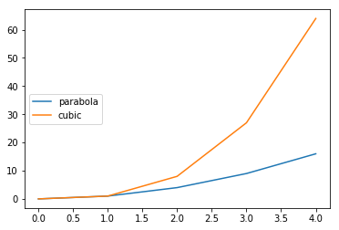
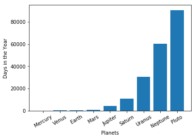
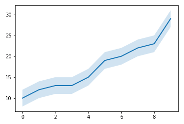
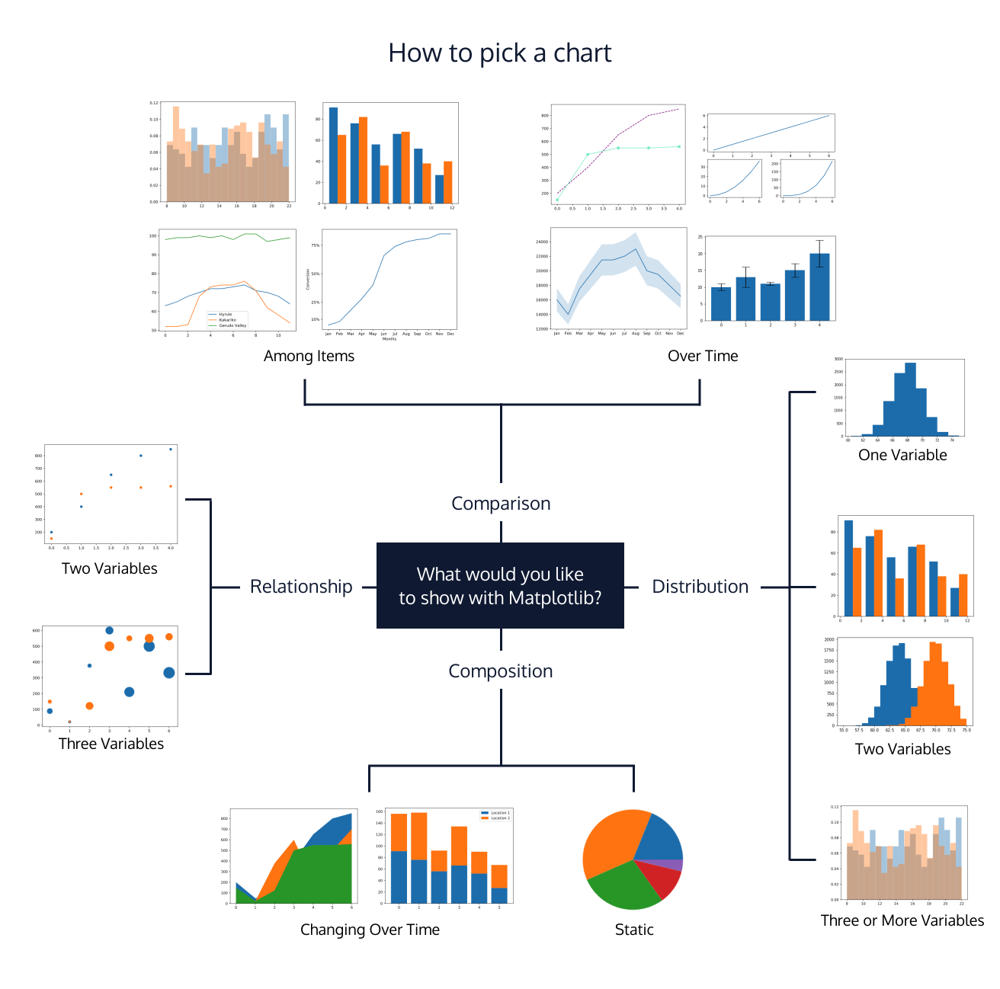
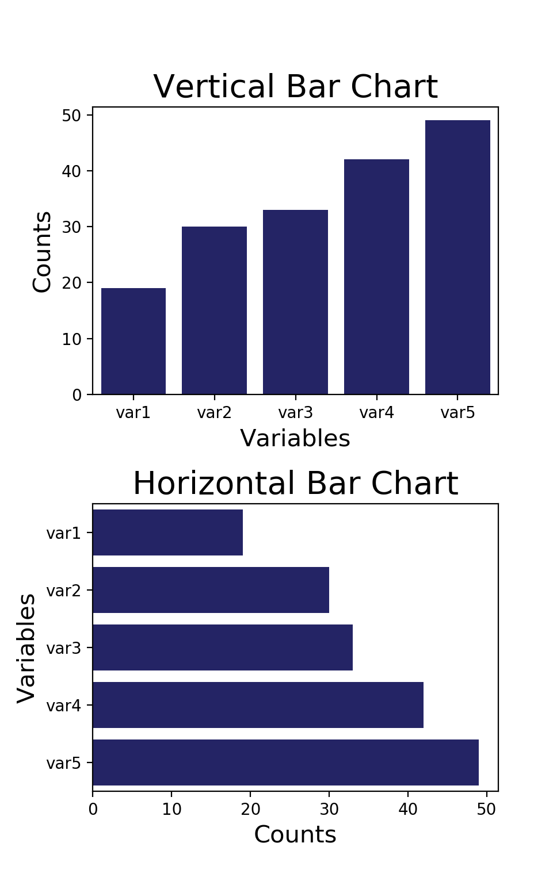
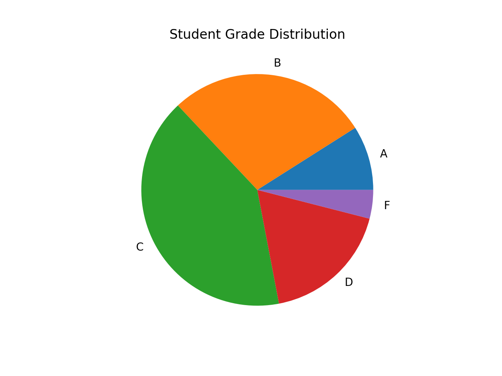

# 10 Data Visualization Fundamentals with Python

<br>

## Content
- **Line Charts in Python**
    - **Line Graphs in Mathplotlib**
        - [Basic Line Plot](#basic-line-plot)
        - [Basic Line Plot II](#basic-line-plot-ii)
        - [Linestyles](#linestyles)
        - [Axis and Labels](#axis-and-labels)
        - [Labeling the Axes](#labeling-the-axes)
        - [Subplots](#subplots)
        - [Subplots Part II](#subplots-part-ii)
        - [Legends](#legends)
        - [Modify Ticks](#modify-ticks)
        - [Figures](#figures)
- **Charts Beyond the Line Chart in Python**
    - **Different Plot Types**
        - [Simple Bar Chart](#simple-bar-chart)
        - [Simple Bar Chart II](#simple-bar-chart-ii)
        - [Side-By-Side Bars](#side-by-side-bars)
        - [Stacked Bars](#stacked-bars)
        - [Error Bars](#error-bars)
        - [Fill Between](#fill-between)
        - [Pie Chart](#pie-chart)
        - [Pie Chart Labeling](#pie-chart-labeling)
        - [Histogram](#histogram)
        - [Multiple Histograms](#multiple-histograms)
    - **Article: How to Select a Meaningful Visualization**
        - [Brainstorming your visualization](#brainstorming-your-visualization)
        - [A Diagram of Diagrams!](#a-diagram-of-diagrams)
        - [Chart categories](#chart-categories)
            - [Composition charts](#composition-charts)
            - [Distribution Charts](#distribution-charts)
            - [Relationship Charts](#relationship-charts)
            - [Comparison Charts](#comparison-charts)
    - [**External Resource: The Data Visualization Catalogue**](#external-resource-the-data-visualization-catalogue)
- **Visualizing Categorical Data**
    - **Bar Charts and Pie Charts**
        - [Visualizing Categorical Data](#visualizing-categorical-data)
        - [Introduction to Bar Charts](#introduction-to-bar-charts)
            - [Vertical vs. Horizontal Bar Charts](#vertical-vs-horizontal-bar-charts)
            - [Bar Charts vs. Histograms](#bar-charts-vs-histograms)
        - [Bar Chart Area](#bar-chart-area)
        - [Plotting Bar Charts Using Seaborn](#plotting-bar-charts-using-seaborn)
        - [Bar Chart Ordering](#bar-chart-ordering)
            - [Nominal Data](#nominal-data)
            - [Ordinal Data](#ordinal-data)
        - [Pie Charts](#pie-charts)
        - [Plotting Pie Charts Using Matplotlib](#plotting-pie-charts-using-matplotlib)
        - [Pitfalls of Pie Charts](#pitfalls-of-pie-charts)
            - [Comparing Category Sizes](#comparing-category-sizes)
        - [Making Your Pie Chart Better](#making-your-pie-chart-better)
        - [Review: Bar Charts and Pie Charts](#review-bar-charts-and-pie-charts)
            - [Bar Charts](#bar-charts)
            - [Pie Charts](#pie-charts)
- **Visualization for Exploratory Data Analysis**
    - [Article: Exploratory Data Analysis - Data Visualization](#article-exploratory-data-analysis---data-visualization)
    - [Article: Visualizing Multivariate Relationships](#article-visualizing-multivariate-relationships)
    - [Article: Visualizing Time Series Data With Python](#article-visualizing-time-series-data-with-python)
    - [Article: Data Visualizations for Messy Data](#article-data-visualizations-for-messy-data)
- Data Visualization Best Practices
    - [Introduction](#introduction)
    - [What to consider](#what-to-consider)
    - [Color](#color)
    - [Bar charts](#bar-charts)
    - [Line charts](#line-charts)
    - [Y-axis](#y-axis)
    - [What to avoid](#what-to-avoid)
    - [Pie charts](#pie-charts)
    - [Stacked bar charts](#stacked-bar-charts)
    - [Stacked area charts](#stacked-area-charts)
    - [Visualization in Python](#visualization-in-python)


## Basic Line Plot
- Line graphs are helpful for visualizing how a variable changes over time.
- Some possible data that would be displayed with a line graph:
    - average prices of gasoline over the past decade
    - weight of an individual over the past couple of months
    - average temperature along a line of longitude over different latitudes
- Using Matplotlib methods, the following code will create a simple line graph using `.plot()` and display it using `.show()`:
    ```python
    x_values = [0, 1, 2, 3, 4]
    y_values = [0, 1, 4, 9, 16]
    plt.plot(x_values, y_values)
    plt.show()
    ```
    - `x_values` is a variable holding a list of x-values for each point on our line graph
    - `y_values` is a variable holding a list of y-values for each point on our line graph
    - `plt` is the name we have given to the Matplotlib module we have imported at the top of the code
    - `plt.plot(x_values, y_values)` will create the line graph
    - `plt.show()` will actually display the graph
- Our graph would look like this:  


<br>

## Basic Line Plot II
- We can also have multiple line plots displayed on the same set of axes.
-  This can be very useful if we want to compare two datasets with the same scale and axis categories.
- Matplotlib will automatically place the two lines on the same axes and give them different colors if you call `plt.plot()` twice.
- Let’s look at the graph we made in the last exercise to track lunch spending, where `days` is on the x-axis and spending (`money_spent`) is on the y-axis:  

- We could add a friend’s lunch spending for comparison like this:
    ```python
    # Days of the week:
    days = [0, 1, 2, 3, 4, 5, 6]
    # Your Money:
    money_spent = [10, 12, 12, 10, 14, 22, 24]
    # Your Friend's Money:
    money_spent_2 = [11, 14, 15, 15, 22, 21, 12]
    # Plot your money:
    plt.plot(days, money_spent)
    # Plot your friend's money:
    plt.plot(days, money_spent_2)
    # Display the result:
    plt.show()
    ```
- We then get two lines on the same plot:  

- By default, the first line is always blue, and the second line is always orange. 

<br>

## Linestyles
- We can specify a different color for a line by using the keyword `color` with either an [HTML color name](https://www.w3schools.com/colors/colors_names.asp) or a [HEX code](https://www.w3schools.com/colors/colors_picker.asp):
    ```python
    plt.plot(days, money_spent, color='green')
    plt.plot(days, money_spent_2, color='#AAAAAA')
    ```
    
- We can also make a line dotted or dashed using the keyword `linestyle`.
    ```python
    # Dashed:
    plt.plot(x_values, y_values, linestyle='--')
    # Dotted:
    plt.plot(x_values, y_values, linestyle=':')
    # No line:
    plt.plot(x_values, y_values, linestyle='')
    ```
- We can also add a marker using the keyword `marker`:
    ```python
    # A circle:
    plt.plot(x_values, y_values, marker='o')
    # A square:
    plt.plot(x_values, y_values, marker='s')
    # A star:
    plt.plot(x_values, y_values, marker='*')
    ```
- To see all of the possible options, check out the [Matplotlib documentation](https://matplotlib.org/stable/api/_as_gen/matplotlib.pyplot.plot.html#matplotlib.pyplot.plot). 
- Here are a couple of those values applied to our plots about lunch spending:
    ```python
    plt.plot(days, money_spent, color='green', linestyle='--')
    plt.plot(days, money_spent_2, color='#AAAAAA',  marker='o')
    ```
    

<br>

## Axis and Labels
- Sometimes, it can be helpful to zoom in or out of the plot, especially if there is some detail we want to address. 
- To zoom, we can use `plt.axis()`. We use `plt.axis()` by feeding it a list as input. This list should contain:
    1. The minimum x-value displayed
    2. The maximum x-value displayed
    3. The minimum y-value displayed
    4. The maximum y-value displayed
- **For example**: 
    - If we want to display a plot from `x=0` to `x=3` and from `y=2` to `y=5`, we would call `plt.axis([0, 3, 2, 5])`.
    ```python	
    x = [0, 1, 2, 3, 4]
    y = [0, 1, 4, 9, 16]
    plt.plot(x, y)
    # plt.axis(min_x, max_x, min_y, max_y)
    plt.axis([0, 3, 2, 5])
    plt.show()
    ```
    

<br>

## Labeling the Axes
- Eventually, we will want to show these plots to other people to convince them of important trends in our data. 
- When we do that, we’ll want to make our plots look as professional as possible.
- The first step towards a professional-looking plot is adding labels to the x-axis and y-axis, and giving the plot a title.
- We can label the x- and y- axes by using `plt.xlabel()` and `plt.ylabel()`. The plot title can be set by using `plt.title()`.
- All of these commands require a string, which is a set of characters in either single (`'`) or double (`"`) quotes.
    ```python
    "This is a string"
    'This is also a string'
    
    'This is NOT a string (the quotes do not match)"
    ```
- **For example**: 
    - If someone has been keeping track of their happiness (on a scale out of 10) throughout the day and wants to display this information with labeled axes, we can use the following commands:
        ```python
        hours = [9, 10, 11, 12, 13, 14, 15, 16, 17, 18, 19, 20]
        happiness = [9.8, 9.9, 9.2, 8.6, 8.3, 9.0, 8.7, 9.1, 7.0, 6.4, 6.9, 7.5]
        plt.plot(hours, happiness)
        plt.xlabel('Time of day')
        plt.ylabel('Happiness Rating (out of 10)')
        plt.title('My Self-Reported Happiness While Awake')
        plt.show()
        ```
    - This will result in a labeled graph:  
        

<br>

## Subplots
- Sometimes, we want to display two lines side-by-side, rather than in the same set of x- and y-axes. 
- When we have multiple axes in the same picture, we call each set of axes a subplot. 
- The picture or object that contains all of the subplots is called a *figure*.
- We can have many different subplots in the same figure, and we can lay them out in many different ways. 
- We can think of our layouts as having rows and columns of subplots. 
- For instance, the following figure has six subplots split into **2 rows and 3 columns**:  
    
- We can create subplots using `.subplot()`.
- The command `plt.subplot()` needs **three arguments** to be passed into it:
    - The number of rows of subplots
    - The number of columns of subplots
    - The index of the subplot we want to create
- For instance, the command `plt.subplot(2, 3, 4)` would create “Subplot 4” from the figure above.
- Any `plt.plot()` that comes after `plt.subplot()` will create a line plot in the specified subplot. 
- For instance:
    ```python
    # Data sets
    x = [1, 2, 3, 4]
    y = [1, 2, 3, 4]
    
    # plt.subplot(nrows, ncols, index, **kwargs)
    # First Subplot
    plt.subplot(1, 2, 1)
    plt.plot(x, y, color='green')
    plt.title('First Subplot')
    
    # Second Subplot
    plt.subplot(1, 2, 2)
    plt.plot(x, y, color='steelblue')
    plt.title('Second Subplot')
    
    # Display both subplots
    plt.show()
    ```
    - This would result in a figure with the two plots arranged like this:  
        

<br>

## Subplots Part II
- Sometimes, when we’re putting multiple subplots together, some elements can overlap and make the figure unreadable:  
    
- We can customize the spacing between our subplots to make sure that the figure we create is visible and easy to understand. 
- To do this, we use the `plt.subplots_adjust()` command. 
- `.subplots_adjust()` has some keyword arguments that can move your plots within the figure:
    - `left` — the left-side margin, with a default of 0.125. You can increase this number to make room for a y-axis label
    - `right` — the right-side margin, with a default of 0.9. You can increase this to make more room for the figure, or decrease it to make room for a legend
    - `bottom` — the bottom margin, with a default of 0.1. You can increase this to make room for tick mark labels or an x-axis label
    - `top` — the top margin, with a default of 0.9
    - `wspace` — the horizontal space between adjacent subplots, with a default of 0.2
    - `hspace` — the vertical space between adjacent subplots, with a default of 0.2
- **For example**:
    - If we were adding space to the bottom of a graph by changing the bottom margin to 0.2 (instead of the default of 0.1), we would use the command:
        ```python
        plt.subplots_adjust(bottom=0.2)
        ```
    - We can also use multiple keyword arguments, if we need to adjust multiple margins. For instance, we could adjust both the top and the hspace:
        ```python
        plt.subplots_adjust(top=0.95, hspace=0.25)
        ```
        - Let’s use wspace to fix the figure above:
            ```python
            # Left Plot
            plt.subplot(1, 2, 1)
            plt.plot([-2, -1, 0, 1, 2], [4, 1, 0, 1, 4])
            
            # Right Plot
            plt.subplot(1, 2, 2)
            plt.plot([-2, -1, 0, 1, 2], [4, 1, 0, 1, 4])
            
            # Subplot Adjust
            plt.subplots_adjust(wspace=0.35)
            
            plt.show()
            ```
        - This would give us figure with a better layout:  
            

<br>

## Legends
- When we have multiple lines on a single graph we can label them by using the command `plt.legend()`.
- The `legend` method takes a list with the labels to display. So, for example, we can call:
    ```python
    plt.plot([0, 1, 2, 3, 4], [0, 1, 4, 9, 16])
    plt.plot([0, 1, 2, 3, 4], [0, 1, 8, 27, 64])
    plt.legend(['parabola', 'cubic'])
    plt.show()
    ```
    - which would display a legend on our graph, labeling each line:  
        
- `plt.legend()` can also take a keyword argument `loc`, which will position the legend on the figure.
- These are the position values `loc` accepts:  
    | Number Code | String |
    |-------------|--------|
    |0	|best|
    |1	|upper right|
    |2	|upper left|
    |3	|lower left|
    |4	|lower right|
    |5	|right|
    |6	|center left|
    |7	|center right|
    |8|	lower center|
    |9|	upper center|
    |10|	center|
- **Note:** If you decide not to set a value for `loc`, it will default to choosing the “best” location.
- **For example**: 
    - We can call `plt.legend()` and set `loc` to `6`:
        ```python
        plt.legend(['parabola', 'cubic'], loc=6)
        plt.show()
        ```
    - which would move the legend to the left side of the graph:  
        
- Sometimes, it’s easier to label each line as we create it. 
- If we want, we can use the keyword `label` inside of `plt.plot()`. If we choose to do this, we don’t pass any labels into `plt.legend()`. 
- **For example:**
    ```python
    plt.plot([0, 1, 2, 3, 4], [0, 1, 4, 9, 16], label="parabola")
    plt.plot([0, 1, 2, 3, 4], [0, 1, 8, 27, 64], label="cubic")
    plt.legend() # Still need this command!
    plt.show()
    ```
    - This would display a legend that looks just like what we had before:  
        

<br>

## Modify Ticks
- In all of our previous exercises, our commands have started with `plt.`. 
- In order to modify tick marks, we’ll have to try something a little bit different.
- Because our plots can have multiple subplots, we have to specify which one we want to modify. 
- In order to do that, we call `plt.subplot()` in a different way.
    ```python
    ax = plt.subplot(1, 1, 1)
    ```
- `ax` is an axes object, and it lets us modify the axes belonging to a specific subplot. 
- Even if we only have one subplot, when we want to modify the ticks, we will need to start by calling either `ax = plt.subplot(1, 1, 1)` or `ax = plt.subplot()` in order to get our axes object.
- Suppose we wanted to set our x-ticks to be at 1, 2, and 4. 
- We would use the following code:
    ```python
    ax = plt.subplot()
    plt.plot([0, 1, 2, 3, 4], [0, 1, 4, 9, 16])
    plt.plot([0, 1, 2, 3, 4], [0, 1, 8, 27, 64])
    ax.set_xticks([1, 2, 4])
    ```
- Our result would look like this:  
    
- We can also modify the y-ticks by using `ax.set_yticks()`.
- When we change the x-ticks, their labels automatically change to match. 
- But, if we want special labels (such as strings), we can use the command `ax.set_xticklabels()` or `ax.set_yticklabels()`. 
- **For example**: 
    - We might want to have a y-axis with ticks at 0.1, 0.6, and 0.8, but label them 10%, 60%, and 80%, respectively. 
    - To do this, we use the following commands:
        ```python
        ax = plt.subplot()
        plt.plot([1, 3, 3.5], [0.1, 0.6, 0.8], 'o')
        ax.set_yticks([0.1, 0.6, 0.8])
        ax.set_yticklabels(['10%', '60%', '80%'])
        ```
    - This would result in this y-axis labeling:  
        

<br>

## Figures
- When we’re making lots of plots, it’s easy to end up with lines that have been plotted and not displayed. 
- If we’re not careful, these “forgotten” lines will show up in your new plots.
- In order to be sure that you don’t have any stray lines, you can use the command `plt.close('all')` to clear all existing plots before you plot a new one.
- Previously, we learned how to put two of axes into the same figure. 
- Sometimes, we would rather have two separate figures. 
- We can use the command `plt.figure()` to create new figures and size them how we want. 
- We can add the keyword `figsize=(width, height)` to set the size of the figure, in inches. 
- We use parentheses (`(` and `)`) to pass in the width and height, which are separated by a comma (`,`).
- To create a figure with a width of 4 inches, and height of 10 inches, we would use:
    ```python
    plt.figure(figsize=(4, 10))
    ```
- It would look tall and skinny, like this:  
    
- Once we’ve created a figure, we might want to save it so that we can use it in a presentation or a website. 
- We can use the command `plt.savefig()` to save out to many different file formats, such as `png`, `svg`, or `pdf`. 
- After plotting, we can call `plt.savefig('name_of_graph.png')`:
    ```python
    # Figure 2
    plt.figure(figsize=(4, 10)) 
    plt.plot(x, parabola)
    plt.savefig('tall_and_narrow.png')
    ```
- This will save `tall_and_narrow.png` to our file system.

<br>

## Simple Bar Chart
- The `plt.bar` function allows you to create simple bar charts to compare multiple categories of data.
- Some possible data that would be displayed with a bar chart:
    - x-axis — famous buildings, y-axis — heights
    - x-axis — different planets, y-axis — number of days in the year
    - x-axis — programming languages, y-axis — lines of code written by you
- You call `plt.bar` with two arguments:
    - the x-values — a list of x-positions for each bar
    - the y-values — a list of heights for each bar
- In most cases, we will want our x-values to be a list that looks like `[0, 1, 2, 3 ...]`and has the same number of elements as our y-values list. 
- We can create that list manually, but we can also use the following code:
    ```python
    heights = [88, 225, 365, 687, 4333, 10756, 30687, 60190, 90553]
    x_values = range(len(heights))
    ```
- The range function creates a list of consecutive integers (i.e., `[0, 1, 2, 3, ...]`). 
- It needs an argument to tell it how many numbers should be in the list. For instance, `range(5)` would make a list with 5 numbers. 
- We want our list to be as long as our bar heights (heights in this example). 
- `len(heights)` tell us how many elements are in the list `heights`.
- Here is an example of how to make a bar chart using `plt.bar` to compare the number of days in a year on the different planets:
    ```python
    days_in_year = [88, 225, 365, 687, 4333, 10756, 30687, 60190, 90553]
    plt.bar(range(len(days_in_year)), days_in_year)
    plt.show()
    ```
    - The result of this is:    
        
    - At this point, it’s hard to tell what this represents, because it’s unclearly labeled. 

<br>

## Simple Bar Chart II
- When we create a bar chart, we want each bar to be meaningful and correspond to a category of data. 
- In the drinks chart from the last exercise, we could see that sales were different for different drink items, but this wasn’t very helpful to us, since we didn’t know which bar corresponded to which drink.
- In the previous lesson, we learned how to customize the tick marks on the x-axis in three steps:
    1. Create an axes object
        ```python
        ax = plt.subplot()
        ```
    2. Set the x-tick positions using a list of numbers
        ```python
        ax.set_xticks([0, 1, 2, 3, 4, 5, 6, 7, 8])
        ```
    3. Set the x-tick labels using a list of strings
        ```python
        ax.set_xticklabels(['Mercury', 'Venus', 'Earth', 'Mars', 'Jupiter', 'Saturn', 'Uranus', 'Neptune', 'Pluto'])
        ```
    - If your labels are particularly long, you can use the rotation keyword to `rotate` your labels by a specified number of degrees:
        ```python
        ax.set_xticklabels(['Mercury', 'Venus', 'Earth', 'Mars', 'Jupiter', 'Saturn', 'Uranus', 'Neptune', 'Pluto'], rotation=30)
        ```
- **Note**: 
    - We have to set the x-ticks before we set the x-labels because the default ticks won’t necessarily be one tick per bar, especially if we’re plotting a lot of bars.
    - If we skip setting the x-ticks before the x-labels, we might end up with labels in the wrong place.
    - Remember from Lesson I that we can label the x-axis (`plt.xlabel`) and y-axis (`plt.ylabel`) as well. Now, our graph is much easier to understand:  
        

<br>

## Side-By-Side Bars
- We can use a bar chart to compare two of data with the same types of axis values. 
- To do this, we plot two sets of bars next to each other, so that the values of each category can be compared. 
- **For example**: 
    - Here is a chart with side-by-side bars for the populations of the United States and China over the age of 65 (in percentages):  
        
- Some examples of data that side-by-side bars could be useful for include:
    - the populations of two countries over time
    - prices for different foods at two different restaurants
    - enrollments in different for males and females
- In the graph above, there are 7 sets of bars, with 2 bars in each set. Each bar has a width of 0.8 (the default width for all bars in Matplotlib).
    - If our first blue bar is at x=0, then we want the next blue bar to be at x=2, and the next to be at x=4, etc.
    - Our first orange bar should be at x=0.8 (so that it is touching the blue bar), and the next orange bar should be at x=2.8, etc.
- This is a lot of math, but we can make Python do it for us by copying and pasting this code:
    ```python
    # China Data (blue bars)
    n = 1  # This is our first dataset (out of 2)
    t = 2 # Number of datasets
    d = 7 # Number of sets of bars
    w = 0.8 # Width of each bar
    x_values1 = [t*element + w*n for element in range(d)]
    ``` 
- That just generated the first set of x-values. 
- To generate the second set, paste the code again, but change n to 2, because this is the second dataset:
    ```python
    # US Data (orange bars)
    n = 2  # This is our second dataset (out of 2)
    t = 2 # Number of datasets
    d = 7 # Number of sets of bars
    w = 0.8 # Width of each bar
    x_values2 = [t*element + w*n for element in range(d)]
    ```

<br>

## Stacked Bars
- If we want to compare two of data while preserving knowledge of the total between them, we can also stack the bars instead of putting them side by side. 
- For instance, if someone was plotting the hours they’ve spent on entertaining themselves with video games and books in the past week, and wanted to also get a feel for total hours spent on entertainment, they could create a stacked bar chart:
    
- We do this by using the keyword `bottom`. 
- The top set of bars will have `bottom` set to the heights of the other set of bars. So the first set of bars is plotted normally:
    ```python
    video_game_hours = [1, 2, 2, 1, 2]
    plt.bar(range(len(video_game_hours)), video_game_hours) 
    ```	
- and the second set of bars has bottom specified:
    ```python
    book_hours = [2, 3, 4, 2, 1]
    plt.bar(range(len(book_hours)), book_hours, bottom=video_game_hours)
    ```
- This starts the `book_hours` bars at the heights of the `video_game_hours` bars. 
- So, for example, on Monday the orange bar representing hours spent reading will start at a value of `1` instead of `0`, because `1` hour was spent playing video games.

<br>

## Error Bars
- In the previous exercise, you learned to represent data as bars of different heights.
-  Sometimes, we need to visually communicate some sort of uncertainty in the heights of those bars. 
- **Here are some examples**:
    - The average number of students in a 3rd grade classroom is 30, but some classes have as few as 18 and others have as many as 35 students.
    - We measured that the weight of a certain fruit was 35g, but we know that our scale isn’t very precise, so the true weight of the fruit might be as much as 40g or as little as 30g.
    - The average price of a soda is $1.00, but we also want to communicate that the standard deviation is $0.20.
- To display error visually in a bar chart, we often use error bars to show where each bar could be, taking errors into account.  
    
- Each of the black lines is called an *error bar*. 
- The taller the bar is, the more uncertain we are about the height of the blue bar. 
- The horizontal lines at the top and bottom are called *caps*. 
- They make it easier to read the error bars.
- If we wanted to show an error of +/- 2, we would add the keyword `yerr=2` to our `plt.bar` command. 
- To make the caps wide and easy to read, we would add the keyword `capsize=10`:
    ```python
    values = [10, 13, 11, 15, 20]
    yerr = 2
    plt.bar(range(len(values)), values, yerr=yerr, capsize=10)
    plt.show()
    ```
- If we want a different amount of error for each bar, we can make `yerr` equal to a list rather than a single number:
    ```python
    values = [10, 13, 11, 15, 20]
    yerr = [1, 3, 0.5, 2, 4]
    plt.bar(range(len(values)), values, yerr=yerr, capsize=10)
    plt.show()
    ```
- This code results in error bars of different sizes:  
    
- Like the list of x-axis labels, Matplotlib reads this in the same order as the list of y-values.
- So, the first index of your error list should correspond to the first index of your y-values list, the second index of your error list should correspond to the second index of your y-values list, and so on.

<br>

## Fill Between
- We’ve learned how to display errors on bar charts using error bars. 
- Let’s take a look at how we might do this in an aesthetically pleasing way on line graphs. 
- In Matplotlib, we can use `plt.fill_between()` to shade error. 
- This function takes three arguments:
    1. `x-values` — this works just like the x-values of `plt.plot()`
    2. lower-bound for y-values — sets the bottom of the shaded area
    3. upper-bound for y-values — sets the top of the shaded area
- Generally, we use `.fill_between()` to create a shaded error region, and then plot the actual line over it. 
- We can set the alpha keyword to a value between 0 and 1 in the `.fill_between()` call for transparency so that we can see the line underneath. 
- Here is an example of how we would display data with an error of 2:
    ```python
    x_values = range(10)
    y_values = [10, 12, 13, 13, 15, 19, 20, 22, 23, 29]
    y_lower = [8, 10, 11, 11, 13, 17, 18, 20, 21, 27]
    y_upper = [12, 14, 15, 15, 17, 21, 22, 24, 25, 31]

    plt.fill_between(x_values, y_lower, y_upper, alpha=0.2) #this is the shaded error
    plt.plot(x_values, y_values) #this is the line itself
    plt.show()
    ```
- This would give us a plot that looks like:  
    
- Having to calculate `y_lower` and `y_upper` by hand is time-consuming. 
- If we try to just subtract 2 from `y_values`, we will get an error.
    ```python
    TypeError: unsupported operand type(s) for -: 'list' and 'int'
    ```
- In order to correctly add or subtract from a list, we need to use *list comprehension*:
    ```python
    y_lower = [i - 2 for i in y_values]
    ```	
- This command looks at each element in `y_values` and calls the element its currently looking at `i`. 
- For each new `i`, it subtracts 2. 
- These opperations create a new list called `y_lower`.
- If we wanted to add 2 to each element in `y_values`, we use this code:
    ```python
    y_upper = [i + 2 for i in y_values]
    ```

<br>

## Pie Chart
- If we want to display elements of a data set as proportions of a whole, we can use a pie chart.
- Pie charts are helpful for displaying data like:
    - Different ethnicities that make up a school district
    - Different macronutrients (carbohydrates, fat, protein) that make up a meal
    - Different responses to an online poll
- In Matplotlib, you can make a pie chart with the command `plt.pie`, passing in the values you want to chart:
    ```python
    budget_data = [500, 1000, 750, 300, 100]
    plt.pie(budget_data)
    plt.show()
    ```
- Which would create a chart like:  
    
- This looks weird and tilted. 
- When we make pie charts in Matplotlib, we almost always want to set the axes to be equal to fix this issue.
- To do this, we use `plt.axis('equal')`, which results in a chart like this:  
    

<br>

## Pie Chart Labeling
- We also want to be able to understand what each slice of the pie represents. 
- To do this, we can either:
    1. Use a legend to label each color, or
    2. Put labels on the chart itself.

<br>

### Method 1
```python
budget_data = [500, 1000, 750, 300, 100]
budget_categories = ['marketing', 'payroll', 'engineering', 'design', 'misc']

plt.pie(budget_data)
plt.legend(budget_categories)
```
- This puts the category names into a legend on the chart:  
    

<br>

### Method 2
```python	
#option 2
plt.pie(budget_data, labels=budget_categories)
```
- This puts the category names into labels next to each corresponding slice:  
    
- One other useful labeling tool for pie charts is adding the percentage of the total that each slice occupies. 
- Matplotlib can add this automatically with the keyword `autopct`. 
- We pass in string formatting instructions to format the labels how we want. 
- Some common formats are:
    - `'%0.2f'` — 2 decimal places, like `4.08`
    - `'%0.2f%%'` — 2 decimal places, but with a percent sign at the end, like 4.08%. You need two consecutive percent signs because the first one acts as an escape character, so that the second one gets displayed on the chart.
    - `'%d%%'` — rounded to the nearest `int` and with a percent sign at the end, like `4%`.
- So, a full call to `plt.pie` might look like:
    ```python
    plt.pie(budget_data, labels=budget_categories, autopct='%0.1f%%')
    ```
- and the resulting chart would look like:  
    

<br>

## Histogram
- Sometimes we want to get a feel for a large dataset with many samples beyond knowing just the basic metrics of mean, median, or standard deviation. 
- To get more of an intuitive sense for a dataset, we can use a histogram to display all the values.

<br>

- A histogram tells us how many values in a dataset fall between different sets of numbers (i.e., how many numbers fall between 0 and 10? Between 10 and 20? Between 20 and 30?).
- Each of these questions represents a bin, for instance, our first bin might be between 0 and 10.

<br>

- All bins in a histogram are always the same size. 
- The width of each bin is the distance between the minimum and maximum values of each bin. 
- In our example, the width of each bin would be 10.

<br>

- Each bin is represented by a different rectangle whose height is the number of elements from the dataset that fall within that bin.
- Here is an example:  
    
- To make a histogram in Matplotlib, we use the command `plt.hist`. 
- `plt.hist` finds the minimum and the maximum values in your dataset and creates 10 equally-spaced bins between those values.
- The histogram above, for example, was created with the following code:
    ```python
    plt.hist(dataset) 
    plt.show()
    ```
- If we want more than 10 bins, we can use the keyword `bins` to set how many bins we want to divide the data into.
-  The keyword `range` selects the minimum and maximum values to plot. 
- **For example**:
    - If we wanted to take our data from the last example and make a new histogram that just displayed the values from 66 to 69, divided into 40 bins (instead of 10), we could use this function call:
        ```python
        plt.hist(dataset, range=(66,69), bins=40)
        ```
    - which would result in a histogram that looks like this:  
        
- Histograms are best for showing the shape of a dataset. 
- **For example**:
    - You might see that values are close together, or skewed to one side. 
    - With this added intuition, we often discover other types of analysis we want to perform.

<br>

## Multiple Histograms
- If we want to compare two different distributions, we can put multiple histograms on the same plot. 
- This could be useful, for example, in comparing the heights of a bunch of men and the heights of a bunch of women. 
- However, it can be hard to read two histograms on top of each other. 
- For example, in this histogram, we can’t see all of the blue plot, because it’s covered by the orange one:  
    
- We have two ways we can solve a problem like this:
    1. Use the keyword `alpha`, which can be a value between 0 and 1. This sets the transparency of the histogram. A value of `0` would make the bars entirely transparent. A value of `1` would make the bars completely opaque.
        ```python
        plt.hist(a, range=(55, 75), bins=20, alpha=0.5)
        plt.hist(b, range=(55, 75), bins=20, alpha=0.5)
        ```
        - This would make both histograms visible on the plot:  
            
    2. Use the keyword `histtype` with the argument `'step'` to draw just the outline of a histogram:
        ```python
        plt.hist(a, range=(55, 75), bins=20, histtype='step')
        plt.hist(b, range=(55, 75), bins=20, histtype='step')
        ```
        - which results in a chart like:   
                
- Another problem we face is that our histograms might have different numbers of samples, making one much bigger than the other. 
- We can see how this makes it difficult to compare qualitatively, by adding a dataset b with a much bigger size value:
    ```python
    a = normal(loc=64, scale=2, size=10000)
    b = normal(loc=70, scale=2, size=100000)

    plt.hist(a, range=(55, 75), bins=20)
    plt.hist(b, range=(55, 75), bins=20)
    plt.show()
    ```
- The result is two histograms that are very difficult to compare:    
    
- To solve this, we can normalize our histograms using `density=True`. 
- This command divides the height of each column by a constant such that the total shaded area of the histogram sums to 1.
    ```python
    a = normal(loc=64, scale=2, size=10000)
    b = normal(loc=70, scale=2, size=100000)

    plt.hist(a, range=(55, 75), bins=20, alpha=0.5, density=True)
    plt.hist(b, range=(55, 75), bins=20, alpha=0.5, density=True)
    plt.show()
    ```
- Now, we can more easily see the differences between the blue set and the orange set:    
        

<br>

## Brainstorming your visualization
- The three steps in the data visualization process are *preparing*, *visualizing*, and *styling data*. 
- When faced with a blank canvas, the second step of the process, visualizing the data, can be overwhelming. 
- To help, we’ve created a diagram to guide the selection of a chart based on what you want to explore in your data.

<br>

- When planning out a visualization, you’ll usually have an idea of what questions you’ll want to explore. 
- However, you may initially wonder exactly which chart to use. 
- This moment is one of the most exciting parts of the process!

<br>

- During your brainstorming phase, you should consider two things:
    - The focusing question you want to answer with your chart
    - The type of data that you want to visualize

<br>

- Depending on the focusing questions you’re trying to answer, the type of chart you select should be different and intentional in its difference. 
- In the diagram below, we have assigned Matplotlib visualizations to different categories.
- These categories explore common focusing questions and types of data you may want to display in a visualization.

<br>

## A Diagram of Diagrams!


<br>

## Chart categories

### Composition charts
- Focusing Question: *What are the parts of some whole? What is the data made of?*

<br>

- Datasets that work well: Data pertaining to probabilities, proportions, and percentages can be visualized as with the graphs in this composition category. 
- Charts in this category illustrate the different data components and their percentages as part of a whole.

<br>

### Distribution Charts
- Datasets that work well: Data in large quantities and/or with an array of attributes works well for these types of charts. 
- Visualizations in this category will allow you to see patterns, re-occurrences, and a clustering of data points.

<br>

- Note: In statistics, a commonly seen distribution is a bell curve, also known as a normal distribution. 
- A bell curve is a bell-shaped distribution where most of the values in the dataset crowd around the average (also known as the mean), therefore causing the curve to form. 
- If you want to see how values in the data are “distributed” across variables, the best way to do that would be with the visualizations in this category.

<br>

### Relationship Charts
- Focusing Question: *How do variables relate to each other?*

<br>

- Datasets that work well: Data with two or more variables can be displayed in these charts. 
- These charts typically illustrate a correlation between two or more variables. 
- You can communicate this relationship by mapping multiple variables in the same chart.
-  Correlation measures the strength of a relationship between variables.

<br>

### Comparison Charts
- Focusing Question: *How do variables compare to each other?*

<br>

- Datasets that work well: Data must have multiple variables, and the visualizations in this category allow readers to compare those items against the others. 
- For example, a line graph that has multiple lines, each belonging to a different variable. 
- Multi-colored bar charts are also a great way to compare items in data.

<br>

## External Resource: The Data Visualization Catalogue
- [The Data Visualization Catalogue](https://datavizcatalogue.com/) 
    - In this resource, you will learn about different data visualization methods including how different methods are related, how to interpret them, and the limitations of each method. 
    - This is helpful if you want to expertly visualize data and can be a powerful reference to use when trying to decide which visualization method matches what you want to show.

<br>

## Visualizing Categorical Data
- You work at a veterinary office and want to compare the number of different types of pets people have in a specific town. 
- This will give you a sense of what supplies you may need and how many office visits you should expect over the coming year. 
- The different types of pets we want to compare are:
    - Dogs
    - Cats
    - Fish
    - Chinchillas
    - Birds
    - Snakes
    - Lizards
- We could summarize this data numerically using a table of frequencies:
    | Type of Pet | Number of Pets |
    |-------------|----------------|
    | Dog         | 4325           |
    | Birds       | 2423           |
    | Cats        | 5126           |
    | Fish        | 3223           |
    | Chinchillas | 978            |
    | Snakes      | 1112           |
    | Lizards     | 453            |
- This table of values is informative for a reader. 
- However, it is time-consuming for a casual reader to recognize patterns in the data and pick out useful information. 
- We can create a *bar chart* that displays our data in a way that is easier for readers to digest and more descriptive than a table of values.  
    
- In this example, we can immediately identify the most and least popular pets on the bar chart. 
- We also see the range and difference between the number of each pet in each column very clearly.

<br>

## Introduction to Bar Charts
- Now that we have seen what a bar chart looks like, let’s examine more in-depth how and when we utilize them! 
- Bar charts are generally used to visualize the relative frequencies of categories within a variable. 
- Therefore, they are primarily helpful for visually summarizing categorical variables rather than quantitative variables. 
- If you can organize your variable into distinct categories, a bar chart is often a great option! 
- If not, you may need to resort to a different visual.

<br>

- Once you have your distinct categories, a bar chart is best used to display the different value counts of each category.
- We can also compare means, but we would recommend using a side-by-side box plot for that instead because they give a full picture of the [five-number summary](https://en.wikipedia.org/wiki/Five-number_summary).

<br>

### Vertical vs. Horizontal Bar Charts
- Within a bar chart, we have two axes. 
    - One axis represents the discrete values within a categorical variable we are comparing, 
    - while the other axis measures the counts of each of these values. 
- Depending on how we orient these axes, we can either have a *horizontal bar chart* or a *vertical bar chart*. Let’s take a look at each below.  
    

<br>

### Bar Charts vs. Histograms
- Finally, we have one last thing to go over before we jump into coding our own charts. 
- If you have ever run into histograms, you may notice that bar charts and histograms look almost identical. 
- However, these are the key differences between them:
    - Bar charts are used for categorical variables, while histograms are used for quantitative data.
    - Histograms must always be arranged in a specific order because they represent a range of numerical values. For a bar chart, each bar represents frequencies of category variables within a category. Unless the variable is ordinal, the bars could be arranged in any order.  
    

<br>

## Bar Chart Area
- Let’s go over one of the most important concepts about bar charts — so important, we gave it its own exercise.
- The bars of a bar chart have a couple of key features:
    - They have lengths that are proportional to the counts they represent
    - Each bar’s width in the bar chart is the same, meaning each bar’s area is also proportional to the counts they represent.
- These features make a bar chart super dependable for representing categorical data.
- For any chart like a bar chart, the areas we use to represent values must always be equivalent to the relative sizes of the values they represent.
-  Otherwise, readers could be misled and potentially identify patterns that do not actually exist.

<br>

## Plotting Bar Charts Using Seaborn  
- We are going to use a library called [seaborn](https://seaborn.pydata.org/). 
- It creates powerful visuals without any syntax headaches, and it is built off of the [Matplotlib](https://matplotlib.org/) library.
- Let’s say we have a dataset called **flu.csv** that says whether patients have tested positive or negative for flu at a clinic in the past week. 
- The first five elements in the column Results are shown below.
    | Results |
    |---------|
    | Positive|
    | Negative|
    | Negative|
    | Negative|
    | Positive|
- We want to create a bar chart that plots the counts of each of the values positive and negative within the Results column. 
- Let’s walk through this with the help of the pandas library and the seaborn library with the following steps:
1. Import the necessary libraries.
    ```python	
    import pandas as pd
    import matplotlib.pyplot as plt
    import seaborn as sns
    ```
2. Import **flu.csv** using the `.read_csv()` method.  
  You can inspect the first five rows of the data with the `.head()` method in pandas.
    ```python
    flu_results  = pd.read_csv('flu.csv')
    print(flu_results .head())
    ```
3. Plot the counts of your intended category with the [.countplot()](https://seaborn.pydata.org/generated/seaborn.countplot.html) method in seaborn.   
  The only required argument of this method is the `x` parameter, which takes in the data column we are plotting.   
  In our case, this is the Results column.
    ```python
    sns.countplot(flu_results["Results"])
    ``` 
4. Show the Plot.
    ```python
    plt.show()
    ```
- Our output in this example is:  
    
- This builds a basic bar chart. 
- We can customize our `.countplot()` chart, which we will cover later in this lesson.
- We also want to note that the `.countplot()` method is not the only method that builds bar charts in the seaborn library. 
- `barplot()` can also be used to plot a bar chart in Python, and it is more flexible in that it can use any function to determine the height of the bars. 
- For this lesson, we’ve chosen to use `.countplot()` because the syntax is simpler and does what we need!

<br>

## Bar Chart Ordering
- You will often see bar graphs with bars set in a certain order. 
- This can help communicate meaningful features about your data.
-  Whether our category labels are ordinal or nominal will affect how we want to order our bars and what features we can emphasize. Let’s investigate.

<br>

### Nominal Data
- Nominal data has labels with no specific order. 
- Thus, we have a lot of creative freedom when choosing where each bar goes on our chart. 
- One way would order our data is by ascending or descending order. 
- Let’s apply this ordering to our **games.csv** data using the `.value_counts()` pandas method in the order parameter.
    ```python
    sns.countplot(df["victory_status"], order=df["victory_status"].value_counts(ascending=True).index)
    ```  
    
- From the way we ordered the graphs, it is immediately clear that resign is the most common game outcome and the mode of our `victory_status` column, while draw is the least common.
- In the above example we have `value_counts(ascending=True)`. 
- If we want the bars in reverse order, we can take `ascending=True` out of the `.value_counts()` method (descending order is the default).
- The `index` call specifies the row labels of the DataFrame.

<br>

### Ordinal Data
- If we are working with ordinal data, we should plot the data according to our categorical variables. 
- **For example**:
    - Let’s say we want to plot the number of students per grade level at a college. 
    - We have a table below, which is a preview data from a **students.csv** file.
        | Grade Level |
        |-------------|
        | Second Year |
        | Second Year |
        | First Year  |
        | Third year  |
        | Fourth Year |
    - We can order the categorical values as `First Year`, `Second Year`, `Third Year`, and `Fourth Year` since they are ordinal. 
    - Using `.countplot()`, we can input these as a list in the `order` parameter.
        ```python
        sns.countplot(df["Grade Level"], order=["First Year", "Second Year", "Third Year", "Fourth Year"])
        ```
        
    - From this chart, we get takeaways that we couldn’t just from looking at the column of data. 
    - We can see that the college had an influx of students for the second year class, as `Second Year` is the mode (most observed value) of the `Grade Level` column of data. 
    - All other years have roughly the same number of students. 
    - Putting bars in order according to the ordinal data helps us see these patterns and make our visuals informative for readers.

<br>

## Pie Charts
- So far in this lesson, we have looked at bar charts as a way to plot categorical data. 
- However, bar charts are not the only option. 
- Often, you will run into *pie charts* as a way to display categorical data.
- While bar charts are usually used for visualizing a table of frequencies, pie charts are an alternative when you want to visualize a table of proportions.

<br>

- Pie charts are made up of slices that are combined to make a full circle. 
- Each slice represents a proportion, and the sum of each proportion (slice) adds up to 1 (or 100%).

<br>

- These slices are meant to give viewers a relative size of the data, similar to how bars in a bar chart act. 
- The arc length (size of the slice’s angle) of each slice is proportional to the quantity it represents. 
- This also means that the area of each slice is proportional to this quantity as well.

<br>

- Before we dive into pie chart use cases and how to plot them, we want to address the fact that pie charts are the most issue-ridden graphing visual. 
- We will explore why later in this lesson. 
- They are still one of the most commonly used visualization tools, so learning all about them will prove to be vital as a data analyst.

<br>

- The main reason one would use a pie chart is to represent a part-to-whole relationship in your data. 
- If you want to compare relative sizes of your data and see how they all are part of a larger sum while worrying less about their precise sizes, a pie chart may be a good option.

<br>

- Let’s take a look at an example of a pie chart with some given data. 
- The following table represents the distribution of each various pies ordered at a restaurant known for its worldwide cuisine.
    | Pie Type         | Proportion |
    |------------------|------------|
    | Chicken Pastilla | .28        |
    | Meat             | .07        |
    | Bobotie          | .17        |
    | Sugar            | .11        |
    | Puko             | .37        |
- The resulting pie chart would look like the following:  
    

<br>

## Plotting Pie Charts Using Matplotlib 
- The seaborn library does not currently have any pie chart libraries.
- Let’s say we have the following table that represents the proportion of grades a students gets on tests during their school year:
    | Grade | Proportion |
    |-------|------------|
    | A     | .09        |
    | B     | .28        |
    | C     | .41        |
    | D     | .18        |
    | F     | .04        |
- First, let’s think about the type of data we are dealing with. 
- Since we have proportions of different categories, we know we are working with categorical data. 
- If we want to visualize this on a graph, we can create a pie chart or a bar chart. 
- Let’s create a pie chart!
- To create a pie chart in Matplotlib, we go through a few steps (these may vary depending on the format of your data). 
- Let’s imagine that the table of values is in a csv file called **student_grades.csv**, so we can use pandas to access them.
1. Load in the dataset using pandas
    ```python
    student_grades = pd.read_csv("student_grades.csv")
    ```
2. Create two variables: 
    - one that represents the wedge sizes of your pie chart (each proportion) and 
    - one that represents the labels that correspond to each wedge. 
    - Use pandas to access both columns of data: 
        - `Grades` and 
        - `Proportion`.
    ```python
    wedge_sizes = student_grades["Proportions"]
    grade_labels = student_grades["Grades"]
    ```
3. Plot the wedge sizes and labels.   
  Use the `.pie()` method from the Matplotlib library.   
  The first parameter is the size of each wedge in the pie chart, and the second is the `labels` parameter, which is a list of the category names.
    ```python
    plt.pie(wedge_sizes, labels = grade_labels)
    ```
4. Set the pie chart to be a perfect circle using the `.axis()` method from the Matplotlib library.
    ```python
    plt.axis('equal')
    ```
5. Give the plot a title and show it.
    ```python
    plt.title(“Student Grade Distribution”)
    plt.show()
    ```
- Our output in this example is:    
    

<br>

## Pitfalls of Pie Charts
- We have learned about pie charts and their use cases, as well as how to plot them in Python. 
- However, while pie charts are commonly used in media and journals, there are several issues that can arise. 
- Let’s dig into the use cases of both pie charts and bar charts to gain a better understanding of when it’s best to use one or the other.

<br>

### Comparing Category Sizes
- One of the main points of data visualization is to make it easier for a reader to compare different sets of information.
- Slices on a pie chart are tough to compare as the human eye has difficulty comparing areas. 
- Let’s look at the example below:  
    
- Looking at any of these pie charts, you will struggle to perceive the relative sizes of each slice. 
- If our audience needs this nuanced understanding of the data, a bar chart is much more effective.  
    
- Let’s look at the same data represented on bar charts.
- You can immediately identify the relative size of each bar here. 
- This would be a case where we should definitely take a pass on the pie.

<br>

## Making Your Pie Chart Better
- A good life motto is normally the more slices of pie, the better.
- Unfortunately, this does not ring true with pie charts. 
- With too many slices, trying to decipher the visual becomes cumbersome — sometimes even more cumbersome than reading off data from a table. 
- Take a look at the example below. 
- There are twenty wedges in the graph. 
- Trying to match each piece to its label is way too much effort when a visual is supposed to make readability simple for the viewer.  
    
- When you find yourself in a situation like this, you have a couple of options.
    1. You can aggregate your pie slices to create fewer while still portraying an informative story.
    2. You can see if a bar chart does a more effective job at portraying the information.   
    Bar charts do not suffer nearly as much as pie charts when it comes to visualizing numerous categories.   
    This is because they are not constrained to one circle — instead, numerous bars.

<br>

## Review: Bar Charts and Pie Charts 

<br>

### Bar Charts
- Bar charts are useful for visualizing counts of categorical data.
- In a bar chart, the height and area are proportional to the value represented. This makes it easy to compare different variables in the bar graph.
- Seaborn is a library that makes it easy to create bar charts with the `.countplot()` method.
- Bar charts have the broadest appeal and are the most common go-to when plotting categorical data.

<br>

### Pie Charts
- A pie chart is another way to represent categorical data. 
- Instead of displaying counts of categorical data through bars, a pie chart shows a part-to-whole relationship by displaying each variable as a sector on a circle.
- In a pie chart, the arc length and area of each sector are proportional to the value they represent.
- You can plot pie charts in Python using the `.pie()` method in Matplotlib. 
- *Pie chart sectors often harder to compare than simple bars, and having too many sectors causes clutter in the visual quickly. 
- This makes use cases for pie charts more limited.

<br>

## Article: Exploratory Data Analysis - Data Visualization
- Watch [here](../Projects%20Section/010%20Data%20Visualization%20Fundamentals%20with%20Python/04%20Visualization%20for%20EDA/Article_EDA_Data_Visualization.ipynb)

<br>

## Article: Visualizing Multivariate Relationships
- Watch [here](../Projects%20Section/010%20Data%20Visualization%20Fundamentals%20with%20Python/04%20Visualization%20for%20EDA/Article_Visualizing_Multivariate_Relationships.ipynb)

<br>

## Article: Visualizing Time Series Data With Python
- Watch [here](../Projects%20Section/010%20Data%20Visualization%20Fundamentals%20with%20Python/04%20Visualization%20for%20EDA/Article_Visualizing_Time_Series_Data_With_Python.ipynb)

<br>

## Article: Data Visualizations for Messy Data
- Watch [here](../Projects%20Section/010%20Data%20Visualization%20Fundamentals%20with%20Python/04%20Visualization%20for%20EDA/Article_Data_Visualizations_for_Messy_Data.ipynb)

<br>

## Introduction
- As a data scientist, an essential part of your role is to effectively present and communicate your findings to both your peers and key stakeholders. 
- While some stakeholders may be well versed in the latest machine learning techniques, most fall outside the realm of data science. 
- This is why clear data visualization is essential to effectively tell the story of your data.
- It is important to keep your research question in mind when creating visuals. 
- As a whole, your analysis should tell the full story of the data, and the visuals should help that process. 
- Similar to childhood stories, images can tell the reader an enormous amount of information in a small amount of space. 
- Likewise, the visuals you create should tell the reader the information the data conveys.

<br>

## What to consider
- In general, your visuals should include clearly labeled axes that are evenly spaced. 
- Legends and colors should be used when plotting data across multiple groups. Let’s take a dive into this.

<br>

## Color
- When choosing colors, it is best to avoid complementary colors, such as red and green. 
- These types of combinations leave no discernable difference between the shades for readers who are color blind. 
- There are built-in color palettes in visualization libraries in Python that can make choosing what color scheme to use a little bit easier. 
- [Here](https://seaborn.pydata.org/tutorial/color_palettes.html) are some varieties for color palettes in the seaborn library.

<br>

## Bar charts
- We can use bar charts to help the reader better understand and visualize relative differences across groups (ie. when the x-axis is made up of categorical data). 
- In the example below, we will look at hypothetical data about the influential value of different media types between millennials and Gen Xers.
- We see that television has the highest influential value for both millennials and Gen Xers, in-theater media is more impactful towards millennials as compared to Gen Xers, and print media is preferred by Gen Xers, as compared to millennials.  
    
- If we wanted to use bar charts to look at averages across groups, we could add error bars that include both the upper and lower limits. 
- However, averages across groups might be better communicated using a scatter plot with error bars because bar charts display aggregated information rather than one number.

<br>

## Line charts
- Line charts are helpful when the x-axis reflects a quantitative variable, such as time. 
- They emphasize the rate of change. 
- Some examples of line charts are crimes that occur throughout the day, changes in the value of the dollar across years, and candy sales throughout the year.

<br>

## Y-axis
- It is always important to remember what the data demonstrates and translate that into your visualization. 
- When working with bar charts and line charts, we should consider whether we include or exclude zero on the y-axis.
- The example below shows two charts of data that look at first-year law school enrollment from 1974 to 2013 (source: Abhinav Agarwal). 
- The plot on the left shows that over 30 years gains in first-year law school enrollment was eliminated within a year. 
- The plot on the right shows the same data scaled differently to include 0 on the y-axis. 
- While you can see the drop in law school enrollment and changes in enrollment throughout the years, the information is not as apparent or striking. 
- This is why context matters, and the data should be the guiding force in your visualization process.     
    

<br>

## What to avoid
- While visuals can be helpful in translating your data, not all visuals are informative. 
- Poor designs can confuse or misinform the reader, rather than guide the reader through your data story. 
- Some common types of charts to avoid are:
    - Pie charts
    - Stacked bar charts
    - Stacked area charts

<br>

## Pie charts
- Pie charts run into a few common errors, such as using too many categories, lacking order, or for each piece of the pie to not add up to 100%. 
- Readers are forced to compare areas or angles rather than relative magnitudes as you would with bar charts. 
- In the example below from a Business Insider article about pie charts, we cannot confidently arrange the pieces of the pie based on magnitude. 
- We can see the largest European Parliament party is EPP, but can we distinguish the smallest party?  
    
- It is made worse when it’s made into a 3-dimensional pie chart. 
- When pie charts are made 3-dimensional, it distorts how much area a category, or in this case, European Parliament Party, takes up. 
- This would mislead the reader into thinking the data is telling us something that it is not.  
    

<br>

## Stacked bar charts
- While stacked bar charts try to combine information from a variety of groups into one chart, they make it difficult to compare categories across groups. 
- This image from [Google documentation](https://developers.google.com/chart/interactive/docs/gallery/barchart?hl=de#stacked-bar-charts) about charts contains information about hypothetical book sales across genres across three decades (2010s, 2020s, and 2030s). 
- It is difficult to identify the distinct differences in sales across genres that are not Fantasy & Sci-Fi.  
    
- Taking the same data, we might instead consider to look at the changes in book sales for each decade by genre. 
- In the line chart below, we see growth in book sales every decade for Fantasy & Sci Fi, Mystery, and Literature genres and decreases in sales every decade for Romance and Western genres. 
- While there was decrease in sales from 2010 to 2020 for the General genre, it still out performs every genre in terms of book sales.
    

<br>

## Stacked area charts
- Similar to stacked bar charts, stacked area charts can also be confusing to interpret. 
- In this example (Cairo, 2016) (source: *Truthful Art, The: Data, Charts, and Maps for Communication*), the stacked area chart on the left shows contributions to the worldwide GDP from Asia, Africa, America, and Europe over time. 
- We see that Asia in 1700 contributed more than 50% to the worldwide GDP, compared to Europe who contributed a little over 25%. 
- However, in 2012, we cannot clearly see if Europe’s contribution to the worldwide GDP is greater or less than the Americas. 
- The stacked area chart does not clearly communicate gains in GDP in Asia nor the relative stagnancy in worldwide GDP shares in Africa. 
- In the chart on the right instead, we can see the relative GDP sizes for all regions and how they have changed over time.  
    

<br>

## Visualization in Python
- There are two main plotting libraries that most Python users use: Matplotlib and seaborn. 
- Both libraries can create beautiful visuals–Matplotlib is versatile and customizable, whereas seaborn is built on top of Matplotlib and its features are a little more user friendly. 
- Let’s go through an example using both of these libraries!
- In 1973, the University of California Berkeley was sued for gender discrimination amongst its graduate admissions. 
- We will explore the arguments of the plaintiff and the defendant with the data below and create some visuals using Matplotlib and seaborn. 
- The plaintiff argued that UC Berkeley discriminated against women in their graduate admissions because men were accepted at a rate of 44% compared to 30% for women. 
- However, when we look at data and focus on the acceptance rate across departments, that is no longer the case. 
- We see that in four out of the six departments women have a higher acceptance rate than men. 
- Note: the specific departments are not known, so we will go with generic A-F as our labels.   
    
- We can see this better visually using bar charts. 
- The following code will walk you through how to create the same plot in both Matplotlib and in seaborn.

<br>

```python	
import pandas as pd
import numpy as np
import matplotlib.pyplot as plt

berkeley = pd.read_csv("berkeley_data.csv")


colleges = list(set(berkeley.Department))
colleges.sort()
female_accept = berkeley.percent_accepted_department[berkeley.Sex == 'Female']
male_accept = berkeley.percent_accepted_department[berkeley.Sex == 'Male']
n = 1 # This is our first dataset 
t = 2 # Number of dataset
d = 6 # Number of sets of bars
w = 0.8 # Width of each bar

x_1 = [t*element + w*n for element in range(d)]
bar1 = plt.bar(x_1, male_accept)
n = 2  
x_2 = [t*element + w*n for element in range(d)]
bar2 = plt.bar(x_2, female_accept)
plt.xlabel('Department')
plt.ylabel('Percent Accepted')
plt.legend((bar1, bar2), ('Male', 'Female'), title = "Sex", loc="upper right")
ax = plt.subplot()
ax.set_xticks((np.array(x_1) + np.array(x_2))/2)

ax.set_xticklabels(colleges)
plt.show()
```


```python
import pandas as pd
import numpy as np
import matplotlib.pyplot as plt
import seaborn as sns

berkeley = pd.read_csv("berkeley_data.csv")

ax = sns.barplot(x = "Department", y = "percent_accepted_department", hue = "Sex", data = berkeley)
ax.set(xlabel="Department", ylabel = "Percent Accepted")
plt.show()
```
