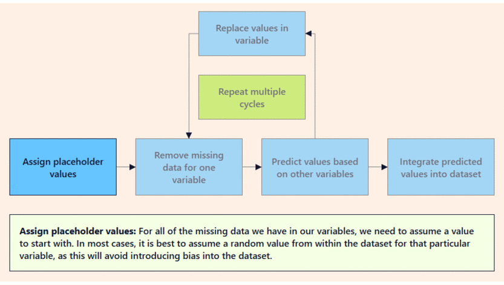

# 12 Data Wrangling, Cleaning, and Tidying

<br>

## Content 
- **Introduction: Data Wrangling and Tidying**
    - [Article: Introduction to Data Wrangling and Tidying](#article-introduction-to-data-wrangling-and-tidying)
- **Introduction to Regular Expressions**
    - **Introduction to Regular Expressions**
        - [Literals](#literals)
        - [Alternation](#alternation)
        - [Character Sets](#character-sets)
        - [Wild for Wildcards](#wild-for-wildcards)
        - [Ranges](#ranges)
        - [Shorthand Character Classes](#shorthand-character-classes)
        - [Grouping](#grouping)
        - [Quantifiers - Fixed](#quantifiers---fixed)
        - [Quantifiers - Optional](#quantifiers---optional)
        - [Quantifiers - 0 or More, 1 or More](#quantifiers---0-or-more-1-or-more)
        - [Anchors](#anchors)
        - [Review: Introduction to Regular Expressions](#review-introduction-to-regular-expressions)
- **How to Clean Data with Python**
    - **How to Clean Data with Python**
        - [Diagnose the Data](#diagnose-the-data)
        - [Dealing with Multiple Files](#dealing-with-multiple-files)
        - [Reshaping your Data](#reshaping-your-data)
        - [Dealing with Duplicates](#dealing-with-duplicates)
        - [Splitting by Index](#splitting-by-index)
        - [Splitting by Character](#splitting-by-character)
        - [Looking at Types](#looking-at-types)
        - [String Parsing](#string-parsing)
        - [More String Parsing](#more-string-parsing)
        - [Missing Values](#missing-values)
            - [Method 1: drop all of the rows with a missing value](#method-1-drop-all-of-the-rows-with-a-missing-value)
            - [Method 2: fill the missing values with the mean of the column, or with some other aggregate value.](#method-2-fill-the-missing-values-with-the-mean-of-the-column-or-with-some-other-aggregate-value)
- **Handling Missing Data**
    - **Article: Types of Missing Data**
        - [Why are there different types of missing data?](#why-are-there-different-types-of-missing-data)
        - [Different types of missing data](#different-types-of-missing-data)
            - [Structurally Missing Data](#structurally-missing-data)
            - [Missing Completely at Random (MCAR)](#missing-completely-at-random-mcar)
            - [Missing at Random (MAR)](#missing-at-random-mar)
            - [Missing Not at Random (MNAR)](#missing-not-at-random-mnar)
            - [Data about Data](#data-about-data)
    - [**Article: Handling Missing Data with Deletion**](#article-handling-missing-data-with-deletion)
        - [When is it safe to use deletion?](#when-is-it-safe-to-use-deletion)
        - [Types of deletion](#types-of-deletion)
            - [Listwise deletion](#listwise-deletion)
            - [Pairwise deletion](#pairwise-deletion)
            - [Dropping Variables](#dropping-variables)
    - [**Article: Single Imputation**](#article-single-imputation)
        - [What is time-series data?](#what-is-time-series-data)
        - [Is it MNAR?](#is-it-mnar)
        - [What can we do?](#what-can-we-do)
        - [LOCF](#locf)
        - [NOCB](#nocb)
        - [Other alternatives](#other-alternatives)
        - [What are the disadvantages?](#what-are-the-disadvantages)
    - [**Article: Multiple Imputation**](#article-multiple-imputation)
        - [What is multiple imputation?](#what-is-multiple-imputation)
        - [When to use it](#when-to-use-it)
        - [How to use it](#how-to-use-it)

<br>

## Article: Introduction to Data Wrangling and Tidying
- Watch [here](../Projects%20Section/012%20Data%20Wrangling,%20Cleaning%20and%20Tyding/01%20Introduction%20-%20Data%20Wrangling%20and%20Tyding/Article_Introduction_to_Data_Wrangling_and_Tyding.ipynb)

<br>

## Literals 
- The simplest text we can match with regular expressions are ***literals***.
- This is where our regular expression contains **the exact text** that we want to match. 
- The regex `a`, for example, will match the text `a`, and the regex `bananas` will match the text `bananas`.

<br>

- We can additionally match just part of a piece of text. 
- Perhaps we are searching a document to see if the word `monkey` occurs, since we love monkeys. 
- We could use the regex `monkey` to match monkey in the piece of text `The monkeys like to eat bananas.`.

<br>

- Not only are we able to match alphabetical characters — digits work as well! 
- The regex `3` will match the `3` in the piece of text `34`, and the regex `5 gibbons` will completely match the text `5 gibbons`!

<br>

- Regular expressions operate by moving character by character, from left to right, through a piece of text. 
- When the regular expression finds a character that matches the first piece of the expression, it looks to find a continuous sequence of matching characters.

<br>

## Alternation
- Do you love baboons and gorillas? 
- You can find either of them with the same regular expression using ***alternation***! 
- Alternation, performed in regular expressions with the pipe symbol, `|`, allows us to match either the characters preceding the | OR the characters after the `|`. 
- The regex baboons|gorillas will match baboons in the text `I love baboons`, but will also match `gorillas` in the text `I love gorillas`.
- Are you thinking about how to match the whole piece of text `I love baboons` or `I love gorillas`? 
- We will get to that later on!

<br>

## Character Sets
- Spelling tests may seem like a distant memory from grade school, but we ultimately take them every day while typing. 
- It’s easy to make mistakes on commonly misspelled words like `consensus`, and on top of that, there are sometimes alternate spellings for the same word.

<br>

- ***Character sets***, denoted by a pair of brackets `[]`, let us match one character from a series of characters, allowing for matches with incorrect or different spellings.

<br>

- The regex `con[sc]en[sc]us` will match `consensus`, the correct spelling of the word, but also match the following three incorrect spellings: `concensus`, `consencus`, and `concencus`. 
- The letters inside the first brackets, `s` and `c`, are the different possibilities for the character that comes after `con` and before `en`.
- Similarly for the second brackets, `s` and `c` are the different character possibilities to come after `en` and before `us`.

<br>

- Thus the regex `[cat]` will match the characters `c`, `a`, or `t`, but not the text `cat`.

<br>

- The beauty of character sets (and alternation) is that they allow our regular expressions to become more flexible and less rigid than by just matching with literals!

<br>

- We can make our character sets even more powerful with the help of the caret `^` symbol. 
- Placed at the front of a character set, the `^` negates the set, matching any character that is not stated. 
- These are called negated character sets. 
- Thus the regex `[^cat]` will match any character that is not `c`, `a`, *or* `t`, and would completely match each character `d`, `o` *or* `g`.

<br>

## Wild for Wildcards
- Sometimes we don’t care exactly WHAT characters are in a text, just that there are SOME characters. 
- Enter the wildcard `.`! 
- ***Wildcards*** will match any single character (letter, number, symbol or whitespace) in a piece of text. 
- They are useful when we do not care about the specific value of a character, but only that a character exists!

<br>

- Let’s say we want to match any 9-character piece of text. 
- The regex `.........` will completely match `orangutan` and `marsupial`! 
- Similarly, the regex `I ate . bananas` will completely match both `I ate 3 bananas` and `I ate 8 bananas`!

<br>

- What happens if we want to match an actual period, `.`? 
- We can use the escape character, `\`, to escape the wildcard functionality of the `.` and match an actual period. 
- The regex `Howler monkeys are really lazy\.` will completely match the text `Howler monkeys are really lazy.`.

<br>

## Ranges
- Character sets are great, but their true power isn’t realized without ranges. 
- ***Ranges*** allow us to specify a range of characters in which we can make a match without having to type out each individual character. 
- The regex `[abc]`, which would match any character `a`, `b`, or `c`, is equivalent to regex range `[a-c]`. 
- The `-` character allows us to specify that we are interested in matching a range of characters.

<br>

- The regex `I adopted [2-9] [b-h]ats` will match the text `I adopted 4 bats` as well as `I adopted 8 cats` and even `I adopted 5 hats`.

<br>

- With ranges we can match any single capital letter with the regex `[A-Z]`, lowercase letter with the regex `[a-z]`, any digit with the regex `[0-9]`. 
- We can even have multiple ranges in the same character set! 
- To match any single capital or lowercase alphabetical character, we can use the regex `[A-Za-z]`.

<br>

- Remember, within any character set `[]` we only match *one* character.

<br>

## Shorthand Character Classes
- While character ranges are extremely useful, they can be cumbersome to write out every single time you want to match common ranges such as those that designate alphabetical characters or digits. 
- To alleviate this pain, there are ***shorthand character classes*** that represent common ranges, and they make writing regular expressions much simpler. 
- These shorthand classes include:
    - `\w`: the “word character” class represents the regex range `[A-Za-z0-9_]`, and it matches a single uppercase character, lowercase character, digit or underscore
    - `\d`: the “digit character” class represents the regex range `[0-9]`, and it matches a single digit character
    - `\s`: the “whitespace character” class represents the regex range `[ \t\r\n\f\v]`, matching a single space, tab, carriage return, line break, form feed, or vertical tab
- For example, the regex `\d\s\w\w\w\w\w\w\w` matches a digit character, followed by a whitespace character, followed by 7 word characters. 
- Thus the regex completely matches the text `3 monkeys`.

<br>

- In addition to the shorthand character classes `\w`, `\d`, and `\s`, we also have access to the *negated shorthand character classes*! 
- These shorthands will match any character that is NOT in the regular shorthand classes. 
- These negated shorthand classes include:
    - `\W`: the “non-word character” class represents the regex range `[^A-Za-z0-9_]`, matching any character that is not included in the range represented by `\w`
    - `\D`: the “non-digit character” class represents the regex range `[^0-9]`, matching any character that is not included in the range represented by `\d`
    - `\S`: the “non-whitespace character” class represents the regex range `[^ \t\r\n\f\v]`, matching any character that is not included in the range represented by `\s`

<br>

## Grouping
- Remember when we were in love with baboons and gorillas a few exercises ago? 
- We were able to match either `baboons` or `gorillas` using the regex `baboons|gorillas`, taking advantage of the `|` symbol.

<br>

- But what if we want to match the whole piece of text `I love baboons` and `I love gorillas` with the same regex? 
- Your first guess might be to use the regex `I love baboons|gorillas`.
- This regex, while it would completely match the string `I love baboons`, would not match `I love gorillas`, and would instead match `gorillas`. This is because the `|` symbol matches the *entire* expression before or after itself.

<br>

- ***Grouping***, denoted with the open parenthesis `(` and the closing parenthesis `)`, lets us group parts of a regular expression together, and allows us to limit alternation to part of the regex.

<br>

- The regex `I love (baboons|gorillas)` will match the text `I love `and *then* match either `baboons` or `gorillas`, as the grouping limits the reach of the `|` to the text within the parentheses.

<br>

- These groups are also called *capture groups*, as they have the power to select, or capture, a substring from our matched text.

<br>

## Quantifiers - Fixed
- `\w\w\w\w\w\w\s\w\w\w\w\w\w`, which would match 6 word characters, followed by a whitespace character, and then followed by more 6 word characters, such as in the text `rhesus monkey`, is there a better way to denote the quantity of characters we want to match?
- The answer is yes, with the help of quantifiers! 
- ***Fixed quantifiers***, denoted with curly braces `{}`, let us indicate the exact quantity of a character we wish to match, or allow us to provide a quantity range to match on.
    - `\w{3}` will match exactly 3 word characters
    - `\w{4,7}` will match at minimum 4 word characters and at maximum 7 word characters

<br>

- The regex `roa{3}r` will match the characters `ro` followed by `3` `a`s, and then the character `r`, such as in the text `roaaar`. 
- The regex `roa{3,7}r` will match the characters `ro` followed by at least `3` `a`s and at most `7` `a`s, followed by an `r`, matching the strings `roaaar`, `roaaaaar` and `roaaaaaaar`.

<br>

- An important note is that quantifiers are considered to be greedy. 
- This means that they will match the greatest quantity of characters they possibly can. 
- For example, the regex `mo{2,4}` will match the text `moooo` in the string `moooo`, and not return a match of `moo`, or `mooo`. 
- This is because the fixed quantifier wants to match the largest number of `o`s as possible, which is `4` in the string `moooo`.

<br>

## Quantifiers - Optional
- You are working on a research project that summarizes the findings of primate behavioral scientists from around the world. 
- Of particular interest to you are the scientists’ observations of humor in chimpanzees, so you whip up some regex to find all occurrences of the word `humor` in the documents you have collected.
- To your dismay, your regex misses the observations of amusement written by scientists hailing from British English speaking countries, where the spelling of the word is `humour`. 
- Optional quantifiers to the rescue!

<br>

- ***Optional quantifiers***, indicated by the question mark `?`, allow us to indicate a character in a regex is optional, or can appear either `0` times or `1` time. 
- For example, the regex `humou?r` matches the characters `humo`, then either `0` occurrences or `1` occurrence of the letter `u`, and finally the letter `r`. Note the `?` *only* applies to the character directly before it.

<br>

- With all quantifiers, we can take advantage of grouping to make even more advanced regexes. 
- The regex `The monkey ate a (rotten )?banana` will completely match both The monkey ate a rotten banana and The` monkey ate a banana`.

<br>

- Since the `?` is a metacharacter, you need to use the escape character in your regex in order to match a question mark `?` in a piece of text.
- The regex `Aren't owl monkeys beautiful\?` will thus completely match the text `Aren't owl monkeys beautiful?`.

<br>

## Quantifiers - 0 or More, 1 or More
- In 1951, mathematician Stephen Cole Kleene developed a system to match patterns in written language with mathematical notation.
- This notation is now known as regular expressions!

<br>

- In his honor, the next piece of regular expressions syntax we will learn is known as the Kleene star. The ***Kleene star***, denoted with the asterisk `*`, is also a quantifier, and matches the preceding character `0` or more times. 
- This means that the character doesn’t need to appear, can appear once, or can appear many many times.

<br>

- The regex `meo*w` will match the characters `me`, followed by `0` or more `o`s, followed by a `w`. Thus the regex will match `mew`, `meow`, `meooow`, and `meoooooooooooow`.

<br>

- Another useful quantifier is the ***Kleene plus***, denoted by the plus `+`, which matches the preceding character `1` or more times.

<br>

- The regex `meo+`w will match the characters `me`, followed by `1` or more `o`s, followed by a `w`. 
- Thus the regex will match `meow`, `meooow`, and `meoooooooooooow`, but not match mew.

<br>

- Like all the other metacharacters, in order to match the symbols `*` and `+`, you need to use the escape character in your regex. 
- The regex `My cat is a \*` will completely match the text `My cat is a *`.

<br>

## Anchors
- When writing regular expressions, it’s useful to make the expression as specific as possible in order to ensure that we do not match unintended text. 
- To aid in this mission of specificity, we can use the anchor metacharacters. 
- The ***anchors*** hat `^` and dollar sign `$` are used to match text at the start and the end of a string, respectively.

<br>

- The regex `^Monkeys: my mortal enemy$` will completely match the text `Monkeys: my mortal enemy` but not match `Spider Monkeys: my mortal enemy in the wild` or `Squirrel Monkeys: my mortal enemy in the wild`. 
- The `^` ensures that the matched text begins with `Monkeys`, and the `$` ensures the matched text ends with `enemy`.

<br>

- Without the anchor tags, the regex `Monkeys: my mortal enemy` will match the text `Monkeys: my mortal enemy` in both `Spider Monkeys: my mortal enemy in the wild` and `Squirrel Monkeys: my mortal enemy in the wild`.

<br>

- Once again, as with all other metacharacters, in order to match the symbols `^` and `$`, you need to use the escape character in your regex.
- The regex `My spider monkey has \$10\^6 in the bank` will completely match the text `My spider monkey has $10^6 in the bank`.

<br>

## Review: Introduction to Regular Expressions
- Do you feel those regular expression superpowers coursing through your body? 
- Do you just want to scream `ah+` really loud? 
- Awesome! You are now ready to take these skills and use them out in the wild. 
- Before beginning your adventures, let’s review what we’ve learned.
    - *Regular expressions* are special sequences of characters that describe a pattern of text that is to be matched
    - We can use *literals* to match the exact characters that we desire
    - *Alternation*, using the pipe symbol `|`, allows us to match the text preceding or following the `|`
    - *Character sets*, denoted by a pair of brackets `[]`, let us match one character from a series of characters
    - *Wildcards*, represented by the period or dot `.`, will match any single character (letter, number, symbol or whitespace)
    - *Ranges* allow us to specify a range of characters in which we can make a match
    - *Shorthand character classes* like `\w`, `\d` and `\s` represent the ranges representing word characters, digit characters, and whitespace characters, respectively
    - *Groupings*, denoted with parentheses `()`, group parts of a regular expression together, and allows us to limit alternation to part of a regex
    - *Fixed quantifiers*, represented with curly braces `{}`, let us indicate the exact quantity or a range of quantity of a character we wish to match
    - *Optional quantifiers*, indicated by the question mark ?, allow us to indicate a character in a regex is optional, or can appear either `0` times or `1` time
    - The *Kleene star*, denoted with the asterisk `*`, is a quantifier that matches the preceding character `0` or more times
    - The *Kleene plus*, denoted by the plus `+`, matches the preceding character `1` or more times
    - The *anchor* symbols hat `^` and dollar sign `$` are used to match text at the start and end of a string, respectively

<br>

## Diagnose the Data
- We often describe data that is easy to analyze and visualize as “tidy data”. What does it mean to have tidy data?
- For data to be tidy, it must have:
    - Each variable as a separate column
    - Each row as a separate observation
- For example, we would want to reshape a table like:
    | Account    | Checkings | Savings |
    |------------|-----------|---------|
    | “12456543” | 8500      | 8900    |
    | “12283942” | 6410      | 8020    |
    | “12839485” | 78000     | 92000   |
- into:
    | Account    | Account Type | Amount |
    |------------|--------------|--------|
    | “12456543” | “Checking”   | 8500   |
    | “12456543” | “Savings”    | 8900   | 
    | “12283942” | “Checking”   | 6410   |
    | “12283942” | “Savings”    | 8020   |
    | “12839485” | “Checking”   | 78000  |
    | “12839485” | “Savings”    | 920000 |
- The first step of diagnosing whether or not a dataset is tidy is using pandas functions to explore and probe the dataset.
- You’ve seen most of the functions we often use to diagnose a dataset for cleaning. 
- Some of the most useful ones are:
    - `.head()` — display the first 5 rows of the table
    - `.info()` — display a summary of the table
    - `.describe()` — display the summary statistics of the table
    - `.columns` — display the column names of the table
    - `.value_counts()` — display the distinct values for a column

<br>

## Dealing with Multiple Files
- Often, you have the same data separated out into multiple files.
- Let’s say that we have a ton of files following the filename structure: `'file1.csv'`, `'file2.csv'`, `'file3.csv'`, and so on. 
- The power of pandas is mainly in being able to manipulate large amounts of structured data. 
- We want to be able to get all of the relevant information into one table so that we can analyze the aggregate data.
- We can combine the use of `glob`, a Python library for working with files, with `pandas` to organize this data better. 
- `glob` can open multiple files using shell-style wildcard matching to get the filenames:  
    ```python
    import glob
    import pandas as pd

    files = glob.glob("file*.csv")

    df_list = []
    for filename in files:
        data = pd.read_csv(filename)
        df_list.append(data)

    df = pd.concat(df_list)

    print(files)
    ```
- This code goes through any file that starts with `'file'` and has an extension of `.csv`. 
- It opens each file, reads the data into a DataFrame, and then concatenates all of those DataFrames together.

<br>

## Reshaping your Data
- Since we want
    - Each variable as a separate column
    - Each row as a separate observation
- We would want to reshape a table like:
    | Account    | Checkings | Savings |
    |------------|-----------|---------|
    | “12456543” | 8500      | 8900    |
    | “12283942” | 6410      | 8020    |
    | “12839485” | 78000     | 92000   |
- Into a table that looks more like:
    | Account    | Account Type | Amount |
    |------------|--------------|--------|
    | “12456543” | “Checking”   | 8500   |
    | “12456543” | “Savings”    | 8900   | 
    | “12283942” | “Checking”   | 6410   |
    | “12283942” | “Savings”    | 8020   |
    | “12839485” | “Checking”   | 78000  |
    | “12839485” | “Savings”    | 920000 |
- We can use `pd.melt()` to do this transformation. 
- `.melt()` takes in a DataFrame, and the columns to unpack:
    ```python
    df = pd.melt(frame=df, id_vars="Account", value_vars=["Checking","Savings"], value_name="Amount", var_name="Account Type")
    ```
- The parameters you provide are:
    - `frame`: the DataFrame you want to `melt`
    - `id_vars`: the column(s) of the old DataFrame to preserve
    - `value_vars`: the column(s) of the old DataFrame that you want to turn into variables
    - `value_name`: what to call the column of the new DataFrame that stores the values
    - `var_name`: what to call the column of the new DataFrame that stores the variables
- The default names may work in certain situations, but it’s best to always have data that is self-explanatory. 
- Thus, we often use `.columns()` to rename the columns after melting:
    ```python
    df.columns(["Account", "Account Type", "Amount"])
    ```

<br>

## Dealing with Duplicates
- Often we see duplicated rows of data in the DataFrames we are working with. 
- This could happen due to errors in data collection or in saving and loading the data.
- To check for duplicates, we can use the pandas function `.duplicated()`, which will return a Series telling us which rows are duplicate rows.
- Let’s say we have a DataFrame fruits that represents this table:
    | *item*       | *price* | *calories* |
    |--------------|---------|------------|
    | “banana”     | “$1”    | 105        |
    | “apple”      | “$0.75” | 95         |
    | “apple”      | “$0.75” | 95         |
    | “peach”      | “$3”    | 55         |
    | “peach”      | “$4”    | 55         |
    | “clementine” | “$2.5”  | 35         |
- If we call `fruits.duplicated()`, we would get the following table:
    | id | value |
    |----|-------|
    | 0  | False |
    | 1  | False |
    | 2  | True  |
    | 3  | False |
    | 4  | False |
    | 5  | False |
- We can see that row 2, which represents an `"apple"` with price `"$0.75"` and `95` calories, is a duplicate row. 
- Every value in this row is the same as in another row.
- We can use the pandas `.drop_duplicates()` function to remove all rows that are duplicates of another row.
- If we call `fruits.drop_duplicates()`, we would get the table:
    | *item*       | *price* | *calories* |
    |--------------|---------|------------|
    | “banana”     | “$1”    | 105        |
    | “apple”      | “$0.75” | 95         |
    | “peach”      | “$3”    | 55         |
    | “peach”      | “$4”    | 55         |
    | “clementine” | “$2.5”  | 35         |
- The `"apple"` row was deleted because it was exactly the same as another row. 
- But the two `"peach"` rows remain because there is a difference in the price column.
- If we wanted to remove every row with a duplicate value in the item column, we could specify a `subset`:
    ```python
    fruits = fruits.drop_duplicates(subset=["item"])
    ```
- By default, this keeps the first occurrence of the duplicate:
    | *item*       | *price* | *calories* |
    |--------------|---------|------------|
    | “banana”     | “$1”    | 105        |
    | “apple”      | “$0.75” | 95         |
    | “peach”      | “$3”    | 55         |
    | “clementine” | “$2.5”  | 35         |
- Make sure that the columns you drop duplicates from are specifically the ones where duplicates don’t belong. 
- You wouldn’t want to drop duplicates with the *`price`* column as a subset, for example, because it’s okay if multiple items cost the same amount!

<br>

## Splitting by Index
- In trying to get clean data, we want to make sure each column represents one type of measurement. 
- Often, multiple measurements are recorded in the same column, and we want to separate these out so that we can do individual analysis on each variable.

<br>

- Let’s say we have a column “birthday” with data formatted in MMDDYYYY format. 
- In other words, “11011993” represents a birthday of November 1, 1993. 
- We want to split this data into day, month, and year so that we can use these columns as separate features.

<br>

- In this case, we know the exact structure of these strings. 
- The first two characters will always correspond to the month, the second two to the day, and the rest of the string will always correspond to year.
- We can easily break the data into three separate columns by splitting the strings using `.str`:
    ```python
    # Create the 'month' column
    df['month'] = df.birthday.str[0:2]
    
    # Create the 'day' column
    df['day'] = df.birthday.str[2:4]
    
    # Create the 'year' column
    df['year'] = df.birthday.str[4:]
    ```
- The first command takes the first two characters of each value in the birthday column and puts it into a month column. 
- The second command takes the second two characters of each value in the birthday column and puts it into a day column. 
- The third command takes the rest of each value in the birthday column and puts it into a year column.
- This would transform a table like:
    | *id* | *birthday* |
    |------|------------|
    | 1011 | “12241989” |
    | 1012 | “10311966” |
    | 1013 | “01052011” |
- into a table like:
    | *id* | *birthday* | *month* | *day* | *year* |
    |------|------------|---------|-------|--------|
    | 1011 | “12241989” | “12”    | “24”  | “1989” |
    | 1012 | “10311966” | “10”    | “31”  | “1966” |
    | 1013 | “01052011” | “01”    | “05”  | “2011” |

<br>

## Splitting by Character
- Let’s say we have a column called “type” with data entries in the format `"admin_US"` or `"user_Kenya"`. 
- Just like we saw before, this column actually contains two types of data. 
- One seems to be the user type (with values like “admin” or “user”) and one seems to be the country this user is in (with values like “US” or “Kenya”).

<br>

- We can no longer just split along the first 4 characters because `admin` and `user` are of different lengths. 
- Instead, we know that we want to split along the `"_"`. 
- Using that, we can split this column into two separate, cleaner columns:
    ```python
    # Split the string and save it as `string_split`
    string_split = df['type'].str.split('_')
    
    # Create the 'usertype' column
    df['usertype'] = string_split.str.get(0)
    
    # Create the 'country' column
    df['country'] = string_split.str.get(1)
    ```
- This would transform a table like:
    | *id* | *type*         |
    |------|----------------|
    | 1011 | “user_Kenya”   |
    | 1012 | “admin_US”     |
    | 1013 | “moderator_UK” |
- into a table like:
    | *id* | *type*         | *usertype* | *country* |
    |------|----------------|------------|-----------|
    | 1011 | “user_Kenya”   | “user”     | “Kenya”   |
    | 1012 | “admin_US”     | “admin”    | “US”      |
    | 1013 | “moderator_UK” | “moderator”| “UK”      |

<br>

## Looking at Types
- Each column of a DataFrame can hold items of the same *data type* or *dtype*. 
- The dtypes that pandas uses are: float, int, bool, datetime, timedelta, category and object. 
- Often, we want to convert between types so that we can do better analysis.
- If a numerical category like `"num_users"` is stored as a Series of `object`s instead of ints, for example, it makes it more difficult to do something like make a line graph of users over time.
- To see the types of each column of a DataFrame, we can use:
    ```python
    print(df.dtypes)
    ```
- For a DataFrame like this:
    | *item*       | *price* | *calories* |
    |--------------|---------|------------|
    | “banana”     | “$1”    | 105        |
    | “apple”      | “$0.75” | 95         |
    | “peach”      | “$3”    | 55         |
    | “clementine” | “$2.5”  | 35         |
- the `.dtypes` attribute would be:
    ```python
    item        object
    price       object
    calories     int64
    dtype: object
    ```
- We can see that the `dtype` of the dtypes attribute itself is an `object`!
- It is a Series object, which you have already worked with. Series objects compose all DataFrames.
- We can see that the `price` column is made up of `object`s, which will probably make our analysis of price more difficult. 
- We’ll look at how to convert columns into numeric values in the next few exercises.

<br>

## String Parsing
- Sometimes we need to modify strings in our DataFrames to help us transform them into more meaningful metrics. 
- For example, in our fruits table from before:
    | *item*       | *price* | *calories* |
    |--------------|---------|------------|
    | “banana”     | “$1”    | 105        |
    | “apple”      | “$0.75” | 95         |
    | “peach”      | “$3”    | 55         |
    | “peach”      | “$4”    | 55         |
    | “clementine” | “$2.5”  | 35         |
- We can see that the `'price'` column is actually composed of strings representing dollar amounts. 
- This column could be much better represented in floats, so that we could take the mean, calculate other aggregate statistics, or compare different fruits to one another in terms of price.
- First, we can use what we know of regex to get rid of all of the dollar signs:
    ```python
    fruit.price = fruit['price'].replace('[\$,]', '', regex=True)
    ```
- Then, we can use the pandas function `.to_numeric()` to convert strings containing numerical values to integers or floats:
    ```python
    fruit['price'] = pd.to_numeric(fruit['price'])
    ```
- Now, we have a DataFrame that looks like:
    | *item*       | *price* | *calories* |
    |--------------|---------|------------|
    | “banana”     | 1       | 105        |
    | “apple”      | 0.75    | 95         |
    | “peach”      | 3       | 55         |
    | “peach”      | 4       | 55         |
    | “clementine” | 2.5     | 35         |

<br>

## More String Parsing
- Sometimes we want to do analysis on numbers that are hidden within string values. 
- We can use regex to extract this numerical data from the strings they are trapped in. 
- Suppose we had this DataFrame `df` representing a workout regimen:
    | *date*     | *exerciseDescription*     |
    |------------|---------------------------|
    | 10/18/2018 | “lunges - 30 reps”        |
    | 10/18/2018 | “squats - 20 reps”        |
    | 10/18/2018 | “deadlifts - 25 reps”     |
    | 10/18/2018 | “jumping jacks - 30 reps” |
    | 10/18/2018 | “lunges - 40 reps”        |
    | 10/18/2018 | “chest flyes - 15 reps”   |
    | ...        | ...                       |
- It would be helpful to separate out data like `"30 lunges"` into 2 columns with the number of reps, `"30"`, and the type of exercise, `"lunges"`. Then, we could compare the increase in the number of lunges done over time, for example.
- To extract the numbers from the string we can use pandas’ `.str.split()` function:
    ```python
    split_df = df['exerciseDescription'].str.split('(\d+)', expand=True)
    ```
- which would result in this DataFrame `split_df`:
    | * * | *0*               | *1*    | *2*    |
    |-----|-------------------|--------|--------|
    | 0   | “lunges -“        | “30“   | “reps“ |
    | 1   | “squats -“        | “20“   | “reps“ |
    | 2   | “deadlifts -“     | “25“   | “reps“ |
    | 3   | “jumping jacks -“ | “30“   | “reps“ |
    | 4   | “lunges -“        | “40“   | “reps“ |
    | 5   | “chest flyes -“   | “15“   | “reps“ |
    | ... | ...               | ...    | ...    |
- Then, we can assign columns from this DataFrame to the original `df`:
    ```python
    df.reps = pd.to_numeric(split_df[1])
    df.exercise = split_df[0].replace('[\- ]', '', regex=True)
    ```
- Now, our `df` looks like this:
    | *date*     | *exerciseDescription*     | *reps* | *exercise*    |
    |------------|---------------------------|--------|---------------|
    | 10/18/2018 | “lunges - 30 reps”        | 30     | “lunges”      |
    | 10/18/2018 | “squats - 20 reps”        | 20     | “squats”      |
    | 10/18/2018 | “deadlifts - 25 reps”     | 25     | “deadlifts”   |
    | 10/18/2018 | “jumping jacks - 30 reps” | 30     | “jumpingjacks”|
    | 10/18/2018 | “lunges - 40 reps”        | 40     | “lunges”      |
    | 10/18/2018 | “chest flyes - 15 reps”   | 15     | “chestflyes”  |
    | ...        | ...                       | ...    | ...           |

<br>

## Missing Values
- We often have data with missing elements, as a result of a problem with the data collection process or errors in the way the data was stored. 
- The missing elements normally show up as `NaN` (or Not a Number) values:
    | *day* | *bill* | *tip* | *num_guests* |
    |-------|--------|-------|--------------|
    | “Mon” | 10.1   | 1     | 1            |
    | “Mon” | 20.75  | 5.5   | 2            |
    | “Tue” | 19.95  | 5.5   | NaN          |
    | “Wed” | 44.10  | 15    | 3            |
    | “Wed” | NaN    | 1     | 1            |
- The `num_guests` value for the 3rd row is missing, and the `bill` value for the 5th row is missing. 
- Some calculations we do will just skip the `NaN` values, but some calculations or visualizations we try to perform will break when a `NaN` is encountered.
- Most of the time, we use one of two methods to deal with missing values.

<br>

### Method 1: drop all of the rows with a missing value 
- We can use `.dropna()` to do this:
    ```python
    bill_df = bill_df.dropna()
    ```
- This command will result in the DataFrame without the incomplete rows:
    | *day* | *bill* | *tip* | *num_guests* |
    |-------|--------|-------|--------------|
    | “Mon” | 10.1   | 1     | 1            |
    | “Mon” | 20.75  | 5.5   | 2            |
    | “Wed” | 44.10  | 15    | 3            |
- If we wanted to remove every row with a `NaN` value in the *num_guests* column only, we could specify a `subset`:
    ```python
    bill_df = bill_df.dropna(subset=["num_guests"])
    ```

<br>

### Method 2: fill the missing values with the mean of the column, or with some other aggregate value.
- We can use `.fillna()` to do this:
    ```python
    bill_df = bill_df.fillna(value={"bill":bill_df.bill.mean(), "num_guests":bill_df.num_guests.mean()})
    ```
- This command will result in the DataFrame with the respective mean of the column in the place of the original `NaN`s:
    | *day* | *bill* | *tip* | *num_guests* |
    |-------|--------|-------|--------------|
    | “Mon” | 10.1   | 1     | 1            |
    | “Mon” | 20.75  | 5.5   | 2            |
    | “Tue” | 19.95  | 5.5   | 1.75         |
    | “Wed” | 44.10  | 15    | 3            |
    | “Wed” | 23.725 | 1     | 1            |

<br>

## Why are there different types of missing data?
- Just as data goes missing for different reasons, there are different ways in which it is missing.
- For the rest of this article, we’ll imagine we have a dataset from a health survey campaign that we ran in our local area. 
- These surveys requested basic information about each person, and participation was completely voluntary.
- When trying to decide what kind of missing data we have, there are two factors we have to take into account:

**How important is this data to the larger dataset?**
- While every variable in a dataset can provide some information that we need, not all variables are created equal. 
- Depending on what we are trying to learn, some fields have more importance than others. 
- It seems obvious that we can’t use data that doesn’t fit our questions – but you’d be surprised how often we accidentally try to.
- **For example**: 
    - Let’s imagine we are collecting data for a health survey. 
    - We are collecting activity level (measured in minutes), location (city), and blood pressure. 
    - If we are missing a lot of data on blood pressure, then we can’t use that dataset to answer questions about blood pressure. 
    - We can still use it to understand the relationship between location and activity, but not blood pressure.

<br>

## Different types of missing data
- But there’s more to missing data than missingness. 
- Missing data comes in four varieties:
    - **Structurally Missing Data** we expect this data to be missing for some logical reason
    - **Missing Completely at Random (MCAR)** the probability of any datapoint being MCAR is the same for all data points – this type of missing data is mostly hypothetical
    - **Missing at Random (MAR)** the probability of any data point being MAR is the same within groups of the observed data – this is much more realistic than MCAR
    - **Missing Not at Random (MNAR)** there is some reason why the data is missing
    Let’s dive into some more details about these types of nothing.

<br>

### Structurally Missing Data
- Sometimes when we have missing data, we aren’t surprised at all. 
- In fact, in some scenarios, we should have missing data, because it makes sense! 
- This is what Structurally Missing Data is, and it frequently occurs when there are one or more fields that depend on another.
- Let’s say that a section of our health survey is asking about common respiratory conditions, and we see a section in our data that look like the following:
    | ParticipiantID | AsthmaFlag | InhalerFrequency | InhalerBrand |
    |----------------|------------|------------------|--------------|
    | 100            | TRUE       | Twice daily      | Breathe-Rite |
    | 101            | TRUE       | Once weekly      | Breathe-Rite |
    | 102            | FALSE      |                  |              |
    | 103            | TRUE       | Once daily       | Asthm-Away   |
    | 104            | FALSE      |                  |              |
- As we can see, two rows do not have any data for the frequency and brand.
- This is expected since we see in the `AsthmaFlag` field that these participants do not use an inhaler at all.

<br>

### Missing Completely at Random (MCAR)
- Sometimes data is just missing. 
- It can happen for any reason, but the important thing is that it could have happened to any observation. 
- For a given variable, every observation is equally likely to be missing.
- Beyond that, MCAR data is truly only MCAR if every potential observation is equally likely to be missing a value for that variable.

<br>

- There’s no logic, no outside force, or unseen behavior. 
- It’s just a completely random, fluke occurrence that there isn’t data.
- MCAR data demands statistical perfection, which is extremely rare because more often than not, there is some unseen reason why data might be missing.

<br>

- But let’s imagine our health survey data again. 
- Steps are part of activity minutes, and let’s say there is a bug in the software that causes the device to not record steps. 
- It’s completely random if someone has the bug in their device or not, and we know from the developers that about 20% of devices are affected.
- Therefore, we might expect that any missing step counts are MCAR. 
- The below data shows a sampling of our data:
    | ParticipantID | Walked | Steps (1,000) |
    |---------------|--------|---------------|
    | 25            | TRUE   | 2.1           |
    | 43            | TRUE   | 15            |
    | 61            | TRUE   | 6             |
    | 62            | TRUE   |               |
    | 78            | TRUE   | 3             |
    | 84            | TRUE   |               |
    | 90            | TRUE   | 0.5           |
    | 102           | TRUE   | 1.5           |
    | 110           | TRUE   | .01           |
    | 115           | TRUE   | 4.1           |
- Since all of these people have identified that they walked on that day, we can assume that the value for Steps should not be missing. 
- We also know about this bug, and see that about 20% of our respondents are recording no steps. 
- Therefore we may be able to assume that the missing values are simply missing by chance, and there isn’t an underlying reason for the missingness (this is actually a really big assumption – but we know about the bug, so seems ok).

<br>

- This kind of missing data is less impactful on our analytics than other types, as there are a variety of techniques we can use to increase the accuracy of our analysis. 
- We could impute the data by taking the average number of steps. 
- We could interpolate the data by generating values based on the distribution of the existing data. 
- Or we could delete it without making our analysis invalid.

<br>

### Missing at Random (MAR)
- Missing at Random might be the most complex of the missing data types. 
- If the likelihood of missingness is different for different groups, but equally likely within a group, then that data is missing at random. 
- It’s kind of a hybrid of missing for a reason and missing completely at random.

<br>

- **For example**: 
    - Several scientific studies have shown that individuals do not like to report their weight, especially when they have a Body Mass Index (BMI) outside of the “normal” range (normal is in quotations because [BMI is a questionable statistic](https://pmc.ncbi.nlm.nih.gov/articles/PMC2930234/) and “normal” is poorly defined, but is the label BMI scales typically use). 
    - In our study, we asked participants to report their `height` and `weight`.
    - This is an example of Missing at Random data because we can assume that some groups are not reporting their weight for a reason, but that anyone within that group (i.e., someone with a non-“normal” BMI) has an equal probability of not reporting their weight.
    - Let’s look at a sampling of our survey data.
        | ParticipantID | Height (cm) | Weight (kg) |
        |---------------|-------------|-------------|
        | 1             | 176         | 84          |
        | 2             | 190         |             |
        | 3             | 160         | 61          |
        | 4             | 180         |             |
        | 5             | 184         |             |
        | 6             | 158         | 72          |
        | 7             | 152         | 50          |
        | 8             | 156         |             |
        | 9             | 194         | 104         |
        | 10            | 180         | 79          |
    - As we can see, some data is missing. 
    - Since we know that some people don’t like to report weight, and we also know that not everyone feels that way, and it doesn’t apply to our entire population, this data is Missing At Random (we know that this is not what “random” usually means, but it’s the statistical definition).
    - This will impact our analysis and limits the claims we are able to make, but there still are several techniques we can still employ that will allow us to use the data that was reported.

<br>

### Missing Not at Random (MNAR)
- Finally, sometimes data is missing for a good reason that applies to all of the data. 
- This can be the most interesting type because it’s when missingness actually tells its own story. 
- This is when the value of the missing variable is related to the reason it’s missing in the first place!

<br>

- Let’s walk through an example to better understand MNAR. 
- Participants in our study have been assigned to a local clinic to get a health reading. 
- They will get blood pressure, height, and weight measured, and the clinician will enter notes after an interview. 
- But a portion of the weight measurements are missing. 
- Participants weren’t responsible for self-reporting, so this is unexpected. 
- We might assume that they didn’t want to be weighed, but if we dive deeper into the data, we might get a different picture. 
- We try the following groupings:
    - last-reported weight to see if data is missing from higher or lower BMI groups
    - demographics such as age, race, and gender to see if there is a pattern here
    - date of data collection
- Let’s say we discovered that the missing data was all collected on the same day. 
- In our clinic, the scales are battery-operated. 
- If the scale runs out of batteries, someone will have to buy more. 
- The data is missing for a reason, even though that reason is completely unrelated to our study.

<br>

- It’s best practice to always assume that the data is MNAR and try to uncover clues as to that reason. 
- As the analyst, you will probably never truly know why data is missing, but finding a pattern can often inform whether the MNAR data is important to your study or not. 
- And knowing that can help you decide what to do about the missing data.

<br>

### Data about Data
- When trying to diagnose the type of missingness, data about the data (aka meta data) can be invaluable. 
- The date/time data was collected, how it was collected, who collected it, where it was collected, etc. can all give invaluable clues to solving the problem of missing data.
- In the end, a lot of data analytics type work is solving mysteries, and The Mystery of the Missing Data is one of the best sellers.

<br>

## Article: Handling Missing Data with Deletion
- We now know why missing data is important, and understand the differences between different types of missing data. 
- Now, we are ready to tackle some missing data. 
- One method we can use to combat missing data is deletion.
- *Deletion* is, quite simply, when we remove some aspect of our missing data so that our resulting dataset is as complete as possible, leading to accurate analytics. 
- Since missing data does not provide a complete picture of what happened in our observations, we can’t rely on it for analytics, hence why deleting data can be a good solution.

<br>

## When is it safe to use deletion?
*Is it really safe to delete data?*
- Deleting data sounds like it could cause more problems than having missing data in the first place. 
- And in some situations, that might be the case! 
- There are some scenarios where deleting data is safe, and others where it is not advised.

<br>

- The big risk with deletion is that we could introduce bias, or unrepresentative data, into the dataset. 
- If we delete too much data, or the wrong kind of data, then the resulting dataset no longer describes what actually happened accurately. 
- In general, data is safe to delete when:
    1. It is either MAR or MCAR missing data. 
        - We can remove data that falls into either of these categories without affecting the rest of the data, since we assume that the data is missing at random. 
        - However, if the percentage of missing data is too high, then we can’t delete the data — we would be reducing our sample size too much.
        - **Note**:
            - That every dataset or analytics use case will have a different definition of how much missing data is “too much”. 
            - For example, data used to predict credit card fraud would have a smaller tolerance for missing data than health survey data.
    2. The missing data has a low correlation with other features in the data. If the missing data is not important for what we’re doing, then we can safely remove that data.  
        

<br>

## Types of deletion
- Depending on the kind of analysis we are doing, we have two available kinds of deletion available to us:
    - Listwise
    - Pairwise
- Each kind of deletion comes with its advantages and disadvantages. 
- Let’s dive in to understand the differences between them.
- In the examples below, we will explore how to tackle some missing health survey data using Python and the popular data manipulation framework, `pandas`.

<br>

### Listwise deletion
- *Listwise deletion*, also known as complete-case analysis, is a technique in which we remove the entire observation when there is missing data. 
- This particular technique is usually employed when the missing variable(s) will directly impact the analysis we are trying to perform, usually with respect to MAR or MCAR missing data.
- Let’s take a look at some health survey data, stored in a DataFrame called `data`.
    | Participant | Sex | Height (cm) | Weight (kg) | Education |
    |-------------|-----|-------------|-------------|-----------|
    | 1           | F   | 176         | 84          | Primary   |
    | 2           | M   | 190         |             | Secondary |
    | 3           | F   | 160         | 61          |           |
    | 4           | F   | 180         | 78          | Primary   |
    | 5           | M   | 184         |             | Primary   |
    | 6           | F   | 158         | 72          |           |
    | 7           | M   | 152         | 50          | No degree |
    | 8           | M   | 156         |             | Secondary |
    | 9           | M   | 194         | 104         | Primary   |
    | 10          | F   | 180         | 79          | No degree |
- In our dataset, we notice a few rows are missing a value for the `Weight` and `Education` variables. 
- If we are studying the correlation between `Height` and `Weight`, we can’t use those rows as they are currently. 
- To remedy this, we can drop any rows that are missing data like so:
    ```python
    # Drop rows that have any missing data
    df.dropna(inplace=True) 
    ```
- Running the above code will change our dataset to look like the following, with no more missing values:
    | Participant | Sex | Height (cm) | Weight (kg) | Education |
    |-------------|-----|-------------|-------------|-----------|
    | 1           | F   | 176         | 84          | Primary   |
    | 4           | F   | 180         | 78          | Primary   |
    | 7           | M   | 152         | 50          | No degree |
    | 9           | M   | 194         | 104         | Primary   |
    | 10          | F   | 180         | 79          | No degree |
- In general, we should be cautious when using listwise deletion, as we lose a lot of information when we remove an entire row. 
- When we remove rows like this, we decrease the amount of data that we can use for analysis. 
- This means we would have less confidence in the accuracy of any conclusions we draw from the resulting dataset.
- As a best practice, we should only use listwise deletion when the number of rows with missing data is relatively small to avoid significant bias.
- Every dataset will have a different context for how much data is safe to remove. 
- A safe place to start is assuming that if less than 5% of data is missing, then we are safe to use listwise deletion.

<br>

### Pairwise deletion
- *Pairwise deletion* is an alternative to listwise deletion, and looks for context to what we are trying to analyze. 
- In pairwise deletion, we only remove rows when there are missing values in the variables we are directly analyzing. 
- Unlike listwise deletion, we do not care if other variables are missing, and can retain those rows.
- Let’s look back at our example dataset:
    | Participant | Sex | Height (cm) | Weight (kg) | Education |
    |-------------|-----|-------------|-------------|-----------|
    | 1           | F   | 176         | 84          | Primary   |
    | 2           | M   | 190         |             | Secondary |
    | 3           | F   | 160         | 61          |           |
    | 4           | F   | 180         | 78          | Primary   |
    | 5           | M   | 184         |             | Primary   |
    | 6           | F   | 158         | 72          |           |
    | 7           | M   | 152         | 50          | No degree |
    | 8           | M   | 156         |             | Secondary |
    | 9           | M   | 194         | 104         | Primary   |
    | 10          | F   | 180         | 79          | No degree |
- Now let’s pretend we are studying the correlation between `Height` and `Education` with this data. 
- If we employed listwise deletion, we would end up removing 5 rows, which is 50% of the data in this selection! 
- With pairwise deletion, however, we keep our focus on the data in the `Education` and `Height` fields, since that is the scope of our study. 
- We can do this with the following code:
    ```python
    df.dropna(subset=['Height','Education'], #only looks at these two columns
            inplace=True, #removes the rows and keeps the data variable
            how='any') #removes data with missing data in either field
    ``` 
- After running the above code, we only ended up removing two rows of data, as opposed to five.
    | Participant | Sex | Height (cm) | Weight (kg) | Education |
    |-------------|-----|-------------|-------------|-----------|
    | 1           | F   | 176         | 84          | Primary   |
    | 2           | M   | 190         |             | Secondary |
    | 4           | F   | 180         | 78          | Primary   |
    | 5           | M   | 184         |             | Primary   |
    | 7           | M   | 152         | 50          | No degree |
    | 8           | M   | 156         |             | Secondary |
    | 9           | M   | 194         | 104         | Primary   |
    | 10          | F   | 180         | 79          | No degree |
- Pairwise deletion has the advantage of retaining as much data as possible, while still letting us handle the missing data for our key variables. 
- In general, pairwise deletion is the preferred technique to use.

<br>

### Dropping Variables
- There is another tactic we could employ: to drop a variable entirely. 
- If a variable is missing enough data, then we really don’t know enough about that variable to use it in our analysis, so we can’t be confident in any conclusions we draw from it.
- While this may sound easier than the other solutions mentioned and possibly effective, we generally don’t want to drop entire variables. 
- Why? In most contexts, having more data is always a good idea and we should work to retain it if possible. 
- The more data we have, the more confidence we can have that our conclusions are actually happening, and not due to random chance. 
- We should only drop a variable as a last resort, and if that variable is missing a very significant amount of data (at least 60%).

<br>

## Article: Single Imputation
- Imagine: you are watching a stock ticker for your favorite company, hoping for it to drop in price so you can jump at the opportunity to invest. 
- Each minute goes by, and it creeps lower and lower, almost to where we want it. 
- Then, suddenly, the data is gone! 
- Then, just as quickly as it disappeared, the price is back, and it has gone up again! What could have happened here?

<br>

## What is time-series data?
- The stock ticker data we were watching is called a time-series dataset. 
- These datasets have interesting properties and analytics capabilities because they track data over (usually) set periods of time. 
- If we are missing data in one of these periods, we have a variety of unique approaches to handle this missing data.
<br>

- When data is missing in time-series data, we have the advantage of context.
- That is, because the data shows observations of the same event over time, we can learn about what is happening and make an educated guess as to what might have happened in our missing data. 
- The methods that we will talk about in this article are specific to time-series data because of this property.

<br>

## Is it MNAR?
- Before we can start describing techniques, we must verify that our missing data can be categorized as MNAR — these techniques assume that to be the case.
- It can be tricky to understand that the data is missing in a non-random manner. 
- How exactly can we verify this? 
- There are two key aspects to be able to accurately describe missing data as MNAR:
    1. **Use domain knowledge**: 
        - Probably the quickest way to identify MNAR is by having extensive knowledge of the data and industry we are working in. 
        - Missing data that falls into MNAR will look and feel different from “normal” data in our dataset.
        - With domain knowledge, either from ourselves or someone on our team, we could identify the cause for missing data. 
        - For example, someone might know that data in a survey is missing in a particular column because the participant was either too embarrassed to answer, or didn’t know the answer. 
        - This would let us know that the data is MNAR.  
    2. **Analyze the dataset to find patterns**: 
        - As we explore, filter, and separate our data, we should ultimately be able to identify something about our missing data that doesn’t line up with everything else. 
        - For example, if we have some survey data, we might find that our missing data almost exclusively comes from men older than 55 years old.
        -  If we see a pattern like this emerge, we can confidently say it is MNAR.
    
<br>

## What can we do?
- Now that we have identified the missing data as MNAR, what can we do to handle our missing data? 
- Let’s take a look at an example of missing data in a time series:
    | Timestamp         | Value |
    |-------------------|-------|
    | 01/10/2021 08:01  | 12    |
    | 01/10/2021 08:02  | 13    |
    | 01/10/2021 08:03  |       |
    | 01/10/2021 08:04  | 16    |
    | 01/10/2021 08:05  | 15    |
- In this case, our dataset has a value for every minute, and we are missing one value. 
- The best way to handle this missing data is by using the data around it to “fill in the blanks”. 
- This is called *single imputation*, and there are many ways that we can tackle this problem.

<br>

## LOCF
- LOCF stands for *Last Observation Carried Forward*. 
- With this technique, we are going to fill in the missing data with the previous value. 
- LOCF is used often when we see a relatively consistent pattern that has continued to either increase or decrease over time.

<br>

- Let’s look at the below dataset with data about how comfortable an office location is, from a collection of employees wearing smartwatches. 
- This data has been adapted from [this “Longitudinal indoor personal comfort preferences” Kaggle dataset](https://www.kaggle.com/datasets/claytonmiller/longitudinal-personal-thermal-comfort-preferences) for the purposes of this article.
    | time                 | space_id | comfort  |
    |----------------------|----------|----------|
    | 2021-03-16 08:22:00  | 125      | Comfy    |
    | 2021-03-16 09:37:00  | 125      | Not Comfy|
    | 2021-03-18 08:11:00  | 125      | Not Comfy|
    | 2021-03-18 09:48:00  | 125      | Comfy    |
    | 2021-03-18 13:35:00  | 125      | Comfy    |
    | 2021-03-18 15:23:00  | 125      | Comfy    |
    | 2021-03-18 15:53:00  | 125      |          |
    | 2021-03-18 18:58:00  | 125      | Comfy    |
    | 2021-03-19 08:05:00  | 125      | Not Comfy|
    | 2021-03-19 09:53:00  | 125      | Comfy    |
- We see that there is a missing value in the seventh row at `2021-03-18 15:53:00+08:00` for the overall comfort of the office in this particular space.
- Since we are looking at data for an office space, we can assume that there wouldn’t be a big change in overall comfort in the span of thirty minutes. 
- This makes the dataset a good candidate for LOCF.

<br>

- In Python, there are a variety of methods we can employ:
    1. If your data is in a pandas DataFrame, we can use the `.ffil()` method on a particular column:
        ```python
        df['comfort'].ffill(axis=0, inplace=True)
        # Applying Forward Fill (another name for LOCF) on the comfort column
        ```
    2. If our data is in a NumPy array, there is a commonly used library called [impyute](https://impyute.readthedocs.io/en/master/index.html) that has a variety of time-series functions. To use LOCF, we can write the following code:
        ```python
        impyute.imputation.ts.locf(data, axis=0)
        # Applying LOCF to the dataset
        ```
- With both of these methods, we are looking to carry data in the comfort column forward to fill in our missing data. 
- In this case, we want to move our Comfy value from the previous timestamp to fill in our missing data. 
- Thus, our dataset would now look like this:
    | time                 | space_id | comfort  |
    |----------------------|----------|----------|
    | 2021-03-16 08:22:00  | 125      | Comfy    |
    | 2021-03-16 09:37:00  | 125      | Not Comfy|
    | 2021-03-18 08:11:00  | 125      | Not Comfy|
    | 2021-03-18 09:48:00  | 125      | Comfy    |
    | 2021-03-18 13:35:00  | 125      | Comfy    |
    | 2021-03-18 15:23:00  | 125      | Comfy    |
    | 2021-03-18 15:53:00  | 125      | Comfy    |
    | 2021-03-18 18:58:00  | 125      | Comfy    |
    | 2021-03-19 08:05:00  | 125      | Not Comfy|
    | 2021-03-19 09:53:00  | 125      | Comfy    |
- This dataset is a good candidate for LOCF, since the data before our missing data has a consistent trend (the office is Comfy for six hours before our missing data). 
- LOCF is a great method when we can assume that past data will carry forward.

<br>

## NOCB
- NOCB stands for *Next Observation Carried Backward*, and it solves imputation in the opposite direction of LOCF. 
- NOCB is usually used when we have more recent data, and we know enough about the past to fill in the blanks that way. 
- Let’s look again at our office comfort dataset for another space in the office:
    | time                 | space_id | comfort  |
    |----------------------|----------|----------|
    | 2021-03-12 14:49:00  | 2        | Comfy    |
    | 2021-03-17 15:30:00  | 2        | Comfy    |
    | 2021-03-17 15:33:00  | 2        | Comfy    |
    | 2021-03-17 15:53:00  | 2        | Not Comfy|
    | 2021-03-18 11:23:00  | 2        |          |
    | 2021-03-18 11:38:00  | 2        | Comfy    |
    | 2021-03-18 12:01:00  | 2        | Comfy    |
    | 2021-03-18 13:49:00  | 2        | Comfy    |
    | 2021-03-18 14:22:00  | 2        | Comfy    |
    | 2021-03-18 15:24:00  | 2        | Comfy    |
    | 2021-03-18 15:59:00  | 2        | Comfy    |
- For this particular space, we are missing the first value for the `comfort` level on March 18th, 2021. 
- Since we can see that the rest of the data for all the data after` 2021-03-18 11:23:00+08:00` all share the same value, this dataset would be a good candidate for NOCB.
- Similarly to LOCF, there are a couple common techniques we can use:
    1. If your data is in a pandas DataFrame, when we can use the `.bfil()` method on a particular column. By “back-filling” (another name for NOCB) our data, we will take data from the next data point in the time series and carry it backwards.
        ```python
        df['comfort'].bfill(axis=0, inplace=True)
        ```
    2. To use `impyute` to perform NOCB, we can write the following code
        ```python
        impyute.imputation.ts.nocb(data, axis=0)
        ```
- In both code blocks, we are trying to take the data
    | time                 | space_id | comfort  |
    |----------------------|----------|----------|
    | 2021-03-12 14:49:00  | 2        | Comfy    |
    | 2021-03-17 15:30:00  | 2        | Comfy    |
    | 2021-03-17 15:33:00  | 2        | Comfy    |
    | 2021-03-17 15:53:00  | 2        | Not Comfy|
    | 2021-03-18 11:23:00  | 2        | Comfy    |
    | 2021-03-18 11:38:00  | 2        | Comfy    |
    | 2021-03-18 12:01:00  | 2        | Comfy    |
    | 2021-03-18 13:49:00  | 2        | Comfy    |
    | 2021-03-18 14:22:00  | 2        | Comfy    |
    | 2021-03-18 15:24:00  | 2        | Comfy    |
    | 2021-03-18 15:59:00  | 2        | Comfy    |
- With NOCB, we can use information from more recent entries to fill in data from that past.

<br>

## Other alternatives
- With LOCF and NOCB, we assume that the data either directly before or after is accurate enough to fill in any surrounding missing data. 
- There are, however, other approaches we can try depending on our data. 
- As with the previous methods of single imputation, deciding which method to use requires domain knowledge to correctly fill in the missing values.

<br>

- One such alternative is BOCF, or *Baseline Observation Carried Forward*. 
- In this approach, the initial values for a given variable are applied to missing values. 
- This is a common approach in medical studies, particularly in drug studies.
- For example, we could assume that missing data for a reported pain level could return to the baseline value.
-  This would happen if a drug were not working as well, so it could be a safe assumption to make if the data is trending in that direction.

<br>

- Let’s look at an example dataset. 
- In this data, we are trying to study some measure of bacteria in a patient’s body after the patient receives a drug that is supposed to reduce it. 
- Here is a set of dummy data that could represent this:
    | timestamp           | concentration |
    |---------------------|---------------|
    | 2021-09-01 08:00:00 | 100           |
    | 2021-09-01 08:15:00 | 98            |
    | 2021-09-01 08:30:00 | 97            |
    | 2021-09-01 08:45:00 | 98            |
    | 2021-09-01 09:00:00 | N/A           |
    | 2021-09-01 09:15:00 | 96            |
    | 2021-09-01 09:30:00 | 94            |
    | 2021-09-01 09:45:00 | 93            |
    | 2021-09-01 10:00:00 | 90            |
- Since we are trying to measure the effect of a drug on something in the body, we don’t want to assume that LOCF or NOCB will apply here, as that could introduce significant error in our analysis. 
- Instead, we could employ BOCF, which could look something like this:
    ```python
    # Isolate the first (baseline) value for our data
    baseline = df['concentration'][0]

    # Replace missing values with our baseline value
    df['concentration'].fillna(value=baseline, inplace=True)
    ```
- Another alternative for single imputation is WOCF, or *Worst Observation Carried Forward*. 
- With this kind of imputation, we want to assume that the data is the worst possible value. 
- This would be useful if the purpose of our analysis was to record improvement in some value (for example, if we wanted to study if a treatment was helping a particular patient’s condition). 
- By filling in data with the worst value, then we can reduce potentially biased results that didn’t actually happen.
- Let’s look at another example dataset. 
- In this dataset, we are tracking a patient’s pain level over the course of a therapy program. 
- The patient rates their pain on a scale of 1 to 10, with 10 being the highest.
    | date       | pain |
    |------------|------|
    | 2021-09-01 | 8    |
    | 2021-09-02 | 8    |
    | 2021-09-03 | 9    |
    | 2021-09-04 | 7    |
    | 2021-09-05 | N/A  |
    | 2021-09-06 | 6    |
    | 2021-09-07 | 7    |
    | 2021-09-08 | 5    |
    | 2021-09-09 | 5    |
- This is a great use case for WOCF. 
- Since we are tracking a patient’s pain level, with the goal of reducing that pain level, we would not want to assume that the patient is feeling better than they are, as that could affect their long-term recovery. 
- Thus, we would always want to assume a higher pain level than the reality, so we can heal them more. 
- This would look like the following code block:
    ```python
    # Isolate worst pain value (in this case, the highest)
    worst = df['pain'].max()

    # Replace all missing values with the worst value
    df['pain'].fillna(value=worst, inplace=True)
    ```

<br>

## What are the disadvantages?
- Single imputation methods are very useful when we have missing data. 
- By using these methods, we can easily and quickly fill in missing data from contextual information in the dataset. 
- There are, however, some disadvantages to using single imputation methods.

<br>

- The biggest disadvantage of these methods is the potential for adding bias into a dataset. 
- When we use single imputation, we assume that the data we are using to fill in the blanks is reliable and accurate for that observation. 
- This isn’t always the case. 
- However, Data often will change in unexpected ways. 
- Single imputation will ignore these potential changes and will “smooth” out our data, which could lead to inaccurate results.

<br>

- In general, single imputation can be an effective technique to handle missing data for our time-series datasets. 
- While it might not be the most sophisticated approach, it can be a useful quick-fix in the right circumstances.

<br>

## Article: Multiple Imputation
- Imagine you are taking a final exam for a science class. 
- As you go through the test, you find some questions that you can’t remember the answer to, so you decide to take a guess. 
- Later on in the exam, you have jogged your memory a bit because some of the later questions have clues about the earlier answers. 
- Luckily, you can use this new knowledge to go back and fill in the previous guesses — hopefully, you will get a better score on the exam!
- This kind of iterative process happens all the time in various data and analytical systems, and is something that we can apply to missing data as well.
- This kind of technique is known as *multiple imputation*.

<br>

## What is multiple imputation?
- *Multiple imputation* is a technique for filling in missing data, in which we replace the missing data multiple times.
-  Multiple imputation, in particular, is used when we have missing data across multiple categorical columns in our dataset. 
- After we have tried different values, we use an algorithm to pick the best values to replace our missing data.
- By doing this, we are able to, over time, find the correct value for our missing data.

<br>

- There are numerous algorithms that we can use, all with their own advantages and disadvantages. 
- Overall, the general process for multiple imputation follows the below flow chart.
    
- After each iteration, our predicted values for each variable should get more and more accurate, since the models continue to refine to better fit our dataset. 
- The goal of multiple imputation is to fill in the missing data so that it can find a model — typically either a normal or chi-square model — to best fit the dataset.

<br>

## When to use it
- Multiple imputation is a powerful technique for replacing missing data, but there are some requirements and considerations to take before using multiple imputation.
- Multiple imputation is best for MAR data, so we should ensure that our data fits that description. 
- With MAR missing data, there is an assumption that there is an underlying reason to have missing data, and we have a good understanding of why that data is missing. 
- Since it is not completely random, using random data to fill in the blanks is not sufficient, so we must use the context of the rest of the data to help.
- Assuming we meet the criteria for using multiple imputation, our dataset will receive a couple key benefits.
    1. We can safely assume that our data won’t be biased, since we start the process off with a random assignment of values for the missing data.
    2. Because the goal of multiple imputation is to have a model that fits the data, we can be pretty confident that the resulting data will be a close approximation of the real data. This would include calculations like standard error and overall statistics.

<br>

## How to use it
- Now that we understand what multiple imputation is trying to do, let’s go ahead and try it out! 
- We don’t have to create our own algorithm to fill in our data, as there are many different approaches and pre-built libraries that can help us out.
- One place to start would be with the `IterativeImputer` module within `sklearn`. 
- This module provides a library to perform Multiple Imputation, leveraging the existing frameworks with `sklearn` and `pandas` DataFrames. 
- Let’s assume that we have the following dataset:
    | X   | Y   | Z   |
    |-----|-----|-----|
    | 5.4 | 18.0| 7.6 |
    | 13.8| 27.4| 4.6 |
    | 14.7|     | 4.2 |
    | 17.6| 18.3|     |
    |     | 49.6| 4.7 |
    | 1.1 | 48.9| 8.5 |
    | 12.9|     | 3.5 |
    | 3.4 | 13.6|     |
    |     | 16.1| 1.8 |
    | 10.2| 42.7| 4.7 |
- If we wanted to use the `IterativeImputer` module here, our code would look like the following:
    ```python
    import numpy as np
    from sklearn.experimental import enable_iterative_imputer
    from sklearn.impute import IterativeImputer
    import pandas as pd

    # Create the dataset as a Python dictionary
    d = {
        'X': [5.4,13.8,14.7,17.6,np.nan,1.1,12.9,3.4,np.nan,10.2],
        'Y': [18,27.4,np.nan,18.3,49.6,48.9,np.nan,13.6,16.1,42.7],
        'Z': [7.6,4.6,4.2,np.nan,4.7,8.5,3.5,np.nan,1.8,4.7]
    }

    dTest = {
        'X': [13.1, 10.8, np.nan, 9.7, 11.2],
        'Y': [18.3, np.nan, 14.1, 19.8, 17.5],
        'Z': [4.2, 3.1, 5.7,np.nan, 9.6]
    }

    # Create the pandas DataFrame from our dictionary
    df = pd.DataFrame(data=d)
    dfTest = pd.DataFrame(data=dTest)

    # Create the IterativeImputer model to predict missing values
    imp = IterativeImputer(max_iter=10, random_state=0)

    # Fit the model to the test dataset
    imp.fit(dfTest)

    # Transform the model on the entire dataset
    dfComplete = pd.DataFrame(np.round(imp.transform(df),1), columns=['X','Y','Z'])

    print(dfComplete.head(10))
    ```
- After running our code, our dataset now looks like this (the imputed values are in **bold**):
    | X   | Y   | Z   |
    |-----|-----|-----|
    | 5.4 | 18.0| 7.6 |
    | 13.8| 27.4| 4.6 |
    | 14.7| **17.4**| 4.2 |
    | 17.6| 18.3| **5.6** |
    | **11.2**| 49.6| 4.7 |
    | 1.1 | 48.9| 8.5 |
    | 12.9| **17.4**| 3.5 |
    | 3.4 | 13.6| **5.7** |
    | **11.2**| 16.1| 1.8 |
    | 10.2| 42.7| 4.7 |
- As we can see, the imputed data looks and behaves much like the rest of the dataset. 
- With only a few lines of code, we can use a library like this to fill in our missing data to the best of our ability.