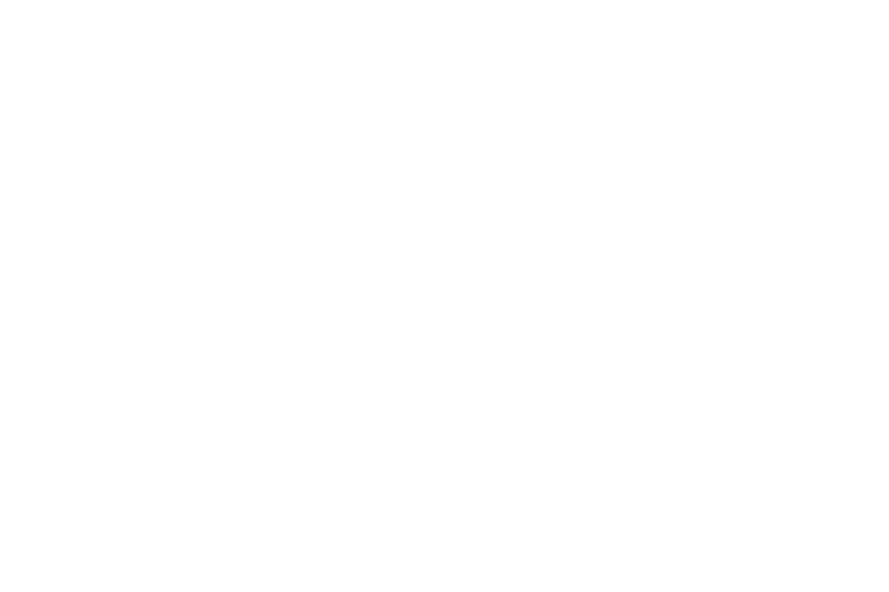
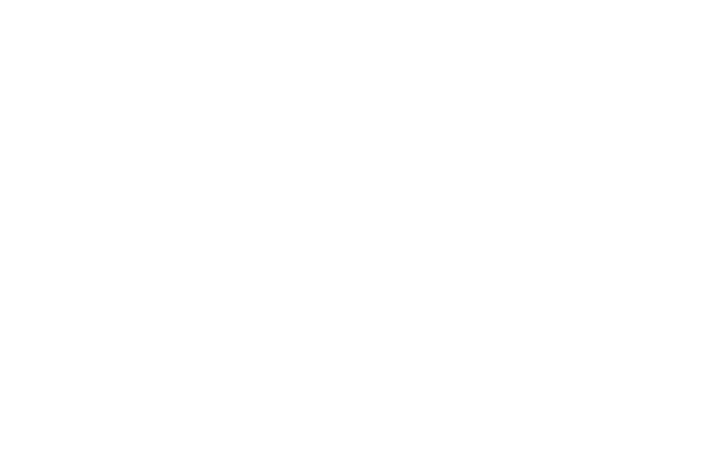
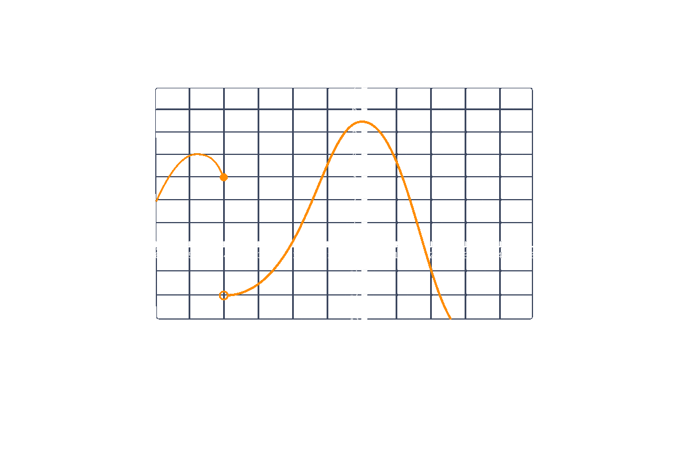
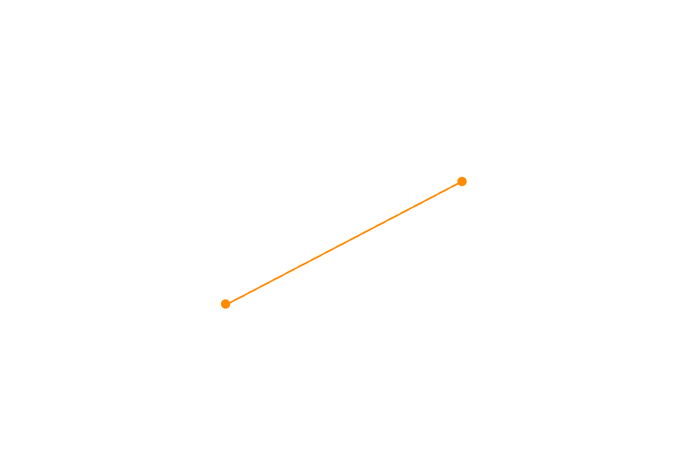
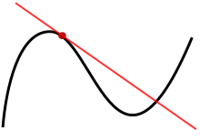
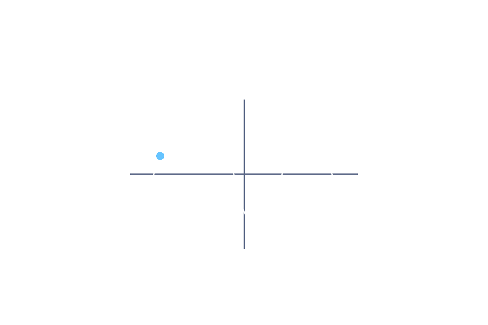

# 17. Math for Machine Learning

<br>

## Content
- **Linear Algebra**
    - **Introduction to Linear Algebra**
        - [Vectors](#vectors)
        - [Basic Vector Operations](#basic-vector-operations)
            - [Scalar Multiplication](#scalar-multiplication)
            - [Vector Addition and Subtraction](#vector-addition-and-subtraction)
        - [Vector Dot Product](#vector-dot-product)
        - [Matrices](#matrices)
        - [Matrix Operations](#matrix-operations)
        - [Special Matrices](#special-matrices)
            - [Identity Matrix](#identity-matrix)
            - [Transpose Matrix](#transpose-matrix)
            - [Permutation Matrix](#permutation-matrix)
        - [Linear Systems in Matrix Form](#linear-systems-in-matrix-form)
        - [Gauss-Jordan Elimination](#gauss-jordan-elimination)
        - [Inverse Matrices](#inverse-matrices)
    - [**Linear Algebra with Python**](#linear-algebra-with-python)
- **Differential Calculus**
    - [Article: What is Calculus?](#article-what-is-calculus)
        - [Rate of Change](#rate-of-change)
        - [Optimization](#optimization)
        - [Infinitesimal Analysis](#infinitesimal-analysis)
    - **Introduction to Differential Calculus**
        - [Limits](#limits)
        - [Limit Definition of a Derivative](#limit-definition-of-a-derivative)
        - [The Derivative Function](#the-derivative-function)
        - [Properties of the Derivative Function](#properties-of-the-derivative-function)
        - [Calculating Derivatives](#calculating-derivatives)
        - [More on Calculating Derivatives](#more-on-calculating-derivatives)
        - [Calculating Derivatives in Python](#calculating-derivatives-in-python)
        
<br>

## Vectors
- The fundamental building blocks of linear algebra are *vectors*. 
- Vectors are defined as quantities having both direction and magnitude, compared to *scalar* quantities that only have magnitude. 
- In order to have direction and magnitude, vector quantities consist of two or more elements of data. 
- The *dimensionality* of a vector is determined by the number of numerical elements in that vector. 
- For example, a vector with four elements would have a dimensionality of four.

<br>

- Let’s take a look at examples of a scalar versus a vector. 
- A car driving at a speed of 40mph is a scalar quantity. 
- Describing the car driving 40mph to the east would represent a two-dimensional vector quantity since it has a magnitude in both the x and y directions.

<br>

- Vectors can be represented as a series of numbers enclosed in parentheses, angle brackets, or square brackets. 
- In this lesson, we will use square brackets for consistency. 
- For example, a three-dimensional vector is written as:  
$$v = \begin{bmatrix} 1 \\ 2 \\ 3 \end{bmatrix}$$
- The magnitude (or length) of a vector, $||v||$, can be calculated with the following formula:  
$$||v|| = \sqrt{\sum_{i=1}^{n} v_i^2}$$
- This formulates translates to the sum of each vector component squared, which can be also written out as:  
$$||v|| = \sqrt{v_1^2 + v_2^2 + v_3^2 + \ldots + v_n^2}$$
- **Let’s look at an example**: 
    - We are told that a ball is traveling through the air and given the velocities of that ball in its $x$, $y$, and $z$ directions in a standard Cartesian coordinate system. 
    - The velocity component values are:
        - $v_x = -12$
        - $v_y = 8$
        - $v_z = -2$
    - Convert the velocities into a vector, and find the total speed of the ball. 
    - (Hint: the speed of the ball is the magnitude of the velocity vector!)  
$$v = \begin{bmatrix} -12 \\ 8 \\ -2 \end{bmatrix}$$
$$ ||v|| = \sqrt{(-12)^2 + 8^2 + (-2)^2} = \sqrt{144 + 64 + 4} = \sqrt{212} \approx 14.56$$

<br>

## Basic Vector Operations
- Now that we know what a vector is and how to represent one, we can begin to perform various operations on vectors and between different vectors. 
- As we’ve previously discussed, the basis of linear algebra is the linear combinations we can generate between vectors (and matrices).

<br>

### Scalar Multiplication
- Any vector can be multiplied by a scalar, which results in every element of that vector being multiplied by that scalar individually.  
$$k \begin{bmatrix} x \\ y \\ z \end{bmatrix} = \begin{bmatrix} kx \\ ky \\ kz \end{bmatrix}$$
- Multiplying vectors by scalars is an *associative operation*, meaning that rearranging the parentheses in the expression does not change the result. 
- For example, we can say ***2(a3) = (2a)3***.

<br>

### Vector Addition and Subtraction
- Vectors can be added and subtracted from each other when they are of the same dimension (same number of components). 
- Doing so adds or subtracts corresponding elements, resulting in a new vector of the same dimension as the two being summed or subtracted. 
- Below is an example of three-dimensional vectors being added and subtracted together.  
$$\begin{bmatrix} x_1 \\ y_1 \\ z_1 \end{bmatrix} + 2 \begin{bmatrix} x_2 \\ y_2 \\ z_2 \end{bmatrix} - 3 \begin{bmatrix} x_3 \\ y_3 \\ z_3 \end{bmatrix} = \begin{bmatrix} x_1 + 2x_2 - 3x_3 \\ y_1 + 2y_2 - 3y_3 \\ z_1 + 2z_2 - 3z_3 \end{bmatrix}$$
- Vector addition is *commutative*, meaning the order of the terms does not matter. 
- For example, we can say ***(a+b = b+a)***. 
- Vector addition is also associative, meaning that ***(a + (b+c) = (a+b) + c)***.

<br>

## Vector Dot Product
- An important vector operation in linear algebra is the dot product. 
- A *dot product* takes two equal dimension vectors and returns a single scalar value by summing the products of the vectors’ corresponding components. This can be written out formulaically as:  
$$a \cdot b = \sum_{i=1}^{n} a_i  b_i$$
- The dot product operation is both commutative ***(a · b = b · a)*** and distributive ***(a · (b+c) = a · b + a · c)***.
- **The resulting scalar value represents how much one vector “goes into” the other vector.** 
- If two vectors are perpendicular (or orthogonal), their dot product is equal to 0, as neither vector “goes into the other.”
- Let’s take a look at an example dot product. Consider the following two vectors:  
$$a = \begin{bmatrix} 3 \\ 2 \\ -3 \end{bmatrix} \quad b = \begin{bmatrix} 0 \\ -3 \\ -6 \end{bmatrix}$$
- To find the dot product between these two vectors, we do the following:  
$$a \cdot b = 3 \cdot 0 + 2 \cdot (-3) + (-3) \cdot (-6) = 0 - 6 + 18 = 12$$
- The dot product can also be used to find the magnitude of a vector and the angle between two vectors. 
- To find the magnitude, we can reference Exercise 2 and see that the magnitude of a vector is simply the square root of a vector’s dot product with itself.  
$$||a|| = \sqrt{a \cdot a}$$
- To find the angle between two vectors, we rely on the dot product between the two vectors and use the following equation.  
$$\cos(\theta) = \frac{a \cdot b}{||a||||b||}$$
- Let’s look at the same two vectors from above:  
$$a = \begin{bmatrix} 3 \\ 2 \\ -3 \end{bmatrix} \quad b = \begin{bmatrix} 0 \\ -3 \\ -6 \end{bmatrix}$$
- To find the angle between these two vectors, we do the following:  
$$\theta = \arccos \frac{3 \cdot 0 + 2 \cdot (-3) + (-3) \cdot (-6)}{\sqrt{3^2 + 2^2 + (-3)^2} \cdot \sqrt{0^2 + (-3)^2 + (-6)^2}}$$
- Solving this, we end up with:  
$$\theta = 67.58^{\circ}$$

<br>

## Matrices
- Now that we’ve learned about vector quantities, we can expand upon those lessons and focus on matrices. 
- A *matrix* is a quantity with *m* rows and *n* columns of data. 
- For example, we can combine multiple vectors into a matrix where each column of that matrix is one of the vectors.

<br>

- Below, you can see a comparison between scalars, vectors, and matrices for context.
$$
\text{Scalar} = 5 \quad \text{Vector} = \begin{bmatrix} 1 \\ 2 \end{bmatrix} \quad \text{Matrix} = \begin{bmatrix} 1 & 2 \\ 3 & 4 \end{bmatrix}
$$
- We can also think of vectors as single-column matrices in their own right.
- Matrices are helpful because they allow us to perform operations on large amounts of data, such as representing entire systems of equations in a single matrix quantity.

<br>

- Matrices can be represented by using square brackets that enclose the rows and columns of data (elements).
-  The shape of a matrix is said to be *mxn*, where there are *m* rows and *n* columns. 
- When representing matrices as a variable, we denote the matrix with a capital letter and a particular matrix element as the matrix variable with an *“m,n”* determined by the element’s location. 
- Let’s look at an example of this. Consider the matrix below.
$$ 
A = \begin{bmatrix} a & b & c \\ d & e & f \\ g & h & i \end{bmatrix}
$$
- The value corresponding to the first row and second column is *b*.
$$
A_{1,2} = b
$$

<br>

## Matrix Operations
- Like with vectors, there are fundamental operations we can perform on matrices that enable the linear transformations needed for linear algebra. 
- We can again both multiply entire matrices by a scalar value, as well as add or subtract matrices with equal shapes.
$$ 2 \begin{bmatrix} a_1 & b _1\\ a_2 & b_2 \end{bmatrix} + 3 \begin{bmatrix} c_1 & d _1\\ c_2 & d_2 \end{bmatrix} = \begin{bmatrix} 2a_1 + 3c_1 & 2b_1 + 3d_1 \\ 2a_2 + 3c_2 & 2b_2 + 3d_2 \end{bmatrix} $$
- A new and important operation we can now perform is matrix multiplication. 
- Matrix multiplication works by computing the dot product between each row of the first matrix and each column of the second matrix. 
- **For example**: 
    - In computing *AB = C*, element (1,2) of the matrix product *C* will be the dot product of row 1 of matrix *A* and column 2 of matrix *B*. 
    - The animation below walks through the multiplication of two matrices showing the dot product between each row and column.  
    
- An important rule about matrix multiplication is that the shapes of the two matrices *AB* must be such that the number of columns in *A* is equal to the number of rows in *B*. 
- With this condition satisfied, the resulting matrix product will be the shape of *rowsA x columnsB*. 
$$ 2 \times 3 \quad 3 \times 2 \rightarrow 2 \times 2 $$
$$ 2 \times 4 \quad 4 \times 3 \rightarrow 2 \times 3 $$
$$ 4 \times 3 \quad 6 \times 5 \rightarrow Not Possible $$
- For example, in the above, the product of a 2x3 matrix and a 3x2 matrix ends up being a 2x2 matrix.

<br>

- Based on how we compute the product matrix with dot products and the importance of having correctly shaped matrices, we can see that matrix multiplication is not commutative, *AB ≠ BA*. 
- However, we can also see that matrix multiplication is associative, *A(BC) = (AB)C*.

<br>

## Special Matrices
- There are a couple of important matrices that are worth discussing on their own.

<br>

### Identity Matrix
- The *identity matrix* is a square matrix of elements equal to 0 except for the elements along the diagonal that are equal to 1. 
- Any matrix multiplied by the identity matrix, either on the left or right side, will be equal to itself.
$$ I = \begin{bmatrix} 1 & 0 & 0 \\ 0 & 1 & 0 \\ 0 & 0 & 1 \end{bmatrix} $$

<br>

### Transpose Matrix
- The *transpose* of a matrix is computed by swapping the rows and columns of a matrix. 
- The transpose operation is denoted by a superscript uppercase “T” (*A^T*).
$$ A = \begin{bmatrix} a & b & c \\ d & e & f \\ g & h & i \end{bmatrix} \rightarrow A^T = \begin{bmatrix} a & d & g \\ b & e & h \\ c & f & i \end{bmatrix} $$

<br>

### Permutation Matrix
- A *permutation matrix* is a square matrix that allows us to flip rows and columns of a separate matrix. 
- Similar to the identity matrix, a permutation matrix is made of elements equal to 0, except for one element in each row or column that is equal to 1. 
- In order to flip rows in matrix *A*, we multiply a permutation matrix *P* on the left *(PA)*. To flip columns, we multiply a permutation matrix *P* on the right *(AP)*.
$$ PA = \begin{bmatrix} 0 & 1 & 0 \\ 0 & 0 & 1 \\ 1 & 0 & 0 \end{bmatrix} \begin{bmatrix} a & b & c \\ d & e & f \\ g & h & i \end{bmatrix} = \begin{bmatrix} d & e & f \\ g & h & i \\ a & b & c \end{bmatrix} $$
$$ AP = \begin{bmatrix} a & b & c \\ d & e & f \\ g & h & i \end{bmatrix} \begin{bmatrix} 0 & 1 & 0 \\ 0 & 0 & 1 \\ 1 & 0 & 0 \end{bmatrix} = \begin{bmatrix} c & a & b \\ f & d & e \\ i & g & h \end{bmatrix} $$


<br>

## Linear Systems in Matrix Form
- An extremely useful application of matrices is for solving systems of linear equations. 
- Consider the following system of equations in its algebraic form.
$$ a_1x + b_1y + c_1z = d_1 $$
$$ a_2x + b_2y + c_2z = d_2 $$
$$ a_3x + b_3y + c_3z = d_3 $$
- This system of equations can be represented using vectors and their linear combination operations that we discussed in the previous exercise.
- We combine the coefficients of the same unknown variables, as well as the equation solutions, into vectors. 
- These vectors are then scalar multiplied by their unknown variable and summed.
$$ x \begin{bmatrix} a_1 \\ a_2 \\ a_3 \end{bmatrix} + y \begin{bmatrix} b_1 \\ b_2 \\ b_3 \end{bmatrix} + z \begin{bmatrix} c_1 \\ c_2 \\ c_3 \end{bmatrix} = \begin{bmatrix} d_1 \\ d_2 \\ d_3 \end{bmatrix} $$
- Our final goal is going to be to represent this system in form *Ax = b*, using matrices and vectors. 
- As we learned earlier, we can combine vectors to create a matrix, which we’ll do with the coefficient vectors to create matrix *A*. 
- We can also convert the unknown variables into vector *x*. 
- We end up with the following *Ax = b* form:
$$ \begin{bmatrix} a_1 & b_1 & c_1 \\ a_2 & b_2 & c_2 \\ a_3 & b_3 & c_3 \end{bmatrix} \begin{bmatrix} x \\ y \\ z \end{bmatrix} = \begin{bmatrix} d_1 \\ d_2 \\ d_3 \end{bmatrix} $$
- Look below if you would like to see how these two expressions are equivalent:
$$ \begin{bmatrix} a_1 & b_1 & c_1 \\ a_2 & b_2 & c_2 \\ a_3 & b_3 & c_3 \end{bmatrix} \begin{bmatrix} x \\ y \\ z \end{bmatrix} = x \begin{bmatrix} a_1 \\ a_2 \\ a_3 \end{bmatrix} + y \begin{bmatrix} b_1 \\ b_2 \\ b_3 \end{bmatrix} + z \begin{bmatrix} c_1 \\ c_2 \\ c_3 \end{bmatrix} $$

**Single Steps again**:  
*First Step: Matrix Multiplication*
$$ \begin{bmatrix} a_1 & b_1 & c_1 \\ a_2 & b_2 & c_2 \\ a_3 & b_3 & c_3 \end{bmatrix} \begin{bmatrix} x \\ y \\ z \end{bmatrix} = \begin{bmatrix} a_1x + b_1y + c_1z \\ a_2x + b_2y + c_2z \\ a_3x + b_3y + c_3z \end{bmatrix} $$
*Second Step: Separate Terms*
$$ \begin{bmatrix} a_1x + b_1y + c_1z \\ a_2x + b_2y + c_2z \\ a_3x + b_3y + c_3z \end{bmatrix} = \begin{bmatrix} a_1x \\ a_2x \\ a_3x \end{bmatrix} + \begin{bmatrix} b_1y \\ b_2y \\ b_3y \end{bmatrix} + \begin{bmatrix} c_1z \\ c_2z \\ c_3z \end{bmatrix} $$
*Third Step: Take out the Coefficients*
$$ \begin{bmatrix} a_1x \\ a_2x \\ a_3x \end{bmatrix} + \begin{bmatrix} b_1y \\ b_2y \\ b_3y \end{bmatrix} + \begin{bmatrix} c_1z \\ c_2z \\ c_3z \end{bmatrix} = x \begin{bmatrix} a_1 \\ a_2 \\ a_3 \end{bmatrix} + y \begin{bmatrix} b_1 \\ b_2 \\ b_3 \end{bmatrix} + z \begin{bmatrix} c_1 \\ c_2 \\ c_3 \end{bmatrix} $$
*Therefore, we can say:*
$$ \begin{bmatrix} a_1 & b_1 & c_1 \\ a_2 & b_2 & c_2 \\ a_3 & b_3 & c_3 \end{bmatrix} \begin{bmatrix} x \\ y \\ z \end{bmatrix} = x \begin{bmatrix} a_1 \\ a_2 \\ a_3 \end{bmatrix} + y \begin{bmatrix} b_1 \\ b_2 \\ b_3 \end{bmatrix} + z \begin{bmatrix} c_1 \\ c_2 \\ c_3 \end{bmatrix} $$
- We can alsow write *Ax = b* in a more general form:
$$ Ax = b \rightarrow [A|b] $$
- This means we can write our Ax = b equation above as:
$$ \begin{bmatrix} a_1 & b_1 & c_1 \\ a_2 & b_2 & c_2 \\ a_3 & b_3 & c_3 \end{bmatrix} \begin{bmatrix} x \\ y \\ z \end{bmatrix} = \begin{bmatrix} d_1 \\ d_2 \\ d_3 \end{bmatrix} \rightarrow \begin{bmatrix} a_1 & b_1 & c_1 & | & d_1 \\ a_2 & b_2 & c_2 & | & d_2 \\ a_3 & b_3 & c_3 & | & d_3 \end{bmatrix} $$ 

<br>

- We can also write *Ax = b* in the following form:
$$ Ax = b \rightarrow [A|b] $$
- This means we can write our Ax = b equation above as:
$$ \begin{bmatrix} a_1 & b_1 & c_1 \\ a_2 & b_2 & c_2 \\ a_3 & b_3 & c_3 \end{bmatrix} \begin{bmatrix} x \\ y \\ z \end{bmatrix} = \begin{bmatrix} d_1 \\ d_2 \\ d_3 \end{bmatrix} \rightarrow \begin{bmatrix} a_1 & b_1 & c_1 & | & d_1 \\ a_2 & b_2 & c_2 & | & d_2 \\ a_3 & b_3 & c_3 & | & d_3 \end{bmatrix} $$

<br>

## Gauss-Jordan Elimination
- Now that we have our system of linear equations in augmented matrix form, we can solve for the unknown variables using a technique called *Gauss-Jordan Elimination*. 
- In regular algebra, we may try to solve the system by combining equations to eliminate variables until we can solve for a single one. 
- Having one variable solved for then allows us to solve for a second variable, and we can continue that process until all variables are solved for.
- The same goal can be used for solving for the unknown variables when in the matrix representation. 
- We start with forming our augmented matrix.
$$ \begin{bmatrix} a_1 & b_1 & c_1 & | & d_1 \\ a_2 & b_2 & c_2 & | & d_2 \\ a_3 & b_3 & c_3 & | & d_3 \end{bmatrix} $$
- To solve for the system, we want to put our augmented matrix into something called *row echelon* form where all elements below the diagonal are equal to zero. 
- This looks like the following:
$$ \begin{bmatrix} a_1 & b_1 & c_1 & | & d_1 \\ a_2 & b_2 & c_2 & | & d_2 \\ a_3 & b_3 & c_3 & | & d_3 \end{bmatrix} \rightarrow \begin{bmatrix} 1 & b_1^{'} & c_1^{'} & | & d_1^{'} \\ 0 & 1 & c_2^{'} & | & d_2^{'} \\ 0 & 0 & 1 & | & d_3^{'} \end{bmatrix} $$
- Note that the values with apostrophes in the *row echelon* form matrix mean that they have been changed in the process of updating the matrix. 
- Once in this form we can rewrite our original equation as:
$$ x + b_1^{'}y + c_1^{'}z = d_1^{'} $$
$$ y + c_2^{'}z = d_2^{'} $$
$$ z = d_3^{'} $$
- This allows us to solve the equations directly using simple algebra. But how do we get to this form?

<br>

- To get to row echelon form we swap rows and/or add or subtract rows against other rows. 
- A typical strategy is to add or subtract row 1 against all rows below in order to make all elements in column 1 equal to 0 under the diagonal. 
- Once this is achieved, we can do the same with row 2 and all rows below to make all elements below the diagonal in column 2 equal to 0.
- Once all elements below the diagonal are equal to 0, we can simply solve for the variable values, starting at the bottom of the matrix and working our way up.
- It’s important to realize that not all systems of equations are solvable! 
- For example, we can perform Gauss-Jordan Elimination and end up with the following augmented matrix.
$$ \begin{bmatrix} 1 & -2 & -2 & | & 5 \\ 0 & 3 & -1 & | & 3 \\ 0 & 0 & 0 & | & 2 \end{bmatrix} $$
- This final augmented matrix here suggests that *0z = 2*, which is impossible!



<br>

## Inverse Matrices
- The *inverse of a matrix*, $A^{-1}$, is one where the following equation is true:
$$ AA^{-1} = A^{-1}A = I $$
- This means that the product of a matrix and its inverse (in either order) is equal to the identity matrix.
- The inverse matrix is useful in many contexts, one of which includes solving equations with matrices.
-  Imagine we have the following equation:
$$ xA = BC $$
- If we are trying to solve for x, we need to find a way to isolate that variable. 
- Since we cannot divide matrices, we can multiply both right sides of the equation by the inverse of A, resulting in the following:
$$ xAA^{-1} = BCA^{-1} \rightarrow BCA^{-1} $$
- An important consideration to keep in mind is that not all matrices have inverses. 
- Those matrices that do not have an inverse are referred to as *singular matrices*.

<br>

- To find the inverse matrix, we can again use Gauss-Jordan elimination. 
- Knowing that $AA^{-1} = I$, we can create the augmented matrix *[ A | I ]*, where we attempt to perform row operations such that *[ A | I ] -> [ I | A-1 ]*.
- One method to find the necessary row operations to convert *A -> I* is to start by creating an upper triangular matrix first, and then work on converting the elements above the diagonal afterward (starting from the bottom right side of the matrix). 
- If the matrix is invertible, this should lead to a matrix with elements equal to 0 except along the diagonal. Each row can then be multiplied by a scalar that leads to the diagonal elements equaling 1 to create the identity matrix.



<br>

## Linear Algebra with Python
- Watch [here](../Projects%20Section/017%20Math%20for%20Machine%20Learning/01%20Linear%20Algebra/02_Lesson_Linear_Algebra_with_Python.ipynb).

<br>

## Article: What is Calculus
- The core task of a data scientist is to make data-driven recommendations on the best way to solve a problem. 
- Along the way, data scientists build and fit statistical models to support their claims, make predictions, and more. 
- In this article, we will look at what calculus is and why it is vital in the data science process.

<br>

### Rate of Change
- *Differential calculus* is the field that studies rates of change. 
- By quantifying how variables relate to each other, we can better understand our statistical model or physical system.
- **For example**: 
    - As a data scientist at a t-shirt company, we may want to know how a change in the marketing budget impacts the company’s total profit.
    - Spend too little, and our product won’t be well known; spend too much, and we might reach a point of diminishing returns where our money would be better spent elsewhere. 
    - How can we find the optimal size of our marketing budget?

<br>

### Optimization
- The last question above is the sort of questions asked and answered by the field of *mathematical optimization*, which intertwines closely with calculus. 
- Optimization problems involve looking for the best solution to a problem.
- Perhaps that’s finding the ‘optimal’ size of the marketing budget for our company, the point where we maximize our profits with a budget that allows us to reach a broad audience without paying too much. 
- Perhaps that means finding the statistical model that ‘best’ fits our data according to some criteria that we define ourselves— mathematical optimization gives us a way to decide among all our possible options. 
- It is a powerful field that underpins much of the modern machine learning revolution and it is built upon the fundamentals of calculus we will investigate.

<br>

### Infinitesimal Analysis
- One of the fundamental paradigms in calculus is to think via *infinitesimals* (extremely small quantities) to say things about instantaneous rates of change. 
- We will discuss this at length in the upcoming lesson.
- To give a rough overview, however, the idea is that by ‘zooming in’ enough and considering how a variable changes over an infinitesimal time frame, we can learn how that variable is changing instantaneously, at a specific moment in time.

<br>

## Limits
- The first concept we will look at is something called a *limit*. 
- Limits quantify what happens to the values of a function as we approach a given point. 
- This can be defined notationally as:
$$ \lim_{x \to 6} f(x) = L $$
- We can read this in simple terms as “the limit as x goes to 6 of f(x) approaches some value L”. 
- To evaluate this limit, we take points increasingly closer and closer to 6— as close to 6 as we can get, but not 6 itself! 
- We then evaluate where the function is headed at those points.

<br>

- If we look at the limit of a function as x approaches a value from one direction, this is called a *one-sided limit*. 
- For example, we might look at the values of *f(5)*, *f(5.9)*, *f(5.999)* and see if they are trending towards the value of *f(6)*. This is represented as:
$$ \lim_{x \to 6^-} f(x) = L $$
- We read this as “the limit as x approaches 6 from the left side approaches some value L.”

<br>

- Whereas if we looked at the values of *f(6.1)*, *f(6.01)*, f*(6.0005)* and see if they are trending towards *f(6)*, we would represent this as:
$$ \lim_{x \to 6^+} f(x) = L $$
- We read this as “the limit as x goes to 6 from the right side approaches some value L.”

<br>

- This takes us to the final key concept about limits. 
- The limit as x approaches 6 exists only if the limit as x approaches 6 from the left side is equal to the limit as x approaches 6 from the right side. 
- This is written out as:
$$ \lim_{x \to 6^-} f(x) = \lim_{x \to 6^+} f(x) = L $$
- then 
$$ \lim_{x \to 6} f(x) = L $$
- if 
$$ \lim_{x \to 6^-} f(x) \neq \lim_{x \to 6^+} f(x) $$
- then
$$ \lim_{x \to 6} f(x) \text{does not exist} $$


<br>

## Limit Definition of a Derivative
- Suppose we wanted to measure a runner’s instantaneous speed using a stopwatch. 
- By instantaneous speed, we mean their speed at an exact moment in time.

<br>

- Let’s define *f(t)* as the runner’s distance from the start time at time *t*. 
- How could we find the runner’s instantaneous speed at 1 second after the race? 
- We could record their positions at 1 second and some time after 1 second and then do some calculations. 
- Let’s say we measure their distance from the start at *f(1)* and *f(3)*. 
- The change in position is *f(3)* - *f(1)*, and the time between 1 second and 3 seconds is 2 seconds, so we can calculate the runner’s average speed to be the following:
$$ \text{average speed} = \frac{f(3) - f(1)}{3 - 1} $$
- However, this gives us the average speed, not the instantaneous speed.
- We don’t know the runner’s speed at *t=1*; we only know their speed on average over the 2-second interval.

<br>

- If we repeated the process but instead took our second measurement at 1.1 seconds, we could be more accurate since we would find the average speed between 1 and 1.1 seconds. 
- If we took our second measurement at a tiny increment, such as *t=1.0000001*, we would be **approaching** instantaneous speed and get a very accurate measurement. 
- The animation below demonstrates this concept.


<br>

- We can generalize this using limits. 
- Define *t = 1* to be the first measurement time, and let’s say we wait *h* seconds until taking the second measurement. 
- Then the second time is *x+h*, and the positions at the two times are *f(x)* and *f(x+h)*. 
- Repeating the exact process as above, we define the runner’s average speed as:
$$ \text{average speed} = \frac{f(x+h) - f(x)}{(x + h) - x} $$
- Simplifying to:
$$ \text{average speed} = \frac{f(x+h) - f(x)}{h} $$
- Using limits, we can make *h* very small. 
- By taking the limit as *h* goes to 0, we can find the instantaneous rate of change!
$$ text{instantaneous rate of change} = \lim_{h \to 0} \frac{f(x+h) - f(x)}{h} $$
- This is called the *derivative at a point*, which is the function’s slope (rate of change) at a specific point. 
- In the next few exercises, we will dive further into derivatives.

<br>

## The Derivative Function
- In the previous exercise, we discussed the idea of the derivative at a point as the instantaneous rate of change at that point. 
- The idea behind the definition is that by finding how the function changes over increasingly small intervals starting at a point, we can understand how a function changes exactly at that point. 
- The formal expression of this concept is written as:
$$ f^{'}(x) = \lim_{h \to 0} \frac{f(x+h) - f(x)}{h} $$
- An equivalent interpretation is that the derivative is the slope of the tangent line at a point. 
- A tangent line at a point is the line that touches the function at that point. 
- Just as the slope of a line describes how a line changes, the slope of the tangent line describes how a “curvier” function changes at a specific point. 
- The visual below shows what a tangent line looks like:  



- Our discussion of taking increasingly smaller intervals in the last exercise gives us a way to calculate the derivative of a function at a point, but this would be a laborious process if we always had to find the derivative at a point this way.

<br>

- Fortunately, many common functions have corresponding derivative functions.
- Derivative functions are often denoted *f’(x)* (read *f* prime of *x*) or *df/dx* (read derivative of *f* at *x*). 
- If *f(x)* represents the function value at a point *x*, the corresponding derivative function *f’(x)* represents how a function is changing at the same point *x*. 
- Essentially, it saves us from having to draw a tangent line or take a limit to compute the derivative at a point. 
- In later exercises, we will see a number of different rules at our disposal that allow us to calculate the derivatives of common functions.

<br>

## Properties of the Derivative Function
- Derivative functions contain important information. 
- **Let’s look at a couple of examples**: 
    - Going back to our running example, *f(t)* describes a runner’s position as a function of time; therefore, the derivative function *f’(t)* describes the runner’s speed at any time *t*. 
    - Let’s say we have a function *s(t)* that describes the real-time sales of a particular product; the corresponding derivative function *s’(t)* describes how those sales are changing in real-time.

<br>

- Let’s look at the general information we can get as well. 
- If *f’(x) > 0*, the corresponding function *f(x)* is increasing. 
- Keep in mind that *f(x)* itself may be negative even though the derivative *f’(x)* is positive. 
- The derivative says nothing about the value of the original function, only about how it is changing. Similarly, if *f’(x) < 0*, then the original function is decreasing.

<br>

- If *f’(x) = 0*, then the function is not changing. 
- This can mean one of a few things.
    - It may mean that the function has reached a *local maximum* (or maxima). 
        - A local maximum is a value of *x* where *f’(x)* changes from positive to negative and thus hits 0 along the way.
        - In *f(x)*, the local maximum is higher than all the points around it.
    - It may also mean that the function has reached what is called a *local minimum*. 
        - A local minimum is lower than the points around it. When *f’(x)* goes from negative values to 0 to positive values, a local minimum forms.
    - It may be an *inflection point*. 
        - This is a point where a function has a change in the direction of curvature. 
        - For example, the curve of the function goes from “facing down” to “facing up.” Finding inflection points involves a second derivative test, which we will not get to in this lesson.
- *Global maxima* and *global minima* are the largest or smallest over the entire range of a function.
- In machine learning models, maxima and minima are key concepts as they’re usually what we are trying to find when we optimize!


## Calculating Derivatives
- We have talked at length about derivatives abstractly. 
- But how do we actually find derivative functions? 
- We will outline this in this exercise and the next one.

<br>

- The answer is through a series of “rules” that we’ll introduce in this exercise and the next. 
- These rules are building blocks, and by combining rules, we can find and plot the derivatives of many common functions.

<br>

- To start, we can think that derivatives are *linear operators*, fancy language that means:
$$ \frac{d}{dx}cf(x) = cf^{'}(x) $$
- This means that we can pull constants out when calculating a derivative. 
- For example, say we have the following function:
$$ f(x) = 4x^2 $$
- We can define the derivative as the following:
$$ \frac{d}{dx}4x^2 = 4\frac{d}{dx}x^2 $$
- We can also say that
$$ \frac{d}{dx}(f(x) + g(x)) = \frac{d}{dx}f(x) + \frac{d}{dx}g(x) $$
- This means that the derivative of a sum is the sum of the derivatives. 
- For example, say we have the following function:
$$ f(x) = x^2 + x^3 $$
- We can define the derivative as the following:
$$ \frac{d}{dx}(x^2 + x^3) = \frac{d}{dx}x^2 + \frac{d}{dx}x^3 $$
- When products get involved, derivatives can get a bit more complicated. 
- For example, let’s say we have a function in the following form of two separate “parts”:
$$ f(x) = u(x)v(x) $$
- We define the product rule as:
$$ f^{'}(x) = u(x)v^{'}(x) + v(x)u^{'}(x) $$
- Mnemonically, we remember this as “first times derivative of second plus second times derivative of first.” 
- For example, say we have the following equation that is the product of two :
$$ f(x) = x^2log(x) $$
- We would use the product rule to find the derivative of f(x):
$$ f^{'}(x) = x^2\frac{d}{dx}log(x) + log(x)\frac{d}{dx}x^2 $$
- Finally, one last rule to take with us into the next exercise is that the derivative of a constant is equal to 0:
$$ \frac{d}{dx}c = 0 $$
- This is because for a constant there is never any change in value, so the derivative will always equal zero. 
- For example, we can say:
$$ \frac{d}{dx}5 = 0 $$

<br>

## More on Calculating Derivatives
- So we now have an idea on where to start differentiating (that is, take the derivative of) things like:
$$ 4log(x) $$
$$ x^2 + log(x)$$
$$ x^2log(x) $$
- Our final step is to understand how to differentiate specific items themselves, like *log(x)* and *x2*.

<br>

- Let’s start off with how to differentiate polynomials. 
- As a reminder, these are expressions that include the following operations:
    - addition
    - subtraction
    - multiplication
    - nonnegative exponents
- For example:
$$ 3x^4 - 2x^2 + 4 $$
- To differentiate polynomials, we use the power rule. 
- This states the following:
$$ \frac{d}{dx}x^n = nx^{n-1} $$
- To take the derivative of $ 3x^4$, we do the following:
$$ \frac{d}{dx}3x^4 = 4 \cdot 3x^{4-1} = 12x^3 $$
- Let’s try a challenging problem. Find the derivative of the following polynomial:
$$ 4x^5 + 2x $$
- Using the power rule and can take the summed term separately:
$$ \frac{d}{dx}(4x^5 + 2x) = 5 \frac{d}{dx}(4x^5) + \frac{d}{dx}(2x) $$
$$ \frac{d}{dx}(4x^5 + 2x) = 5 \cdot 4x^{5-1} + 1 \cdot 2x^{1-1} $$
$$ \frac{d}{dx}(4x^5 + 2x) = 20x^4 + 2 $$
- There are rules even beyond the power rule. 
- Many common functions have defined derivatives. 
- Here are some common ones:
$$ \frac{d}{dx}ln(x) = \frac{1}{x} $$
$$ \frac{d}{dx}e^x = e^x $$
$$ \frac{d}{dx}sin(x) = cos(x) $$
$$ \frac{d}{dx}cos(x) = -sin(x) $$
- Let’s use these rules to try out some practice problems!
- **Practice Problem 1**:
$$ 2x + ln(x) + cos(x) $$
$$ \frac{d}{dx}(2x + ln(x) + cos(x)) = \frac{d}{dx}(2x) + \frac{d}{dx}(ln(x)) + \frac{d}{dx}(cos(x)) $$
$$ \frac{d}{dx}(2x + ln(x) + cos(x)) = 2 + \frac{1}{x} + -sin(x) $$
- **Practice Problem 2**:
$$ 2x \cdot ln(x) $$
$$ \frac{d}{dx}(2x \cdot ln(x)) = 2x \cdot \frac{d}{dx}(ln(x)) + ln(x) \cdot \frac{d}{dx}(2x) $$
$$ \frac{d}{dx}(2x \cdot ln(x)) = 2x \cdot \frac{1}{x} + ln(x) \cdot 2 $$
$$ \frac{d}{dx}(2x \cdot ln(x)) = 2 + 2ln(x) $$
- Taking derivatives is something that takes plenty of practice to get the hang of. 
- As a learner in this course, your biggest takeaway should be that we can differentiate many common functions by using some combination of these rules in tandem.

<br>

## Calculating Derivatives in Python
- We’ve discussed how to compute derivatives by hand. 
- However, oftentimes when working on a computer, we have functions given to us in array form rather than an explicit equation. 
- In this exercise, we will investigate how to calculate derivatives using Python.
- For example, let’s say we have an array that represents the following function:
$$ f(x) = x^2 + 3 $$
- We can define this function in two sets of arrays using the following code.
    ```python
    from math import pow
    # dx is the "step" between each x value
    dx = 0.05
    def f(x):
        # to calculate the y values of the function
        return pow(x, 2) + 3
    # x values
    f_array_x = [x for x in np.arange(0,4,dx)]
    # y values
    f_array_y = [f(x) for x in np.arange(0,4,dx)]
    ```
- The `pow()` function within the `f(x)` function we defined allows us to calculate the values of *x²*, and we use a list comprehension to create a list of the y-values in a variable called `f_array_y`.
- To compute the derivative of `f_array`, we use a NumPy function called `gradient()`.
    ```python
    import numpy as np
    f_array_deriv = np.gradient(f_array_y, dx)
    ```
- `gradient()` takes in an array (in this case, a one-dimensional array) as its first argument.
- We also need to specify the distance between the *x* values, which is `dx`. For a one-dimensional array, `gradient()` calculates the rate of change using the following formula:
$$ \frac{\Delta y}{\Delta x} = \frac{\text{Change in y}}{\text{Change in x}} $$
- As we know from the limit definition of the derivative, we want “Change in x” to be as small as possible, so we get an accurate instantaneous rate of change for each point.

<br>

## 