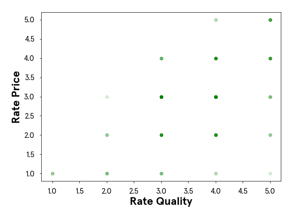

# 18 Machine Learning Fundamentals

<br>

## Content
- **Introduction to Machine Learning**
    - **Why Use Machine Learning?**
        - [Supervised Learning: Regression](#supervised-learning-regression)
            - [Regression](#regression)
            - [Classification](#classification)
    - [**Article: Supervised vs. Unsupervised**](#supervised-learning-classification)
        - [Supervised Learning](#supervised-learning)
        - [Unsupervised Learning](#unsupervised-learning)
- **EDA for Machine Learning Models**
    - [Article: EDA Prior To Fitting a Regression Model](#article-eda-prior-to-fitting-a-regression-model)
    - [Article: EDA Prior To Fitting a Classification Model](#article-eda-prior-to-fitting-a-classification-model)
    - [Article: EDA Prior To Unsupervised Learning](#article-eda-prior-to-unsupervised-learning)
    - [Article: EDA Prior to Unsupervised Clustering](#article-eda-prior-to-unsupervised-clustering)
- **Introduction to Feature Engineering**
    - [Article: Introduction to Feature Engineering](#article-introduction-to-feature-engineering)
        - [What is feature engineering?](#what-is-feature-engineering)
        - [Why do we need feature engineering?](#why-do-we-need-feature-engineering)
            - [1. Performance](#1-performance)
            - [2. Runtime](#2-runtime)
            - [3. Interpretability](#3-interpretability)
            - [4. Generalizability](#4-generalizability)
        - [Feature Engineering and the Machine Learning Workflow](#feature-engineering-and-the-machine-learning-workflow)
            - [1. Feature Transformation methods](#1-feature-transformation-methods)
            - [2. Dimensionality Reduction methods](#2-dimensionality-reduction-methods)
            - [3. Feature Selection methods](#3-feature-selection-methods)
        - [Summary of Feature Engineering](#summary-of-feature-engineering)
- **Data Transformations for Feature Analysis**
    - **Feature Engineering - Numerical Transformations**
        - [Numerical Transformation Introduction](#numerical-transformation-introduction)
        - [Centering Your Data](#centering-your-data)
        - [Standardizing our Data](#standardizing-our-data)
        - [Standardizing our Data with Sklearn](#standardizing-our-data-with-sklearn)
        - [Min-Max Normalization](#min-max-normalization)
        - [Min-Max Normalization with Sklearn](#min-max-normalization-with-sklearn)
        - [Binning our Data](#binning-our-data)
        - [Natural Log Transformation](#natural-log-transformation)
    - [**Article: Encoding Categorical Variables**](#article-encoding-categorical-variables)

<br>

## Supervised Learning: Regression
- Machine learning can be branched out into the following categories:
    - Supervised Learning
    - Unsupervised Learning
- Supervised Learning is where the data is labeled and the program learns to predict the output from the input data. 
- For instance, a supervised learning algorithm for credit card fraud detection would take as input a set of recorded transactions. 
- For each transaction, the program would predict if it is fraudulent or not.
- Supervised learning problems can be further grouped into regression and classification problems.

<br>

### Regression
- In regression problems, we are trying to predict a continuous-valued output. 
- Examples are:
    - What is the housing price in New York?
    - What is the value of cryptocurrencies?

<br>

### Classification
- In classification problems, we are trying to predict a discrete number of values. 
- Examples are:
    - Is this a picture of a human or a picture of a cyborg?
    - Is this email spam?

<br>

- For a quick preview, here’s an example of a regression problem.
- A real estate company wants to analyze housing costs in New York. 
- They built a linear regression model to predict rent prices from two variables: the square footage of each apartment and the number of burglaries in the apartment’s neighborhood during the past year.

<br>

## Supervised Learning: Classification
- Now that you’ve seen a regression example, let’s take a look at a classification example.
- An exclusive nightclub in Neo York doesn’t want to serve robots, but technology has advanced so far that it’s hard for bouncers to tell humans from robots just by looking. 
- To help the bouncers, the nightclub created a model that uses the k-nearest neighbors algorithm to distinguish between humans and robots based on how long it takes them identify blurry pictures or traffic lights.

<br>

## Unsupervised Learning
- Unsupervised Learning is a type of machine learning where the program learns the inherent structure of the data based on unlabeled examples.
- **Clustering** is a common unsupervised machine learning approach that finds patterns and structures in unlabeled data by grouping them into clusters.
- Some examples:
    - Social networks clustering topics in their news feed
    - Consumer sites clustering users for recommendations
    - Search engines to group similar objects in one cluster
- For a quick preview, here’s an example of unsupervised learning.
- A social media platform wants to separate their users into categories based on what kind of content they engage with. 
- They have collected three pieces of data from a sample of users:
    - Number of hours per week spent reading posts
    - Number of hours per week spent watching videos
    - Number of hours per week spent in virtual reality
- The company is using an algorithm called k-means clustering to sort users into three different groups.

<br>

## Article: Supervised vs. Unsupervised
- As humans, we have many different ways we learn things. 
- The way you learned calculus, for example, is probably not the same way you learned to stack blocks.
- The way you learned the alphabet is probably wildly different from the way you learned how to tell if objects are approaching you or going away from you. 
- The latter you might not even realize you learned at all!

<br>

- Similarly, when we think about making programs that can learn, we have to think about these programs learning in different ways. 
- Two main ways that we can approach machine learning are **Supervised Learning** and **Unsupervised Learning**. 
- Both are useful for different situations or kinds of data available.

<br>

### Supervised Learning
- Let’s imagine you’re first learning about different genres in music. 
- Your music teacher plays you an indie rock song and says “This is an indie rock song”. 
- Then, they play you a K-pop song and tell you “This is a K-pop song”. 
- Then, they play you a techno track and say “This is techno”.
- You go through many examples of these genres.

<br>

- The next time you’re listening to the radio, and you hear techno, you may think “This is similar to the 5 techno tracks I heard in class today. This must be techno!”
- Even though the teacher didn’t tell you about this techno track, she gave you enough examples of songs that were techno, so you could recognize more examples of it.
- When we explicitly tell a program what we expect the output to be, and let it learn the rules that produce expected outputs from given inputs, we are performing supervised learning.  
    
- A common example of this is image classification. 
- Often, we want to build systems that will be able to describe a picture. 
- To do this, we normally show a program thousands of examples of pictures, with labels that describe them. 
- During this process, the program adjusts its internal parameters. 
- Then, when we show it a new example of a photo with an unknown description, it should be able to produce a reasonable description of the photo.

<br>

- *Data is labeled and the program learns to predict the output from the input data*

<br>

- When you complete a [Captcha](https://en.wikipedia.org/wiki/CAPTCHA) and identify the images that have cars, you’re labeling images! 
- A supervised machine learning algorithm can now use those pictures that you’ve tagged to make it’s car-image predictor more accurate.

<br>

### Unsupervised Learning
- Let’s say you are an alien who has been observing the meals people eat. 
- You’ve embedded yourself into the body of an employee at a typical tech startup, and you see people eating breakfasts, lunches, and snacks. 
- Over the course of a couple weeks, you surmise that for breakfast people mostly eat foods like:
    - Cereals
    - Bagels
    - Granola bars
- Lunch is usually a combination of:
    - Some sort of vegetable
    - Some sort of protein
    - Some sort of grain
- Snacks are usually a piece of fruit or a handful of nuts. 
- No one explicitly told you what kinds of foods go with each meal, but you learned from natural observation and put the patterns together. 
- In unsupervised learning, we don’t tell the program anything about what we expect the output to be. 
- The program itself analyzes the data it encounters and tries to pick out patterns and group the data in meaningful ways.  
    
- An example of this includes **clustering** to create segments in a business’s user population. 
- In this case, an unsupervised learning algorithm would probably create groups (or clusters) based on parameters that a human may not even consider.

<br>

- *Data is unlabeled and the program learns to recognize the inherent structure in the input data*

<br>

## Article: EDA Prior To Fitting a Regression Model
- Watch [here](../Projects%20Section/018%20Machine%20Learning%20Fundamentals/03%20EDA%20for%20Machine%20Learning%20Models/Article_EDA_Prior_To_Fitting_a_Regression_Model.ipynb).

<br>

## Article: EDA Prior To Fitting a Classification Model
- Watch [here](../Projects%20Section/018%20Machine%20Learning%20Fundamentals/03%20EDA%20for%20Machine%20Learning%20Models/Article_EDA_Prior_To_Fitting_a_Classification_Model.ipynb).

<br>

## Article: EDA Prior to Unsupervised Clustering
- Watch [here](../Projects%20Section/018%20Machine%20Learning%20Fundamentals/03%20EDA%20for%20Machine%20Learning%20Models/Article_EDA_Prior_to_Unsupervised_Clustering.ipynb).

<br>

## Article: Introduction to Feature Engineering
- Feature engineering is an integral part of building and implementing machine learning models. 
- In this article, you’ll learn about what feature engineering is, why we need it and where it fits in within the machine learning workflow. 
- Additionally, you’ll get a brief overview of the many data science tools involved in feature engineering and how they assist data scientists in model diagnostics.

<br>

## What is feature engineering?
- Before we can talk about feature engineering, we have to define what we mean by ‘features’. 
- A **feature** is a measurable property in a dataset, and a feature can be used as an **input to a machine learning model**. 
- One way to think about features is as predictor variables that go into a model to predict the outcome variable. 
- For example, if we want a model that predicts precipitation at a given place and time, we might use temperature, humidity, month, altitude, etc. as inputs. These are our features.

<br>

- Often, when presented with a dataset, it might not be clear what features we should use for a specific model (i.e., should we use ‘tree density’ as an input to our precipitation model?). 
- Similarly, in large datasets, there might be too many features to manually decide which features to use. 
- Some features might be highly correlated with one another, some might not vary much with the outcome variable, and some might be in the wrong form to be a model input and so on. 
- It is not uncommon that a data scientist might not realize any of this until they begin diagnosing a model that is performing poorly.

<br>

- Feature engineering is a way to address these challenges. 
- It is an umbrella term for the techniques we use to help us make decisions about features in machine learning model implementations.

<br>

## Why do we need feature engineering?
To paraphrase Tolstoy, *“All functional model implementations resemble one another but every dysfunctional model implementation is dysfunctional in its own way.*”
- There are a lot of different ways that a model implementation can be dysfunctional. 
- So the question is: What would make a model implementation functional or dysfunctional? 
- Consider the following four attributes:

<br>

### 1. Performance
- We would like our machine learning model to perform “well” on our data. 
- If it is not able to predict the outcome variable (to a reasonable degree of accuracy) on known data, it would be unwise to use it to predict outcomes on unknown data.

<br>

### 2. Runtime
- Suppose a model has excellent performance but takes a really long time to run. 
- For a data scientist, depending on their available computational resources, such a model might be impractical for production.

<br>

### 3. Interpretability
- A model is only as good as the insights it helps us glean from the data. 
- Data scientists are often tasked with finding out what factors drive different outcomes. 
- A well-performing model would not be of much help if it’s opaque and uninterpretable.

<br>

### 4. Generalizability
- We would like our model to generalize well to unseen data. 
- Often data scientists work with streaming data and need their model to be flexible with new and unknown data.

<br>

- Feature engineering can be thought of as a toolkit of techniques to use when a model is missing one or more of the above attributes. 
- If we imagine a model diagnostic machine (kind of like a modern version of this one) with meters representing the attributes, feature engineering would be akin to turning knobs and pushing buttons until we arrive upon a model that meets all of our attributes satisfactorily.  
    

<br>

## Feature Engineering and the Machine Learning Workflow
- So where does feature engineering fall within the machine learning workflow? 
- Does it go before modeling, after modeling or alongside modeling? 
- The answer is: all of the above! 
- Feature engineering is often introduced as an intermediate step between exploratory data analysis and implementing a machine learning algorithm. 
- In reality, these distinctions are fuzzy and the process is not exactly linear.
- Broadly, we can divide feature engineering techniques into three categories:

<br>

### 1. Feature Transformation methods
- These involve numerical transformations methods and ways to encode non-numerical variables. 
- These techniques are applied before implementing a machine learning model. 
- They include and are not limited to: 
    - scaling, 
    - binning, 
    - logarithmic transformations, 
    - hashing and 
    - one hot encoding. 
- These methods typically improve performance, runtime and interpretability of a model.

<br>

### 2. Dimensionality Reduction methods
- Dimensionality of a dataset refers to the number of features within a dataset and reducing dimensionality allows for faster runtimes and (often) better performance. 
- This is an extremely powerful tool in working with datasets with “high dimensionality”. 
- For instance, a hundred-feature problem can be reduced to less than ten modified features, saving a lot of computational time and resources while maintaining or even improving performance.
-  Typically, dimensionality reduction methods are machine learning algorithms themselves, such as 
    - Principal Component Analysis (PCA), 
    - Linear Discriminant Analysis (LDA), 
    - etc.

<br>

- These techniques transform the existing feature space into a new subset of features that are ordered by decreasing importance. 
- Since they “extract” new features from high dimensional data they’re also referred to as Feature Extraction methods. 
- The transformed features do not directly relate to anything in the real world anymore. 
- Rather, they are mathematical objects that are related to the original features. 
- However, these mathematical objects are often difficult to interpret.
- The lack of interpretability is one of the drawbacks of dimensionality reduction.

<br>

### 3. Feature Selection methods
- Feature selection methods are a set of techniques that allow us to choose among the pool of features available. 
- Unlike dimensionality reduction, these retain the features as they are which makes them highly interpretable. 
- They usually belong to one of these three categories:

<br>

1. **Filter methods**:
    - These are statistical techniques used to “filter” out useful features. 
    - Filter methods are completely model agnostic (meaning they can be used with any model) and are useful sanity checks for a data scientist to carry out before deciding on a model. 
    - They include and are not limited to: 
        - correlation coefficients (Pearson, Spearman, etc) , 
        - chi^2, 
        - ANOVA, and 
        - Mutual Information calculations.

2. **Wrapper methods**:
    - Wrapper methods search for the best set of features by using a “greedy search strategy”. 
    - They pick a subset of features, train a model, evaluate it, try a different subset of features, train a model again, and so on until the best possible set of features and most optimal performance is reached. 
    - As this could potentially go on forever, a stopping criterion based on number of features or a model performance metric is typically used. 
    - Forward Feature Selection, Backward Feature Elimination and Sequential Floating are some examples of wrapper method algorithms.

3. **Embedded methods**:
    - Embedded methods are implemented during the model implementation step. 
    - Regularization techniques such as Lasso or Ridge tweak the model to get it to generalize better to new and unknown data. 
    - Tree-based feature importance is another widely used embedded method. 
    - This method provides insight into the features that are most relevant to the outcome variable while fitting decision trees to the data.

<br>

## Summary of Feature Engineering
- Here’s a brief summary of the feature engineering methods we’ve covered in this article, the attributes they seek to improve, and where they fit in within the machine learning workflow:  
    

<br>

## Numerical Transformation Introduction
- We’ve all heard it; a lot of work goes into getting your data just right for the task you have at hand. 
- Perhaps you are trying to find insight into customer behavior or predicting the best time to send a marketing email. 
- Whatever problem you may be trying to solve - you have probably already spent some time wrangling your data and getting it just right, and now you are at the stage where you need to prepare your data for machine learning.

<br>

- For example, some machine learning models, like logistic regression and neural networks, can only handle numbers. 
- Then random forest and decision tree models can take both numbers and text. 
- We will call these text features categorical data, but more on that later. 
- We also need to understand the spread of our data, as some models have a tough time handling data that has extreme outliers.

<br>

- This process is called *numerical transformation*, when we take our numerical data and change it into another numerical value. 
- This is meant to change the scale of our values or even adjust the skewness of our data. 
- You may be thinking, “we already have our data in numbers. 
- Why would we want to change those?” Well, first of all, that is a great question. 
- We’ll dive deep into the “why we do this” throughout this lesson. 
- To put it simply, we do this to help our model better compare features and, most importantly, improve our model’s accuracy and interpretability. 
- That sounds like some good reasons to put the time and effort into numerical transformations if I do say so myself.

<br>

- We’ll focus on the following numerical transformations:
    - Centering
    - Standard Scaler
    - Min and Max Scaler
    - Binning
    - Log transformations

<br>

## Centering Your Data
- Data centering involves subtracting the mean of a data set from each data point so that the new mean is 0. 
- This process helps us understand how far above or below each of our data points is from the mean.
- We can look at the `nearest_starbucks` column.
    ```python	
    distance = coffee['nearest_starbucks']
    ```
- We will find the mean of our feature, create one line of code to center our data, and then plot the centered data. 
- Here’s what it will look like in Python.
    ```python
    #get the mean of your feature
    mean_dis = np.mean(distance)

    #take our distance array and subtract the mean_dis, this will create a new series with the results
    centered_dis = distance - mean_dis

    #visualize your new list
    plt.hist(centered_dis, bins = 5, color = 'g')

    #label our visual
    plt.title('Starbucks Distance Data Centered')
    plt.xlabel('Distance from Mean')
    plt.ylabel('Count')
    plt.show()
    ```
    
- Now, look at that! 
- Our data is centered at 0 and we can see the spread of data, many of our customers who took the survey tend to live fairly close to a Starbucks.

<br>

## Standardizing our Data
- Excellent work with centering the age feature from our dataset! 
- Now we’ll take that concept one step further and discuss standardizing our data. 
- *Standardization* (also known as *Z-Score normalization*) is when we center our data, then divide it by the standard deviation. 
- Once we do that, our entire data set will have a mean of zero and a standard deviation of one. 
- This allows all of our features to be on the same scale.

<br>

- This step is critical because some machine learning models will treat all features equally regardless of their scale.
- You’ll definitely want to standardize your data in the following situations:
    - Before Principal Component Analysis
    - Before using any clustering or distance based algorithm (think KMeans or DBSCAN)
    - Before KNN
    - Before performing regularization methods like LASSO and Ridge
- If I wanted to see how customers rated quality vs. price, I could graph a scatter plot of those two features and easily see that customers tend to score those two questions closely. 
- Notice the darker spots (meaning more data points are laying on top of one another) around the 3.0 for “Rate Quality” and 3.0 for “Rate Price” as an example. 
- This insight was easy to see since our features are on the same one to five scale.  
    
- Now, what happens if I am working with features on two totally different scales? 
- Perhaps the “customer age” and “how far they live from a Starbucks” feature? 
- Let’s take a look.  
    
- Woah! Looking at this, it is much more challenging to gain insight or even identify patterns within our data. 
- This will be a similar experience for our machine learning models.
- That’s why when we standardize our entire dataset, we tend to see a more robust model performance if all features are on the same scale.

<br>

- Let’s examine one feature to learn the mathematics that goes on when we standardize our data. 
- The mathematical formula will look like this:
$$ z = \frac{value - mean}{stdev} $$
- We’ll look at just one feature, where customers were asked how close they are to their nearest Starbucks, and follow that formula above. 
- First, we will set our `nearest_starbucks` feature to its own variable and then find the mean and standard deviation. 
- Then we can quickly standard our list following the formula above.
    ```python	
    distance = coffee['nearest_starbucks']

    #find the mean of our feature
    distance_mean = np.mean(distance)

    #find the standard deviation of our feature
    distance_std_dev = np.std(distance)
        
    #this will take each data point in distance subtract the mean, then divide by the standard deviation
    distance_standardized = (distance - distance_mean) / distance_std_dev
    ```
- We now have our distance feature standardized! 
- Let’s double-check by seeing what the mean and standard deviation of our array is.
    ```python
    # print what type distance_standardized is
    print(type(distance_standardized))
    #output = <class 'pandas.core.series.Series'>

    #print the mean
    print(np.mean(distance_standardized))
    #output = 7.644158530205996e-17

    #print the standard deviation
    print(np.std(distance_standardized))
    #output = 1.0000000000000013
    ```
- Our outputs are basically mean = 0 and standard deviation = 1. 

<br>

## Standardizing our Data with Sklearn
- Now that we understand the mathematics behind a standard scaler let’s quickly implement it with the sklearn library. 
- We will begin by importing our `StandardScaler` library from `sklearn.preprocessing`.
    ```python	
    from sklearn.preprocessing import StandardScaler
    scaler = StandardScaler()
    ```
- We instantiate the StandardScaler by setting it to a variable called `scaler` which we can then use to transform our feature. 
- The next step is to reshape our distance array. 
- StandardScaler must take in our array as 1 column, so we’ll reshape our distance array using the `.reshape(-1,1)` method. 
- This numpy method says to take our data and give it back to us as 1 column, represented in the second value. 
- The -1 asks numpy to figure out the exact number of rows to create based on our data.
    ```python
    reshaped_distance = np.array(distance).reshape(-1,1)
    distance_scaler = scaler.fit_transform(reshaped_distance)
    ```
- Just like we learned in the last lesson, we do this so our data has a mean of 0 and standard deviation of 1. 
- Let’s print to see how the StandardScaler did.
    ```python
    print(np.mean(distance_scaler))
    #output = -9.464196275493137e-17
    print(np.std(distance_scaler))
    #output = 0.9999999999999997
    ```
- You’ll notice the `e-17` at the end of our output for the mean, and that is our number written in exponential notation.
-  Written in standard notation our answer is `-0.00000000000000009464196275493137`. 
- Which basically has the mean at 0 and our standard deviation = 1. 

<br>

## Min-Max Normalization
- Another form of scaling your data is to use a min-max normalization process. 
- The name says it all, we find the minimum and maximum data point in our entire data set and set each of those to 0 and 1, respectively. 
- Then the rest of the data points will transform to a number between 0 and 1, depending on its distance between the minimum and maximum number. 
- We find that transformed number by taking the data point subtracting it from the minimum point, then dividing by the value of our maximum minus minimum.
- Mathematically a min-max normalization looks like this:
$$ X_{norm} = \frac{X - X_{min}}{X_{max} - X_{min}} $$
- One thing to note about min-max normalization is that this transformation does not work well with data that has extreme outliers.
- You will want to perform a min-max normalization if the range between your min and max point is not too drastic.
- The reason we would want to normalize our data is very similar to why we would want to standardize our data - getting everything on the same scale.

<br>

- We’d do this process to our entire data set, but lets look at our distance to a nearest Starbucks feature. 
- We already know from earlier in this lesson that our range in this feature is not too large, so it is a good candidate for a min-max normalization.
-  We’ll write a function that will perform the mathematics needed to transform the entire column.
    ```python	
    distance = coffee['nearest_starbucks']

    #find the min value in our feature
    distance_min = np.min(distance)

    #find the max value in our feature
    distance_max = np.max(distance)

    #normalize our feature by following the formula
    distance_normalized = (distance - distance_min) / (distance_max - distance_min)
    ```
- Excellent! Now if I were to print all the unique numbers in `distance_norm` here is what we will see.
    ```python
    {0.0, 0.125, 0.25, 0.375, 0.5, 0.625, 0.75, 0.875, 1.0}
    ```
- We can see that all numbers are between 0 and 1. 

<br>

## Min-Max Normalization with Sklearn
- Happy to see you now have a strong understanding of how a Min-Max Normalization works, let’s try implementing it with the sklearn library.
- We will start by importing our `MinMaxScaler` library from `sklearn.preprocessing`. 
- Just like we covered in the StandardScaler exercise, we start by instantiating the MinMaxScaler by setting it to a variable called `mmscaler` which we can then use to transform our feature.
    ```python	
    from sklearn.preprocessing import MinMaxScaler
    mmscaler = MinMaxScaler()
    ```
- The next step is to import our distance feature and reshape it so it is ready for our `mmscaler`.
    ```python
    #get our distance feature
    distance = coffee['nearest_starbucks']

    #reshape our array to prepare it for the mmscaler
    reshaped_distance = np.array(distance).reshape(-1,1)

    #.fit_transform our reshaped data
    distance_norm = mmscaler.fit_transform(reshaped_distance)

    #see unique values
    print(set(np.unique(distance_norm)))
    #output = {0.0, 0.125, 0.25, 0.375, 0.5, 0.625, 0.75, 0.875, 1.0}
    ```
- Excellent. We now have a normalized feature within our dataset using the sklearn library MinMaxScaler!

<br>

## Binning our Data
- Binning data is the process of taking numerical or categorical data and breaking it up into groups. 
- We could decide to bin our data to help capture patterns in noisy data. 
- There isn’t a clean and fast rule about how to bin your data, but like so many things in machine learning, you need to be aware of the trade-offs.

<br>

- You want to make sure that your bin ranges aren’t so small that your model is still seeing it as noisy data. 
- Then you also want to make sure that the bin ranges are not so large that your model is unable to pick up on any pattern. 
- It is a delicate decision to make and will depend on the data you are working with.

<br>

- Going back to our customer data and looking at our distance feature, let’s look at the data with a histogram.  
    
- We can easily see that a lot of customers who completed this survey live fairly close to a Starbucks, and our data has a range of 0 km to 8km. 
- I wonder how our data would transform if we were to bin our data in the following way:
    - distance < 1km
    - 1.1km <= distance < 3km
    - 3.1km <= distance < 5km
    - 5.1km <= distance
- First, we’ll set the upper boundaries of what we listed above.
    ```python	
    bins = [0, 1, 3, 5, 8.1]
    ```
- Now you may be asking yourself ‘Why end at 8.1? Isn’t our max value 8?’ That is true! We have 8.1 and not 8 because the pandas function we will use `pd.cut()` has a parameter where it will include the lower bound, and excludes the upper bound. 
- Let me show you what I mean.
    ```python
    coffee['binned_distance'] = pd.cut(coffee['nearest_starbucks'], bins, right = False)

    print(coffee[['binned_distance', 'nearest_starbucks']].head(3))

    #output
    #  binned_distance  nearest_starbucks
    #0      [5.0, 8.1)                  8
    #1      [5.0, 8.1)                  8
    #2      [5.0, 8.1)                  8
    ```
- We can see that those who marked 8 km now live in the [5.0, 8.1) bucket. 
- The bracket `[` tells us 5.0 is included, and the parenthesis `)` tells us that 8.1 is excluded. 
- We could write it as an inequality statement like this: `5 <= distance < 8.1` this allows our customers who marked 8 to belong to the ‘Lives greater than 5.1 km’ bin. 
- Now let’s have a look at our newly binned data.
    ```python
    # Plot the bar graph of binned distances
    coffee['binned_distance'].value_counts().plot(kind='bar')
    
    # Label the bar graph 
    plt.title('Starbucks Distance Distribution')
    plt.xlabel('Distance')
    plt.ylabel('Count') 
    
    # Show the bar graph 
    plt.show()
    ```  
    

<br>

## Natural Log Transformation
- We’ve covered plenty of transformations! 
- We have one last transformation we need to cover, and that is log transformations. 
- Logarithms are an essential tool in statistical analysis and preparation. 
- This transformation works well for right-skewed data and data with large outliers. 
- After we log transform our data, one large benefit is that it will allow the data to be closer to a “normal” distribution. 
- It also changes the scale so our data points will drastically reduce the range of their values.

<br>

- For example, let’s explore a whole new data set from Kaggle around used car prices. 
- Take a look at this histogram plot of 100,000 used car odometers.
    ```python	
    import pandas as pd

    #import our dataframe
    cars = pd.read_csv('cars.csv')

    #set our variable
    odometer = cars['odometer']

    #graph our odometer readings
    plt.hist(odometer, bins = 200, color = 'g')

    #add labels
    plt.xticks(rotation = 45)
    plt.title('Number of Cars by Odometer Reading')
    plt.ylabel('Number of Cars')
    plt.xlabel('Odometer')
    plt.show()
    ```  
    
- This histogram is right-skewed, where the majority of our data is located on the left side of our graph. 
- If we were to provide this feature to our machine learning model it will see a lot of different cars with odometer readings off on the left of our graph. 
- It will not see a lot of examples with very high odometer readings.
- This may cause issues with our model, as it may struggle to pick up on patterns that are within those examples off on the right side of our histogram.

<br>

- We’ll perform a log transformation using numpy to see how our data will transform.
    ```python	
    import numpy as np

    #perform the log transformation
    log_car = np.log(cars['odometer'])

    #graph our transformation
    plt.hist(log_car, bins = 200, color = 'g')

    #rotate the x labels so we can read it easily
    plt.xticks(rotation = 45)

    #provide a title
    plt.title('Logarithm of Car Odometers')
    plt.show()
    ```    
    
- Our data looks much closer to a normal distribution! 
- If we were to look at a sample of five different cars with varying odometer readings, let’s examine how the log transformation changed their values.
    | make | odometer | odometer_logged |
    |------|----------|-----------------|
    | Altima | 10126 | 9.222862 |
    | Jetta | 34042 | 10.435350 |
    | Camry | 56762 | 10.946622 |
    | Civic | 100103 | 11.513955 |
    | F-150 | 145695 | 11.889271 |
    | Saturn | 151687 | 11.929574 |
- If we compare the Altima with 10,126 miles to the Saturn with 151,687 miles those two cars have a huge difference in odometer readings. 
- Yet, once we log transform the data we see the range from 9.22 to 11.93 is much smaller. 
- Compressing the range of our data can help our model perform better!

<br>

- There is so much more to add about log transformation. 
- For the purpose of this exercise we just want to give a high overview and demonstrate how to log transform your data. 
- Before we have you start testing your new skills let’s quickly cover two major topics with log transformation:
    1. Using a log transformation in a machine learning model will require some extra interpretation. 
        - For example, if you were to log transform your data in a linear regression model, our independent variable has a multiplication relationship with our dependent variable instead of the usual additive relationship we would have if our data was not log-transformed.
    2. Keep in mind, just because your data is skewed does not mean that a log transformation is the best answer. You would not want to log transform your feature if:
        - You have values less than 0. The natural logarithm (which is what we’ve been talking about) of a negative number is undefined.
        - You have left-skewed data. That data may call for a square or cube transformation.
        - You have non-parametric data

<br>

## Article: Encoding Categorical Variables
- Watch [here](../Projects%20Section/018%20Machine%20Learning%20Fundamentals/05%20Data%20Transformations%20for%20Feature%20Analysis/Article_Encoding_Categorical_Varibles.ipynb).