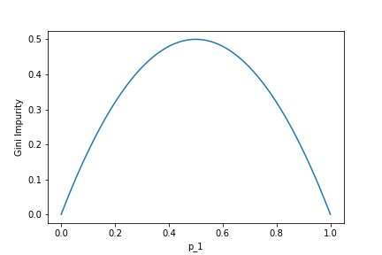

# 19 Supervised Learning I: Regressors, Classifiers, and Trees

<br>

## Content 
- **Introduction to Supervised Learning**
    - [Article: Regression vs. Classification](#article-regression-vs-classification)
        - [Regression](#regression)
        - [Classification](#classification)
- **Simple Linear Regression**
    - **Linear Regression**
        - [Introduction to Linear Regression](#introduction-to-linear-regression)
        - [Points and Lines](#points-and-lines)
        - [Minimizing Loss](#minimizing-loss)
        - [Gradient Descent for Intercept](#gradient-descent-for-intercept)
        - [Gradient Descent for Slope](#gradient-descent-for-slope)
        - [Put it Together](#put-it-together)
        - [Convergence](#convergence)
        - [Learning Rate](#learning-rate)
        - [Use Your Functions on Real Data](#use-your-functions-on-real-data)
        - [Scikit-Learn](#scikit-learn)
- **Multiple Linear Regression**
    - **Multiple Linear Regression**
        - [Introduction to Multiple Linear Regression](#introduction-to-multiple-linear-regression)
        - [Training Set vs. Test Set](#training-set-vs-test-set)
        - [Multiple Linear Regression: Scikit-Learn](#multiple-linear-regression-scikit-learn)
        - [Visualizing Results with Matplotlib](#visualizing-results-with-matplotlib)
        - [Multiple Linear Regression Equation](#multiple-linear-regression-equation)
        - [Correlations](#correlations)
        - [Evaluating the Model's Accuracy](#evaluating-the-models-accuracy)
    - [**Article: Solving a Regression Problem: Ordinary Least Squares to Gradient Descent**](#article-solving-a-regression-problem-ordinary-least-squares-to-gradient-descent)
        - [Ordinary Least Squares](#ordinary-least-squares)
        - [Gradient Descent](#gradient-descent)
        - [Learning Rate and Convergence](#learning-rate-and-convergence)
        - [Implementation in sci-kit learn](#implementation-in-sci-kit-learn)
        - [Gradient Descent in Other Machine Learning Algorithms](#gradient-descent-in-other-machine-learning-algorithms)
- **Logistic Regression**
    - **Logistic Regression**
        - [Introduction to Logistic Regression](#introduction-to-logistic-regression)
        - [Linear Regression Approach](#linear-regression-approach)
        - [Logistic Regression](#logistic-regression)
        - [Log-Odds](#log-odds)
        - [Sigmoid Function](#sigmoid-function)
        - [Fitting a model in sklearn](#fitting-a-model-in-sklearn)
        - [Prediction in sklearn](#prediction-in-sklearn)
        - [Classification Thresholding](#classification-thresholding)
        - [Confusion Matrix](#confusion-matrix)
        - [Accuracy, Recall, Precision, F1 Score](#accuracy-recall-precision-f1-score)
        - [Review of Logistic Regression](#review-of-logistic-regression)
- **K Nearest Neighbors**
    - **K-Nearest Neighbors**
        - [K-Nearest Neighbors Classifier](#k-nearest-neighbors-classifier)
        - [Introduction to K-Nearest Neighbors](#introduction-to-k-nearest-neighbors)
        - [Distance Between Points - 2D](#distance-between-points-2d)
        - [Distance Between Points - 3D](#distance-between-points-3d)
        - [Data with Different Scales: Normalization](#data-with-different-scales-normalization)
        - [Finding the Nearest Neighbors](#finding-the-nearest-neighbors)
        - [Count Neighbors](#count-neighbors)
        - [Training and Validation Sets](#training-and-validation-sets)
        - [Choosing K](#choosing-k)
        - [Graph of K](#graph-of-k)
        - [Using sklearn](#using-sklearn)
    - **K-Nearest Neighbor Regressor**
        - [Regression with K-Nearest Neighbors](#regression-with-k-nearest-neighbors)
        - [Weighted Regression](#weighted-regression)
        - [Scikit-Learn for Regression](#scikit-learn-for-regression)
- **Decision Trees**
    - **Decision Trees**
        - [What is a Decision Tree?](#what-is-a-decision-tree)
        - [What is a Decision Tree? (Contd.)](#what-is-a-decision-tree-contd)
        - [Implementing a Decision Tree](#implementing-a-decision-tree)
        - [Interpreting a Decision Tree](#interpreting-a-decision-tree)
        - [Gini Impurity](#gini-impurity)
        - [Information Gain](#information-gain)
        - [How a Decision Tree is Built (Feature Split)](#how-a-decision-tree-is-built-feature-split)
        - [How a Decision Tree is Built (Recursion)](#how-a-decision-tree-is-built-recursion)
        - [Train and Predict using `scikit-learn`](#train-and-predict-using-scikit-learn)
        - [Visualizing Decision Trees](#visualizing-decision-trees)
        - [Advantages and Disadvantages](#advantages-and-disadvantages)
    - [**Article: Decision Trees for Classification and Regression**](#article-decision-trees-for-classification-and-regression)
- **Evaluation Metrics**
    - **Article: Normalization**
        - [Why Normalize?](#why-normalize)
        - [Min-Max Normalization](#min-max-normalization)
        - [Z-Score Normalization](#z-score-normalization)
        - [Review: Normalization](#review-normalization)
    - [**Training, Validation and Test Datasets**](#training-validation-and-test-datasets)
        - [Training-Validation-Test Split](#training-validation-test-split)
        - [Evaluating the Model](#evaluating-the-model)
        - [How to Split](#how-to-split)
        - [N-Fold Cross-Validation](#n-fold-cross-validation)
    - **Accuracy, Recall, Precision, F1 Score**
        - [Confusion Matrix](#confusion-matrix)
        - [Accuracy](#accuracy)
        - [Recall](#recall)
        - [Precision](#precision)
        - [F1 Score](#f1-score)
        - [Review: Accuracy, Recall, Precision, F1 Score](#review-accuracy-recall-precision-f1-score)

<br>

## Article: Regression vs. Classification
- Machine Learning is a set of many different techniques that are each suited to answering different types of questions.
- One way of categorizing machine learning algorithms is by using the kind output they produce. 
- In terms of output, two main types of machine learning models exist: those for regression and those for classification.

<br>

### Regression
- Regression is used to predict outputs that are *continuous*. 
- The outputs are quantities that can be flexibly determined based on the inputs of the model rather than being confined to a set of possible labels.
- For example:
    - Predict the height of a potted plant from the amount of rainfall
    - Predict salary based on someone’s age and availability of high-speed internet
    - Predict a car’s MPG (miles per gallon) based on size and model year
- Linear regression is the most popular regression algorithm. 
- It is often underrated because of its relative simplicity. 
- In a business setting, it could be used to predict the likelihood that a customer will churn or the revenue a customer will generate. 
- More complex models may fit this data better, at the cost of losing simplicity.

<br>

### Classification
- Classification is used to predict a *discrete label*. 
- The outputs fall under a finite set of possible outcomes. 
- Many situations have only two possible outcomes. 
- This is called *binary classification* (True/False, 0 or 1, Hotdog / not Hotdog).
- For example:
    - Predict whether an email is spam or not
    - Predict whether it will rain or not
    - Predict whether a user is a power user or a casual user
- There are also two other common types of classification: *multi-class classification* and *multi-label classification*.
- Multi-class classification has the same idea behind binary classification, except instead of two possible outcomes, there are three or more.
- For example:
    - Predict whether a photo contains a pear, apple, or peach
    - Predict what letter of the alphabet a handwritten character is
    - Predict whether a piece of fruit is small, medium, or large
- An important note about binary and multi-class classification is that in both, each outcome has one specific label. 
- However, in multi-label classification, there are multiple possible labels for each outcome. 
- This is useful for customer segmentation, image categorization, and sentiment analysis for understanding text. 
- To perform these classifications, we use models like Naive Bayes, K-Nearest Neighbors, SVMs, as well as various deep learning models.
- An example of multi-label classification is shown below. 
- Here, a cat and a bird are both identified in a photo showing a classification model with more than one label as a result.  
    
- Choosing a model is a critical step in the Machine Learning process. 
- It is important that the model fits the question at hand. 
- When you choose the right model, you are already one step closer to getting meaningful and interesting results.

<br>

## Introduction to Linear Regression
- The purpose of machine learning is often to create a model that explains some real-world data, so that we can predict what may happen next, with different inputs.
- The simplest model that we can fit to data is a line. 
- When we are trying to find a line that fits a set of data best, we are performing **Linear Regression**.
- We often want to find lines to fit data, so that we can predict unknowns. 
- **For example**:
    - The market price of a house vs. the square footage of a house. Can we predict how much a house will sell for, given its size?
    - The tax rate of a country vs. its GDP. Can we predict taxation based on a country’s GDP?
    - The amount of chips left in the bag vs. number of chips taken. Can we predict how much longer this bag of chips will last, given how much people at this party have been eating?
- Imagine that we had this set of weights plotted against heights of a large set of professional baseball players:  
    
- To create a linear model to explain this data, we might draw this line:  
    
- Now, if we wanted to estimate the weight of a player with a height of 73 inches, we could estimate that it is around 143 pounds.
- A line is a rough approximation, but it allows us the ability to explain and predict variables that have a linear relationship with each other. 

<br>

## Points and Lines
- In the last exercise, you were probably able to make a rough estimate about the next data point for Sandra’s lemonade stand without thinking too hard about it. 
- For our program to make the same level of guess, we have to determine what a line would look like through those data points.
- A line is determined by its *slope* and its *intercept*. 
- In other words, for each point y on a line we can say:
$$ y = mx + b $$
- where `m` is the slope, and `b` is the intercept. 
- `y` is a given point on the y-axis, and it corresponds to a given `x` on the x-axis.
- The slope is a measure of how steep the line is, while the intercept is a measure of where the line hits the y-axis.
- When we perform Linear Regression, the goal is to get the “best” `m` and `b` for our data. 
- We will determine what “best” means in the next exercises.

<br>

## Loss
- When we think about how we can assign a slope and intercept to fit a set of points, we have to define what the *best fit* is.
- For each data point, we calculate **loss**, a number that measures how bad the model’s (in this case, the line’s) prediction was. 
- You may have seen this being referred to as error.
- We can think about loss as the squared distance from the point to the line. 
- We do the squared distance (instead of just the distance) so that points above and below the line both contribute to total loss in the same way:  
    
- In this example:
    - or point A, the squared distance is `9` (3²)
    - For point B, the squared distance is `1` (1²)
- So the total loss, with this model, is `10`. 
- If we found a line that had less loss than `10`, that line would be a better model for this data.

<br>

## Minimizing Loss
- The goal of a linear regression model is to find the slope and intercept pair that minimizes loss on average across all of the data.
- To find this optimal line, we must iterate, adjusting the slope and intercept of the line to find the smallest possible loss.


<br>

## Gradient Descent for Intercept
- As we try to minimize loss, we take each parameter we are changing, and move it as long as we are decreasing loss. 
- It’s like we are moving down a hill, and stop once we reach the bottom:  
    
- The process by which we do this is called **gradient descent**. 
- We move in the direction that decreases our loss the most. 
- Gradient refers to the slope of the curve at any point.

<br>

- For example, let’s say we are trying to find the intercept for a line. 
- We currently have a guess of 10 for the intercept. 
- At the point of 10 on the curve, the slope is downward. 
- Therefore, if we increase the intercept, we should be lowering the loss. 
- So we follow the gradient downwards.  
    
- We derive these gradients using calculus.
- It is not crucial to understand how we arrive at the gradient equation. 
- To find the gradient of loss as intercept changes, the formula comes out to be:
    - `N` is the number of points we have in our dataset
    - `m` is the current gradient guess
    - `b` is the current intercept guess
$$ - \frac{2}{N} \sum_{i=1}^{N} (y_i - (mx_i + b)) $$
- Basically:
    - we find the sum of `y_value - (m*x_value + b)` for all the `y_values` and `x_values` we have
    - and then we multiply the sum by a factor of `-2/N`. `N` is the number of points we have.

<br>

## Gradient Descent for Slope
- We have a function to find the gradient of `b` at every point. 
- To find the `m` gradient, or the way the loss changes as the slope of our line changes, we can use this formula:
$$ - \frac{2}{N} \sum_{i=1}^{N} x_i(y_i - (mx_i + b)) $$
- Once more:
    - `N` is the number of points we have in our dataset
    - `m` is the current gradient guess
    - `b` is the current intercept guess
- To find the `m` gradient:
    - we find the sum of `x_value * (y_value - (m*x_value + b))` for all the `y_values` and `x_values` we have
    - and then we multiply the sum by a factor of `-2/N`. `N` is the number of points we have.
- Once we have a way to calculate both the `m` gradient and the `b` gradient, we’ll be able to follow both of those gradients downwards to the point of lowest loss for both the `m` value and the `b` value. 
- Then, we’ll have the best `m` and the best `b` to fit our data!

<br>

## Put it Together
- Now that we know how to calculate the gradient, we want to take a “step” in that direction. 
- However, it’s important to think about whether that step is too big or too small. 
- We don’t want to overshoot the minimum error!
- We can scale the size of the step by multiplying the gradient by a *learning rate*.
- To find a new `b` value, we would say:
    ```python
    new_b = current_b - (learning_rate * b_gradient)
    ```
- where `current_b` is our guess for what the b value is, `b_gradient` is the gradient of the loss curve at our current guess, and `learning_rate` is proportional to the size of the step we want to take.

<br>

## Convergence
- How do we know when we should stop changing the parameters `m` and `b`? 
- How will we know when our program has learned enough?
- To answer this, we have to define convergence. 
- **Convergence** is when the loss stops changing (or changes very slowly) when parameters are changed.
- Hopefully, the algorithm will converge at the best values for the parameters `m` and `b`.    
    

<br>

## Learning Rate
- We want our program to be able to iteratively learn what the best `m` and `b` values are. 
- So for each `m` and `b` pair that we guess, we want to move them in the direction of the gradients we’ve calculated. 
- But how far do we move in that direction?
- We have to choose a **learning rate**, which will determine how far down the loss curve we go.
- A small learning rate will take a long time to converge — you might run out of time or cycles before getting an answer.
- A large learning rate might skip over the best value. 
- It might *never* converge!  
    
- Finding the absolute best learning rate is not necessary for training a model. 
- You just have to find a learning rate large enough that gradient descent converges with the efficiency you need, and not so large that convergence never happens.
- Example for a learning rate that is too large:    
    
- Example for a learning rate that is too small:  
    

<br>

## Scikit-Learn
- Luckily, we don’t have to do this every time we want to use linear regression. 
- We can use Python’s scikit-learn library. 
- Scikit-learn, or `sklearn`, is used specifically for Machine Learning. 
- Inside the `linear_model` module, there is a `LinearRegression()` function we can use:
    ```python
    from sklearn.linear_model import LinearRegression
    ```	
- You can first create a `LinearRegression` model, and then fit it to your `x` and `y` data:
    ```python
    line_fitter = LinearRegression()
    line_fitter.fit(X, y)
    ```
- The `.fit()` method gives the model two variables that are useful to us:
    1. the `line_fitter.coef_`, which contains the slope
    2. the `line_fitter.intercept_`, which contains the intercept
- We can also use the `.predict()` function to pass in x-values and receive the y-values that this line would predict:
    ```python
    y_predicted = line_fitter.predict(X)
    ```
- **Note**: the `num_iterations` and the `learning_rate` that you learned about in your own implementation have default values within scikit-learn, so you don’t need to worry about setting them specifically!

<br>

## Introduction to Multiple Linear Regression
- Linear regression is useful when we want to predict the values of a variable from its relationship with other variables. 
- There are two different types of linear regression models (simple linear regression and multiple linear regression).

<br>

- In predicting the price of a home, one factor to consider is the size of the home. 
- The relationship between those two variables, price and size, is important, but there are other variables that factor in to pricing a home: location, air quality, demographics, parking, and more. 
- When making predictions for price, our *dependent variable*, we’ll want to use multiple *independent variables*. 
- To do this, we’ll use Multiple Linear Regression.

<br>

- **Multiple Linear Regression** uses two or more independent variables to predict the values of the dependent variable. 
- It is based on the following equation that we’ll explore later on:
$$ y = b + m_1x_1 + m_2x_2 + ... + m_nx_n $$

<br>

## Training Set vs. Test Set
- As with most machine learning algorithms, we have to split our dataset into:
    - **Training set**: the data used to fit the model
    - **Test set**: the data partitioned away at the very start of the experiment (to provide an unbiased evaluation of the model)  
    
- In general, putting 80% of your data in the training set and 20% of your data in the test set is a good place to start.
- Suppose you have some values in `x` and some values in `y`:
    ```python
    from sklearn.model_selection import train_test_split
    
    x_train, x_test, y_train, y_test = train_test_split(x, y, train_size=0.8, test_size=0.2)
    ```
- Here are the parameters:
    - `train_size`: the proportion of the dataset to include in the train split (between 0.0 and 1.0)
    - `test_size`: the proportion of the dataset to include in the test split (between 0.0 and 1.0)
    - `random_state`: the seed used by the random number generator [optional]
- To learn more, here is a [Training Set vs Validation Set vs Test Set article](https://www.codecademy.com/article/training-set-vs-validation-set-vs-test-set).

<br>

## Multiple Linear Regression: Scikit-Learn
- Now we have the training set and the test set, let’s use scikit-learn to build the linear regression model!
- The steps for multiple linear regression in scikit-learn are identical to the steps for simple linear regression. 
- Just like simple linear regression, we need to import `LinearRegression` from the `linear_model` module:
    ```python
    from sklearn.linear_model import LinearRegression
    ```
- Then, create a `LinearRegression` model, and then fit it to your `x_train` and `y_train` data:
    ```python
    mlr = LinearRegression()

    mlr.fit(x_train, y_train) 
    # finds the coefficients and the intercept value
    ```
- We can also use the `.predict()` function to pass in x-values. 
- It returns the y-values that this plane would predict:
    ```python
    y_predicted = mlr.predict(x_test)
    # takes values calculated by `.fit()` and the `x` values, plugs them into the multiple linear regression equation, and calculates the predicted y values. 
    ```
- We will start by using two of these columns to teach you how to predict the values of the dependent variable, prices.

<br>

## Visualizing Results with Matplotlib
- You’ve performed Multiple Linear Regression, and you also have the predictions in `y_predict`. 
- However, we don’t have insight into the data, yet. 
- In this exercise, you’ll create a 2D scatterplot to see how the independent variables impact prices.
- **How do you create 2D graphs?**
- Graphs can be created using Matplotlib’s `pyplot` module. 
- Here is the code with inline comments explaining how to plot using Matplotlib’s `.scatter()`:
    ```python
    # Create a scatter plot
    plt.scatter(x, y, alpha=0.4)

    # Create x-axis label and y-axis label
    plt.xlabel("the x-axis label")
    plt.ylabel("the y-axis label")

    # Create a title
    plt.title("title!")

    # Show the plot
    plt.show()
    ```
- We want to create a scatterplot like this:  
    

<br>

## Multiple Linear Regression Equation
- Now that we have implemented Multiple Linear Regression, we will learn how to tune and evaluate the model. 
- Before we do that, however, it’s essential to learn the equation behind it.
- **Equation 6.1** The equation for multiple linear regression that uses two independent variables is this:
$$ y = b + m_1x_1 + m_2x_2 $$
- **Equation 6.2** The equation for multiple linear regression that uses three independent variables is this:
$$ y = b + m_1x_1 + m_2x_2 + m_3x_3 $$
- **Equation 6.3** As a result, since multiple linear regression can use any number of independent variables, its general equation becomes:
$$ y = b + m_1x_1 + m_2x_2 + ... + m_nx_n $$
- Here,_ $m_1$,_ $m_2$,_ $m_3$, …_ $m_n$ refer to the **coefficients**, and $b$ refers to the **intercept** that you want to find. 
- You can plug these values back into the equation to compute the predicted *y* values.

<br>

- Remember, with sklearn‘s `LinearRegression()` method, we can get these values with ease.
- The `.fit()` method gives the model two variables that are useful to us:
    - `.coef_`, which contains the coefficients
    - `.intercept_`, which contains the intercept
- After performing multiple linear regression, you can print the coefficients using `.coef_`.
- Coefficients are most helpful in determining which independent variable carries more weight. 
- For example, a coefficient of -1.345 will impact the rent more than a coefficient of 0.238, with the former impacting prices negatively and latter positively.

<br>

## Correlations
- In our Manhattan model, we used 14 variables, so there are 14 coefficients:
    ```python
    [ -302.73009383  1199.3859951  4.79976742 
    -24.28993151  24.19824177 -7.58272473  
    -140.90664773  48.85017415 191.4257324  
    -151.11453388  89.408889  -57.89714551  
    -19.31948556  -38.92369828 ]
    ```
    - `bedrooms` - number of bedrooms
    - `bathrooms` - number of bathrooms
    - `size_sqft` - size in square feet
    - `min_to_subway` - distance from subway station in minutes
    - `floor` - floor number
    - `building_age_yrs` - building’s age in years
    - `no_fee` - has no broker fee (0 for fee, 1 for no fee)
    - `has_roofdeck` - has roof deck (0 for no, 1 for yes)
    - `has_washer_dryer` - has in-unit washer/dryer (0/1)
    - `has_doorman` - has doorman (0/1)
    - `has_elevator` - has elevator (0/1)
    - `has_dishwasher` - has dishwasher (0/1)
    - `has_patio` - has patio (0/1)
    - `has_gym` - has gym (0/1)
- To see if there are any features that don’t affect price linearly, let’s graph the different features against `rent`.

**Interpreting graphs**

- In regression, the independent variables will either have a positive linear relationship to the dependent variable, a negative linear relationship, or no relationship. 
- A negative linear relationship means that as X values *increase*, Y values will *decrease*.
- Similarly, a positive linear relationship means that as X values *increase*, Y values will also *increase*.
- Graphically, when you see a downward trend, it means a negative linear relationship exists.
- When you find an upward trend, it indicates a positive linear relationship. Here are two graphs indicating positive and negative linear relationships:  
    

<br>

## Evaluating the Model's Accuracy
- When trying to evaluate the accuracy of our multiple linear regression model, one technique we can use is **Residual Analysis**.
- The difference between the actual value *y*, and the predicted value *ŷ* is the ***residual e***. 
- The equation is:
$$ e = y - \hat{y} $$
- In the StreetEasy dataset, *y* is the actual rent and the *ŷ* is the predicted rent. 
- The real *y* values should be pretty close to these predicted *y* values.
- `sklearn`‘s `linear_model.LinearRegression` comes with a `.score()` method that returns the coefficient of determination R² of the prediction.
- The coefficient R² is defined as:
$$ = 1 - \frac{u}{v} $$
- where *u* is the residual sum of squares:
    $$ u = \sum_{i=1}^{n} (y_i - \hat{y_i})^2 $$
    ```python	
    ((y - y_predict) ** 2).sum()
    ```
- and v is the total sum of squares (TSS):
    $$ v = \sum_{i=1}^{n} (y_i - \bar{y})^2 $$
    ```python
    ((y - y.mean()) ** 2).sum()
    ```
- The TSS tells you how much variation there is in the y variable.
- R² is the percentage variation in y explained by all the x variables together.

<br>

- For example, say we are trying to predict `rent` based on the `size_sqft` and the `bedrooms` in the apartment and the R² for our model is 0.72 — that means that all the x variables (square feet and number of bedrooms) together explain 72% variation in y (`rent`).
- Now let’s say we add another x variable, building’s age, to our model. 
- By adding this third relevant x variable, the R² is expected to go up. 
- Let say the new R² is 0.95. 
- This means that square feet, number of bedrooms and age of the building together explain 95% of the variation in the rent.
- The best possible R² is 1.00 (and it can be negative because the model can be arbitrarily worse). 
- Usually, a R² of 0.70 is considered good.

<br>

## Article: Solving a Regression Problem: Ordinary Least Squares to Gradient Descent
- Linear regression finds a linear relationship between one or more predictor variables and an outcome variable. 
- This article will explore two different ways of finding linear relationships: *Ordinary Least Squares* and *Gradient Descent*.

<br>

## Ordinary Least Squares
- To understand the method of least squares, let’s take a look at how to set up the linear regression problem with linear equations. 
- We’ll use the [Diabetes dataset](https://scikit-learn.org/stable/datasets/toy_dataset.html#diabetes-dataset) as an example. 
- The outcome variable, Y, is a measure of disease progression. 
- There are 10 predictor variables in this dataset, but to simplify things let’s take a look at just one of them: BP (average blood pressure). Here are the first five rows of data:
    | BP | Y |
    |----|---|
    | 32.1 | 151 |
    | 21.6 | 75 |
    | 0.5 | 141 |
    | 25.3 | 206 |
    | 23 | 135 |
- We can fit the data with the following simple linear regression model with slope m and intercept b:
$$ Y = m \cdot BP + b $$
- This equation is actually short-hand for a large number of equations — one for each patient in our dataset. 
- The first five equations (corresponding to the first five rows of the dataset) are:
    $$ 151 = m \cdot 32.1 + b + error_1 $$
    $$ 75 = m \cdot 21.6 + b + error_2 $$
    $$ 141 = m \cdot 0.5 + b + error_3 $$
    $$ 206 = m \cdot 25.3 + b + error_4 $$
    $$ 135 = m \cdot 23 + b + error_5 $$
- When we fit this linear regression model, we are trying to find the values of m and b such that the sum of the squared error terms above (e.g., error_1^2 + error_2^2 + error_3^2 + error_4^2 + error_5^2 + ….) is minimized.
- We can create a column matrix of Y (the outcome variable), a column matrix of BP (the predictor variable), and a column matrix of the errors and rewrite the five equations above as one matrix equation:
$$ \begin{bmatrix} 151 \\ 75 \\ 141 \\ 206 \\ 135 \end{bmatrix} = m \cdot \begin{bmatrix} 32.1 \\ 21.6 \\ 0.5 \\ 25.3 \\ 23 \end{bmatrix} + b \cdot \begin{bmatrix} 1 \\ 1 \\ 1 \\ 1 \\ 1 \end{bmatrix} + \begin{bmatrix} error_1 \\ error_2 \\ error_3 \\ error_4 \\ error_5 \end{bmatrix} $$
- Using the rules of matrix addition and multiplication, it is possible to simplify this to the following.
$$ \begin{bmatrix} 151 \\ 75 \\ 141 \\ 206 \\ 135 \end{bmatrix} = \begin{bmatrix} 32.1 & 1 \\ 21.6 & 1 \\ 0.5 & 1 \\ 25.3 & 1 \\ 23 & 1 \end{bmatrix} \cdot \begin{bmatrix} m \\ b \end{bmatrix} + \begin{bmatrix} error_1 \\ error_2 \\ error_3 \\ error_4 \\ error_5 \end{bmatrix} $$
- In total we have 4 matrices in this equation:
    - A one-column matrix on the left hand side of the equation containing the outcome variable values that we will call Y
    - A two-column matrix on the right hand side that contains a column of 1’s and a column of the predictor variable values (BP here) that we will call X.
    - A one-column matrix containing the intercept b and the slope m, i.e, the solution matrix that we will denote by the Greek letter beta. The goal of the regression problem is to find this matrix.
    - A one-column matrix of the residuals or errors, the error matrix. The regression problem can be solved by minimizing the sum of the squares of the elements of this matrix. The error matrix will be denoted by the Greek letter epsilon.
- Using these shorthands, the matrix representation of the regression equation is thus:
$$ Y = X \cdot \beta + \epsilon $$
- Ordinary Least Squares gives us an explicit formula for beta. Here’s the formula:
$$ \beta = (X^T \cdot X)^{-1} \cdot X^T \cdot Y $$
- A couple of reminders: X^T is the transpose of X. 
- M^{-1} is the inverse of a matrix. We won’t review these terms here, but if you want to know more you can check the Wikipedia articles for the [transpose](https://en.wikipedia.org/wiki/Transpose) and [invertible matrices](https://en.wikipedia.org/wiki/Invertible_matrix).
- This looks like a fairly simple formula. 
- In theory, you should be able to plug in X and Y, do the computations, and get beta. But it’s not always so simple.

<br>

- First of all, it’s possible that the matrix XX^T might not even have an inverse. 
- This will be the case if there happens to be an exact linear relationship between some of the columns of X. 
- If there is such a relationship between the columns of X, we say that X is multicollinear. 
- For example, your data set might contain temperature readings in both Fahrenheit and Celsius. 
- Those columns would be linearly related, and thus XX^T would not have an inverse.

<br>

- In practice, you also have to watch out for data that is almost multicollinear. 
- For example, a data set might have Fahrenheit and Celsius readings that are rounded to the nearest degree. 
- Due to rounding error, those columns would not be perfectly correlated. 
- In that case it would still be possible to compute the inverse of XX^T, but it would lead to other problems.
- Dealing with situations like that is beyond the scope of this article, but you should be aware that multicollinearity can be troublesome.

<br>

- Another drawback of the OLS equation for beta is that it can take a long time to compute. 
- Matrix multiplication and matrix inversion are both computationally intensive operations. 
- Data sets with a large of number of predictor variables and rows can make these computations impractical.

<br>

## Gradient Descent
- *Gradient descent* is a numerical technique that can determine regression parameters without resorting to OLS. 
- It’s an iterative process that uses calculus to get closer and closer to the exact coefficients one step at a time. 
- To introduce the concept, we’ll look at a simple example: linear regression with one predictor variable. 
- For each row of data, we have the following equation:
$$ y_i = m \cdot x_i + b + \epsilon_i $$
- The sum of the squared errors is
$$ \sum_{i=1}^{n} \epsilon_i^2 = \sum_{i=1}^{n} (y_i - (m \cdot x_i - b))^2 $$
- This is the loss function. It depends on two variables: m and b. [Here](https://content.codecademy.com/programs/data-science-path/line-fitter/line-fitter.html)‘s an interactive plot where you can tune the parameters m and b and see how it affects the loss.
- Try changing m and b and observe how those changes affect the loss. 
- You can also try to come up with an algorithm for how to adjust m and b in order to minimize the loss.

<br>

- As you adjust the sliders and try to minimize the loss, you might notice that there is a sweet spot where changing either m or b too far in either direction will increase the loss. 
- Get too far away from that sweet spot, and small changes in m or b will result in bigger changes to the loss.

<br>

- If playing with the sliders made you think about rates of change, derivatives, and calculus, then you’re well on your way toward understanding gradient descent. 
- The gradient of a function is a calculus concept that’s very similar to the derivative of a function. 
- We won’t cover the technical definition here, but you can think of it as a vector that points uphill in the steepest direction. 
- The steeper the slope, the larger the gradient. If you step in the direction opposite of the gradient, you will move downhill.

<br>

- That’s where the descent part of the gradient descent comes in. 
- Imagine you’re standing on some undulating terrain with peaks and valleys. 
- Now take a step in the opposite direction of the gradient. If the gradient is large (in other words, if the slope you’re on is steep), take a big step. 
- If the gradient is small, take a small step. 
- If you repeat this process enough times, you’ll probably end up at the bottom of a valley. 
- By going against the gradient, you’ve minimized your elevation!

<br>

- Here’s an example of how this works in two dimensions.  
    
- Let’s take a closer look at how gradient descent works in the case of linear regression with one predictor variable. 
- The process always starts by making starting guesses for m and b. 
- The initial guesses aren’t important. 
- You could make random guesses, or just start with m=0 and b=0. 
- The initial guesses will be adjusted by using gradient formulas.
- Here’s the gradient formula for b. 
- This formula can be obtained by differentiating the average of the squared error terms with respect to b.
$$ \frac{d}{db} = -2 \cdot \frac{1}{N} \sum_{i=1}^{n} (y_i - (m \cdot x_i + b)) $$
- In this formula,
    - N is the total number of observations in the data set,
    - x_i and y_i are the observations,
    - m is the current guess for the slope of the linear regression equation, and
    - b is the current guess for the intercept of the linear regression equation.
- Here’s the gradient formula for m. 
- Again, this can be obtained by differentiating the average of the squared error terms with respect to m.
$$ \frac{d}{dm} = -2 \cdot \frac{1}{N} \sum_{i=1}^{n} x_i \cdot (y_i - (m \cdot x_i + b)) $$
- The next step of gradient descent is to adjust the current guesses for m and b by subtracting a number proportional the gradient.
- Our new guess for b is
$$ b - \eta (-\frac{2}{N} \sum_{i=1}^{n} (y_i - (m \cdot x_i + b))) $$
- Our new guess for m is
$$ m - \eta (-\frac{2}{N} \sum_{i=1}^{n} x_i \cdot (y_i - (m \cdot x_i + b))) $$
- For now, eta is just a constant. 
- We’ll explain it in the next section. 
- Once we get new guesses for m and b, we recompute the gradient and continue the process.

<br>

## Learning Rate and Convergence
- How big should your steps be when doing gradient descent? 
- Imagine you’re trying to get to the bottom of a valley, one step at a time. 
- If you step one inch at time, it could take a very long time to get to the bottom. 
- You might want to take bigger steps. On the other extreme, imagine you could cover a whole mile in a single step. 
- You’d cover a lot of ground, but you might step over the bottom of the valley and end up on a mountain!

<br>

- The size of the steps that you take during gradient descent depend on the gradient (remember that we take big steps when the gradient is steep, and small steps when the gradient is small).
- In order to further tune the size of the steps, machine learning algorithms multiply the gradient by a factor called the learning rate. 
- If this factor is big, gradient descent will take bigger steps and hopefully reach the bottom of the valley faster. 
- In other words, it “learns” the regression parameters faster. 
- But if the learning rate is too big, gradient descent can overshoot the bottom of the valley and fail to converge.

<br>

- How do you know when to stop doing gradient descent?
- Imagine trying to find the bottom of a valley if you were blindfolded. 
- How would you know when you reached the lowest point?

<br>

- If you’re walking downhill (or doing gradient descent on a loss function), sooner or later you’ll reach a point where everything flattens out and moving against the gradient will only reduce your elevation by a negligible amount. 
- When that happens, we say that gradient descent converges. 
- You might have noticed this when you were adjusting m and b on the interactive graph: when m and b are both near their sweet spot, small adjustments to m and b didn’t affect the loss much.

<br>

- To summarize what we’ve learned so far, here are the steps of gradient descent. 
- We’ll denote the learning rate by eta.
    1. Set initial guesses for m and b
    2. Replace m with m + eta * (-gradient) and replace b with b + eta * (-gradient)
    3, Repeat step 2 until convergence
- If the algorithm fails to converge because the loss increases after some steps, the learning rate is probably too large. 
- If the algorithm runs for a long time without converging, then the learning rate is probably too small.

<br>

## Implementation in sci-kit learn
- Version 1.0.3 of the scikit-learn library has two different linear regression models: one that uses OLS and another that uses a variation of gradient descent.
- The `LinearRegression` model uses OLS. For most applications this is a good approach. 
- Even if a data set has hundreds of predictor variables or thousands of observations, your computer will have no problem computing the parameters using OLS. 
- One advantage of OLS is that it is guaranteed to find the exact optimal parameters for linear regression. 
- Another advantage is that you don’t have to worry about what the learning rate is or whether the gradient descent algorithm will converge.
- Here’s some code that uses `LinearRegression`.
    ```python
    from sklearn.datasets import load_diabetes
    from sklearn.linear_model import LinearRegression

    # Import the data set
    X, y = load_diabetes(return_X_y=True)

    # Create the OLS linear regression model
    ols = LinearRegression()

    # Fit the model to the data
    ols.fit(X, y)

    # Print the coefficients of the model
    print(ols.coef_)

    # Print R^2
    print(ols.score(X, y))

    # Output
    [ -10.01219782 -239.81908937  519.83978679  324.39042769 -792.18416163
    476.74583782  101.04457032  177.06417623  751.27932109   67.62538639]
    0.5177494254132934
    ```
- Scikit-learn’s `SGDRegressor` model uses a variant of gradient descent called *stochastic gradient descent* (or *SGD* for short). 
- SGD is very similar to gradient descent, but instead of using the actual gradient it uses an approximation of the gradient that is more efficient to compute. 
- This model is also sophisticated enough to adjust the learning rate as the SGD algorithm iterates, so in many cases you won’t have to worry about setting the learning rate.
- `SGDRegressor` also uses a technique called *regularization* that encourages the model to find smaller parameters. 
- Regularization is beyond the scope of this article, but it’s important to note that the use of regularization can sometimes result in finding different coefficients than OLS would have.
- If your data set is simply too large for your computer to handle OLS, you can use `SGDRegressor`. 
- It will not find the exact optimal parameters, but it will get close enough for all practical purposes and it will do so without using too much computing power. Here’s an example.
    ```python
    from sklearn.datasets import load_diabetes
    from sklearn.linear_model import SGDRegressor

    # Import the data set
    X, y = load_diabetes(return_X_y=True)

    # Create the SGD linear regression model
    # max_iter is the maximum number of iterations of SGD to try before halting
    sgd = SGDRegressor(max_iter = 10000)

    # Fit the model to the data
    sgd.fit(X, y)

    # Print the coefficients of the model
    print(sgd.coef_)

    # Print R^2
    print(sgd.score(X, y))

    # Output
    [  12.19842555 -177.93853188  463.50601685  290.64175509  -33.34621692
    -94.62205923 -202.87056914  129.75873577  386.77536299  123.17079841]
    0.5078357600233131
    ```

<br>

## Gradient Descent in Other Machine Learning Algorithms
- Gradient descent can be used for much more than just linear regression. 
- In fact, it can be used to train any machine learning algorithm as long as the ML algorithm has a loss function that is a differentiable function of the ML algorithm’s parameters. 
- In more intuitive terms, gradient descent can be used whenever the loss function looks like smooth terrain with hills and valleys (even if those hills and valleys live in a space with more than 3 dimensions).
- Gradient descent (or variations of it) can be used to find parameters in logistic regression models, support vector machines, neural networks, and other ML models. 
- Gradient descent’s flexibility makes it an essential part of machine learning.

<br>

## Introduction to Logistic Regression 
- When an email lands in your inbox, how does your email service know whether it’s real or spam? 
- This evaluation is made billions of times per day, and one possible method is logistic regression.
- ***Logistic regression*** is a supervised machine learning algorithm that predicts the probability, ranging from 0 to 1, of a datapoint belonging to a specific category, or class. 
- These probabilities can then be used to assign, or classify, observations to the more probable group.

<br>

- For example, we could use a logistic regression model to predict the probability that an incoming email is spam.
- If that probability is greater than 0.5, we could automatically send it to a spam folder.
- This is called *binary classification* because there are only two groups (eg., spam or not spam).
- Some other examples of problems that we could solve using logistic regression:
    - Disease identification — Is a tumor malignant?
    - Customer conversion — Will a customer arriving on a sign-up page enroll in a service?

<br>

## Linear Regression Approach 
- With the data from Codecademy University, we want to predict whether each student will pass their final exam. 
- Recall that in linear regression, we fit a line of the following form to the data:
$$ y = b + m_1x_1 + m_2x_2 + ... + m_nx_n $$
- where
    - `y` is the value we are trying to predict
    - `b_0` is the intercept of the regression line
    - `m_1`, `m_2`, … `m_n` are the coefficients
    - `x_1`, `x_2`, … `x_n` are the predictors (also sometimes called features)
- For our data, `y` is a binary variable, equal to either `1` (passing), or `0` (failing). We have only one predictor (`x_1`): `num_hours_studied`. 
- Below we’ve fitted a linear regression model to our data and plotted the results. 
- The best fit line is in red.  
    
- We see that the linear model does not fit the data well. 
- Our goal is to predict whether a student passes or fails; however, a best fit line allows predictions between negative and positive infinity.

<br>

## Logistic Regression
- We saw that predicted outcomes from a linear regression model range from negative to positive infinity. 
- These predictions don’t really make sense for a classification problem. 
- Step in ***logistic regression***!
- To build a logistic regression model, we apply a ***logit link function*** to the left-hand side of our linear regression function. 
- Remember the equation for a linear model looks like this:
$$ y = b + m_1x_1 + m_2x_2 + ... + m_nx_n $$
- When we apply the logit function, we get the following:
$$ ln\frac{y}{1-y} = b + m_1x_1 + m_2x_2 + ... + m_nx_n $$
- For the Codecademy University example, this means that we are fitting the curve shown below to our data — instead of a line, like in linear regression:  
    
- Notice that the red line stays between 0 and 1 on the y-axis.
- It now makes sense to interpret this value as a probability of group membership; whereas that would have been non-sensical for regular linear regression.
- Note that this is a pretty nifty trick for adapting a linear regression model to solve classification problems! 
- There are actually many other kinds of link functions that we can use for different adaptations.

<br>

## Log-Odds
- So far, we’ve learned that the equation for a logistic regression model looks like this:
$$ ln\frac{p}{1-p} = b + m_1x_1 + m_2x_2 + ... + m_nx_n $$
- Note that we’ve replaced *y* with the letter *p* because we are going to interpret it as a probability (eg., the probability of a student passing the exam). 
- The whole left-hand side of this equation is called ***log-odds*** because it is the natural logarithm (ln) of odds (*p/(1-p)*). 
- The right-hand side of this equation looks exactly like regular linear regression!
- In order to understand how this link function works, let’s dig into the interpretation of ***log-odds*** a little more. 
- The odds of an event occurring is:
$$ Odds = \frac{p}{1-p} = \frac{P(\text{event occuring})}{P(\text{event not occuring})} $$
- For example, suppose that the probability a student passes an exam is 0.7. 
- That means the probability of failing is 1 - 0.7 = 0.3. Thus, the odds of passing are:
$$ Odds = \frac{0.7}{0.3} = 2.33 $$
- This means that students are 2.33 times more likely to pass than to fail.

<br>

- Odds can only be a positive number. 
- When we take the natural log of odds (the log odds), we transform the odds from a positive value to a number between negative and positive infinity — which is exactly what we need!
- The logit function (log odds) transforms a probability (which is a number between 0 and 1) into a continuous value that can be positive or negative.

<br>

## Sigmoid Function
- Let’s return to the logistic regression equation and demonstrate how this works by fitting a model in sklearn. 
- The equation is:
$$ ln\frac{p}{1-p} = b + m_1x_1 + m_2x_2 + ... + m_nx_n $$
- Suppose that we want to fit a model that predicts whether a visitor to a website will make a purchase. 
- We’ll use the number of minutes they spent on the site as a predictor. 
- The following code fits the model:
    ```python
    from sklearn.linear_model import LogisticRegression
    model = LogisticRegression()
    model.fit(min_on_site, purchase)
    ```
- Next, just like linear regression, we can use the right-hand side of our regression equation to make predictions for each of our original datapoints as follows:
    ```python
    log_odds = model.intercept_ + model.coef_ * min_on_site 
    print(log_odds)

    # Output
    [[-3.28394203]
     [-1.46465328]
     [-0.02039445]
     [ 1.22317391]
     [ 2.18476234]]
    ```
- Notice that these predictions range from negative to positive infinity: these are log odds.
-  In other words, for the first datapoint, we have:
$$ ln\frac{p}{1-p} = -3.28394203 $$
- We can turn log odds into a probability as follows:
$$ ln\frac{p}{1-p} = -3.28 $$
$$ \frac{p}{1-p} = e^{-3.28} $$
$$ p = e^{-3.28} \cdot (1-p) $$
$$ p = e^{-3.28} - e^{-3.28} \cdot p $$
$$ p + e^{-3.28} \cdot p = e^{-3.28} $$
$$ p(1 + e^{-3.28}) = e^{-3.28} $$
$$ p = \frac{e^{-3.28}}{1 + e^{-3.28}} $$
$$ p = 0.04 $$
- In Python, we can do this simultaneously for all of the datapoints using NumPy (loaded as `np`):
    ```python
    np.exp(log_odds)/(1+ np.exp(log_odds))

    # Output
    array([[0.0361262 ],
           [0.18775665],
           [0.49490156],
           [0.77262162],
           [0.89887279]])
    ```
- The calculation that we just did required us to use something called the *sigmoid function*, which is the inverse of the logit function. 
- The sigmoid function produces the S-shaped curve we saw previously:  
    

<br>

## Fitting a model in sklearn
- Now that we’ve learned a little bit about how logistic regression works, let’s fit a model using `sklearn`.
- To do this, we’ll begin by importing the `LogisticRegression` module and creating a `LogisticRegression` object:
    ```python
    from sklearn.linear_model import LogisticRegression
    model = LogisticRegression()
    ```
- After creating the object, we need to fit our model on the data. 
- We can accomplish this using the `.fit()` method, which takes two parameters: a matrix of features and a matrix of class labels (the outcome we are trying to predict).
    ```python
    model.fit(features, labels)
    ```
- Now that the model is trained, we can access a few useful attributes:
    - `model.coef_` is a vector of the coefficients of each feature
    - `model.intercept_` is the intercept
- The coefficients can be interpreted as follows:
    - Large positive coefficient: a one unit increase in that feature is associated with a large **increase** in the log odds (and therefore probability) of a datapoint belonging to the positive class (the outcome group labeled as `1`)
    - Large negative coefficient: a one unit increase in that feature is associated with a large **decrease** in the log odds/probability of belonging to the positive class.
    - Coefficient of 0: The feature is not associated with the outcome.
- One important note is that `sklearn`‘s logistic regression implementation requires the features to be standardized because regularization is implemented by default.

<br>

## Predictions in sklearn
- Using a trained model, we can predict whether new datapoints belong to the positive class (the group labeled as `1`) using the `.predict()` method. 
- The input is a matrix of features and the output is a vector of predicted labels, `1` or `0`.
    ```python
    print(model.predict(features))
    # Sample output: [0 1 1 0 0]
    ```
- If we are more interested in the predicted probability of group membership, we can use the `.predict_proba()` method. 
- The input to `predict_proba()` is also a matrix of features and the output is an array of probabilities, ranging from `0` to `1`:
    ```python
    print(model.predict_proba(features)[:,1])
    # Sample output: [0.32 0.75  0.55 0.20 0.44]
    ```
- By default, `.predict_proba()` returns the probability of class membership for both possible groups. 
- In the example code above, we’ve only printed out the probability of belonging to the positive class. 
- Notice that datapoints with predicted probabilities greater than 0.5 (the second and third datapoints in this example) were classified as `1`s by the `.predict()` method. 
- This is a process known as thresholding. 
- As we can see here, sklearn sets the default classification threshold probability as 0.5.

<br>

## Classification Thresholding
- As we’ve seen, logistic regression is used to predict the probability of group membership. 
- Once we have this probability, we need to make a decision about what class a datapoint belongs to. 
- This is where the ***classification threshold*** comes in!
- The default threshold for `sklearn` is `0.5`. 
- If the predicted probability of an observation belonging to the positive class is greater than or equal to the threshold, `0.5`, the datapoint is assigned to the positive class.  
    
- We can choose to change the threshold of classification based on the use-case of our model. 
- For example, if we are creating a logistic regression model that classifies whether or not an individual has cancer, we may want to be more sensitive to the positive cases. 
- We wouldn’t want to tell someone they don’t have cancer when they actually do!

<br>

- In order to ensure that most patients with cancer are identified, we can move the classification threshold down to `0.3` or `0.4`, increasing the sensitivity of our model to predicting a positive cancer classification. 
- While this might result in more overall misclassifications, we are now missing fewer of the cases we are trying to detect: actual cancer patients.  
    

<br>

## Confusion Matrix
- When we fit a machine learning model, we need some way to evaluate it. 
- Often, we do this by splitting our data into training and test datasets.
- We use the training data to fit the model; then we use the test set to see how well the model performs with new data.
- As a first step, data scientists often look at a confusion matrix, which shows the number of true positives, false positives, true negatives, and false negatives.
- For example, suppose that the true and predicted classes for a logistic regression model are:
    ```
    y_true = [0, 0, 1, 1, 1, 0, 0, 1, 0, 1]
    y_pred = [0, 1, 1, 0, 1, 0, 1, 1, 0, 1]
    ```
- We can create a confusion matrix as follows:
    ```python
    from sklearn.metrics import confusion_matrix
    print(confusion_matrix(y_true, y_pred))

    # Output
    [[3 2]
     [1 4]]
    ```
- This output tells us that there are `3` true negatives, `1` false negative, `4` true positives, and `2` false positives. 
- Ideally, we want the numbers on the main diagonal (in this case, 3 and 4, which are the true negatives and true positives, respectively) to be as large as possible.

<br>

## Accuracy, Recall, Precision, F1 Score
- Once we have a confusion matrix, there are a few different statistics we can use to summarize the four values in the matrix. 
- These include accuracy, precision, recall, and F1 score. 
- We won’t go into much detail about these metrics here, but a quick summary is shown below (T = true, F = false, P = positive, N = negative). 
- For all of these metrics, a value closer to 1 is better and closer to 0 is worse.
    - Accuracy = (TP + TN)/(TP + FP + TN + FN)
    - Precision = TP/(TP + FP)
    - Recall = TP/(TP + FN)
    - F1 score: weighted average of precision and recall
- In `sklearn`, we can calculate these metrics as follows:
    ```python
    # accuracy:
    from sklearn.metrics import accuracy_score
    print(accuracy_score(y_true, y_pred))
    # output: 0.7

    # precision:
    from sklearn.metrics import precision_score
    print(precision_score(y_true, y_pred))
    # output: 0.67

    # recall: 
    from sklearn.metrics import recall_score
    print(recall_score(y_true, y_pred))
    # output: 0.8

    # F1 score
    from sklearn.metrics import f1_score
    print(f1_score(y_true, y_pred))
    # output: 0.73
    ```

<br>

## Review of Logistic Regression
- Logistic regression is used to perform binary classification.
- Logistic regression is an extension of linear regression where we use a logit link function to fit a sigmoid curve to the data, rather than a line.
- We can use the coefficients from a logistic regression model to estimate the log odds that a datapoint belongs to the positive class. We can then transform the log odds into a probability.
- The coefficients of a logistic regression model can be used to estimate relative feature importance.
- A classification threshold is used to determine the probabilistic cutoff for where a data sample is classified as belonging to a positive or negative class. The default cutoff in sklearn is `0.5`.
- We can evaluate a logistic regression model using a confusion matrix or summary such as accuracy, precision, recall, and F1 score.

<br>

## K-Nearest Neighbors Classifier
- **K-Nearest Neighbors (KNN)** is a classification algorithm. 
- The central idea is that data points with similar attributes tend to fall into similar categories.

<br>

- Consider the image below. This image is complicated, but for now, let’s just focus on where the data points are being placed. 
- Every data point — whether its color is red, green, or white — has an `x` value and a `y` value. 
- As a result, it can be plotted on this two-dimensional graph.  
    

<br>

- Next, let’s consider the color of the data. The color represents the class that the K-Nearest Neighbor algorithm is trying to classify. 
- In this image, data points can either have the class `green` or the class `red`. 
- If a data point is white, this means that it doesn’t have a class yet. 
- The purpose of the algorithm is to classify these unknown points.

<br>

- Finally, consider the expanding circle around the white point. 
- This circle is finding the `k` nearest neighbors to the white point. 
- When `k = 3`, the circle is fairly small. 
- Two of the three nearest neighbors are green, and one is red. 
- So in this case, the algorithm would classify the white point as green. 
- However, when we increase `k` to `5`, the circle expands, and the classification changes. 
- Three of the nearest neighbors are red and two are green, so now the white point will be classified as red.

<br>

- This is the central idea behind the K-Nearest Neighbor algorithm. 
- If you have a dataset of points where the class of each point is known, you can take a new point with an unknown class, find it’s nearest neighbors, and classify it.

<br>

## Introduction to K-Nearest Neighbors
- Before diving into the K-Nearest Neighbors algorithm, let’s first take a minute to think about an example.
- Consider a dataset of movies. Let’s brainstorm some features of a movie data point. 
- A feature is a piece of information associated with a data point. 
- Here are some potential features of movie data points:
    - the *length* of the movie in minutes.
    - the *budget* of a movie in dollars.
- If you think back to the previous exercise, you could imagine movies being places in that two-dimensional space based on those numeric features. 
- There could also be some boolean features: features that are either true or false. 
- For example, here are some potential boolean features:
    -  *Black and white*. This feature would be `True` for black and white movies and `False` otherwise.
    - *Directed by Stanley Kubrick*. This feature would be False for almost every movie, but for the few movies that were directed by Kubrick, it would be True.
- Finally, let’s think about how we might want to classify a movie. 
- For the rest of this lesson, we’re going to be classifying movies as either good or bad. 
- In our dataset, we’ve classified a movie as good if it had an IMDb rating of 7.0 or greater. 
- Every “good” movie will have a class of `1`, while every bad movie will have a class of `0`.

<br>

## Distance Between Points - 2D
- In the first exercise, we were able to visualize the dataset and estimate the k nearest neighbors of an unknown point. 
- But a computer isn’t going to be able to do that!
- We need to define what it means for two points to be close together or far apart. 
- To do this, we’re going to use the Distance Formula.
- For this example, the data has two dimensions:
    - The length of the movie
    - The movie’s release date
- Consider *Star Wars* and *Raiders of the Lost Ark*. 
- *Star Wars* is 125 minutes long and was released in 1977. 
- *Raiders of the Lost Ark* is 115 minutes long and was released in 1981.
- The distance between the movies is computed below:
$$ \sqrt{(125-115)^2 + (1977-1981)^2} = \sqrt{10^2 + (-4)^2} = \sqrt{100 + 16} = \sqrt{116} = 10.77 $$

<br>

## Distance Between Points - 3D
- Making a movie rating predictor based on just the length and release date of movies is pretty limited. 
- There are so many more interesting pieces of data about movies that we could use! So let’s add another dimension.
- Let’s say this third dimension is the movie’s budget. 
- We now have to find the distance between these two points in three dimensions.  
    
- What if we’re not happy with just three dimensions? Unfortunately, it becomes pretty difficult to visualize points in dimensions higher than 3.
- But that doesn’t mean we can’t find the distance between them.
- The generalized distance formula between points A and B is as follows:
$$ \sqrt{(A_1-B_1)^2 + (A_2-B_2)^2 + ... + (A_n-B_n)^2} $$
- Here, $A_1-B_1$ is the difference between the first feature of each point.
-  $A_n-B_n$ is the difference between the last feature of each point.
- Using this formula, we can find the K-Nearest Neighbors of a point in N-dimensional space! 
- We now can use as much information about our movies as we want.

<br>

## Data with Different Scales: Normalization
- In the next three lessons, we’ll implement the three steps of the K-Nearest Neighbor Algorithm:
    - **Normalize the data**
    - Find the `k` nearest neighbors
    - Classify the new point based on those neighbors

--- 
- When we added the dimension of budget, you might have realized there are some problems with the way our data currently looks.
- Consider the two dimensions of release date and budget. 
- The maximum difference between two movies’ release dates is about 125 years (The Lumière Brothers were making movies in the 1890s). 
- However, the difference between two movies’ budget can be millions of dollars.
- The problem is that the distance formula treats all dimensions equally, regardless of their scale. 
- If two movies came out 70 years apart, that should be a pretty big deal.
-  However, right now, that’s exactly equivalent to two movies that have a difference in budget of 70 dollars. 
- The difference in one year is exactly equal to the difference in one dollar of budget. That’s absurd!
- Another way of thinking about this is that the budget completely outweighs the importance of all other dimensions because it is on such a huge scale. 
- The fact that two movies were 70 years apart is essentially meaningless compared to the difference in millions in the other dimension.
- The solution to this problem is to normalize the data so every value is between `0` and `1`. 
- In this lesson, we’re going to be using min-max normalization.

<br>

## Finding the Nearest Neighbors
- The K-Nearest Neighbor Algorithm:
    - Normalize the data
    - **Find the k nearest neighbors**
    - Classify the new point based on those neighbors

---
- Now that our data has been normalized and we know how to find the distance between two points, we can begin classifying unknown data!
- To do this, we want to find the `k` nearest neighbors of the unclassified point. 
- In a few exercises, we’ll learn how to properly choose `k`, but for now, let’s choose a number that seems somewhat reasonable. Let’s choose 5.
- In order to find the 5 nearest neighbors, we need to compare this new unclassified movie to every other movie in the dataset. 
- This means we’re going to be using the distance formula again and again.
- We ultimately want to end up with a sorted list of distances and the movies associated with those distances.
- It might look something like this:
    ```py
    [
        [0.30, 'Superman II'],
        [0.31, 'Finding Nemo'],
        ...
        ...
        [0.38, 'Blazing Saddles']
    ]
    ```	
- In this example, the unknown movie has a distance of `0.30` to Superman II.

<br>

## Count Neighbors
- The K-Nearest Neighbor Algorithm:
    - Normalize the data
    - Find the k nearest neighbors
    - **Classify the new point based on those neighbors**

---
- We’ve now found the `k` nearest neighbors, and have stored them in a list that looks like this:
    ```py
    [
        [0.083, 'Lady Vengeance'],
        [0.236, 'Steamboy'],
        ...
        ...
        [0.331, 'Godzilla 2000']
    ]
    ```	
- Our goal now is to count the number of good movies and bad movies in the list of neighbors. 
- If more of the neighbors were good, then the algorithm will classify the unknown movie as good. 
- Otherwise, it will classify it as bad.
- In order to find the class of each of the labels, we’ll need to look at our `movie_labels` dataset. 
- For example, `movie_labels['Akira']` would give us `1` because Akira is classified as a good movie.
- You may be wondering what happens if there’s a tie. 
- What if `k = 8` and four neighbors were good and four neighbors were bad? 
- There are different strategies, but one way to break the tie would be to choose the class of the closest point.

<br>

## Training and Validation Sets
- You’ve now built your first K Nearest Neighbors algorithm capable of classification. 
- You can feed your program a never-before-seen movie and it can predict whether its IMDb rating was above or below 7.0. 
- However, we’re not done yet. We now need to report how effective our algorithm is. 
- After all, it’s possible our predictions are totally wrong!

<br>

- As with most machine learning algorithms, we have split our data into a training set and validation set.

<br>

- Once these sets are created, we will want to use every point in the validation set as input to the K Nearest Neighbor algorithm.
-  We will take a movie from the validation set, compare it to all the movies in the training set, find the K Nearest Neighbors, and make a prediction. 
- After making that prediction, we can then peek at the real answer (found in the validation labels) to see if our classifier got the answer correct.

<br>

- If we do this for every movie in the validation set, we can count the number of times the classifier got the answer right and the number of times it got it wrong. 
- Using those two numbers, we can compute the validation accuracy.

<br>

- Validation accuracy will change depending on what K we use. 
- In the next exercise, we’ll use the validation accuracy to pick the best possible K for our classifier.

<br>

## Choosing K
- In the previous exercise, we found that our classifier got one point in the training set correct. 
- Now we can test *every* point to calculate the validation accuracy.

<br>

- The validation accuracy changes as k changes. 
- The first situation that will be useful to consider is when `k` is very small. 
- Let’s say `k = 1`. We would expect the validation accuracy to be fairly low due to *overfitting*. 
- Overfitting is a concept that will appear almost any time you are writing a machine learning algorithm. 
- Overfitting occurs when you rely too heavily on your training data; you assume that data in the real world will always behave exactly like your training data. 
- In the case of K-Nearest Neighbors, overfitting happens when you don’t consider enough neighbors. 
- A single outlier could drastically determine the label of an unknown point. 
- Consider the image below.  
    
- The dark blue point in the top left corner of the graph looks like a fairly significant outlier. 
- When `k = 1`, all points in that general area will be classified as dark blue when it should probably be classified as green. 
- Our classifier has relied too heavily on the small quirks in the training data.
- On the other hand, if `k` is very large, our classifier will suffer from *underfitting*. 
- Underfitting occurs when your classifier doesn’t pay enough attention to the small quirks in the training set. 
- Imagine you have `100` points in your training set and you set `k = 100`. 
- Every single unknown point will be classified in the same exact way. 
- The distances between the points don’t matter at all! 
- This is an extreme example, however, it demonstrates how the classifier can lose understanding of the training data if `k` is too big.

<br>

## Graph of K
- The graph below shows the validation accuracy of our movie classifier as `k` increases. 
- When `k` is small, overfitting occurs and the accuracy is relatively low. 
- On the other hand, when `k` gets too large, underfitting occurs and accuracy starts to drop.  
    
- What seems to be the best k for this dataset?
    - `k = 75`

<br>

## Using sklearn
- You’ve now written your own K-Nearest Neighbor classifier from scratch! 
- However, rather than writing your own classifier every time, you can use Python’s `sklearn` library. 
- `sklearn` is a Python library specifically used for Machine Learning. 
- It has an amazing number of features, but for now, we’re only going to investigate its K-Nearest Neighbor classifier.

<br>

- There are a couple of steps we’ll need to go through in order to use the library. 
- First, you need to create a `KNeighborsClassifier` object. 
- This object takes one parameter - `k`. 
- For example, the code below will create a classifier where `k = 3`
    ```python
    classifier = KNeighborsClassifier(n_neighbors = 3)
    ```
- Next, we’ll need to train our classifier. 
- The `.fit()` method takes two parameters. 
- The first is a list of points, and the second is the labels associated with those points. 
- So for our movie example, we might have something like this
    ```python
    training_points = [
        [0.5, 0.2, 0.1],
        [0.9, 0.7, 0.3],
        [0.4, 0.5, 0.7]
    ]

    training_labels = [0, 1, 1]
    classifier.fit(training_points, training_labels)
    ```
- Finally, after training the model, we can classify new points. 
- The `.predict()` method takes a list of points that you want to classify. 
- It returns a list of its guesses for those points.
    ```python
    unknown_points = [
        [0.2, 0.1, 0.7],
        [0.4, 0.7, 0.6],
        [0.5, 0.8, 0.1]
    ]

    guesses = classifier.predict(unknown_points)
    ```

<br>

## Regression with K-Nearest Neighbors
- The K-Nearest Neighbors algorithm is a powerful supervised machine learning algorithm typically used for classification. However, it can also perform regression.
- In this lesson, we will use the movie dataset that was used in the K-Nearest Neighbors classifier lesson. 
- However, instead of classifying a new movie as either good or bad, we are now going to predict its IMDb rating as a real number.
- This process is almost identical to classification, except for the final step. 
- Once again, we are going to find the k nearest neighbors of the new movie by using the distance formula. 
- However, instead of counting the number of good and bad neighbors, the regressor averages their IMDb ratings.
- For example, if the three nearest neighbors to an unrated movie have ratings of `5.0`, `9.2`, and `6.8`, then we could predict that this new movie will have a rating of `7.0`.

<br>

## Weighted Regression
- We’re off to a good start, but we can be even more clever in the way that we compute the average.
-  We can compute a weighted average based on how close each neighbor is.
- Let’s say we’re trying to predict the rating of movie X and we’ve found its three nearest neighbors. 
- Consider the following table:
    | Movie | Rating | Distance to movie X |
    |-------|--------|---------------------|
    | A     | 5.0    | 3.2                 |
    | B     | 6.8    | 11.5                |
    | C     | 9.0    | 1.1                 |
- If we find the mean, the predicted rating for X would be 6.93. 
- However, movie X is most similar to movie C, so movie C’s rating should be more important when computing the average. 
- Using a weighted average, we can find movie X’s rating:
$$ \frac{\frac{5.0}{3.2} + \frac{6.8}{11.5} + \frac{9.0}{1.1}}{\frac{1}{3.2} + \frac{1}{11.5} + \frac{1}{1.1}} = 7.9 $$
- The numerator is the sum of every rating divided by their respective distances. 
- The denominator is the sum of one over every distance. 
- Even though the ratings are the same as before, the *weighted average* has now gone up to 7.9.

<br>

## Scikit-Learn for Regression
- Now that you’ve written your own K-Nearest Neighbor regression model, let’s take a look at scikit-learn’s implementation. 
- The `KNeighborsRegressor` class is very similar to `KNeighborsClassifier`.
- We first need to create the regressor. 
- We can use the parameter `n_neighbors` to define our value for `k`.
- We can also choose whether or not to use a weighted average using the parameter `weights`. 
- If `weights` equals `"uniform"`, all neighbors will be considered equally in the average. 
- If `weights` equals `"distance"`, then a weighted average is used.
    ```python	
    classifier = KNeighborsRegressor(n_neighbors = 3, weights = "distance")
    ```
- Next, we need to fit the model to our training data using the `.fit()` method. 
- `.fit()` takes two parameters. 
- The first is a list of points, and the second is a list of values associated with those points.
    ```python
    training_points = [
        [0.5, 0.2, 0.1],
        [0.9, 0.7, 0.3],
        [0.4, 0.5, 0.7]
    ]

    training_labels = [5.0, 6.8, 9.0]
    classifier.fit(training_points, training_labels)
    ```
- Finally, we can make predictions on new data points using the `.predict()` method. 
- `.predict()` takes a list of points and returns a list of predictions for those points.
    ```python
    unknown_points = [
        [0.2, 0.1, 0.7],
        [0.4, 0.7, 0.6],
        [0.5, 0.8, 0.1]
    ]

    guesses = classifier.predict(unknown_points)
    ```

<br>

## What is a Decision Tree?
- Decision trees are machine learning models that try to find patterns in the features of data points. 
- By asking questions like “What is the student’s average grade in the class” the decision tree tries to get a better understanding of their chances on the next test.
- In order to make a classification, this classifier needs a data point with four features:
    - The student’s average grade in the class.
    - The number of hours the student plans on studying for the test.
    - The number of hours the student plans on sleeping the night before the test.
    - Whether or not the student plans on cheating.
- For example, let’s say that somebody has a “B” average in the class, studied for more than 3 hours, slept less than 5 hours before the test, and doesn’t plan to cheat. 
- If we start at the top of the tree and take the correct path based on that data, we’ll arrive at a leaf node that predicts the person will not get an A on the next test.  
    

<br>

## What is a Decision Tree? (Contd.)
- If we’re given this magic tree, it seems relatively easy to make classifications. 
- But how do these trees get created in the first place? 
- Decision trees are supervised machine learning models, which means that they’re created from a training set of labeled data. 
- Creating the tree is where the learning in machine learning happens.

<br>

- Take a look at the gif on this page. 
- We begin with every point in the training set at the top of the tree.
- These training points have labels — the red points represent students that didn’t get an A on a test and the green points represent students that did get an A on a test.  
    

<br>

- We then decide to split the data into smaller groups based on a feature.
- For example, that feature could be something like their average grade in the class. 
- Students with an A average would go into one set, students with a B average would go into another subset, and so on.

<br>

- Once we have these subsets, we repeat the process — we split the data in each subset again on a different feature. 
- Eventually, we reach a point where we decide to stop splitting the data into smaller groups. 
- We’ve reached a leaf of the tree.
-  We can now count up the labels of the data in that leaf. 
- If an unlabeled point reaches that leaf, it will be classified as the majority label.

<br>

- We can now make a tree, but how did we know which features to split the data set with? 
- After all, if we started by splitting the data based on the number of hours they slept the night before the test, we’d end up with a very different tree that would produce very different results. 
- How do we know which tree is best? 

<br>

## Implementing a Decision Tree
- Watch [here](../Projects%20Section/019%20Supervised%20Learning%20I%20-%20Regressors,%20Classifiers%20and%20Trees/06%20Decision%20Trees/01_Lesson_Decision_Trees.ipynb#3.-Implementing-a-Decision-Tree)

<br>

## Interpreting a Decision Tree
- We’re now going to examine the decision tree we built for the car dataset. 
- The image below is the exact plot you created in the previous exercise. 
- Two important concepts to note here are the following:
    1. The root node is identified as the top of the tree. This is notated already with the number of samples and the numbers in each class (i.e. unacceptable vs. acceptable) that was used to build the tree.
    2. Splits occur with True to the left, False to the right. Note the right split is a leaf node i.e., there are no more branches. Any decision ending here results in the majority class. (The majority class here is unacc.)
- (Note that there is a term called gini in each of the boxes that is immensely important for how the split is done - we will explore this in the following exercise!)
- To interpret the tree, it’s useful to keep in mind that the variables we’re looking at are categorical variables that correspond to:
    - `buying`: The price of the car which can be “vhigh”, “high”, “med”, or “low”.
    - `maint`: The cost of maintaining the car which can be “vhigh”, “high”, “med”, or “low”.
    - `doors`: The number of doors which can be “2”, “3”, “4”, “5more”.
    - `persons`: The number of people the car can hold which can be “2”, “4”, or “more”.
    - `lugboot`: The size of the trunk which can be “small”, “med”, or “big”.
    - `safety`: The safety rating of the car which can be “low”, “med”, or “high”.  
    

<br>

## Gini Impurity
- Consider the two trees below. Which tree would be more useful as a model that tries to predict whether someone would get an A in a class?  
    
    
- Let’s say you use the left tree. 
- You’ll end up at a leaf node where the label is up for debate. 
- The training data has labels from both classes! 
- If you use the right tree, you’ll end up at a leaf where there’s only one type of label. 
- There’s no debate at all! 
- We’d be much more confident about our classification if we used the right tree.

<br>

- This idea can be quantified by calculating the *Gini impurity* of a set of data points. 
- For two classes (1 and 2) with probabilites `p_1` and `p_2` respectively, the Gini impurity is:  
    
$$ G = 1 - (p_1^2 - p_2^2) = 1 - (p_1^2 + (1 - p_1)^2) $$  
- The goal of a decision tree model is to separate the classes the best possible, i.e. minimize the impurity (or maximize the purity). 
- Notice that if `p_1` is 0 or 1, the Gini impurity is 0, which means there is only one class so there is perfect separation. 
- From the graph, the Gini impurity is maximum at `p_1=0.5`, which means the two classes are equally balanced, so this is perfectly impure!
- In general, the Gini impurity for C classes is defined as:
$$ G = 1 - \sum_{i=1}^{C} p_i^2 $$

<br>

## Information Gain
- We know that we want to end up with leaves with a low Gini Impurity, but we still need to figure out which features to split on in order to achieve this.
- To answer this question, we can calculate the information gain of splitting the data on a certain feature. Information gain measures the difference in the impurity of the data before and after the split.
- For example, let’s start with the root node of our car acceptability tree:  
    
- The initial Gini impurity (which we confirmed previously) is 0.418. 
- The first split occurs based on the feature `safety_low<=0.5`, and as this is a dummy variable with values 0 and 1, this split is pushing higher safety cars to the left (912 samples) and low safety cars to the right (470 samples). 
- Before we discuss how we decided to split on this feature, let’s calculate the information gain.
- The new Gini impurities for these two split nodes are 0.495 and 0 (which is a pure leaf node!). 
- All together, the now weighted Gini impurity after the split is:
$$ 0.495 \times \frac{912}{1382} + 0 \times \frac{470}{1382} = 0.3267 $$
- Not bad! (Remember we want our Gini impurity to be lower!) This is lower than our initial Gini impurity, so by splitting the data in that way, we’ve gained some information about how the data is structured — the datasets after the split are purer than they were before the split.
- Then the information gain (or reduction in impurity after the split) is
$$ 0.4185 - 0.3267 = 0.0918 $$
- The higher the information gain the better — if information gain is 0, then splitting the data on that feature was useless!

<br>

## How a Decision Tree is Built (Feature Split)
- We’re ready to understand how the decision tree was built by `scikit-learn`. To recap:
    - The root node in the tree we’ve been using so far is split on the feature `safety_low`. When its value is 1, this corresponds to the right split (vehicles with low safety) and when its value is 0, this corresponds to the left split.
    - Information gain is the difference in the weighted gini impurity before and after performing a split at a node. We saw in the previous exercise that information gain for `safety_low` as root node was `0.4185 - 0.3267 = 0.0918`.
- We now consider an important question: **How does one know that this is the best node to split on?!** 
- To figure this out we’re going to go through the process of calculating information gain for other possible root node choices and calculate the information gain values for each of these. 
- This is precisely what is going on under the hood when one runs a `DecisionTreeClassifier()` in `scikit-learn`. 
- By checking information gain values of all possible options at any given split, the algorithm decide on the best feature to split on at every node.

<br>

## How a Decision Tree is Built (Recursion)
- Now that we can find the best feature to split the dataset, we can repeat this process again and again to create the full tree. 
- This is a recursive algorithm! 
- We start with every data point from the training set, find the best feature to split the data, split the data based on that feature, and then recursively repeat the process again on each subset that was created from the split.
- We’ll stop the recursion when we can no longer find a feature that results in any information gain.
-  In other words, we want to create a leaf of the tree when we can’t find a way to split the data that makes purer subsets.

<br>

## Train and Predict using `scikit-learn`
- Now we’ll finally build a decision tree ourselves! 
- We will use `scikit-learn`‘s tree module to create, train, predict, and visualize a decision tree classifier. 
- The syntax is the same as other models in `scikit-learn`, so it should look very familiar. 
- First, an instance of the model class is instantiated with `DecisionTreeClassifier()`. 
- To use non-default hyperparameter values, you can pass them at this stage, such as `DecisionTreeClassifier(max_depth=5)`.

<br>

- Then `.fit()` takes a list of data points followed by a list of the labels associated with that data and builds the decision tree model.

<br>

- Finally, once we’ve made our tree, we can use it to classify new data points. 
- The `.predict()` n method takes an array of data points and will return an array of classifications for those data points. 
- `predict_proba()` can also be used to return class probabilities instead. 
- Last, `.score()` can be used to generate the accuracy score for a new set of data and labels.

<br>

- As with other sklearn models, only numeric data can be used (categorical variables and nulls must be handled prior to model fitting).

<br>

## Visualizing Decision Trees
- Great, we built a decision tree using `scikit-learn` and predicted new values with it! 
- But what does the tree look like? 
- What features are used to split? Two methods using only `scikit-learn`/`matplotlib` can help visualize the tree, the first using `tree_plot`, the second listing the rules as text. 
- There are other libraries available with more advanced visualization (`graphviz` and `dtreeviz`, for example, but may require additional installation and won’t be covered here).

<br>

## Advantages and Disadvantages
- As we have seen already, decision trees are easy to understand, fully explainable, and have a natural way to visualize the decision making process. 
- In addition, often little modification needs to be made to the data prior to modeling (such as scaling, normalization, removing outliers) and decision trees are relatively quick to train and predict. 
- However, now let’s talk about some of their limitations.

<br>

- One problem with the way we’re currently making our decision trees is that our trees aren’t always globally optimal. 
- This means that there might be a better tree out there somewhere that produces better results. 
- But wait, why did we go through all that work of finding information gain if it’s not producing the best possible tree?

<br>

- Our current strategy of creating trees is greedy. 
- We assume that the best way to create a tree is to find the feature that will result in the largest information gain right now and split on that feature.
- We never consider the ramifications of that split further down the tree.
- It’s possible that if we split on a suboptimal feature right now, we would find even better splits later on. 
- Unfortunately, finding a globally optimal tree is an extremely difficult task, and finding a tree using our greedy approach is a reasonable substitute.

<br>

- Another problem with our trees is that they are prone to overfit the data. 
- This means that the structure of the tree is too dependent on the training data and may not generalize well to new data. 
- In general, larger trees tend to overfit the data more. 
- As the tree gets bigger, it becomes more tuned to the training data and it loses a more generalized understanding of the real world data.

<br>

## Article: Decision Trees for Classification and Regression
- Watch [here](../Projects%20Section/019%20Supervised%20Learning%20I%20-%20Regressors,%20Classifiers%20and%20Trees/06%20Decision%20Trees/Article_Decision_Trees_for_Classification_and_Regression.ipynb)

<br>

## Why Normalize?
- Many machine learning algorithms attempt to find trends in the data by comparing features of data points. 
- However, there is an issue when the features are on drastically different scales.

<br>

- For example, consider a dataset of houses. 
- Two potential features might be the number of rooms in the house, and the total age of the house in years. 
- A machine learning algorithm could try to predict which house would be best for you. 
- However, when the algorithm compares data points, the feature with the larger scale will completely dominate the other.
- Take a look at the image below:  
    
- When the data looks squished like that, we know we have a problem. 
- The machine learning algorithm should realize that there is a huge difference between a house with 2 rooms and a house with 20 rooms. 
- But right now, because two houses can be 100 years apart, the difference in the number of rooms contributes less to the overall difference.

<br>

- As a more extreme example, imagine what the graph would look like if the x-axis was the cost of the house. The data would look even more squished; the difference in the number of rooms would be even less relevant because the cost of two houses could have a difference of thousands of dollars.

<br>

- The goal of normalization is to make every datapoint have the same scale so each feature is equally important. 
- The image below shows the same house data normalized using min-max normalization.  
    

<br>

## Min-Max Normalization
- Min-max normalization is one of the most common ways to normalize data. 
- For every feature, the minimum value of that feature gets transformed into a 0, the maximum value gets transformed into a 1, and every other value gets transformed into a decimal between 0 and 1.

<br>

- For example, if the minimum value of a feature was 20, and the maximum value was 40, then 30 would be transformed to about 0.5 since it is halfway between 20 and 40. 
- The formula is as follows:
$$ \frac{x - \text{min}(x)}{\text{max}(x) - \text{min}(x)} $$
- Min-max normalization has one fairly significant downside: it does not handle outliers very well. 
- For example, if you have 99 values between 0 and 40, and one value is 100, then the 99 values will all be transformed to a value between 0 and 0.4. 
- That data is just as squished as before! 
- Take a look at the image below to see an example of this.  
    
- Normalizing fixed the squishing problem on the y-axis, but the x-axis is still problematic. 
- Now if we were to compare these points, the y-axis would dominate; the y-axis can differ by 1, but the x-axis can only differ by 0.4.

<br>

## Z-Score Normalization
- Z-score normalization is a strategy of normalizing data that avoids this outlier issue. 
- The formula for Z-score normalization is below:
$$ \frac{x - \text{mean}(x)}{\text{std}(x)} = \frac{x - \mu}{\sigma} $$
- Here, μ is the mean value of the feature and σ is the standard deviation of the feature. 
- If a value is exactly equal to the mean of all the values of the feature, it will be normalized to 0. 
- If it is below the mean, it will be a negative number, and if it is above the mean it will be a positive number. 
- The size of those negative and positive numbers is determined by the standard deviation of the original feature. 
- If the unnormalized data had a large standard deviation, the normalized values will be closer to 0.
- Take a look at the graph below. This is the same data as before, but this time we’re using z-score normalization.  
    
- While the data still *looks* squished, notice that the points are now on roughly the same scale for both features — almost all points are between -2 and 2 on both the x-axis and y-axis. 
- The only potential downside is that the features aren’t on the exact same scale.

<br>

- With min-max normalization, we were guaranteed to reshape both of our features to be between 0 and 1. 
- Using z-score normalization, the x-axis now has a range from about -1.5 to 1.5 while the y-axis has a range from about -2 to 2.
-  This is certainly better than before; the x-axis, which previously had a range of 0 to 40, is no longer dominating the y-axis.

<br>

## Review
- Normalizing your data is an essential part of machine learning. 
- You might have an amazing dataset with many great features, but if you forget to normalize, one of those features might completely dominate the others. 
- It’s like you’re throwing away almost all of your information! 
- Normalizing solves this problem. 
    - **Min-max normalization**: Guarantees all features will have the exact same scale but does not handle outliers well.
    - **Z-score normalization**: Handles outliers, but does not produce normalized data with the exact same scale.

<br>

## Training, Validation and Test Datasets
- Supervised machine learning models have the potential to learn patterns from labeled datasets and make predictions. 
- But how do we know if the predictions our models are making are even useful? 
- After all, it is possible that every prediction our email spam classifier makes is actually wrong, or that every housing price prediction our regression model makes is orders of magnitude off!

<br>

- Luckily, we can leverage the fact that supervised machine learning models require a dataset of pre-labeled observations to help us determine the performance of our model.
-  To do so, we will have to split our labeled dataset into three chunks – a training, validation and test (or holdout) set.

<br>

## Training-Validation-Test Split
- Before we even begin to think about writing the code we will use to fit our machine learning model to the data, we must perform the split of our dataset to create our training set, validation set, and test set.

<br>

- The ***training set*** is the data that the model will learn how to make predictions from. 
- Learning looks different depending on which algorithm we are using. 
- With Linear Regression, the observations in the training set are used to fit the parameters of a line of best fit. 
- For choose different model (classification), the observations in the training set are used to fit the parameters being fit.

<br>

- The ***validation set*** is the data that will be used during the training phase to evaluate the interim performance of the model, guide the tuning of hyper-parameters, and assist in other model improvement capacities (for example, feature selection). 
- Some common metrics used to calculate the performance of machine learning models are accuracy, recall, precision, and F1-Score. 
- The metric we choose to use will vary depending on our particular use case.

<br>

- The ***test set*** is the data that will determine the performance of our final model so we can estimate how our model will fare in the real world. 
- To avoid introducing any bias to the final measurements of performance, we do not want the test set anywhere near the model training or tuning processes. 
- That is why the test set is often referred to as the holdout set.

<br>

## Evaluating the Model
- During model fitting, both the features (X) and the true labels (y) of the training set (Xtrain, ytrain) are used to learn. 
- When evaluating the performance of the model with the validation (Xval, yval) or test (Xtest, ytest) set, we are going to temporarily pretend like we do not know the true label of every observation.
- If we use the observation features in our validation (Xval) or test (Xtest) sets as inputs to the trained model, we can receive a prediction as output for each observation (ypred). 
- We can now compare each of the true labels (yval or ytest) with each of the predicted labels (ypred) and get a quantitative evaluation on the performance of the model.  
    

<br>

## How to Split
- Figuring out how much of our data should be split into training, validation, and test sets is a tricky question and there is no simple answer. 
- If our training set is too small, then the model might not have enough data to effectively learn. 
- On the other hand, if our validation and test sets are too small, then the performance metrics could have a large variance. 
- In general, putting *70% of the data into the training set* and *15% of the data into each of the validation and test sets* is a good place to start.

<br>

## N-Fold Cross-Validation
- Sometimes our dataset is so small that splitting it into training, validation, and test sets that are appropriate sizes is unfeasible. 
- A potential solution is to perform N-Fold Cross-Validation. 
- While we still first split the dataset into a training and test set, we are going to further split the training set into N chunks. 
- In each iteration (or fold), N-1 of the chunks are treated as the training set and 1 of the chunks is treated as the validation set over which the evaluation metrics are calculated.  
    
- This process is repeated N times cycling through each chunk acting as the validation set and the evaluation metrics from each fold are averaged. 
- For example, in 10-fold cross-validation, we’ll make the validation set the first 10% of the training set and calculate our evaluation metrics. 
- We’ll then make the validation set the second 10% of the data and calculate these statistics once again. 
- We can do this process 10 times, and every time the validation set will be a different chunk of the data. 
- If we then average all of the accuracies, we will have a better sense of how our model does on average.

<br>

## Confusion Matrix
- When creating a machine learning algorithm capable of making predictions, an important step in the process is to measure the model’s predictive power. 
- In this lesson we will learn how to calculate some of the more common evaluation metrics for classification problems. 
- Remember, in order to calculate these statistics, we need to split our data into a training, validation, and test set before we start fitting our model.

<br>

- Let’s say we are fitting a machine learning model to try to predict whether or not an email is spam.
-  We can pass the features of our evaluation set through the trained model and get an output list of the predictions our model makes. 
- We then compare each of those predictions to the actual labels.
- There are four possible categories that each of the comparisons can fall under:
    - True Positive (**TP**): The algorithm predicted spam and it was spam
    - True Negative (**TN**): The algorithm predicted not spam and it was not spam
    - False Positive (**FP**): The algorithm predicted spam and it was not spam
    - False Negative (**FN**): The algorithm predicted not spam and it was spam
- One common way to visualize these values is in a **confusion matrix**. 
- In a confusion matrix the predicted classes are represented as columns and the actual classes are represented as rows.
    | . | Predicted Spam | Predicted Not Spam |
    |---|----------------|--------------------|
    | Actual Not Spam | TN | FP |
    | Actual Spam | FN | TP |

<br>

## Accuracy
- One method for determining the effectiveness of a classification algorithm is by measuring its accuracy statistic. 
- Accuracy is calculated by finding the total number of correctly classified predictions (true positives and true negatives) and dividing by the total number of predictions.
- Accuracy is defined as:
$$ \text{Accuracy} = \frac{TP + TN}{TP + TN + FP + FN} $$

<br>

## Recall
- Accuracy can be a misleading statistic depending on our data and the problem we are trying to solve. 
- Consider a model tasked with predicting spam in the email inboxes of top secret government employees who never use their work email addresses for online shopping or logging onto their favorite gaming apps. 
- We can write a pretty simple and accurate classifier that always predicts False, the email is not spam. 
- This classifier will be incredibly accurate since there are hardly ever any spam emails sent to those top secret emails, but this classifier will never be able to find the information we are actually interested in, when there is spam.

<br>

- In this situation, a helpful statistic to consider is **recall**. 
- In our example, recall measures the ratio of correct spam predictions that our classifier found to the total number of spam emails.
- Recall is defined as:
$$ \text{Recall} = \frac{TP}{TP + FN} $$
- Recall is the ratio of correct positive predictions classifications made by the model to all actual positives. 
- For the spam classifier, this would be the number of correctly labeled spam emails divided by all the emails that were actually spam in the dataset.

<br>

- Our algorithm that always predicts not spam might have a very high accuracy, but it never will find any true positives, so its recall will be 0.

<br>

## Precision
- Unfortunately, recall isn’t a perfect statistic either (spoiler alert! There is no perfect statistic). 
- For example, we could create a spam email classifier that always returns `True`, the email is spam. 
- This particular classifier would have low accuracy, but the recall would be 1 because it would be able to accurately find every spam email.

<br>

- In this situation, a helpful statistic to understand is precision. 
- In our email spam classification example, precision is the ratio of correct spam email predictions to the total number of spam predictions.
- Precision is defined as:
$$ \text{Precision} = \frac{TP}{TP + FP} $$
- Precision is the ratio of correct positive classifications to all positive classifications made by the model. 
- For the spam classifier, this would be the number of correctly labeled spam emails divided by all the emails that were correctly or incorrectly labeled spam.
- The algorithm that predicts every email is spam will have a recall of 1, but it will have very low precision. 
- It correctly predicts every spam email, but there are tons of false positives as well.

<br>

## F1 Score
- It is often useful to consider both the precision and recall when attempting to describe the effectiveness of a model. 
- The F1-score combines both precision and recall into a single statistic, by determining their harmonic mean. 
- The harmonic mean is a method of averaging.
- F1-score is defined as:
$$ F1 = 2 \times \frac{\text{Precision} \times \text{Recall}}{\text{Precision} + \text{Recall}} $$
- We use the harmonic mean rather than the traditional arithmetic mean because we want the F1-score to have a low value when either precision or recall is 0.

<br>

- For example, consider a classifier where recall = 1 and precision = 0.02.
- Despite our classifier having an extremely high recall score, there is most likely a problem with this model since the precision is so low. 
- Ideally the F1-score would reflect that.
- If we took the arithmetic mean of precision and recall, we get:
$$ \frac{1 + 0.02}{2} = 0.51 $$
- That performance statistic is misleadingly high for a classifier that has such dismal precision. 
- If we instead calculate the harmonic mean, we get:
$$ 2 \times \frac{1 \times 0.02}{1 + 0.02} = 0.0392 $$
- That is a much better descriptor of the classifier’s effectiveness!

<br>

## Review: Accuracy, Recall, Precision, F1 Score
- There is no perfect metric. 
- The decision to use accuracy, precision, recall, F1-score, or another metric not covered in this lesson ultimately comes down to the specific context of the classification problem.

<br>

- Take the email spam problem.
-  We probably want a model that is high precision and do not mind as much if it has a low recall score.
- This is because we want to make sure the algorithm does not incorrectly send an important email message to the spam folder, while it is not as detrimental to have a few spam emails end up in our inbox.

<br>

- As long as you have an understanding of what question you’re trying to answer, you should be able to determine which statistic is most relevant to you.
- The Python library `scikit-learn` has some functions that will calculate these statistics for you!

<br>

- You have now learned many different ways to analyze the predictive power of your classification algorithm. 
- Here are some of the key takeaways:
    - Classifying a single point can result in a true positive (`actual = 1`, `predicted = 1`), a true negative (`actual = 0`, `predicted = 0`), a false positive (`actual = 0`, `predicted = 1`), or a false negative (`actual = 1`, `predicted = 0`). These values are often summarized in a confusion matrix.
    - Accuracy measures how many classifications your algorithm got correct out of every classification it made.
    - Recall is the ratio of correct positive predictions classifications made by the model to all actual positives.
    - Precision is the ratio of correct positive classifications to all positive classifications made by the model.
    - F1-score is a combination of precision and recall.
    - F1-score will be low if either precision or recall is low.