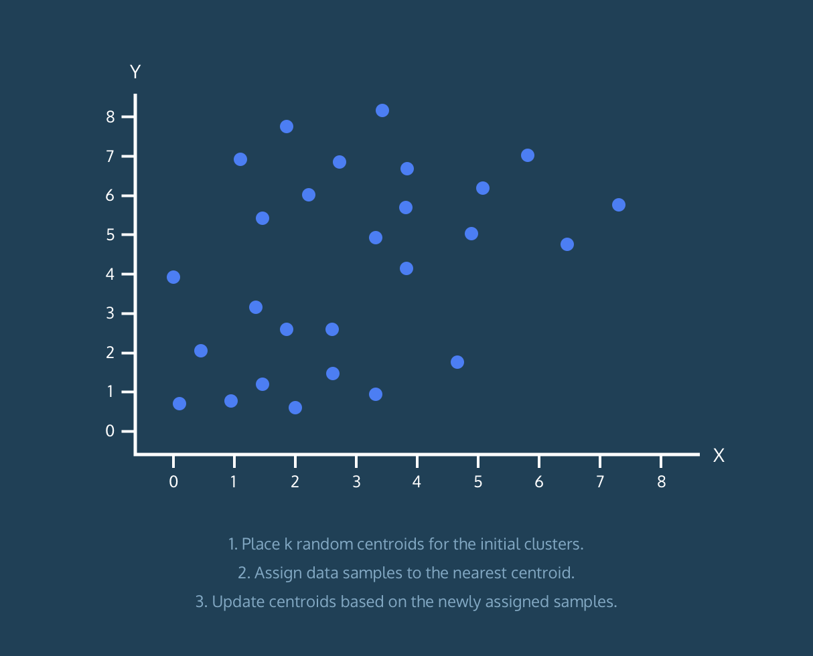
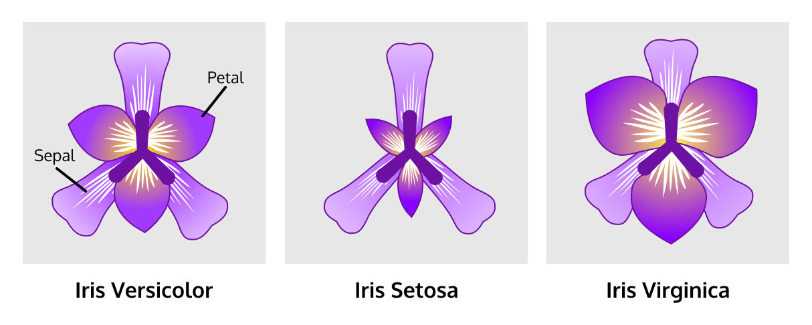
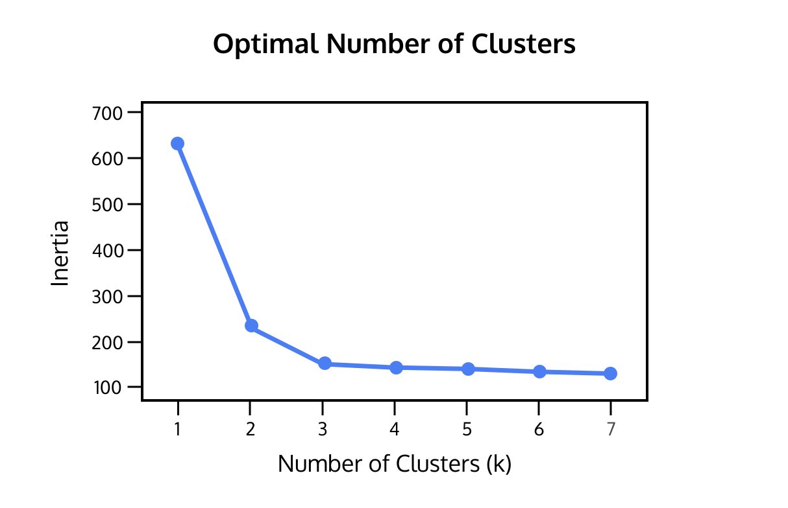
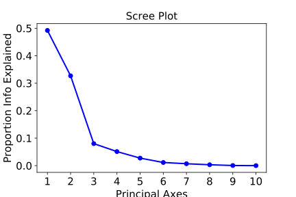
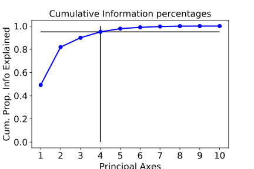
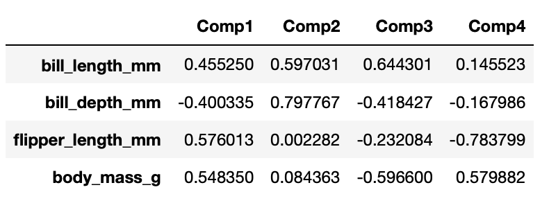
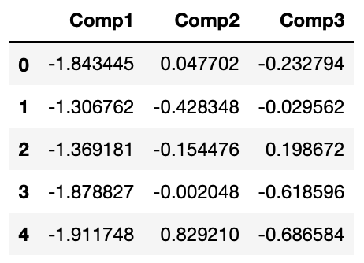
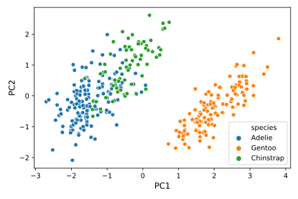

# 20 Unsupervised Learning Algorithms I

<br>

## Content 
- **K-Means Clustering**
    - **K-Means Clustering**
        - [Introduction to Clustering](#Introduction-to-Clustering)
        - [K-Means Clustering](#K-Means-Clustering)
        - [Iris Dataset](#Iris-Dataset)
        - [Visualize Before K-Means](#Visualize-Before-K-Means)
        - [Implementing K-Means: Steps](#Implementing-K-Means:-Steps)
        - [Implementing K-Means: Scikit-Learn](#Implementing-K-Means:-Scikit-Learn)
        - [New Data?](#New-Data?)
        - [Visualize After K-Means](#Visualize-After-K-Means)
        - [Evaluation](#Evaluation)
        - [The Number of Clusters](#The-Number-of-Clusters)
- **Principal Component Analysis**
    - [**Article: What is PCA?**](#Article:-What-is-PCA?)
    - **Implementing PCA in Python**
        - [Introduction to Implementing PCA](#Introduction-to-Implementing-PCA)
        - [Implementing PCA in NumPy I](#Implementing-PCA-in-NumPy-I)
        - [Implementing PCA in NumPy II - Analysis](#Implementing-PCA-in-NumPy-II---Analysis)
        - [Implementing PCA using Scikit-Learn](#Implementing-PCA-using-Scikit-Learn)
        - [Projecting the Data onto the principal Axes](#Projecting-the-Data-onto-the-principal-Axes)
        - [PCA as Features](#PCA-as-Features)
        - [PCA for Images I](#PCA-for-Images-I)
        - [PCA for Images II](#PCA-for-Images-II)
        - [Review: PCA](#Review:-PCA)

<br>

## Introduction to Clustering
- Often, the data you encounter in the real world won’t be sorted into categories and won’t have labeled answers to your question. 
- Finding patterns in this type of data, unlabeled data, is a common theme in many machine learning applications. 
- *Unsupervised Learning* is how we find patterns and structure in these data.
- **Clustering** is the most well-known unsupervised learning technique. 
- It finds structure in unlabeled data by identifying similar groups, or clusters. 
- Examples of clustering applications are:
    - **Recommendation engines**: group products to personalize the user experience
    - **Search engines**: group news topics and search results
    - **Market segmentation**: group customers based on geography, demography, and behaviors
    - **Image segmentation**: medical imaging or road scene segmentation on self-driving cars
    - **Text clustering**: group similar texts together based on word usage
- The *Iris* data set is a famous example of unlabeled data. 
- It consists of measurements of sepals and petals on 50 different iris flowers. 

<br>

## K-Means Clustering
- The goal of clustering is to separate data so that data similar to one another are in the same group, while data different from one another are in different groups. 
- So two questions arise:
    - How many groups do we choose?
    - How do we define similarity?
- *k-means* is the most popular and well-known clustering algorithm, and it tries to address these two questions.
    - The “k” refers to the number of clusters (groups) we expect to find in a dataset.
    - The “Means” refers to the average distance of data to each cluster center, also known as the *centroid*, which we are trying to minimize.
- It is an iterative approach:
    1. Place `k` random centroids for the initial clusters.
    2. Assign data samples to the nearest centroid.
    3. Calculate new centroids based on the above-assigned data samples.
    4. Repeat Steps 2 and 3 until convergence.
- *Convergence* occurs when points don’t move between clusters and centroids stabilize. 
- This iterative process of updating clusters and centroids is called training.
- Once we are happy with our clusters, we can take a new unlabeled datapoint and quickly assign it to the appropriate cluster. This is called inference.
- In practice it can be tricky to know how many clusters to look for. In the example here, the algorithm is sorting the data into `k=2` clusters.  
    

<br>

## Iris Dataset
- Before we implement the k-means algorithm, let’s find a dataset. 
- The sklearn package embeds some datasets and sample images. 
- One of them is the Iris dataset.
- The Iris dataset consists of measurements of sepals and petals of 3 different plant species:
    - *Iris setosa*
    - *Iris versicolor*
    - *Iris virginica*  

  

- The sepal is the part that encases and protects the flower when it is in the bud stage. A petal is a leaflike part that is often colorful.

<br>

- From `sklearn` library, import the `datasets` module:
    ```python
    from sklearn import datasets
    ```
- To load the Iris dataset:
    ```python
    iris = datasets.load_iris()
    ```
- The Iris dataset looks like:
    ```python
    [[ 5.1  3.5  1.4  0.2 ]
     [ 4.9  3.   1.4  0.2 ]
     [ 4.7  3.2  1.3  0.2 ]
     [ 4.6  3.1  1.5  0.2 ]
     . . .
     [ 5.9  3.   5.1  1.8 ]]
    ```
- We call each row of data a *sample*. 
- For example, each flower is one sample.
- Each characteristic we are interested in is a *feature*. 
- For example, petal length is a feature of this dataset.
- The features of the dataset are:
    - **Column 0**: Sepal length
    - **Column 1**: Sepal width
    - **Column 2**: Petal length
    - **Column 3**: Petal width

<br>

## Visualize Before K-Means
- To get a better sense of the data in the `iris.data` matrix, let’s visualize it!

<br>

- With Matplotlib, we can create a 2D scatter plot of the Iris dataset using two of its features (sepal length vs. petal length). 
- Of course there are four different features that we could plot, but it’s much easier to visualize only two dimensions.

<br>

- The sepal length measurements are stored in column `0` of the matrix, and the petal length measurements are stored in column `2` of the matrix.

<br>

- But how do we get these values?
- Suppose we only want to retrieve the values that are in column 0 of a matrix, we can use the NumPy/pandas notation `[:,0]` like so:
    ```python
    matrix[:,0]
    ```
- `[:,0]` can be translated to `[all_rows , column_0]`
- Once you have the measurements we need, we can make a scatter plot like this:
    ```python
    plt.scatter(x, y)
    ```

<br>

## Implementing K-Means: Steps
The K-Means algorithm:
1. Place `k` random centroids for the initial clusters.
2. Assign data samples to the nearest centroid.
3. Update centroids based on the above-assigned data samples.
4. Repeat Steps 2 and 3 until convergence.

<br>

## Implementing K-Means: Scikit-Learn
- Writing an algorithm whenever you need it can be very time-consuming and you might make mistakes and typos along the way. 
- We will now show you how to implement k-means more efficiently – using the [scikit-learn](https://scikit-learn.org/stable/) library.

<br>

- There are many advantages to using scikit-learn. 
- It can run k-means on datasets with as many features as your computer can handle, so it will be easy for us to use all four features of the iris data set instead of the two features that we used in the previous exercises.

<br>

- Another big advantage of scikit-learn is that it is a widely-used open-source library. 
- It is very well-tested, so it is much less likely to contain mistakes. 
- Since so many people use it, there are many online resources that can help you if you get stuck. 
- If you have a specific question about scikit-learn, it’s very likely that other users have already asked and answered your question on public forums.
- To import KMeans from sklearn.cluster:
    ```python
    from sklearn.cluster import KMeans
    ```
- For Step 1, use the `KMeans()` method to build a model that finds `k` clusters. 
- To specify the number of clusters (`k`), use the `n_clusters` keyword argument:
    ```python
    model = KMeans(n_clusters=k)
    ```
- For Steps 2 and 3, use the `.fit()` method to compute k-means clustering:
    ```python
    model.fit(x)
    ```
- After k-means, we can now predict the closest cluster each sample in X belongs to. 
- Use the .`predict()` method to compute cluster centers and predict cluster index for each sample:
    ```python
    model.predict(x)
    ```

<br>

## New Data?
- You used k-means and found three clusters of the samples data. But it gets cooler!
- Since you have created a model that computed k-means clustering, you can now feed new data samples into it and obtain the cluster labels using the `.predict()` method.
- So, suppose we went to the florist and bought 3 more Irises with the measurements:
    ```python	
    [[ 5.1  3.5  1.4  0.2 ]
     [ 3.4  3.1  1.6  0.3 ]
     [ 4.9  3.   1.4  0.2 ]]
    ```
- We can feed this new data into the model and obtain the labels for them.

<br>

## Visualize After K-Means
- We have done the following using sklearn library:
    - Load the embedded dataset
    - Compute k-means on the dataset (where `k` is 3)
    - Predict the labels of the data samples
- And the labels resulted in either `0`, `1`, or `2`.
- Let’s finish it by making a scatter plot of the data again!
- This time, however, use the `labels` numbers as the colors.
- To edit colors of the scatter plot, we can set `c = labels`:
    ```python
    plt.scatter(x, y, c=labels, alpha=0.5)

    plt.xlabel('sepal length (cm)')
    plt.ylabel('sepal width (cm)')
    ```

<br>

## Evaluation
- At this point, we have clustered the Iris data into 3 different groups (implemented using Python and using scikit-learn).
- But do the clusters correspond to the actual species? Let’s find out!
- First, remember that the Iris dataset comes with target values:
    ```python
    target = iris.target
    ```
- It looks like:
    ```python
    [ 0 0 0 0 0 ... 2 2 2]
    ```
- According to the metadata:
    - All the `0`‘s are *Iris-setosa*
    - All the `1`‘s are *Iris-versicolor*
    - All the `2`‘s are *Iris-virginica*
- Let’s change these values into the corresponding species using the following code:
    ```python
    species = [iris.target_names[t] for t in list(target)]
    ```
- Then we are going to use the Pandas library to perform a *cross-tabulation*.
- Cross-tabulations enable you to examine relationships within the data that might not be readily apparent when analyzing total survey responses.
- The result should look something like:
    ```python
    labels    setosa    versicolor    virginica
    0             50             0            0
    1              0             2           36
    2              0            48           14
    ```
- (You might need to expand this narrative panel in order to the read the table better.)
- The first column has the cluster labels. 
- The second to fourth columns have the Iris species that are clustered into each of the labels.
- By looking at this, you can conclude that:
    - *Iris-setosa* was clustered with 100% accuracy.
    - *Iris-versicolor* was clustered with 96% accuracy.
    - *Iris-virginica* didn’t do so well.
- Follow the instructions below to learn how to do a cross-tabulation.

<br>

## The Number of Clusters
- At this point, we have grouped the Iris plants into 3 clusters. 
- But suppose we didn’t know there are three species of Iris in the dataset, what is the best number of clusters? 
- And how do we determine that?
- Before we answer that, we need to define what is a *good* cluster?

<br>

- Good clustering results in tight clusters, meaning that the samples in each cluster are bunched together. 
- How spread out the clusters are is measured by inertia. 
- Inertia is the distance from each sample to the centroid of its cluster. 
- The lower the inertia is, the better our model has done.
- You can check the inertia of a model by:
    ```python
    print(model.inertia_)
    ```
- For the Iris dataset, if we graph all the `k`s (number of clusters) with their inertias:  
    
- Notice how the graph keeps decreasing.
- Ultimately, this will always be a trade-off. 
- If the inertia is too large, then the clusters probably aren’t clumped close together. 
- On the other hand, if there are too many clusters, the individual clusters might not be different enough from each other. 
- The goal is to have low inertia and a small number of clusters.

<br>

- One of the ways to interpret this graph is to use the elbow method: choose an “elbow” in the inertia plot - when inertia begins to decrease more slowly.
- In the graph above, 3 is the optimal number of clusters.

<br>

## Article: What is PCA?
- Watch [here](../Projects%20Section/020%20Unsupervised%20Learning%20Algorithms%20I/03%20Principal%20Component%20Analysis/Article_What_is_PCA.ipynb)

<br>

## Introduction to Implementing PCA
- In this lesson, we will be implementing Principal Component Analysis (PCA) using the Python libraries `NumPy` and `scikit-learn`.
- The motivation of Principal Component Analysis (PCA) is to find a new set of features that are ordered by the amount of variation (and therefore, information) they contain. 
- We can then select a subset of these PCA features. 
- This leaves us with lower-dimensional data that still retains most of the information contained in the larger dataset.

<br>

- In this lesson, we will:
    - Implement PCA in NumPy step-by-step
    - Implement PCA in scikit-learn using only a few lines of code
    - Use principal components to train a model
    - Visualize principal components using image data
- For the next few exercises, we will use a dataset that describes several types of dry beans separated into seven categories.

<br>

## Implementing PCA in NumPy I
- In this exercise, we will perform PCA using the NumPy `np.linalg.eig`, which performs eigendecomposition and outputs the eigenvalues and eigenvectors.
- The ***eigenvalues*** are related to the relative variation described by each principal component. 
- The ***eigenvectors*** are also known as the principal axes. They tell us how to transform (rotate) our data into new features that capture this variation.
- To implement this in Python:
    ```python	
    correlation_matrix = data_matrix.corr()
    eigenvalues, eigenvectors = np.linalg.eig(correlation_matrix).
    ```
1. First, we generate a correlation matrix using .`corr()`
2. Next, we use `np.linalg.eig()` to perform eigendecompostition on the correlation matrix. This gives us two outputs — the eigenvalues and eigenvectors.

<br>

## Implementing PCA in NumPy II - Analysis
- After performing PCA, we generally want to know how useful the new features are. 
- One way to visualize this is to create a scree plot, which shows the proportion of information described by each principal component.
- The proportion of information explained is equal to the relative size of each eigenvalue:
    ```python	
    info_prop = eigenvalues / eigenvalues.sum()
    print(info_prop)
    ```
- To create a scree plot, we can then plot these relative proportions:
    ```python
    plt.plot(np.arange(1,len(info_prop)+1), info_prop, 'bo-')
    plt.show()
    ```
    
- From this plot, we see that the first principal component explains about 50% of the variation in the data, the second explains about 30%, and so on.
- Another way to view this is to see how many principal axes it takes to reach around 95% of the total amount of information. Ideally, we’d like to retain as few features as possible while still reaching this threshold.
- To do this, we need to calculate the cumulative sum of the `info_prop` vector we created earlier:
    ```python
    cum_info_prop = np.cumsum(info_prop)
    ```
- We can then plot these values using matplotlib:
    ```python
    plt.plot(np.arange(1,len(info_prop)+1), cum_info_prop, 'bo-')
    plt.hlines(y=.95, xmin=0, xmax=15)
    plt.vlines(x=4, ymin=0, ymax=1)
    plt.show()
    ```
    
- From this plot, we see that four principal axes account for 95% of the variation in the data.

<br>

## Implementing PCA using Scikit-Learn
- Another way to perform PCA is using the scikit-learn module `sklearn.decomposition.PCA`.
- The steps to perform PCA using this method are:
    - Standardize the data matrix. This is done by subtracting the mean and dividing by the standard deviation of each column vector.
        ```python
        mean = data.mean(axis=0)
        sttd = data.std(axis=0)
        data_standardized = (data - mean) / sttd
        ```  	
    - Perform eigendecomposition by fitting the standardized data. We can access the eigenvectors using the `components_` attribute and the proportional sizes of the eigenvalues using the `explained_variance_ratio_` attribute.
        ```python
        pca = PCA()
        components = pca.fit(data_standardized).components_
        components = pd.DataFrame(components).transpose()
        components.index =  data_matrix.columns
        print(components)
        ```
        .
        ```python
        var_ratio = pca.explained_variance_ratio_
        var_ratio = pd.DataFrame(var_ratio).transpose()
        print(var_ratio)
        ```
- This module has many advantages over the NumPy method, including a number of different solvers to calculate the principal axes. 
- This can greatly improve the quality of the results.

<br>

## Projecting the Data onto the principal Axes
- Once we have performed PCA and obtained the eigenvectors, we can use them to project the data onto the first few principal axes.
- We can do this by taking the dot product of the data and eigenvectors, or by using the `sklearn.decomposition.PCA` module as follows:
    ```python
    from sklearn.decomposition import PCA

    # only keep 3 PCs
    pca = PCA(n_components = 3)

    # transform the data using the first 3 PCs
    data_pcomp = pca.fit_transform(data_standardized)

    # transform into a dataframe
    data_pcomp = pd.DataFrame(data_pcomp)

    # rename columns
    data_pcomp.columns = ['PC1', 'PC2', 'PC3']

    # print the transformed data
    print(data_pcomp.head())
    ```
    
- Once we have the transformed data, we can look at a scatter plot of the first two transformed features using seaborn or matplotlib. 
- This allows us to view relationships between multiple features at once in 2D or 3D space. 
- Often, the the first 2-3 principal components result in clustering of the data.
- Below, we’ve plotted the first two principal components for a dataset of measurements for three different penguin species:
    ```python
    sns.lmplot(x='PC1', y='PC2', data=data_pcomp, hue='species', fit_reg=False)
    plt.show()
    ```
    

<br>

## PCA as Features
- So far we have used PCA to find principal axes and project the data onto them. 
- We can use a subset of the projected data for modeling, while retaining most of the information in the original (and higher-dimensional) dataset.

<br>

- For example, recall in the previous exercise that the first four principal axes already contained 95% of the total amount of variance (or information) in the original data. 
- We can use the first four components to train a model, just like we would on the original 16 features.

<br>

- Because of the lower dimensionality, we should expect training times to be faster.
- Furthermore, the principal axes ensure that each new feature has no correlation with any other, which can result in better model performance.

<br>

- In this checkpoint, we will be using the first four principal components as our training data for a Support Vector Classifier (SVC). 
- We will compare this to a model fit with the entire dataset (16 features) using the average likelihood score. 
- Average likelihood is a model evaluation metric; the higher the average likelihood, the better the fit.

<br>

## PCA for Images I
- Another way to show the inner workings of PCA is to use an image dataset. 
- An image can be represented as a row in a data matrix, where each feature corresponds to the intensity of a pixel.

<br>

- In this and the following exercise, we will be using the Olivetti Faces image dataset. 
- We will begin by standardizing the images, and then observing the images of faces themselves.

<br>

- In the next exercise, we will then transform the original data using PCA and re-plot the images using a subset of the principal components. 
- This will allow us to visualize the mechanism by which PCA retains information in the data while reducing the dimensionality.

<br>

## PCA for Images II
- Now that we have cleaned up the data, we can perform PCA to retrieve the eigenvalues and eigenvectors.
- This can be useful in understanding how PCA works! 
- We can visualize the eigenvectors by plotting them. 
- They actually have a name: ***eigenfaces***. 
- The eigenfaces are the building blocks for all the other faces in the data.
- We can also visualize the dimensionality reduction that occurs when we transform the original data using a smaller number of principal components. In the, we’ve provided you with code to:
    - Plot the eigenfaces
    - Plot the reconstructed faces using a smaller number of transformed features. To start, we’ve used 400 principal components — only 0.9% of the original number of features (pixels)!

<br>

## Review: PCA
- In this lesson, we have seen how PCA can be implemented using NumPy and scikit-learn. 
- In particular, we have seen how:
    - Implementation: scikit-learn provides a more in-depth set of methods and attributes that extend the number of ways to perform PCA or display the percentage of variance for each principal axis.
    - Dimensionality reduction: We visualized the data projected onto the principal axes, known as principal components.
    - Image classification: We performed PCA on images of faces to visually understand how principal components still retain nearly all the information in the original dataset.
    - Improved algorithmic speed/accuracy: Using principal components as input to a classifier, we observed how we could achieve equal or better results with lower dimensional data. Having lower dimensionality also speeds the training.

