# 21 Supervised Learning Algorithms II: SVMs, Random Forest, Naive Bayes

<br>

## Content 
- **Support Vector Machines**
    - **Support Vector Machines**
        - [Introduction SVMs](#Introduction-SVMs)
        - [Optimal Decision Boundaries](#Optimal-Decision-Boundaries)
        - [Support Vectors and Margins](#Support-Vectors-and-Margins)
        - [SVM in scikit-learn](#SVM-in-scikit-learn)
        - [Outliers](#Outliers)
        - [Kernels](#Kernels)
        - [Polynomial Kernel](#Polynomial-Kernel)
        - [Radial Basis Function Kernel](#Radial-Basis-Function-Kernel)
        - [Review: SVMs](#Review-SVMs)
- **Random Forests**
    - **Random Forests**
        - [Basics of a Random Forest](#Basics-of-a-Random-Forest)
        - [Bootstrapping](#Bootstrapping)
        - [Bagging](#Bagging)
        - [Random Feature Selection](#Random-Feature-Selection)
        - [Bagging in `scikit-learn`](#Bagging-in-scikit-learn)
        - [Traing and Predict using `scikit-learn`](#Traing-and-Predict-using-scikit-learn)
        - [Random Forest Regressor](#Random-Forest-Regressor)
        - [Review: Random Forests](#Review-Random-Forests)

<br>

## Introduction SVMs
- A **Support Vector Machine** (SVM) is a powerful supervised machine learning model used for classification. 
- An SVM makes classifications by defining a decision boundary and then seeing what side of the boundary an unclassified point falls on. 
- In the next few exercises, we’ll learn how these decision boundaries get defined, but for now, know that they’re defined by using a training set of classified points. 
- That’s why SVMs are *supervised* machine learning models.

<br>

- Decision boundaries are easiest to wrap your head around when the data has two features. 
- In this case, the decision boundary is a line. 
- Take a look at the example below.  
    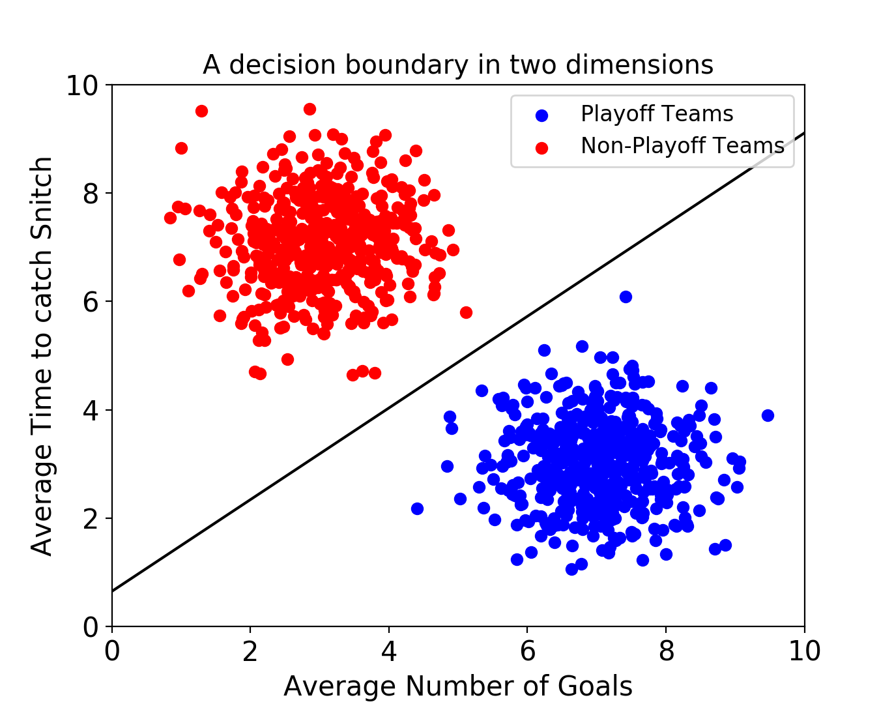
- Note that if the labels on the figures in this lesson are too small to read, you can resize this pane to increase the size of the images.

<br>

- This SVM is using data about fictional games of Quidditch from the Harry Potter universe! 
- The classifier is trying to predict whether a team will make the playoffs or not. 
- Every point in the training set represents a “historical” Quidditch team. 
- Each point has two features — the average number of goals the team scores and the average number of minutes it takes the team to catch the Golden Snitch.

<br>

- After finding a decision boundary using the training set, you could give the SVM an unlabeled data point, and it will predict whether or not that team will make the playoffs.

<br>

- Decision boundaries exist even when your data has more than two features. 
- If there are three features, the decision boundary is now a plane rather than a line.  
    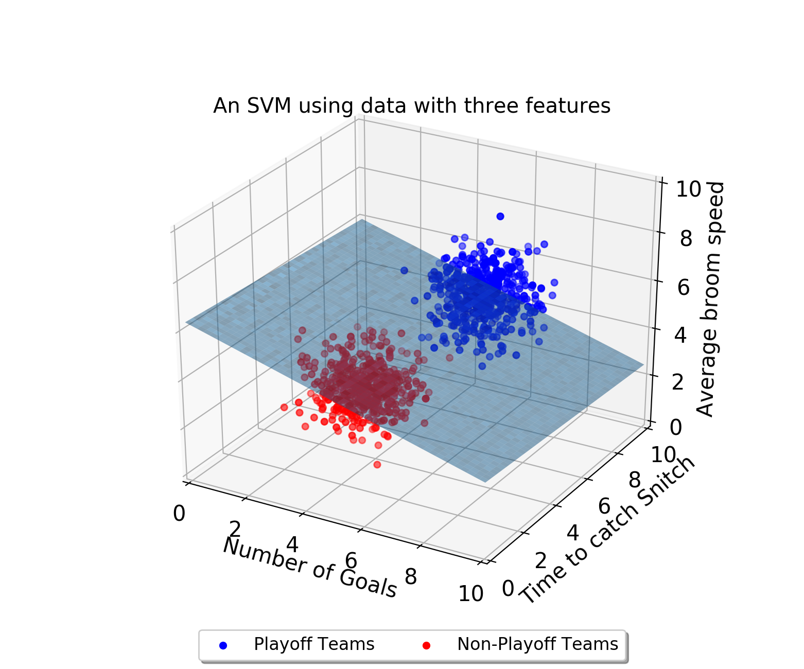
- As the number of dimensions grows past 3, it becomes very difficult to visualize these points in space.
- Nonetheless, SVMs can still find a decision boundary.
- However, rather than being a separating line, or a separating plane, the decision boundary is called a *separating hyperplane*.

<br>

## Optimal Decision Boundaries
- One problem that SVMs need to solve is figuring out what decision boundary to use. 
- After all, there could be an infinite number of decision boundaries that correctly separate the two classes. 
- Take a look at the image below:  
    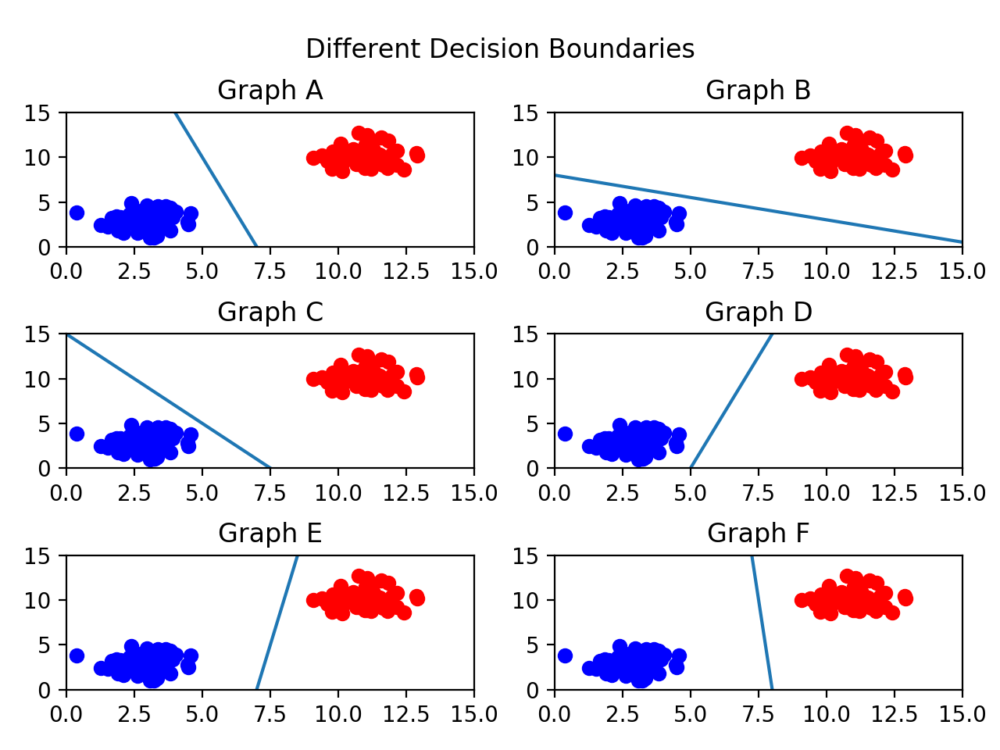
- There are so many valid decision boundaries, but which one is best? 
- In general, we want our decision boundary to be as far away from training points as possible.

<br>

- Maximizing the distance between the decision boundary and points in each class will decrease the chance of false classification. 
- Take graph C for example.  
    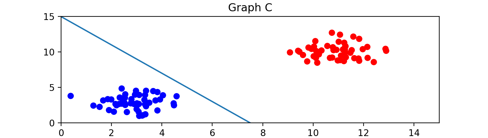
- The decision boundary is close to the blue class, so it is possible that a new point close to the blue cluster would fall on the red side of the line.
- Out of all the graphs shown here, graph F has the best decision boundary.

<br>

## Support Vectors and Margins
- We now know that we want our decision boundary to be as far away from our training points as possible. 
- Let’s introduce some new terms that can help explain this idea.

<br>

- The support vectors are the points in the training set closest to the decision boundary. 
- In fact, these vectors are what define the decision boundary. 
- But why are they called vectors? 
- Instead of thinking about the training data as points, we can think of them as vectors coming from the origin.  
    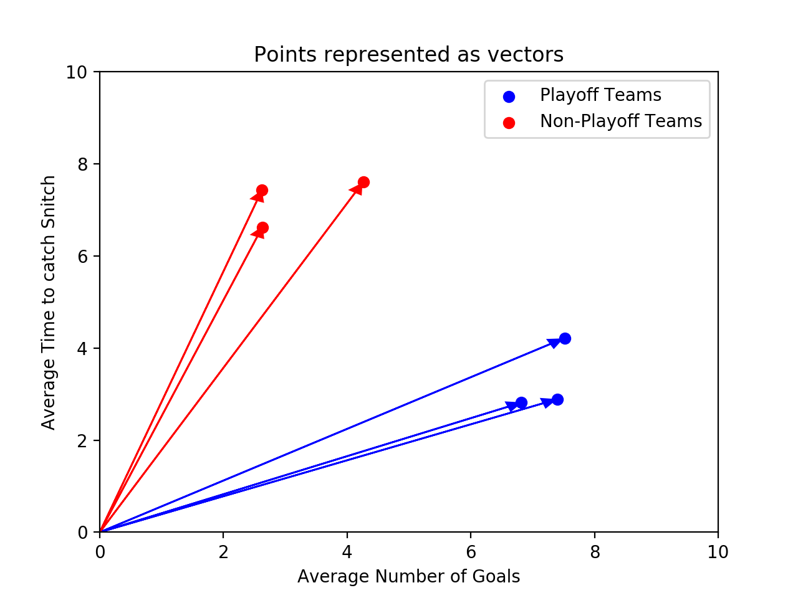
- These vectors are crucial in defining the decision boundary — that’s where the “support” comes from. 
- If you are using `n` features, there are at least `n+1` support vectors.

<br>

- The distance between a support vector and the decision boundary is called the *margin*. 
- We want to make the margin as large as possible. 
- The support vectors are highlighted in the image below:  
    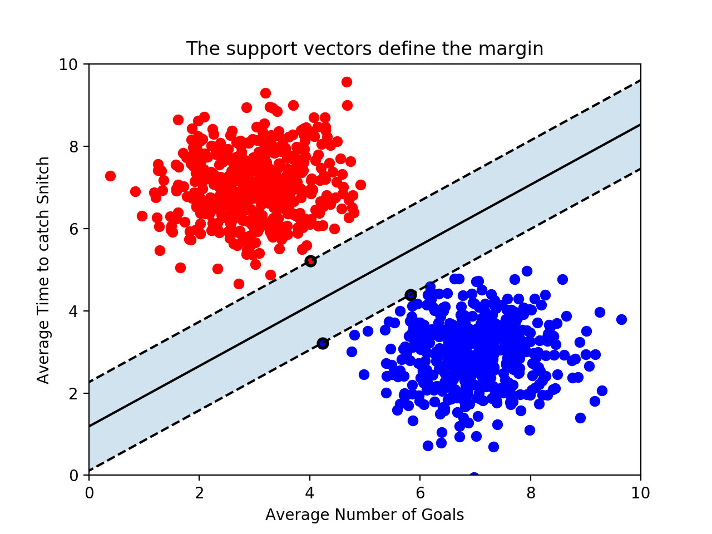
- Because the support vectors are so critical in defining the decision boundary, many of the other training points can be ignored. 
- This is one of the advantages of SVMs. 
- Many supervised machine learning algorithms use every training point in order to make a prediction, even though many of those training points aren’t relevant. 
- SVMs are fast because they only use the support vectors!

<br>

## SVM in scikit-learn
- Now that we know the concepts behind SVMs we need to write the code that will find the decision boundary that maximizes the margin. 
- All of the code that we’ve written so far has been guessing and checking — we don’t actually know if we’ve found the best line. 
- Unfortunately, calculating the parameters of the best decision boundary is a fairly complex optimization problem. 
- Luckily, Python’s scikit-learn library has implemented an SVM that will do this for us.

<br>

- Note that while it is not important to understand how the optimal parameters are found, you should have a strong conceptual understanding of what the model is optimizing.

<br>

- To use scikit-learn’s SVM we first need to create an SVC object.
- It is called an SVC because scikit-learn is calling the model a Support Vector Classifier rather than a Support Vector Machine.
    ```python	
    classifier = SVC(kernel = 'linear')
    ```
- We’ll soon go into what the `kernel` parameter is doing, but for now, let’s use a `'linear'` kernel.

<br>

- Next, the model needs to be trained on a list of data points and a list of labels associated with those data points. 
- The labels are analogous to the color of the point — you can think of a `1` as a red point and a 0 as a blue point. 
- The training is done using the `.fit()` method:
    ```python
    training_points = [[1, 2], [1, 5], [2, 2], [7, 5], [9, 4], [8, 2]]
    labels = [1, 1, 1, 0, 0, 0]
    classifier.fit(training_points, labels) 
    ```
- The graph of this dataset would look like this:  
    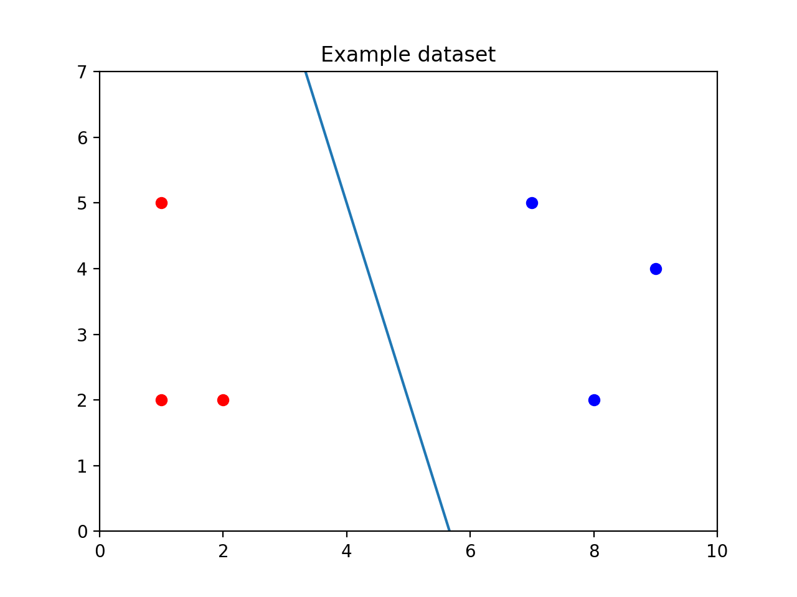
- Calling `.fit()` creates the line between the points.

<br>

- Finally, the classifier predicts the label of new points using the `.predict()` method. 
- The `.predict()` method takes a list of points you want to classify. 
- Even if you only want to classify one point, make sure it is in a list:
    ```python
    print(classifier.predict([[3, 2]]))
    ```
- In the image below, you can see the unclassified point `[3, 2]` as a black dot. 
- It falls on the red side of the line, so the SVM would predict it is red.  
    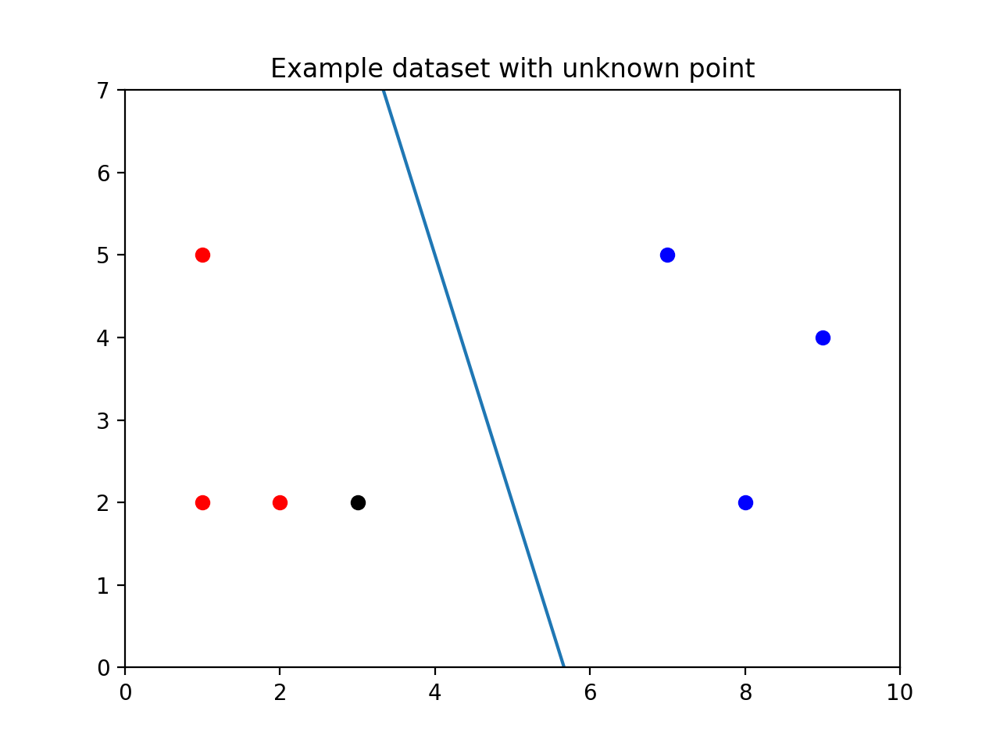
- In addition to using the SVM to make predictions, you can inspect some of its attributes. 
- For example, if you can print `classifier.support_vectors_` to see which points from the training set are the support vectors.
- In this case, the support vectors look like this:
    ```python
    print(classifier.support_vectors_)
    
    # Output
    [[7, 5],
     [8, 2],
     [2, 2]]
    ```

<br>

## Outliers
- SVMs try to maximize the size of the margin while still correctly separating the points of each class. 
- As a result, outliers can be a problem. 
- Consider the image below.  
    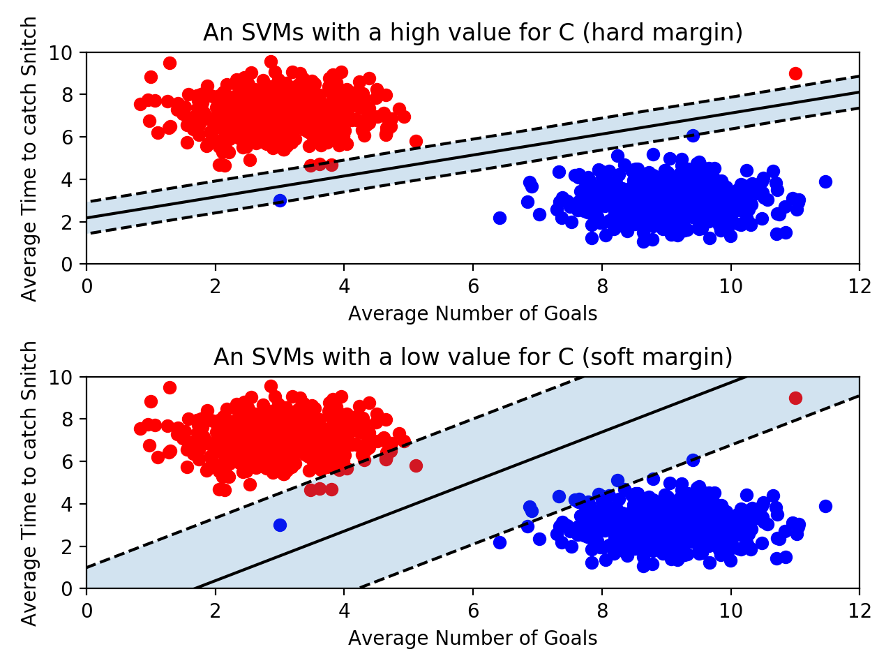
- The size of the margin decreases when a single outlier is present, and as a result, the decision boundary changes as well. 
- However, if we allowed the decision boundary to have some error, we could still use the original line.

<br>

- SVMs have a parameter `C` that determines how much error the SVM will allow for. 
- If `C` is large, then the SVM has a hard margin — it won’t allow for many misclassifications, and as a result, the margin could be fairly small. 
- If `C` is too large, the model runs the risk of overfitting. 
- It relies too heavily on the training data, including the outliers.

<br>

- On the other hand, if `C` is small, the SVM has a soft margin. 
- Some points might fall on the wrong side of the line, but the margin will be large. 
- This is resistant to outliers, but if `C` gets too small, you run the risk of underfitting. 
- The SVM will allow for so much error that the training data won’t be represented.

<br>

- When using scikit-learn’s SVM, you can set the value of `C` when you create the object:
    ```python
    classifier = SVC(C = 0.01)
    ```
- The optimal value of `C` will depend on your data. 
- Don’t always maximize margin size at the expense of error.
- Don’t always minimize error at the expense of margin size. 
- The best strategy is to validate your model by testing many different values for `C`.

<br>

## Kernels
- Up to this point, we have been using data sets that are linearly separable. 
- This means that it’s possible to draw a straight decision boundary between the two classes. 
- However, what would happen if an SVM came along a dataset that wasn’t linearly separable?  
    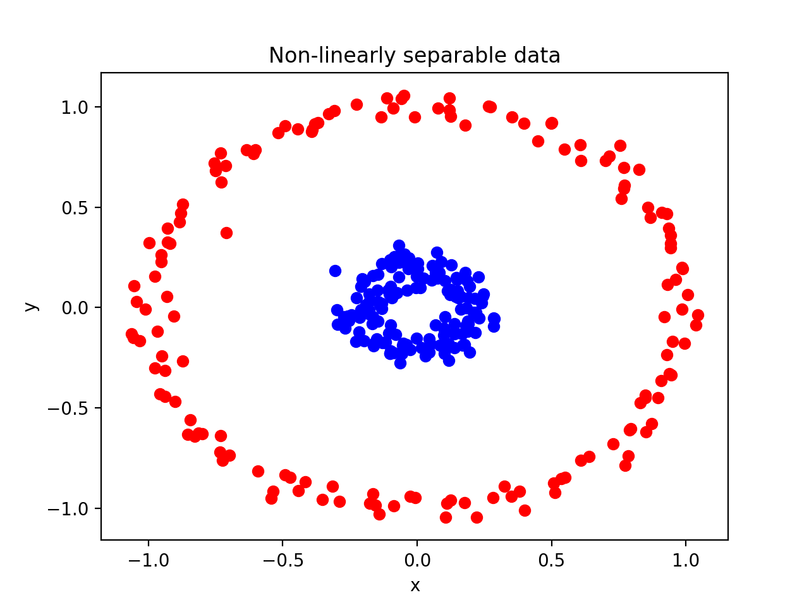
- It’s impossible to draw a straight line to separate the red points from the blue points!

<br>

- Luckily, SVMs have a way of handling these data sets. 
- Remember when we set `kernel = 'linear'` when creating our SVM? 
- Kernels are the key to creating a decision boundary between data points that are not linearly separable.

<br>

- Note, that most machine learning models should allow for some error. 
- For example, the image below shows data that isn’t linearly separable. 
- However, it is not linearly separable due to a few outliers.
- We can still draw a straight line that, for the most part, separates the two classes. 
- You shouldn’t need to create a non-linear decision boundary just to fit some outliers. 
- Drawing a line that correctly separates every point would be drastically overfitting the model to the data.
    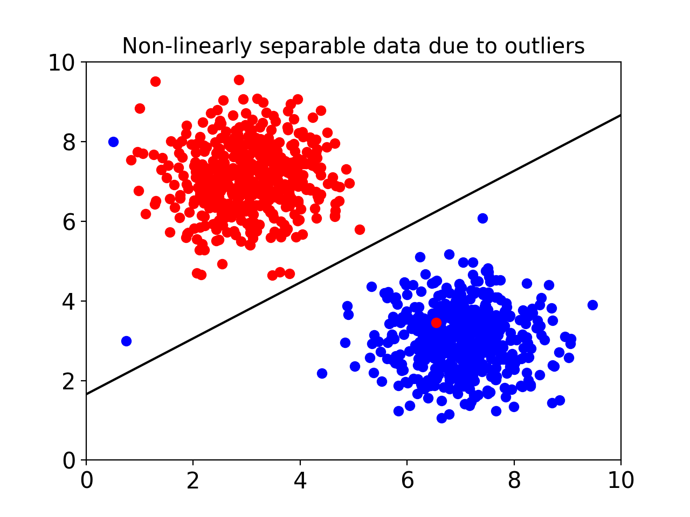

<br>

## Polynomial Kernel
- That kernel seems pretty magical. 
- It is able to correctly classify every point! 
- Let’s take a deeper look at what it was really doing.
- We start with a group of non-linearly separable points that looked like this:
    
- The kernel transforms the data in a clever way to make it linearly separable.
- We used a polynomial kernel which transforms every point in the following way:
$$ (x, y) \rightarrow (\sqrt{2} \cdot x \cdot y, x^2, y^2) $$
- The kernel has added a new dimension to each point! For example, the kernel transforms the point `[1, 2]` like this:
$$ (1, 2) \rightarrow (\sqrt{2} \cdot 1 \cdot 2, 1^2, 2^2) = (2\sqrt{2}, 1, 4) $$
- If we plot these new three dimensional points, we get the following graph:
    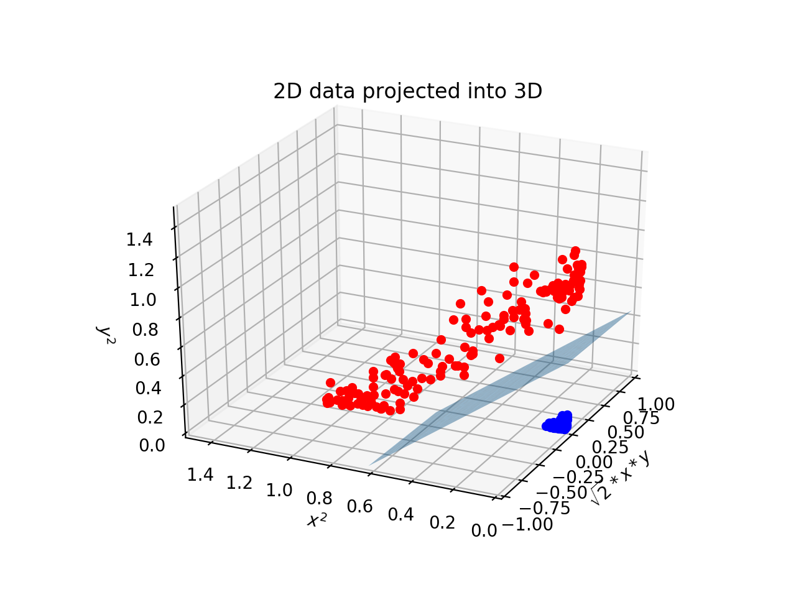
- All of the blue points have scooted away from the red ones. 
- By projecting the data into a higher dimension, the two classes are now linearly separable by a plane. 
- We could visualize what this plane would look like in two dimensions to get the following decision boundary.
    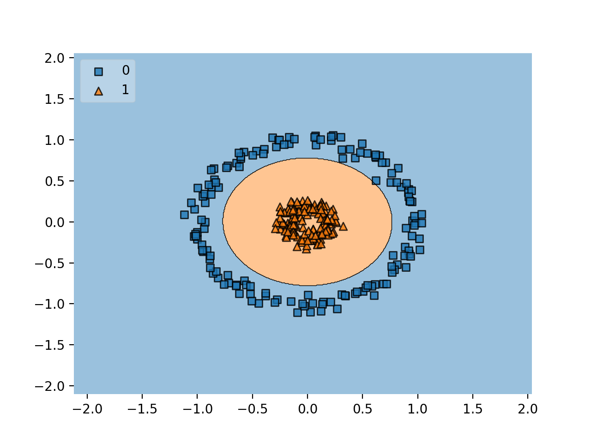

<br> 

## Radial Basis Function Kernel
- The most commonly used kernel in SVMs is a radial basis function (**rbf**) kernel.
-  This is the default kernel used in scikit-learn’s `SVC` object. 
- If you don’t specifically set the kernel to `"linear"`, `"poly"` the `SVC` object will use an rbf kernel. 
- If you want to be explicit, you can set `kernel = "rbf"`, although that is redundant.

<br>

- It is very tricky to visualize how an rbf kernel “transforms” the data. 
- The polynomial kernel we used transformed two-dimensional points into three-dimensional points. 
- An rbf kernel transforms two-dimensional points into points with an infinite number of dimensions!

<br>

- We won’t get into how the kernel does this — it involves some fairly complicated linear algebra. 
- However, it is important to know about the rbf kernel’s `gamma` parameter.
    ```python
    classifier = SVC(kernel = "rbf", gamma = 0.5, C = 2)
    ```
- `gamma` is similar to the `C` parameter. 
- You can essentially tune the model to be more or less sensitive to the training data. 
- A higher `gamma`, say `100`, will put more importance on the training data and could result in overfitting. 
- Conversely, A lower `gamma` like `0.01` makes the points in the training data less relevant and can result in underfitting.

<br>

## Review: SVMs
- SVMs are supervised machine learning models used for classification.
- An SVM uses support vectors to define a decision boundary. Classifications are made by comparing unlabeled points to that decision boundary.
- Support vectors are the points of each class closest to the decision boundary. The distance between the support vectors and the decision boundary is called the margin.
- SVMs attempt to create the largest margin possible while staying within an acceptable amount of error.
- The `C` parameter controls how much error is allowed. A large `C` allows for little error and creates a hard margin. A small `C` allows for more error and creates a soft margin.
- SVMs use kernels to classify points that aren’t linearly separable.
- Kernels transform points into higher dimensional space. A polynomial kernel transforms points into three dimensions while an rbf kernel transforms points into infinite dimensions.
- An rbf kernel has a `gamma` parameter. If `gamma` is large, the training data is more relevant, and as a result overfitting can occur.

<br>

## Basics of a Random Forest
- We’ve seen that [decision trees](019_Supervised_Learning_I_Regressors_Classifiers_and_Trees.md)** can be powerful supervised machine learning models. 
- However, they’re not without their weaknesses — decision trees are often prone to overfitting. 
- We’ve discussed some strategies to minimize this problem, like pruning, but sometimes that isn’t enough. 
- We need to find another way to generalize our trees. 
- This is where the concept of a random forest comes in handy.

<br>

- A random forest is an *ensemble machine learning technique*. 
- A random forest contains many decision trees that all work together to classify new points. 
- When a random forest is asked to classify a new point, the random forest gives that point to each of the decision trees. 
- Each of those trees reports their classification and the random forest returns the most popular classification. 
- It’s like every tree gets a vote, and the most popular classification wins.
- Some of the trees in the random forest may be overfit, but by making the prediction based on a large number of trees, overfitting will have less of an impact.

<br>

- ** *A prerequisite for this lesson is the understanding of decision trees*. Be sure to revisit the decision trees module if needed!

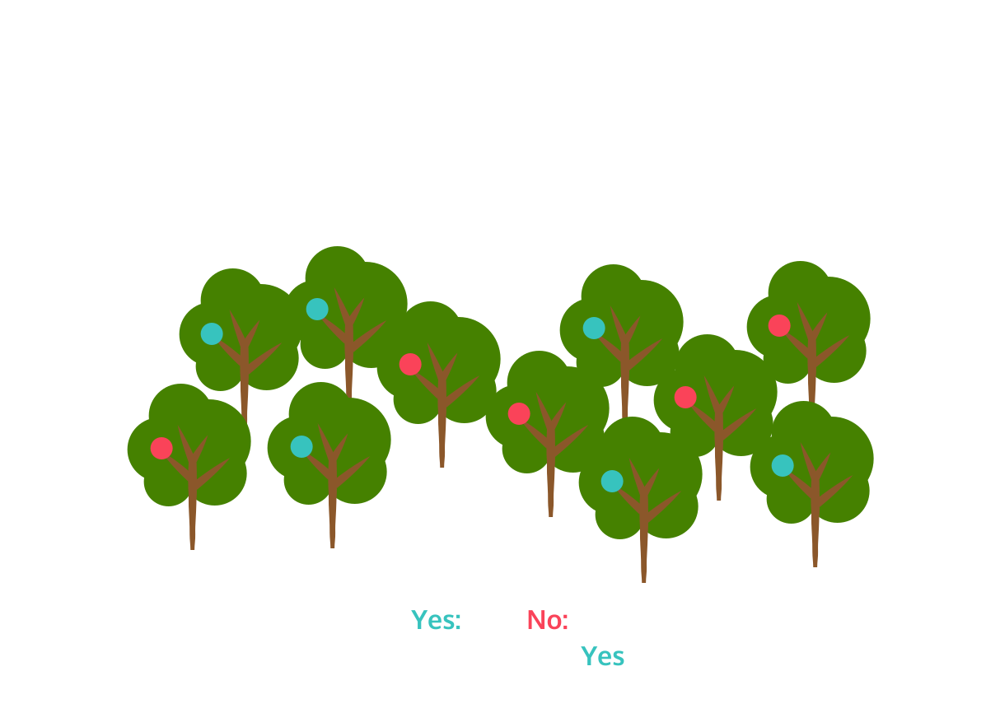

<br>

## Bootstrapping
- You might be wondering how the trees in the random forest get created. 
- After all, right now, our algorithm for creating a decision tree is deterministic — given a training set, the same tree will be made every time. 
- To make a random forest, we use a technique called *bagging*, which is short for *bootstrap aggregating*. 
- This exercise will explain bootstrapping, which is a type of sampling method done with replacement.

<br>

- How it works is as follows: 
    - every time a decision tree is made, it is created using a different subset of the points in the training set. 
    - For example, if our training set had `1000` rows in it, we could make a decision tree by picking `100` of those rows at random to build the tree.
    -  This way, every tree is different, but all trees will still be created from a portion of the training data.

<br>

- In bootstrapping, we’re doing this process *with replacement*.
- Picture putting all `100` rows in a bag and reaching in and grabbing one row at random. 
- After writing down what row we picked, we put that row back in our bag.
-  This means that when we’re picking our `100` random rows, we could pick the same row more than once. 
- In fact, it’s very unlikely, but all `100` randomly picked rows could all be the same row! 
- Because we’re picking these rows with replacement, there’s no need to shrink our bagged training set from 1000 rows to `100`. 
- We can pick 1000 rows at random, and because we can get the same row more than once, we’ll still end up with a unique data set.

<br>

- We’ve loaded a dataset about cars here. 
- An important field within the dataset is the safety rating, which tells us how crash/rollover resistant a car is, in other words, how safe the car is.
- The `safety` variable can be either “low”, “med”, or “high.” 
- We’re going to implement bootstrapping and estimate the average safety rating across the different bootstrapped samples.

<br>

- Here is a list of the variables in the car evaluation dataset.
    | Variable | Description |
    | --- | --- |
    | safety | estimated safety of the car (low, med, or high) |
    | buying | buying price |
    | maint | price of the maintenance |
    | doors | number of doors |
    | persons | capacity in terms of persons to carry |
    | lug_boot | the size of luggage boot |
    | accep | evaulation level (unacceptable, acceptable, good, very good) |

<br>

## Bagging
- Random forests create different trees using a process known as bagging, which is short for bootstrapped aggregating. 
- As we already covered bootstrapping, the process starts with creating a single decision tree on a bootstrapped sample of data points in the training set. 
- Then after many trees have been made, the results are “aggregated” together. 
- In the case of a classification task, often the aggregation is taking the majority vote of the individual classifiers. 
- For regression tasks, often the aggregation is the average of the individual regressors.

<br>

- We will dive into this process for the cars dataset we used in the previous exercise.
- The dataset has six features:
    - `buying`: car price as a categorical variable: “vhigh”, “high”, “med”, or “low”
    - `maint`: cost of maintaining the car; can be “vhigh”, “high”, “med”, or “low”.
    - `doors`: number of doors; can be “2”, “3”, “4”, “5more”.
    - `persons`: number of people the car can hold; can be “2”, “4”, or “more”.
    - `lugboot`: size of the trunk; can be “small”, “med”, or “big”.
    - `safety`: safety rating of the car; can be “low”, “med”, or “high”

<br>

## Random Feature Selection
- In addition to using bootstrapped samples of our dataset, we can continue to add variety to the ways our trees are created by randomly selecting the features that are used.
- Recall that for our car data set, the original features were the following:
    - The price of the car which can be “vhigh”, “high”, “med”, or “low”.
    - The cost of maintaining the car which can be “vhigh”, “high”, “med”, or “low”.
    - The number of doors which can be “2”, “3”, “4”, “5more”.
    - The number of people the car can hold which can be “2”, “4”, or “more”.
    - The size of the trunk which can be “small”, “med”, or “big”.
    - The safety rating of the car which can be “low”, “med”, or “high”
- Our target variable for prediction is an acceptability rating, `accep`, that’s either `True` or `False`. 
- For our final features sets, `x_train` and `x_test`, the categorical features have been dummy encoded, giving us 15 features in total.

<br>

- When we use a decision tree, all the features are used and the split is chosen as the one that increases the information gain the most. 
- While it may seem counter-intuitive, selecting a random subset of features can help in the performance of an ensemble model. 
- In the following example, we will use a random selection of features prior to model building to add additional variance to the individual trees.
- While an individual tree may perform worse, sometimes the increases in variance can help model performance of the ensemble model as a whole.

<br>

## Bagging in `scikit-learn`
- The two steps we walked through above created trees on bootstrapped samples and randomly selecting features. 
- These can be combined together and implemented at the same time! 
- Combining them adds an additional variation to the base learners for the ensemble model. 
- This in turn increases the ability of the model to generalize to new and unseen data, i.e., it minimizes bias and increases variance. 
- Rather than re-doing this process manually, we will use `scikit-learn`‘s bagging implementation, `BaggingClassifier()`, to do so.

<br>

- Much like other models we have used in `scikit-learn`, we instantiate a instance of `BaggingClassifier()` and specify the parameters. 
- The first parameter, `base_estimator` refers to the machine learning model *that is being bagged*. 
- In the case of random forests, the *base estimator* would be a *decision tree*. 
- We are going to use a decision tree classifier WITH a `max_depth` of 5, this will be instantiated with `BaggingClassifier(DecisionTreeClassifier(max_depth=5))`.

<br>

- After the model has been defined, methods `.fit()`, `.predict()`, `.score()` can be used as expected. 
- Additional hyperparameters specific to bagging include the number of estimators (`n_estimators`) we want to use and the maximum number of features we’d like to keep (`max_features`).

<br>

- *Note*: While we have focused on decision tree classifiers (as this is the base learner for a random forest classifier), this procedure of bagging is not specific to decision trees, and in fact can be used for any base classifier or regression model. 
- The scikit-learn implementation is generalizable and can be used for other base models!

<br>

## Traing and Predict using `scikit-learn`
- Now that we have covered two major ways to combine trees, both in terms of samples and features, we are ready to get to the implementation of random forests! 
- This will be similar to what we covered in the previous exercises, but the random forest algorithm has a slightly different way of randomly choosing features. 
- Rather than choosing a single random set at the onset, each split chooses a different random set.

<br>

- For example, when finding which feature to split the data on the first time, we might randomly choose to only consider the price of the car, the number of doors, and the safety rating. 
- After splitting the data on the best feature from that subset, we’ll likely want to split again. 
- For this next split, we’ll randomly select three features again to consider. 
- This time those features might be the cost of maintenance, the number of doors, and the size of the trunk.
-  We’ll continue this process until the tree is complete.

<br>

- One question to consider is how to choose the number of features to randomly select. 
- Why did we choose 3 in this example? A good rule of thumb is select as many features as *the square root of the total number of features*. 
- Our car dataset doesn’t have a lot of features, so in this example, it’s difficult to follow this rule. 
- But if we had a dataset with 25 features, we’d want to randomly select 5 features to consider at every split point.

<br>

- You now have the ability to make a random forest using your own decision trees. 
- However, `scikit-learn` has a `RandomForestClassifier()` class that will do all of this work for you! 
- `RandomForestClassifier` is in the `sklearn.ensemble module`.

<br>

- `RandomForestClassifier()` works almost identically to `DecisionTreeClassifier()` — the `.fit()`, `.predict()`, and `.score()` methods work in the exact same way.

<br>

## Random Forest Regressor
- Just like in decision trees, we can use random forests for regression as well! 
- It is important to know when to use regression or classification — this usually comes down to what type of variable your target is. 
- Previously, we were using a binary categorical variable (acceptable versus not), so a classification model was used.

<br>

- We will now consider a hypothetical new target variable, price, for this data set, which is a continuous variable. 
- We’ve generated some fake prices in the dataset so that we have numerical values instead of the previous categorical variables. 
- (Please note that these are not reflective of the previous categories of high and low prices - we just wanted some numeric values so we can perform regression! :) )

<br>

- Now, instead of a classification task, we will use `scikit-learn`‘s `RandomForestRegressor()` to carry out a regression task.

<br>

- Note: Recall that the default evaluation score for regressors in `scikit-learn` is the R-squared score.

<br>

## Review: Random Forests
- Here are some of the major takeaways about random forests:
    - A random forest is an ensemble machine learning model. It makes a classification by aggregating the classifications of many decision trees.
    - Random forests are used to avoid overfitting. By aggregating the classification of multiple trees, having overfitted trees in a random forest is less impactful.
    - Every decision tree in a random forest is created by using a different subset of data points from the training set. Those data points are chosen at random with replacement, which means a single data point can be chosen more than once. This process is known as bagging.
    - When creating a tree in a random forest, a randomly selected subset of features are considered as candidates for the best splitting feature. If your dataset has n features, it is common practice to randomly select the square root of n features.


<br>