# 23 Deep Learning and Neural Networks

<br>

## Content 
- **Introduction to Deep Learning for NLP**
    - **Article: What is Deep Learning?**
        - [What is Deep Learning?](#what-is-deep-learning)
        - [Deep Learning vs Machine Learning](#deep-learning-vs-machine-learning)
        - [What does "deep" mean?](#what-does-deep-mean)
        - [High Volume of Data](#high-volume-of-data)
        - [With Deep Learning Comes Deep Responsibility](#with-deep-learning-comes-deep-responsibility)
        - [Graphics Processing Units](#graphics-processing-units)
    - **Deep Learning Math**
        - [Scalars, Vectors, and Matrices](#scalars-vectors-and-matrices)
        - [Tensors](#tensors)
        - [Matrix Algebra](#matrix-algebra)
        - [Neural Networks Concept Overview](#neural-networks-concept-overview)
        - [The Math Behind the Journey!](#the-math-behind-the-journey)
        - [Loss Functions](#loss-functions)
        - [Backpropagation](#backpropagation)
        - [Gradient Descent](#gradient-descent)
        - [Stochastic Gradient Descent](#stochastic-gradient-descent)
        - [More Variants of Gradient Descent](#more-variants-of-gradient-descent)
        - [Review: Deep Learning Math](#review-deep-learning-math)
    - **Dangers of the Black Box**
        - [What Makes Deep Learning Models Dangerous?](#what-makes-deep-learning-models-dangerous)
        - [When to Use Them](#when-to-use-them)
        - [Misconceptions](#misconceptions)
        - [Key Issues](#key-issues)
        - [More Examples](#more-examples)
        - [Personal Responsibility](#personal-responsibility)
        - [Interpretability and Transparency](#interpretability-and-transparency)
- **Perceptrons**
    - **Article: What are Neural Networks**
        - [Understanding Neural Networks](#understanding-neural-networks)
        - [The Birth of an Artificial Neuron](#the-birth-of-an-artificial-neuron)
        - [More Neurons](#more-neurons)
    - **Perceptron**
        - [What is a Perceptron?](#what-is-a-perceptron)
        - [Representing a Perceptron](#representing-a-perceptron)
        - [Step 1: Weighted Sum](#step-1-weighted-sum)
        - [Step 2: Activation Function](#step-2-activation-function)
        - [Training the Perceptron](#training-the-perceptron)
        - [Training Error](#training-error)
        - [Tweaking the Weights](#tweaking-the-weights)
        - [The Perceptron Algorithm](#the-perceptron-algorithm)
        - [The Bias Weight](#the-bias-weight)
        - [Representing a Line](#representing-a-line)
        - [Finding a Linear Classifier](#finding-a-linear-classifier)

<br>

## What is Deep Learning?
- Have you ever wondered what powers ChatGPT? 
- What technology developers are using to create self-driving cars? 
- How your phone can recognize faces? 
- Why it seems like your photos app is better at recognizing your friends’ faces than even you can? 
- What is behind all of this? Is it magic? Well, not exactly; it is a powerful technology called deep learning (DL). 

<br>

## Deep Learning vs Machine Learning
- First, let’s focus on *learning*. 
- If you have come across *machine learning* before, you might be familiar with the concept of a learning model. 
- Learning describes the process by which models analyze data and finds patterns. 
- A machine learning algorithm learns from patterns to find the best representation of this data, which it then uses to make predictions about new data that it has never seen before.
- Deep learning is a subfield of machine learning, and the concept of learning is pretty much the same.
    - We create our model carefully
    - Throw relevant data at it
    - Train it on this data
    - Have it make predictions for data it has never seen
- Deep learning models are used with many different types of data, such as text, images, audio, and more, making them applicable to many different domains.

<br>

## What does "deep" mean?
- That leaves the question: what is this “deep” aspect of deep learning? 
- It separates deep learning from typical machine learning models and why it is a powerful tool that is becoming more prevalent in today’s society.
- The deep part of deep learning refers to the numerous “layers” that transform data. 
- This architecture mimics the structure of the brain, where each successive layer attempts to learn progressively complex patterns from the data fed into the model. 
- This may seem a bit abstract, so let’s look at a concrete example, such as facial recognition. 
- With facial recognition, a deep learning model takes in a photo as an input, and numerous layers perform specific steps to identify whose face is in the picture.
- The steps taken by each layer might be the following:
    1. Find the face within the image using edge detection.
    2. Analyze the facial features (eyes, nose, mouth, etc.).
    3. Compare against faces within a repository.
    4. Output a prediction!
- This structure of many abstract layers makes deep learning incredibly powerful. 
- Feeding high volumes of data into the model makes the connections between layers more intricate. 
- Deep learning models tend to perform better with more massive amounts of data than other learning algorithms.

<br>

## High Volume of Data
- Notice that without large amounts of data, deep learning models are no more powerful (and maybe even less accurate) than less complex learning models. 
- However, with large amounts of data, deep learning models can improve performance to the point that they outperform humans in tasks such as classifying objects or faces in images or driving.
- Deep learning is fundamentally a future learning system (also known as representation learning).
- It learns from raw data without human intervention.
- Hence, given massive amounts of data, a deep learning system will perform better than traditional machine learning systems that rely on feature extractions from developers.  

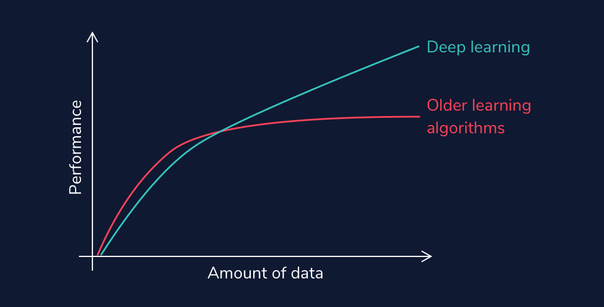

- Autonomous vehicles, such as Tesla, have to process thousands, even millions of stop signs, to understand that cars are supposed to stop when they see a red hexagon with “Stop” written on them (and this is only for U.S. stop signs!). 
- Think about the enormous number of situations a self-driving vehicle must train on to ensure safety.

<br>

## With Deep Learning Comes Deep Responsibility
- Even beyond identifying objects, deep learning models can generate audio and visual content that is deceivingly real. 
- They can modify existing images, such as in this cool applet that allows you to add in trees or alter buildings in a set of photos. 
- However, they can have a darker side. 
- DL models can produce artificial media in which the identity of someone in an image, video, or audio is replaced with someone else. 
- These are known as *deepfakes*, and they can have scary implications, such as financial fraud and the distribution of fake news and hoaxes.

<br>

## Graphics Processing Units
- One final thing to note about deep learning is that with large amounts of data and layers of complexity, you may imagine that this takes a lot of time and processing power. 
- That intuition would be correct. These models often require high-performance GPUs (graphics processing units) to run in a reasonable amount of time. 
- These processors have a large memory bandwidth and can process multiple computations simultaneously.
- CPUs can run deep learning models as well; however, they will be much slower.

<br>

- The development of GPUs has been critical to the success of deep learning. 
- It is interesting to note that one of the driving factors for this development was not the need for better deep learning tools, but the demand for better video game graphics. 
- It just so happened that GPUs are perfect for processing large datasets.
-  This makes them a perfect tool for learning models and has put deep learning specifically at the forefront of machine learning conversations.

<br>

---

<br>

## Scalars, Vectors, and Matrices
- To start, let us go over a couple of topics that will be integral to understanding the mathematical operations that are present in deep learning, including how data is represented:
    - **Scalars:** 
        - A scalar is a single quantity that you can think of as a number. 
        - In machine learning models, we can use scalar quantities to manipulate data, and we often modify them to improve our model’s accuracy. 
        - We can also represent data as scalar values depending on what dataset we are working with.
            ```py
            x = 5
            ```
    - **Vectors:**
        - Vectors are arrays of numbers. 
        - In Python, we often denote vectors as NumPy arrays. 
        - Each value in the array can be identified by its index (location within the array).
            ```py
            x = np.array([1, 2, 3])
            ```
    - **Matrices:**
        - Matrices are grids of information with rows and columns. 
        - We can index a matrix just like an array; however, when indexing on a matrix, we need two arguments: one for the row and one for the column.
            ```py
            x = np.array([[1, 2, 3],[4, 5, 6],[7, 8, 9]])
            ```

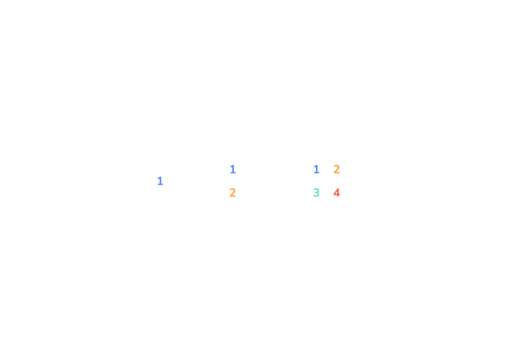

<br>

## Tensors
- *Scalars*, *vectors*, and *matrices* are foundational objects in linear algebra. 
- Understanding the different ways they interact with each other and can be manipulated through matrix algebra is integral before diving into deep learning. 
- This is because the data structure we use in deep learning is called a tensor, which is a generalized form of a vector and matrix: a multidimensional array.
- A tensor allows for more flexibility with the type of data you are using and how you can manipulate that data.

<br>

## Matrix Algebra
- The following gifs walkthrough matrix multiplication, addition, and transpose. 
- You can perform element-wise operations on tensors using matrix algebra as well, which you can read more about [here](https://en.wikipedia.org/wiki/Matrix_(mathematics)#Addition,_scalar_multiplication,_and_transposition).
- *Matrix Addition*:  
    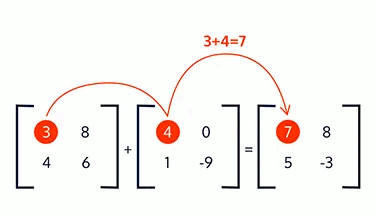
- *Scalar Multiplication*:  
    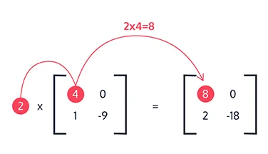
- *Matrix Multiplication*:
    - This is the most complicated, so spend time understanding how it is done in Animation below.  
    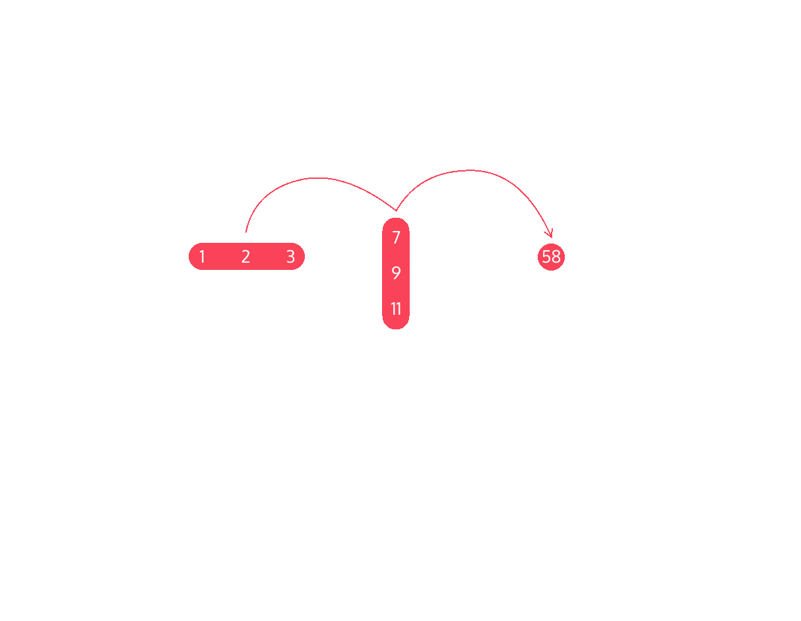
- *Transpose*:  
    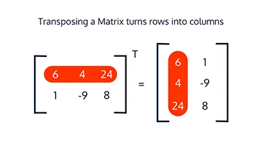
    - This is all of the matrix algebra we need to proceed with the rest of our deep learning investigation! 
    - These concepts are the fundamental building blocks of why deep learning models are so powerful. 
    - When we are training our models, we are performing operations on tensors. 
    - This data is analyzed, manipulated, and shaped by the matrix algebra we have quickly gone over.

<br>

## Neural Networks Concept Overview
- Let’s take a look at the journey our *inputs* take inside of a neural network! 
- By an input, we mean a data point from our dataset. 
- Our input can have many different features, so in our *input layer*, each node represents a different input feature. 
- For example, if we were working with a dataset of different types of food, some of our features might be size, shape, nutrition, etc., where the value for each of these features would be held in an input node.
- Besides an input layer, our neural network has two other different types of layers:
    - *Hidden layers*
        -  are layers that come between the input layer and the output layer. 
        - They introduce complexity into our neural network and help with the learning process. 
        - You can have as many hidden layers as you want in a neural network (including zero of them).
    - *Output layers*
        - is the final layer in our neural network. 
        - It produces the final result, so every neural network must have only one output layer.
- Each layer in a neural network contains nodes. 
- Nodes between each layer are connected by *weights*. 
- These are the learning parameters of our neural network, determining the strength of the connection between each linked node.

<br>

- The weighted sum between nodes and weights is calculated between each layer. 
- For example, from our input layer, we take the weighted sum of the inputs and our weights with the following equation:
$$ weighted\_sum = (inputs \cdot weight_transpose) + bias $$
- We then apply an activation function to it.
$$ Activation(weighted\_sum) $$
- The two formulas we have gone over take all the inputs through one layer of a neural network. 
- Aside from the activation function, all of the transformations we have done so far are linear. 
- Activation functions introduce nonlinearity in our learning model, creating more complexity during the learning process.

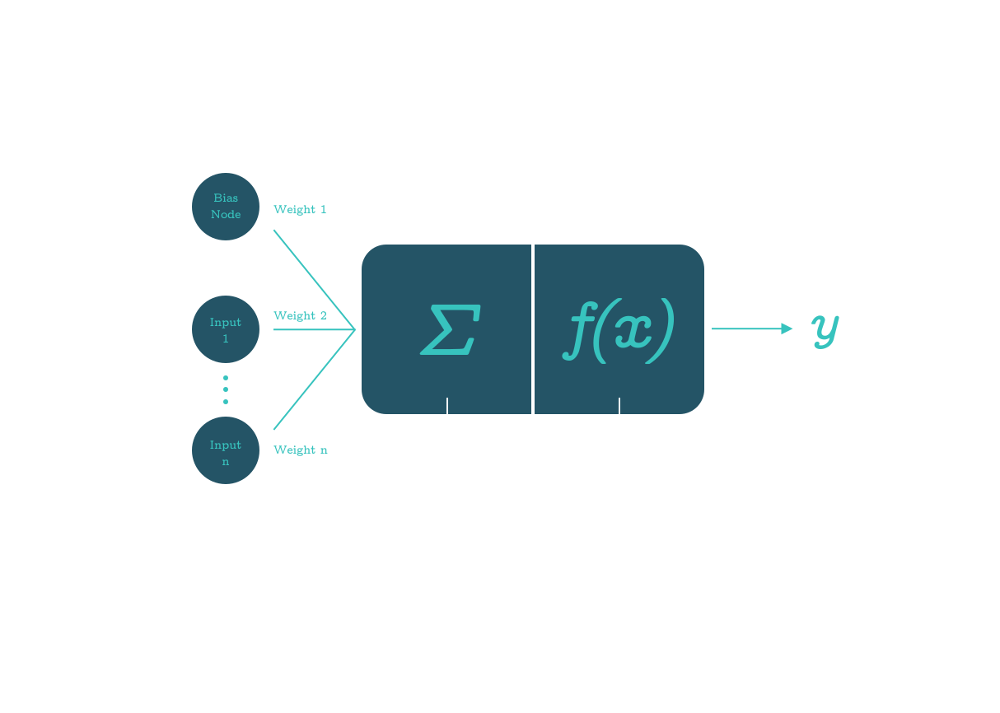

- This is what makes activation functions important. 
- A neural network with many hidden layers but no activation functions would just be a series of successive layers that would be no more effective or accurate than simple linear regression.

<br>

- An activation function decides what is fired to the next neuron based on its calculation for the weighted sums. 
- Various types of activation functions can be applied at each layer. 
- The most popular one for hidden layers is *ReLU*.  
    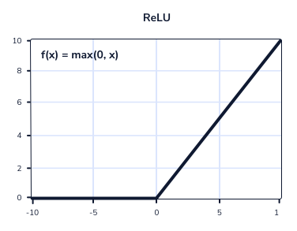
- Others commonly used, often for the output layer, are *sigmoid* and *softmax*. 
- You will learn more about these functions as you use them later in this course.
    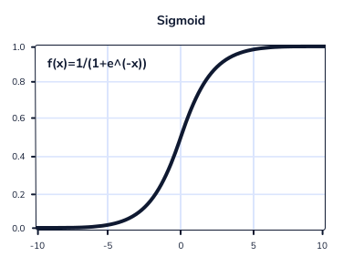

<br>

## The Math Behind the Journey!
- Let’s bring all of these concepts together and see how they function in a neural network with one hidden layer. 
- As you scroll over each section, you will see the inputs/weights/calculations associated with it and see how inputs get from the starting point and make their way to the end!
- The process we have been going through is known as *forward propagation*. Inputs are moved forward from the input layer through the hidden layer(s) until they reach the output layer.


<br>

## Loss Functions
- We have seen how we get to an output! Now, what do we do with it? 
- When a value is outputted, we calculate its error using a loss function. 
- Our predicted values are compared with the actual values within the training data. 
- There are two commonly used loss calculation formulas:
    - *Mean squared error (MSE)*
        -  which is most likely familiar to you if you have come across linear regression. 
        - This gif below shows how mean squared error is calculated for a line of best fit in *linear regression*.  
            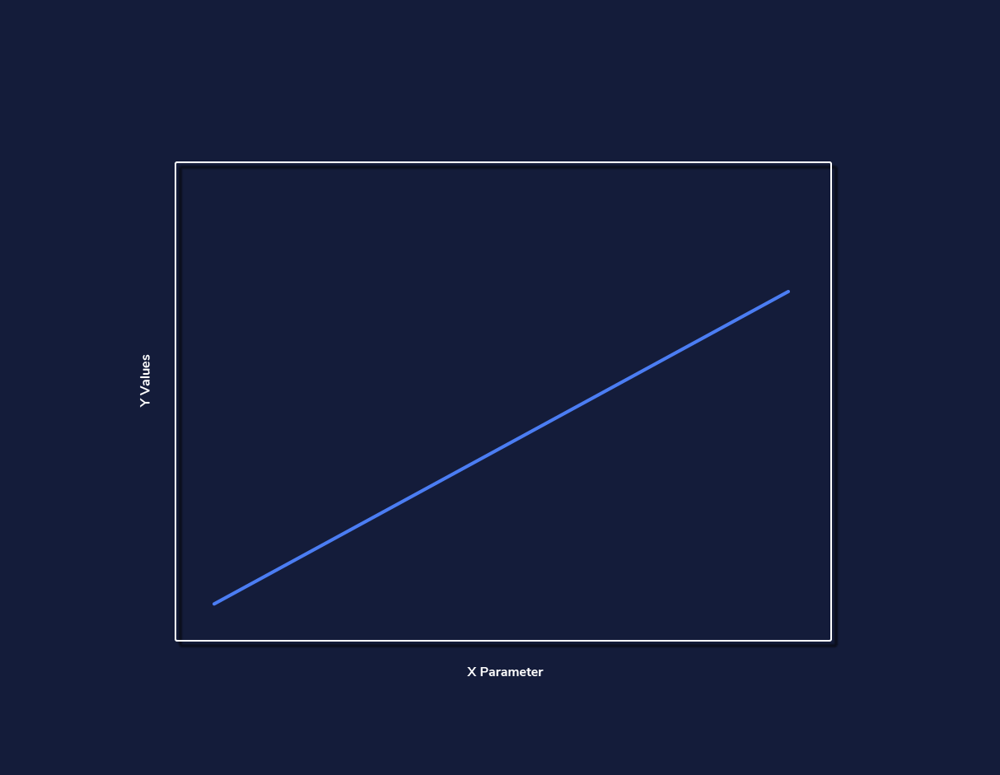
    - *Cross-entropy loss*
        - which is used for classification learning models rather than regression.

<br>

## Backpropagation
- This all seems fine and dandy so far. 
- However, what if our output values are inaccurate? Do we cry? Try harder next time? 
- Well, we can do that, but the good news is that there is more to our deep learning models.

<br>

- This is where *backpropagation* and *gradient descent* come into play. 
- Forward propagation deals with feeding the input values through hidden layers to the final output layer. 
- Backpropagation refers to the computation of gradients with an algorithm known as gradient descent. 
- This algorithm continuously updates and refines the weights between neurons to minimize our loss function.

<br>

- By gradient, we mean the rate of change with respect to the parameters of our loss function.
- From this, backpropagation determines how much each weight is contributing to the error in our loss function, and gradient descent will update our weight values accordingly to decrease this error.

<br>

- This is a conceptual overview of backpropagation. 
- If you would like to engage with the gritty mathematics of it, you can do so [here](https://en.wikipedia.org/wiki/Backpropagation). 
 - However, for this course, we will not need this level of detailed understanding.

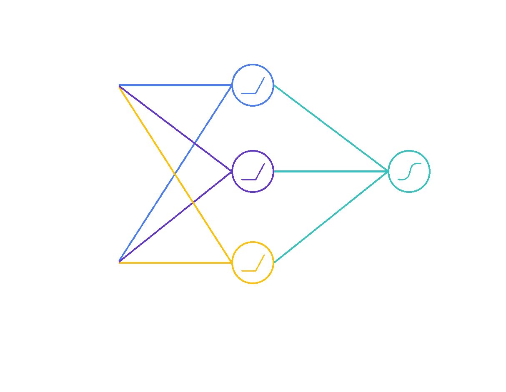

<br>

## Gradient Descent
- We have the overall process of backpropagation down! 
- Now, let’s zoom in on what is happening during gradient descent.
- If we think about the concept graphically, we want to look for the minimum point of our loss function because this will yield us the highest accuracy. 
- If we start at a random point on our loss function, gradient descent will take “steps” in the “downhill direction” towards the negative gradient. 
- The size of the “step” taken is dependent on our learning rate. 
- Choosing the optimal learning rate is important because it affects both the efficiency and accuracy of our results.
- The formula used with learning rate to update our weight parameters is the following:
$$ parameter\_new = parameter\_old - learning\_rate \cdot gradient(loss\_function(parameter\_old)) $$
- The learning rate we choose affects how large the “steps” our pointer takes when trying to optimize our error function. 
- Initial intuition might indicate that you should choose a large learning rate; however, as shown above, this can lead you to overshoot the value we are looking for and cause a divergent search.

<br>

- Now you might think that you should choose an incredibly small learning rate; however, if it is too small, it could cause your model to be unbearably inefficient or get stuck in a local minimum and never find the optimum value. 
- It is a tricky game of finding the correct combination of efficiency and accuracy.

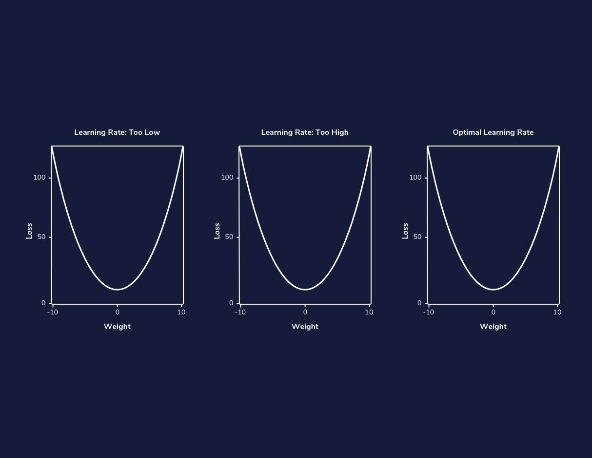

<br>

## Stochastic Gradient Descent
- This leads us to the final point about gradient descent. 
- In deep learning models, we are often dealing with extremely large datasets. 
- Because of this, performing backpropagation and gradient descent calculations on all of our data may be inefficient and computationally exhaustive no matter what learning rate we choose.

<br>

- To solve this problem, a variation of gradient descent known as *Stochastic Gradient Descent (SGD)* was developed. 
- Let’s say we have 100,000 data points and 5 parameters. 
- If we did 1000 iterations (also known as epochs in Deep Learning) we would end up with 100000⋅5⋅1000 = 500,000,000 computations. 
- We do not want our computer to do that many computations on top of the rest of the learning model; it will take forever.

<br>

- This is where SGD comes to play. 
- Instead of performing gradient descent on our entire dataset, we pick out a random data point to use at each iteration. 
- This cuts back on computation time immensely while still yielding accurate results.

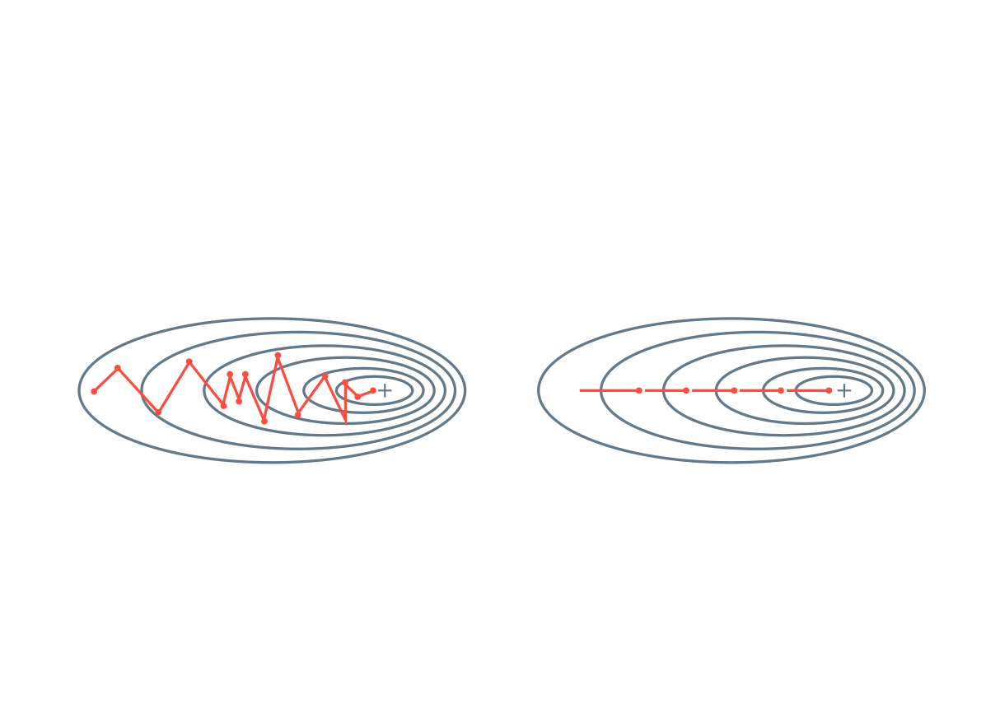

<br>

## More Variants of Gradient Descent
- Just when you thought SGD solved all our problems, even more options come into the picture!

<br>

- There are also other variants of gradient descent such as *Adam optimization algorithm* and *mini-batch gradient descent*. 
- Adam is an adaptive learning algorithm that finds individual learning rates for each parameter. 
- Mini-batch gradient descent is similar to SGD except instead of iterating on one data point at a time, we iterate on small batches of fixed size.

<br>

- Adam optimizer’s ability to have an adaptive learning rate has made it an ideal variant of gradient descent and is commonly used in deep learning models. 
- Mini-batch gradient descent was developed as an ideal trade-off between GD and SGD. 
- Since mini-batch does not depend on just one training sample, it has a much smoother curve and is less affected by outliers and noisy data making it a more optimal algorithm for gradient descent than SGD.

<br>

- These are just some quick notes! 
- You can read more about Adam [here](https://arxiv.org/abs/1412.6980) and more about mini-batch [here](https://arxiv.org/pdf/1609.04747). 
- Experts in deep learning are constantly coming up with ways to improve these algorithms to make them more efficient and accurate, so the ability to adapt and build upon what you learn as you dive into this domain will be key!


<br>

## Review: Deep Learning Math
- This overview completes the necessary mathematical intuition you need to move forward and begin coding your own learning models! 
    - Scalars, vectors, matrices, and tensors
        - A *scalar* is a singular quantity like a number.
        - A *vector* is an array of numbers (scalar values).
        - A *matrix* is a grid of information with rows and columns.
        - A *tensor* is a multidimensional array and is a generalized version of a vector and matrix.
    - Matrix algebra
        - In *scalar multiplication*, every entry of the matrix is multiplied by a scalar value.
        - In *matrix addition*, corresponding matrix entries are added together.
        - In *matrix multiplication*, the dot product between the corresponding rows of the first matrix and columns of the second matrix is calculated.
        - A *matrix transpose* turns the rows of a matrix into columns.
    - In *forward propagation*, data is sent through a neural network to get initial outputs and error values.
        - *Weights* are the learning parameters of a deep learning model that determine the strength of the connection between two nodes.
        - A *bias node* shifts the activation function either left or right to create the best fit for the given data in a deep learning model.
        - *Activation Functions* are used in each layer of a neural network and determine whether neurons should be “fired” or not based on output from a weighted sum.
        - *Loss functions* are used to calculate the error between the predicted values and actual values of our training set in a learning model.
    - In *backpropagation*, the gradient of the loss function is calculated with respect to the weight parameters within a neural network.
        - *Gradient descent* updates our weight parameters by iteratively minimizing our loss function to increase our model’s accuracy.
        - *Stochastic gradient descent* is a variant of gradient descent, where instead of using all data points to update parameters, a random data point is selected.
        - *Adam optimization* is a variant of SGD that allows for adaptive learning rates.
        - *Mini-batch gradient descent* is a variant of GD that uses random batches of data to update parameters instead of a random datapoint.

<br>

---

<br>

## What Makes Deep Learning Models Dangerous?
- When talking about machine learning, deep learning, and artificial intelligence, people tend to focus on the progress and amazing feats we could potentially achieve. 
- While it is true that these disciplines have the potential to change the world we live in and allow us to perform otherwise impossible feats, there are often unintended consequences.

<br>

- We live in an imperfect world, and the learning algorithms we design are not immune to these imperfections. 
- Before we dive into creating our models, we must review some of the issues and implications that they can have on people’s lives. 
- Deep Learning models can be especially scary as they are some of the most powerful, and they are becoming more commonplace in society.
- They are also most often black boxes (hard for users to understand as to why and how specific results occur).


<br>

## When to Use Them
- Due to this nature of deep learning models, we should only ever use them if there is an apparent, significant reason for using one. 
- If there is not a clear reason, we can use basic machine learning or statistical analysis approaches depending on what suffices.
- When choosing solutions to a problem, we have to juggle many numerous factors, including
    - speed
    - accuracy
    - training time
    - interpretability
    - maintenance
    - enhancement
    - size of the trained model
- along with even more before beginning to prototype. 
- Asking questions along these lines is vital because we design learning algorithms that can harm individuals or even entire communities in their daily lives if we do not craft them with care and awareness.

<br>

## Misconceptions
- There are often misconceptions about AI and deep learning models and what implications they have on our world. 
- Science fiction has illustrated the dangers as some sort of robot apocalypse where humans are outsmarted and overpowered.
- This depiction does not reflect the real risks that are already present from the growing dependence on learning models in our everyday lives.
- Healthcare, banking, and the criminal justice system have all seen a massive rise in the reliance on learning algorithms to make decisions in recent years.
- While these have led to increased efficiency and developments, trusting these systems to make high-risk decisions has also led to various risks.

<br>

## Key Issues
- There are some key things to address about machine learning models that can lead to potentially problematic implications.
- Let’s dive into this through the lens of healthcare.
1. **Machine learning algorithms can only be as good as the data it is trained on.**
    - If we train the data on a model that does not match environmental data well, accuracy will not translate into the real world. 
    - A good example is this study on personalized risk assessments for acute kidney injury.
    - While patient data evolved and disease patterns changed, the predictive model became less accurate and, therefore, much less useful. 
    - It is crucial for developers to monitor outputs periodically and account for data-shift problems over time.
    - The work is not complete after we deploy a model; it must be managed and continuously refined to account for continuous environmental developments.
    - There is also a history of the health industry not including enough women and people of color in medical studies.
    - Different demographics can have unique manifestations and risk factors with diseases.
    - If training data is not diverse and representative of all potential sample individuals, inaccuracies and misdiagnoses could occur.
    - It is vital to have orthogonal data in that it is both high in volume and diversity.
    - Without attention to this, social health disparities that are already present could become widened.
2. **Machine learning models do not understand the impact of a false negative vs. a false positive diagnostic (at least not like humans can).**
    - When diagnosing patients, doctor’s often “err on the side of caution.” 
    - For example, being falsely diagnosed with a malignant tumor (false positive) is much less dangerous than being incorrectly diagnosed with a benign tumor (false negative). 
    - Further testing would occur in the former situation, whereas the latter could cause much scarier consequences with a malignant tumor being unaddressed.
    - Models may not have this “err on the side of caution” attitude, especially if we do not design them with this implication in mind.
    - If we solely train it to be as accurate as possible, it is at the expense of missing malignant diagnoses. 
    - Developers can create custom loss functions that can account for the implications of false negatives vs. false positives. 
    - However, to do this, they must understand the domain well.
3. **For many of the clinicians and the patients, the models are a black box.**
    - Stakeholders only can make decisions based on the outcome, and the predictions are not open to inspection. 
    - Therefore, it is hard for anyone to determine that there are patterns of inaccurate predictions until prolonged use has already occurred. 
    - For example, imagine an X-ray analysis model that is inaccurate under certain conditions because it was not present in the training data.
    - The doctor would not identify this until continuously observing incorrect diagnoses because the only aspect of the model focuses on is the outcome.  

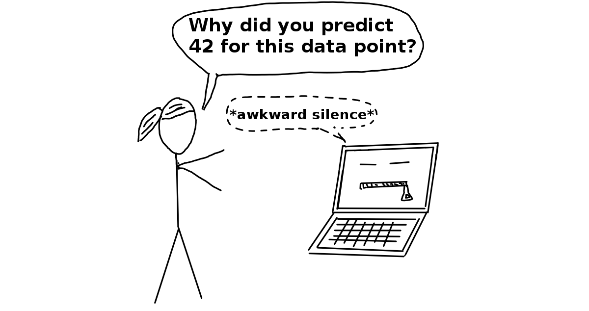

<br>

## More Examples
- This is just the tip of the iceberg for concerns about the use of learning models in the healthcare industry, and we have yet to even go into implications within other sectors. 
- Facial recognition has shown implicit bias within Google’s algorithm, which incorrectly identified a woman and her friend as gorillas.
- An error like this leads to emotional harm, and it shows that learning models are not immune to social issues and can reproduce or even exacerbate them.

<br>

- Employing black box technology becomes more of an issue when used in contexts without transparency. 
- For example, in criminal justice or banking, biased data is used to deny people of color loans at a higher rate or label them as “high risk” repeat offenders.
- A real-life example of this is a machine learning questionnaire algorithm known as COMPAS (Correctional Offender Management Profiling for Alternative Sanctions). 
- It was used to determine the risk of whether an arrestee would being a repeat offender. 
- A [study](https://www.propublica.org/article/machine-bias-risk-assessments-in-criminal-sentencing) showed that this algorithm was racially-biased despite never explicitly asking about race. 
- Individuals were asked questions that modeled existing social inequalities, and minorities, particularly blacks, were more likely to be labeled “high-risk” repeat offenders. 
- The graph below shows the distribution of risk scores for black defendants and white defendants.
- You can read more about the analysis of this report [here](https://www.propublica.org/article/how-we-analyzed-the-compas-recidivism-algorithm).

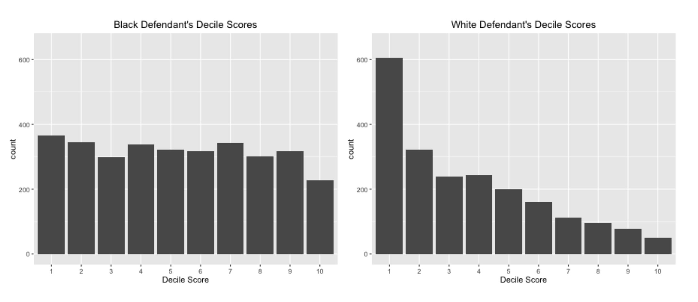  

- Models like these can even go beyond mirroring existing inequity.
- They can go onto perpetuate them and contribute to vicious cycles. 
- For example, if we were to use systems like these to determine patrol routes, this could bias crime data for individuals in those communities.
- As we add more data to the learning model, the problem is exacerbated.
- What is even scarier about these models is that they are often beyond dispute or appeal. 
- Given the result of a mathematical formula, we usually take it as fact. 
- Someone who ends up negatively affected by this cannot argue against it or reason with a machine.
- They cannot explain the full reality to a computer. 
- Instead, a machine will define its own reality to justify its results.
- While an outside observer can question, “why did this individual get a high-risk score despite only a minor crime?” a machine is merely operating under its historical data and findings.

<br>

## Personal Responsibility
- This is not to say that we should not use machine learning models in ways that impact everyday lives. 
- It is meant to outline some of the issues that can arise when used to make high-stakes decisions and how they can cause harm. 
- As you move forward to developing your own neural networks, consider the social implications of what you have made.
- As developers, we must work to ensure that our models are free from bias and will not misrepresent certain populations. 
- The Institute for Ethical AI and Machine Learning has a [framework for developing responsible machine learning](https://ethical.institute/principles.html) that we encourage you to read up on.

<br>

## Interpretability and Transparency
- It is also imperative that the models we build are used in ways that are transparent to potential stakeholders.
- If someone is impacted due to the output of a learning model, they should understand:
    - why the model is being used
    - how their personal data is being used
    - what personal data is being used
- The final thing to consider is making your model’s inner workings understandable for your users, also known as interpretable machine learning. 
- Making the inner workings of a model understandable allows users to identify inaccuracies earlier and explain results to potential stakeholders.
- A great example of this is a simple classifier model that identifies huskies vs. wolves. 
- In the case below, a husky in incorrectly classified as a wolf.
- With the implementation of a system called [LIME](https://arxiv.org/pdf/1602.04938), predictions are explained and can be understood by users. 
- In this case, the explanation is that if a picture contains snow, it will be classified as a wolf. 
- This information gives developers an indicator of why their model contains inaccuracies and clarifies how to improve it.

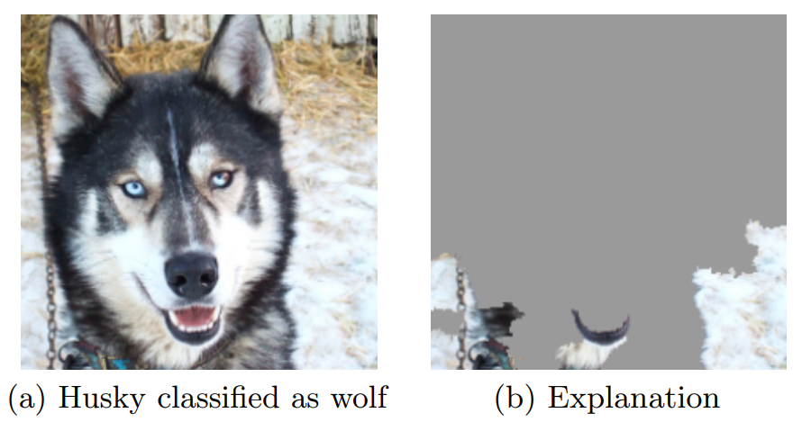

<br>

---

<br>

## Understanding Neural Networks
- As you are reading this article, the very same brain that sometimes forgets why you walked into a room is magically translating these pixels into letters, words, and sentences — a feat that puts the world’s fastest supercomputers to shame.
-  Within the brain, thousands of neurons are firing at incredible speed and accuracy to help us recognize text, images, and the world at large.
- A **neural network** is a programming model inspired by the human brain. Let’s explore how it came into existence.

<br>

## The Birth of an Artificial Neuron
- Computers have been designed to excel at number-crunching tasks, something that most humans find terrifying. 
- On the other hand, humans are naturally wired to effortlessly recognize objects and patterns, something that computers find difficult.
- This juxtaposition brought up two important questions in the 1950s:
    - “How can computers be better at solving problems that humans find effortless?”
    - “How can computers solve such problems in the way a human brain does?”
- In 1957, Frank Rosenblatt explored the second question and invented the Perceptron algorithm that allowed an artificial neuron to simulate a biological neuron! 
- The artificial neuron could take in an input, process it based on some rules, and fire a result. 
- But computers had been doing this for years — what was so remarkable?


- There was a final step in the Perceptron algorithm that would give rise to the incredibly mysterious world of Neural Networks — the artificial neuron could train itself based on its own results, and fire better results in the future. 
- In other words, it could learn by trial and error, just like a biological neuron.

<br>

## More Neurons
- The Perceptron Algorithm used multiple artificial neurons, or perceptrons, for image recognition tasks and opened up a whole new way to solve computational problems. 
- However, as it turns out, this wasn’t enough to solve a wide range of problems, and interest in the Perceptron Algorithm along with Neural Networks waned for many years.
- But many years later, the neurons fired back.
- It was found out that creating multiple layers of neurons — with one layer feeding its output to the next layer as input — could process a wide range of inputs, make complex decisions, and still produce meaningful results. 
- With some tweaks, the algorithm became known as the Multilayer Perceptron, which led to the rise of Feedforward Neural Networks.

**60 Years Later…**

- With Feedforward Networks, the results improved. 
- But it was only recently, with the development of high-speed processors, that neural networks finally got the necessary computing power to seamlessly integrate into daily human life.
- Today, the applications of neural networks have become widespread — from simple tasks like speech recognition to more complicated tasks like self-driving vehicles.
- In 2012, Alex Krizhevsky and his team at University of Toronto entered the ImageNet competition (the annual Olympics of computer vision) and trained a **deep convolutional neural network** [pdf](https://proceedings.neurips.cc/paper_files/paper/2012/file/c399862d3b9d6b76c8436e924a68c45b-Paper.pdf)
- No one truly understood how it made the decisions it did, but it worked better than any other traditional classifier, by a huge 10.8% margin.

<br>

---

<br>

## What is a Perceptron?
- Similar to how atoms are the building blocks of matter and how microprocessors are the building blocks of a computer, perceptrons are the building blocks of Neural Networks.
- If you look closely, you might notice that the word “perceptron” is a combination of two words:
    - **Perception** (noun) the ability to sense something
    - **Neuron** (noun) a nerve cell in the human brain that turns sensory input into meaningful information
- Therefore, the perceptron is an artificial neuron that simulates the task of a biological neuron to solve problems through its own “sense” of the world.
- Although the perceptron comes with its own artificial design and set of parameters, at its core, a single perceptron is trying to make a simple decision.

<br>

- Let’s take the example a simple self-driving car that is based on a perceptron. 
- If there’s an obstacle on the left, the car would have to steer right. 
- Similarly, if there’s an obstacle on the right, the car would have to steer left.
- For this example, a perceptron could take the position of the obstacle as inputs, and produce a decision — left turn or right turn — based on those inputs.

<br>

- And here’s the cool part — the perceptron can correct itself based on the result of its decision to make better decisions in the future!
- Of course, the real world scenario isn’t that simple. 
- But if you combine a bunch of such perceptrons, you will get a neural network that can even make better decisions on your behalf!


<br>

## Representing a Perceptron
- So the perceptron is an artificial neuron that can make a simple decision. 
- The perceptron has three main components:
    - **Inputs**: 
        - Each input corresponds to a feature. 
        - For example, in the case of a person, features could be age, height, weight, college degree, etc.
    - **Weights**: 
        - Each input also has a weight which assigns a certain amount of importance to the input. 
        - If an input’s weight is large, it means this input plays a bigger role in determining the output. 
        - For example, a team’s skill level will have a bigger weight than the average age of players in determining the outcome of a match.
    - **Output**: 
        - Finally, the perceptron uses the inputs and weights to produce an output. 
        - The type of the output varies depending on the nature of the problem. 
        - For example, to predict whether or not it’s going to rain, the output has to be binary — 1 for Yes and 0 for No. 
        - However, to predict the temperature for the next day, the range of the output has to be larger — say a number from 70 to 90.

<br>

## Step 1: Weighted Sum
- Great! Now that you understand the structure of the perceptron, here’s an important question — how are the inputs and weights magically turned into an output? 
- This is a two-step process, and the first step is finding the weighted sum of the inputs.
- What is the **weighted sum**? 
- This is just a number that gives a reasonable representation of the inputs:
$$ weighted\_sum = x_1w_1 + x_2w_2 + x_3w_3 + ... + x_nw_n $$
- The *x*‘s are the inputs and the w‘s are the weights.
- Here’s how we can implement it:
    1. Start with a weighted sum of 0. Let’s call it `weighted_sum`.
    2. Start with the first input and multiply it by its corresponding weight. Add this result to `weighted_sum`.
    3. Go to the next input and multiply it by its corresponding weight. Add this result to `weighted_sum`.
    4. Repeat this process for all inputs.

<br>

## Step 2: Activation Function
- After finding the weighted sum, the second step is to *constrain the weighted sum to produce a desired output*.
- Why is that important? Imagine if a perceptron had inputs in the range of 100-1000 but the goal was to simply predict whether or not something would occur — 1 for “Yes” and 0 for “No”. 
- This would result in a very large weighted sum.

<br>

- How can the perceptron produce a meaningful output in this case? 
- This is exactly where **activation functions** come in! 
- These are special functions that transform the weighted sum into a desired and constrained output.
- For example, if you want to train a perceptron to detect whether a point is above or below a line, you might want the output to be a `+1` or `-1` label. 
- For this task, you can use the “sign activation function” to help the perceptron make the decision:
    - If weighted sum is positive, return `+1`
    - If weighted sum is negative, return `-1`
- In this lesson, we will focus on using the sign activation function because it is the simplest way to get started with perceptrons and eventually visualize one in action.

<br>

## Training the Perceptron
- Our perceptron can now make a prediction given inputs, but how do we know if it gets those predictions right?
- Right now we expect the perceptron to be very bad because it has random weights. 
- We haven’t taught it anything yet, so we can’t expect it to get classifications correct! 
- The good news is that we can train the perceptron to produce better and better results! 
- In order to do this, we provide the perceptron a training set — a collection of random inputs with correctly predicted outputs.
- Below, you can see a plot of scattered points with positive and negative labels. This is a simple training set.
    
- In the code, the training set has been represented as a dictionary with coordinates as keys and labels as values. For example:
    ```py
    training_set = {(18, 49): -1, (2, 17): 1, (24, 35): -1, (14, 26): 1, (17, 34): -1}
    ```
- We can measure the perceptron’s actual performance against this training set. 
- By doing so, we get a sense of “how bad” the perceptron is. 
- The goal is to gradually nudge the perceptron — by slightly changing its weights — towards a better version of itself that correctly matches all the input-output pairs in the training set.
- We will use these points to train the perceptron to correctly separate the positive labels from the negative labels by visualizing the perceptron as a line. 

<br>

## Training Error
- Now that we have our training set, we can start feeding inputs into the perceptron and comparing the actual outputs against the expected labels!
- Every time the output mismatches the expected label, we say that the perceptron has made a training error — a quantity that measures “how bad” the perceptron is performing.
- As mentioned in the last exercise, the goal is to nudge the perceptron towards zero training error. 
- The training error is calculated by subtracting the predicted label value from the actual label value.

$$ training\_error = actual\_label - predicted\_label $$

- For each point in the training set, the perceptron either produces a +1 or a -1 (as we are using the Sign Activation Function). 
- Since the labels are also a +1 or a -1, there are four different possibilities for the error the perceptron makes:
    | Actual | Predicted | Training Error |
    |--------|-----------|----------------|
    | +1     | +1        | 0              |
    | +1     | -1        | 2              |
    | -1     | -1        | 0              |
    | -1     | +1        | -2             |
- These training error values will be crucial in improving the perceptron’s performance as we will see in the upcoming exercises.

<br>

## Tweaking the Weights
- What do we do once we have the errors for the perceptron? We slowly nudge the perceptron towards a better version of itself that eventually has zero error.
- The only way to do that is to change the parameters that define the perceptron. 
- We can’t change the inputs so the only thing that can be tweaked are the weights. 
- As we change the weights, the outputs change as well.
- The goal is to find the optimal combination of weights that will produce the correct output for as many points as possible in the dataset.

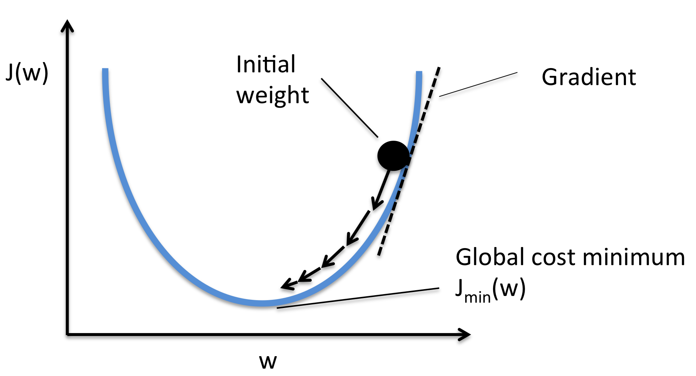

<br>

## The Perceptron Algorithm
- But one question still remains — how do we tweak the weights optimally? 
- We can’t just play around randomly with the weights until the correct combination magically pops up. 
- There needs to be a way to guarantee that the perceptron improves its performance over time.
- This is where the **Perceptron Algorithm** comes in. 
- The math behind why this works is outside the scope of this lesson, so we’ll directly apply the algorithm to optimally tweak the weights and nudge the perceptron towards zero error.
- The most important part of the algorithm is the update rule where the weights get updated:

$$ weight = weight + (error \cdot input) $$

- We keep on tweaking the weights until all possible labels are correctly predicted by the perceptron. 
- This means that multiple passes might need to be made through the `training_set` before the Perceptron Algorithm comes to a halt.

<br>

## The Bias Weight
- You have understood that the perceptron can be trained to produce correct outputs by tweaking the regular weights.
- However, there are times when a minor adjustment is needed for the perceptron to be more accurate. 
- This supporting role is played by the bias weight. 
- It takes a default input value of 1 and some random weight value.
- So now the weighted sum equation should look like:

$$ weighted\_sum = x_1w_1 + x_2w_2 + x_3w_3 + ... + x_nw_n + 1w_b $$

<br>

## Representing a Line
- So far so good! The perceptron works as expected, but everything seems to be taking place behind the scenes.
- What if we could visualize the perceptron’s training process to gain a better understanding of what’s going on?
- The weights change throughout the training process so if only we could meaningfully visualize those weights…
- Turns out we can! In fact, it gets better. 
- The weights can actually be used to represent a line! 
- This greatly simplifies our visualization.

<br>

- You might know that a line can be represented using the slope-intercept form. 
- A perceptron’s weights can be used to find the slope and intercept of the line that the perceptron represents.
    - `slope = -self.weights[0]/self.weights[1]`
    - `intercept = -self.weights[2]/self.weights[1]`
- The explanation for these equations is beyond the scope of this lesson, so we’ll just use them to visualize the perceptron for now.
- In the plot below, you should be able to see a line that represents the perceptron in its first iteration of the training process.


<br>

## Finding a Linear Classifier
- The perceptron has inputs, weights, and an output. 
- The weights are parameters that define the perceptron and they can be used to represent a line. 
- In other words, the perceptron can be visualized as a line.
- What does it mean for the perceptron to correctly classify every point in the training set?
- Theoretically, it means that the perceptron predicted every label correctly.
- Visually, it means that the perceptron found a linear classifier, or a decision boundary, that separates the two distinct set of points in the training set.

<br>