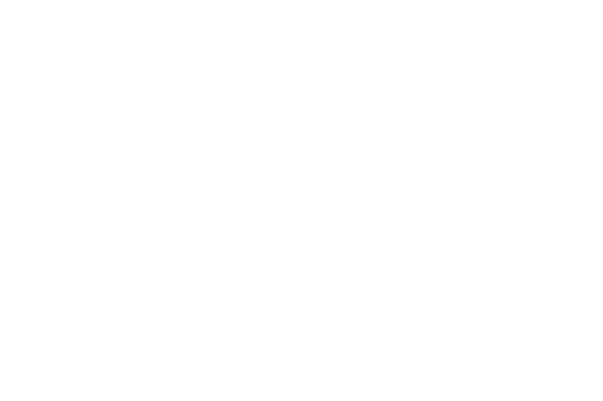
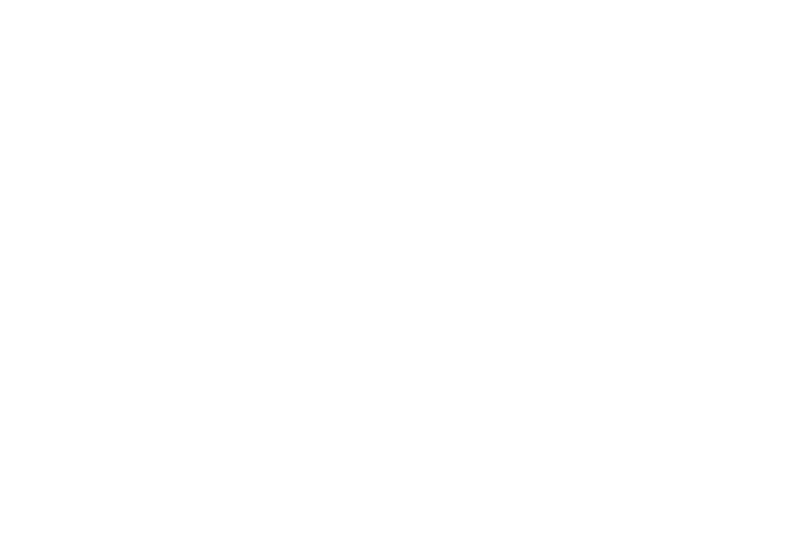

# Tasks: Introduction to Linear Algebra

 

## Content
- [Vectors](#vectors)
- [Basic Vector Operations](#basic-vector-operations)
- [Vector Dot Product](#vector-dot-product)
- [Matrices](#matrices)
- [Matrix Operations](#matrix-operations)
- [Linear Systems in Matrix Form](#linear-systems-in-matrix-form)
- [Gauss-Jordan Elimination](#gauss-jordan-elimination)
- [Inverse Matrices](#inverse-matrices)

 

## Vectors
**Formulas**
- Magnitude of a Vector (or Length/Norm of a Vector):
$$ ||v|| = \sqrt{\sum_{i=1}^{n} v_i^2} $$

 

**Task**
1. Find the magnitudes of the following vectors:
$$ a = \begin{bmatrix} 3 \\ -4 \end{bmatrix} $$
$$ b = \begin{bmatrix} 0 \\ 26 \end{bmatrix} $$
$$ c = \begin{bmatrix} 26 \\ 0 \end{bmatrix} $$
$$ d = \begin{bmatrix} -12 \\ 13 \end{bmatrix} $$

 

**Solution**
$$ ||a|| = \sqrt{3^2 + (-4)^2} = \sqrt{9 + 16} = \sqrt{25} = 5 $$
$$ ||b|| = \sqrt{0^2 + 26^2} = \sqrt{0 + 676} = \sqrt{676} = 26 $$
$$ ||c|| = \sqrt{26^2 + 0^2} = \sqrt{676 + 0} = \sqrt{676} = 26 $$
$$ ||d|| = \sqrt{(-12)^2 + 13^2} = \sqrt{144 + 169} = \sqrt{313} \approx 17.69 $$

 

## Basic Vector Operations
**Formulas**
- Scalar Multiplication: 
$$ k \begin{bmatrix} x \\ y \\ z \end{bmatrix} = \begin{bmatrix} kx \\ ky \\ kz \end{bmatrix} $$
- Vector Addition and Subtraction:
$$ \begin{bmatrix} x_1 \\ y_1 \\ z_1 \end{bmatrix} + 2 \begin{bmatrix} x_2 \\ y_2 \\ z_2 \end{bmatrix} - 3 \begin{bmatrix} x_3 \\ y_3 \\ z_3 \end{bmatrix} = \begin{bmatrix} x_1 + 2x_2 - 3x_3 \\ y_1 + 2y_2 - 3y_3 \\ z_1 + 2z_2 - 3z_3 \end{bmatrix} $$

 

**Task**
1. $$ 3 \begin{bmatrix} 2 \\ -7 \\ 1 \end{bmatrix} $$
2. $$ \begin{bmatrix} 10 \\ -7 \end{bmatrix} + \begin{bmatrix} -14 \\ 7 \end{bmatrix} $$
3. $$ \begin{bmatrix} 14 \\ -3 \\ 2 \end{bmatrix} + 7 \begin{bmatrix} -1 \\ 3 \\ -5 \end{bmatrix} - 5 \begin{bmatrix} 6 \\ -4 \\ -1 \end{bmatrix} $$

 

**Solution**
1. $$ 3 \begin{bmatrix} 2 \\ -7 \\ 1 \end{bmatrix} = \begin{bmatrix} 3(2) \\ 3(-7) \\ 3(1) \end{bmatrix} = \begin{bmatrix} 6 \\ -21 \\ 3 \end{bmatrix} $$
2. $$ \begin{bmatrix} 10 \\ -7 \end{bmatrix} + \begin{bmatrix} -14 \\ 7 \end{bmatrix} = \begin{bmatrix} 10 + (-14) \\ -7 + 7 \end{bmatrix} = \begin{bmatrix} -4 \\ 0 \end{bmatrix} $$
3. $$ \begin{bmatrix} 14 \\ -3 \\ 2 \end{bmatrix} + 7 \begin{bmatrix} -1 \\ 3 \\ -5 \end{bmatrix} - 5 \begin{bmatrix} 6 \\ -4 \\ -1 \end{bmatrix} = \begin{bmatrix} 14 + 7(-1) - 5(6) \\ -3 + 7(3) - 5(-4) \\ 2 + 7(-5) - 5(-1) \end{bmatrix} = \begin{bmatrix} 14 - 7 - 30 \\ -3 + 21 + 20 \\ 2 - 35 + 5 \end{bmatrix} = \begin{bmatrix} -23 \\ 38 \\ -28 \end{bmatrix} $$

 

## Vector Dot Product
**Formulas**
- Dot Product:
$$ 
a \cdot b = \sum_{i=1}^{n} a_i  b_i 
$$
- Angle between two vectors:
$$\cos(\theta) = \frac{a \cdot b}{||a||||b||}$$

 

**Task**
$$ a = \begin{bmatrix} -17 \\ 22 \end{bmatrix}, b = \begin{bmatrix} 0 \\ 32 \end{bmatrix} $$

 

**Solution**
- Dot Product:
$$ a \cdot b = (-17)(0) + 22(32) = 0 + 704 = 704 $$
- Angle between two vectors:
    - Magnitude of a:
    $$ ||a|| = \sqrt{(-17)^2 + 22^2} = \sqrt{289 + 484} = \sqrt{773} \approx 27.78 $$
    - Magnitude of b:
    $$ ||b|| = \sqrt{0^2 + 32^2} = \sqrt{0 + 1024} = \sqrt{1024} = 32 $$
    - Angle:
    $$ \theta = \arccos \frac{704}{27.8 \cdot 32} = \arccos \frac{704}{889.6} \approx 37.69^{\circ} $$

 

## Matrices
**Structure**
$$ 
A = \begin{bmatrix} a & b & c \\ d & e & f \\ g & h & i \end{bmatrix}
$$

 

**Task**
- What is the value corresponding to the second row and third column?

 

**Solution**
$$ A_{2,3} = f $$

 

## Matrix Operations
**Formulas**
- Matrix Addition and Subtraction with Scalar Multiplication:
$$ 2 \begin{bmatrix} a_1 & b _1\\ a_2 & b_2 \end{bmatrix} + 3 \begin{bmatrix} c_1 & d _1\\ c_2 & d_2 \end{bmatrix} = \begin{bmatrix} 2a_1 + 3c_1 & 2b_1 + 3d_1 \\ 2a_2 + 3c_2 & 2b_2 + 3d_2 \end{bmatrix} $$
- Matrix Multiplication:
$$
\begin{bmatrix} a & b \\ c & d \end{bmatrix} \cdot \begin{bmatrix} e & f \\ g & h \end{bmatrix} = \begin{bmatrix} ae + bg & af + bh \\ ce + dg & cf + dh \end{bmatrix}
$$
- Rules of Matrix Multiplication:
$$ 2 \times 3 \quad 3 \times 2 \rightarrow 2 \times 2 $$
$$ 2 \times 4 \quad 4 \times 3 \rightarrow 2 \times 3 $$
$$ 4 \times 3 \quad 6 \times 5 \rightarrow Not Possible $$

 

**Task**
1. $$ \begin{bmatrix} 1 & 6 \\ 3 & 2 \end{bmatrix} + \begin{bmatrix} 2 & 1 \\ 5 & 6 \end{bmatrix} $$
2. $$ 2 \begin{bmatrix} 3 & 5 \\ -2 & 12 \end{bmatrix} $$
3. $$ \begin{bmatrix} 1 & 6 \\ 3 & 2 \end{bmatrix} \cdot \begin{bmatrix} 2 & 1 \\ 5 & 6 \end{bmatrix} $$

 

**Solution**
1. $$ \begin{bmatrix} 1 & 6 \\ 3 & 2 \end{bmatrix} + \begin{bmatrix} 2 & 1 \\ 5 & 6 \end{bmatrix} = \begin{bmatrix} 1 + 2 & 6 + 1 \\ 3 + 5 & 2 + 6 \end{bmatrix} = \begin{bmatrix} 3 & 7 \\ 8 & 8 \end{bmatrix} $$
2. $$ 2 \begin{bmatrix} 3 & 5 \\ -2 & 12 \end{bmatrix} = \begin{bmatrix} 2 \cdot 3 & 2 \cdot 5 \\ 2 \cdot (-2) & 2 \cdot 12 \end{bmatrix} = \begin{bmatrix} 6 & 10 \\ -4 & 24 \end{bmatrix} $$
3. $$ \begin{bmatrix} 1 & 6 \\ 3 & 2 \end{bmatrix} \cdot \begin{bmatrix} 2 & 1 \\ 5 & 6 \end{bmatrix} = \begin{bmatrix} 1 \cdot 2 + 6 \cdot 5 & 1 \cdot 1 + 6 \cdot 6 \\ 3 \cdot 2 + 2 \cdot 5 & 3 \cdot 1 + 2 \cdot 6 \end{bmatrix} = \begin{bmatrix} 32 & 37 \\ 16 & 15 \end{bmatrix} $$ 

 

## Linear Systems in Matrix Form
**Structure**
$$ a_1x + b_1y + c_1z = d_1 $$
$$ a_2x + b_2y + c_2z = d_2 $$
$$ a_3x + b_3y + c_3z = d_3 $$
$$ to $$
$$ \begin{bmatrix} a_1 & b_1 & c_1 & | & d_1 \\ a_2 & b_2 & c_2 & | & d_2 \\ a_3 & b_3 & c_3 & | & d_3 \end{bmatrix} $$

 

**Task**
- Write the following linear system in matrix form:
$$ -3x + 2z = 4 $$
$$ -5y + 10z = 6 $$
$$ 2x + 3y - 3z = 8 $$

 

**Solution**
$$ \begin{bmatrix} -3 & 0 & 2 & | & 4 \\ 0 & -5 & 10 & | & 6 \\ 2 & 3 & -3 & | & 8 \end{bmatrix} $$

 

## Gauss-Jordan Elimination
**Structure**
$$ \begin{bmatrix} a_1 & b_1 & c_1 & | & d_1 \\ a_2 & b_2 & c_2 & | & d_2 \\ a_3 & b_3 & c_3 & | & d_3 \end{bmatrix} \rightarrow \begin{bmatrix} 1 & b_1^{'} & c_1^{'} & | & d_1^{'} \\ 0 & 1 & c_2^{'} & | & d_2^{'} \\ 0 & 0 & 1 & | & d_3^{'} \end{bmatrix} $$
$$ x + b_1^{'}y + c_1^{'}z = d_1^{'} $$
$$ y + c_2^{'}z = d_2^{'} $$
$$ z = d_3^{'} $$

 

**Task**
- Solve the following linear system using Gauss-Jordan elimination:
$$ x + y - 2z = 1 $$
$$ -x - y + z = 2 $$
$$ -2x + 2y + z = 0 $$

 

**Solution**
- **Step 1**: Put system of equations into augmented matrix form.
$$ \begin{bmatrix} 1 & 1 & -2 & | & 1 \\ -1 & -1 & 1 & | & 2 \\ -2 & 2 & 1 & | & 0 \end{bmatrix} $$
- **Step 2**: Cancel out the first two entries in row 2 by adding the values of row 1 to row 2.
    - $ R2 + R1 = R2_{new}$
$$ \begin{bmatrix} 1 & 1 & -2 & | & 1 \\ 0 & 0 & -1 & | & 3 \\ -2 & 2 & 1 & | & 0 \end{bmatrix} $$
- **Step 3**: Cancel out the first entry in row 3 by adding the values of row 1 to one-half of each value in row 3.
    - $ \frac{1}{2} \cdot R3 + R1 = R3_{new}$
$$ \begin{bmatrix} 1 & 1 & -2 & | & 1 \\ 0 & 0 & -1 & | & 3 \\ 0 & 2 & \frac{-3}{2} & | & 1 \end{bmatrix} $$
- **Step 4**: Swap row 2 and row 3.
$$ \begin{bmatrix} 1 & 1 & -2 & | & 1 \\ 0 & 2 & \frac{-3}{2} & | & 1 \\ 0 & 0 & -1 & | & 3 \end{bmatrix} $$
- **Step 5**: Normalize the diagonals (make them all equal 1). Multiply each value in row 2 by 1/2 and each value in row 3 by -1.
    - $ \frac{1}{2} \cdot R2 = R2_{new}$
    - $ -1 \cdot R3 = R3_{new}$
$$ \begin{bmatrix} 1 & 1 & -2 & | & 1 \\ 0 & 1 & \frac{-3}{4} & | & \frac{1}{2} \\ 0 & 0 & 1 & | & -3 \end{bmatrix} $$
- **Step 6**: Put augmented matrix into system of equations form.
$$ x + y - 2z = 1 $$
$$ y - \frac{-3}{4}z = \frac{1}{2} $$
$$ z = -3 $$

 

## Inverse Matrices
**Structure**
$$ AA^{-1} = A^{-1}A = I $$

 

**Task**
- We will solve for the inverse matrix by going from the form $ [ A | I ] \rightarrow [ I | A^{-1} ] $
$$ A = \begin{bmatrix} 0 & 2 & 1 \\ -1 & -2 & 0 \\ -1 & 1 & 2 \end{bmatrix} $$

 

**Solution**
- **Step 1**: Put system of equations into $ [A|I] $ form.
$$ \begin{bmatrix} 0 & 2 & 1 & | & 1 & 0 & 0 \\ -1 & -2 & 0 & | & 0 & 1 & 0 \\ -1 & 1 & 2 & | & 0 & 0 & 1 \end{bmatrix} $$
- **Step 2**: Swap row 1 and row 3.
$$ \begin{bmatrix} -1 & 1 & 2 & | & 0 & 0 & 1 \\ -1 & -2 & 0 & | & 0 & 1 & 0 \\ 0 & 2 & 1 & | & 1 & 0 & 0 \end{bmatrix} $$
- **Step 3**: Subtract the values of row 1 from the values of row 2 to cancel out the first entry in row 2.
    - $ R2 - R1 = R2_{new} $
$$ \begin{bmatrix} -1 & 1 & 2 & | & 0 & 0 & 1 \\ 0 & -3 & -2 & | & 0 & 1 & -1 \\ 0 & 2 & 1 & | & 1 & 0 & 0 \end{bmatrix} $$
- **Step 4**: Cancel out the first two entries of row 3 by adding 3/2 of each value of row 3 to row 2.
    - $ \frac{3}{2} \cdot R3 + R2 = R3_{new} $
$$ \begin{bmatrix} -1 & 1 & 2 & | & 0 & 0 & 1 \\ 0 & -3 & -2 & | & 0 & 1 & -1 \\ 0 & 0 & \frac{-1}{2} & | & \frac{3}{2} & 1 & -1 \end{bmatrix} $$
- **Step 5**: Cancel out the second entry of row 1 by adding triple of each value of row 1 to row 2.
    - $ 3 \cdot R1 + R2 = R1_{new} $
$$ \begin{bmatrix} -3 & 0 & 4 & | & 0 & 1 & 2 \\ 0 & -3 & -2 & | & 0 & 1 & -1 \\ 0 & 0 & \frac{-1}{2} & | & \frac{3}{2} & 1 & -1 \end{bmatrix} $$
- **Step 6**: Cancel out the third entry of row 2 by adding row 3 to -1/4 of each value of row 2.
    - $ \frac{-1}{4} \cdot R2 + R3 = R2_{new} $
$$ \begin{bmatrix} -3 & 0 & 4 & | & 0 & 1 & 2 \\ 0 & \frac{3}{4} & 0 & | & \frac{3}{2} & \frac{3}{4} & \frac{-3}{4} \\ 0 & 0 & \frac{-1}{2} & | & \frac{3}{2} & 1 & -1 \end{bmatrix} $$
- **Step 7**: Cancel out the third entry of row 2 by adding row 3 to -1/4 of each value of row 2.
    - $ \frac{1}{8} \cdot R1 + R3 = R1_{new} $
$$ \begin{bmatrix} \frac{-3}{8} & 0 & 0 & | & \frac{3}{2} & \frac{9}{8} & \frac{-3}{4} \\ 0 & \frac{3}{4} & 0 & | & \frac{3}{2} & \frac{3}{4} & \frac{-3}{4} \\ 0 & 0 & \frac{-1}{2} & | & \frac{3}{2} & 1 & -1 \end{bmatrix} $$
- **Step 8**: Normalize the diagonals. Each value of row 1 is multiplied by -8/3. Each value of row 2 is multiplied by 4/3. Each value of row 3 is multiplied by -2. We are now in $ [I|A^{-1}] $  form!
    - $ \frac{-8}{3} \cdot R1 = R1_{new} $
    - $ \frac{4}{3} \cdot R2 = R2_{new} $
    - $ -2 \cdot R3 = R3_{new} $
$$ \begin{bmatrix} 1 & 0 & 0 & | & -4 & -3 & 2 \\ 0 & 1 & 0 & | & 2 & 1 & -1 \\ 0 & 0 & 1 & | & -3 & -2 & 2 \end{bmatrix} $$

